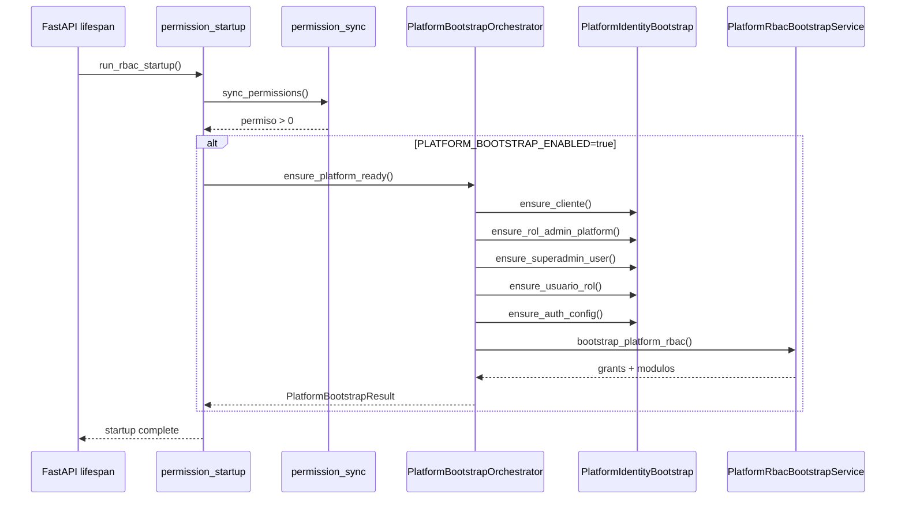

# Auditoría arquitectónica — Automatización bootstrap plataforma

**Tipo:** Diseño (sin implementación)  
**Fecha:** 2026-06-05  
**Objetivo:** Eliminar pasos manuales post-instalación (extracción D010 + `repair_platform_rbac.py`) y dejar la plataforma lista para login `superadmin` tras el primer arranque.

**Restricciones explícitas:**

| Restricción | Implicación |
|-------------|-------------|
| NO modificar `bootstrap_v2_sql_apply.ps1` | El pipeline SQL global permanece igual |
| NO modificar onboarding de tenants | `ClienteOnboardingService` intacto |
| NO crear tenants automáticamente | Solo cliente plataforma |
| NO crear datos demo | Sin ACME, INNOVA, etc. |
| NO usar D010 en runtime | Lógica nueva en servicio Python |
| Seguro para producción | Contraseñas, opt-in, fail-safe |

---

## 1. Problema actual

### Flujo manual hoy

```text
bootstrap_v2_sql_apply.ps1
        ↓
Primer arranque FastAPI (permission_sync)
        ↓
Extracción manual bloques A–E de D010__seed_bd_central.sql
        ↓
sqlcmd D010_platform_min.sql
        ↓
python scripts/repair_platform_rbac.py --apply
        ↓
Login superadmin posible
```

### Por qué no basta con el arranque actual

| Paso | Qué resuelve | Qué NO resuelve |
|------|--------------|-----------------|
| `bootstrap_v2_sql_apply` | Schema + catálogo módulos/menús | Cliente, usuarios, roles |
| `permission_sync` | Tabla `permiso` | Identidad plataforma |
| `repair_platform_rbac.py` | `cliente_modulo` + `rol_permiso` | Requiere cliente/rol/usuario **preexistentes** |

**Conclusión:** el 50 % del gap (RBAC plataforma) ya está implementado; falta el 50 % (provisión de identidad) y la orquestación automática.

---

## 2. Inventario de componentes existentes

### 2.1 `PlatformRbacBootstrapService` (parcial — reutilizable)

**Ruta:** `app/modules/tenant/application/services/platform_rbac_bootstrap_service.py`

| Capacidad | Idempotente | Precondición |
|-----------|:-----------:|--------------|
| Reactivar `admin.platform.access` / `admin.tenant.access` | ✅ | Catálogo `permiso` post-sync |
| `activar_modulos_base_cliente` → SYS_ADMIN | ✅ | Fila `cliente` + módulo S010/S020 |
| `asignar_permisos_admin_platform` → `rol_permiso` | ✅ | Rol `ADMIN_PLATFORM` existente |
| Resolver `SUPERADMIN_CLIENTE_ID` desde settings | ✅ | Env configurado |

**Limitación crítica:** lanza `PLATFORM_ADMIN_ROLE_NOT_FOUND` si el rol no existe. **No crea** cliente, rol ni usuario.

### 2.2 `repair_platform_rbac.py` (CLI delgado)

**Ruta:** `scripts/repair_platform_rbac.py`

- Delega 100 % en `PlatformRbacBootstrapService.bootstrap_platform_rbac`
- Expone `--audit-only`, `--dry-run`, `--apply`
- **No es bootstrap completo** — es reparación RBAC post-seed SQL

### 2.3 `OnboardingRbacService` (reutilizable parcialmente)

**Ruta:** `app/modules/tenant/application/services/onboarding_rbac_service.py`

| Método | Reutilizable para plataforma | Notas |
|--------|:----------------------------:|-------|
| `_validar_catalogo_permiso` | ✅ | Misma precondición que tenants |
| `activar_modulos_base_cliente` | ✅ | Ya usado por `PlatformRbacBootstrapService` |

**No reutilizar:** `bootstrap_cliente_rbac` (provisiona ADMIN_TENANT, OWNER_FULL, bundles T1/T2/T3).

### 2.4 `ClienteOnboardingService` (no tocar)

Contiene patrones útiles como referencia de diseño:

| Patrón | Uso potencial (copiar lógica, no invocar) |
|--------|-------------------------------------------|
| `_insertar_auth_config_si_no_existe` | `cliente_auth_config` mínimo para login |
| `_generar_contrasena_segura` | Generación de password inicial |
| `get_password_hash` | Hash bcrypt |
| Inserts `usuario` / `usuario_rol` | Estructura de campos obligatorios |

**Prohibido:** llamar `crear_cliente_con_onboarding` para plataforma (crearía tenant ERP completo).

### 2.5 Startup RBAC

**Ruta:** `app/core/authorization/permission_startup.py` → `run_rbac_startup`

Orden actual:

```text
register_core_permissions → ensure_registry_from_routes → apply_rbac_enforcement → sync_permissions
```

**Punto de extensión natural:** invocar bootstrap plataforma **inmediatamente después** de `sync_permissions`, en la misma transacción lógica de startup (misma sesión o sesión separada con commit).

### 2.6 Auth / login — requisitos para PASS

| Requisito | Fuente |
|-----------|--------|
| Usuario en `usuario` con `cliente_id = SUPERADMIN_CLIENTE_ID` | Identidad |
| `nombre_usuario = SUPERADMIN_USERNAME` | Settings |
| Contraseña bcrypt válida | Identidad |
| `usuario_rol` → `ADMIN_PLATFORM` | Identidad |
| `is_super_admin` en JWT | `_detect_platform_superadmin`: bypass por username reservado **o** rol legacy `SUPER_ADMIN` |
| Menú plataforma | `ModuloMenuService`: elevación por `is_super_admin=true` (no requiere `rol_menu_permiso`) |
| Permisos efectivos | `rol_permiso` vía `PlatformRbacBootstrapService` |
| `cliente_modulo` SYS_ADMIN | `activar_modulos_base_cliente` |

**Hallazgo:** `rol_menu_permiso` **no es bloqueante** para plataforma (menú elevado super_admin). No incluir en MVP salvo regresión futura.

### 2.7 D010 — qué aporta y qué descartar

| Bloque D010 | ¿Necesario en automatización? |
|-------------|:-----------------------------:|
| INSERT cliente SUPERADMIN | ✅ Equivalente runtime |
| INSERT rol ADMIN_PLATFORM | ✅ |
| INSERT usuario superadmin | ✅ |
| INSERT usuario_rol | ✅ |
| Clientes demo, módulos duplicados, sección 7 permisos | ❌ |
| SUPPORT/USER platform | ❌ (fuera de requisitos) |

---

## 3. Brecha funcional (gap analysis)

| Requisito del usuario | Estado actual | Responsable propuesto |
|-----------------------|---------------|----------------------|
| Crear cliente SYSTEM/SUPERADMIN si no existe | ❌ Manual D010 | **Nuevo:** `PlatformIdentityBootstrapService` |
| Crear ADMIN_PLATFORM si no existe | ❌ Manual D010 | Idem |
| Crear usuario superadmin si no existe | ❌ Manual D010 | Idem |
| Asignar ADMIN_PLATFORM al usuario | ❌ Manual D010 | Idem |
| Activar SYS_ADMIN para SYSTEM | ⚠️ Solo si identidad existe | **Existente:** `PlatformRbacBootstrapService` |
| Asignar permisos plataforma | ⚠️ Solo si rol existe | **Existente:** `PlatformRbacBootstrapService` |
| Idempotencia total | ⚠️ Parcial (solo RBAC) | Orquestador unificado |
| Ejecutable tras primer arranque | ❌ Manual | Hook post-`permission_sync` |

---

## 4. Opciones arquitectónicas evaluadas

### Opción A — Solo CLI nuevo (`scripts/bootstrap_platform.py`)

| Pros | Contras |
|------|---------|
| Explícito, auditable | Sigue siendo paso manual post-arranque |
| Sin impacto en startup prod | No cumple objetivo "listo tras primer arranque" |
| Fácil rollback | Operador puede olvidar ejecutarlo |

**Veredicto:** complemento útil, **insuficiente** como solución principal.

### Opción B — Hook automático en startup (post permission_sync)

| Pros | Contras |
|------|---------|
| Cumple objetivo: login tras `docker compose up` | Debe ser opt-in en prod |
| Una sola acción del operador | Errores en startup requieren política clara |
| Reutiliza servicios existentes | Contraseña inicial necesita diseño seguro |

**Veredicto:** **recomendada como canal principal**.

### Opción C — SQL seed dedicado (`S025__seed_platform.sql`)

| Pros | Contras |
|------|---------|
| Consistente con bootstrap_v2 | Viola "NO modificar bootstrap_v2_sql_apply" si se añade al helper |
| Sin lógica Python | Contraseña en SQL = inseguro; no cumple "independiente" bien |
| | Duplica lógica ya en Python (repair) |

**Veredicto:** **descartada** (contradice restricciones y seguridad).

### Opción D — Híbrida B + A (recomendada)

```text
Startup (opt-in) ──→ PlatformBootstrapOrchestrator.ensure_platform_ready()
CLI bootstrap_platform.py ──→ misma función (manual / CI / recovery)
repair_platform_rbac.py ──→ deprecar hacia CLI unificado (fase 2)
```

---

## 5. Arquitectura recomendada

### 5.1 Visión general

Nuevo módulo **independiente** de onboarding tenant, con tres capas:

```text
┌─────────────────────────────────────────────────────────────┐
│           PlatformBootstrapOrchestrator                      │
│  ensure_platform_ready() — punto de entrada único            │
└───────────────┬─────────────────────────┬───────────────────┘
                │                         │
                ▼                         ▼
┌───────────────────────────┐  ┌──────────────────────────────┐
│ PlatformIdentityBootstrap │  │ PlatformRbacBootstrapService   │
│ Service (NUEVO)           │  │ (EXISTENTE — sin cambios       │
│                           │  │  de contrato público)          │
│ • ensure_cliente()        │  │ • bootstrap_platform_rbac()  │
│ • ensure_rol_admin()      │  │                                │
│ • ensure_usuario()        │  │                                │
│ • ensure_usuario_rol()    │  │                                │
│ • ensure_auth_config()    │  │                                │
└───────────────────────────┘  └──────────────────────────────┘
```

### 5.2 Ubicación propuesta de archivos

| Artefacto | Ruta propuesta | Rol |
|-----------|----------------|-----|
| Orquestador | `app/modules/platform/application/services/platform_bootstrap_service.py` | Coordina identidad + RBAC |
| Identidad | `app/modules/platform/application/services/platform_identity_bootstrap_service.py` | CRUD idempotente entidades |
| Resultado/DTO | `app/modules/platform/application/schemas/platform_bootstrap_result.py` | Qué se creó vs existía |
| Hook startup | Extensión en `permission_startup.py` **o** `platform_startup.py` importado desde lifespan | Post-sync |
| CLI oficial | `scripts/bootstrap_platform.py` | Ejecución manual/recovery |
| Tests | `tests/unit/test_platform_identity_bootstrap.py`, integración con BD mock | Idempotencia |
| Docs | Actualizar `PLATFORM_FIRST_BOOT.md` → obsoleto tras implementación | Operación |

**Nota:** módulo `app/modules/platform/` ya existe parcialmente (`superadmin`); evaluar si conviene `platform/bootstrap/` bajo `tenant` vs módulo top-level. **Recomendación:** carpeta bajo `app/modules/tenant/application/services/` con prefijo `platform_*` para evitar proliferación de módulos, **o** `app/core/platform/` si se considera infraestructura transversal.

**Preferencia auditoría:** `app/modules/platform/application/services/` — separación clara de "administración SaaS" vs "gestión tenant".

### 5.3 Flujo de ejecución



### 5.4 Orden interno obligatorio

1. Validar settings (`SUPERADMIN_CLIENTE_ID`, `SUPERADMIN_USERNAME`, …)
2. Validar catálogo permisos (`OnboardingRbacService._validar_catalogo_permiso`) — **después** de sync
3. Provisión identidad (cliente → rol → usuario → usuario_rol → auth_config)
4. Provisión RBAC (`PlatformRbacBootstrapService.bootstrap_platform_rbac`)
5. Commit único (preferible) o dos commits con idempotencia garantizada

---

## 6. Diseño de identidad (PlatformIdentityBootstrapService)

### 6.1 Fuente de verdad: variables de entorno

| Variable | Uso en bootstrap |
|----------|------------------|
| `SUPERADMIN_CLIENTE_ID` | PK `cliente.cliente_id` (determinístico) |
| `SUPERADMIN_CLIENTE_CODIGO` | `cliente.codigo_cliente` (default `SYSTEM`; D010 usaba `SUPERADMIN`) |
| `SUPERADMIN_SUBDOMINIO` | `cliente.subdominio` (default `platform`) |
| `SUPERADMIN_USERNAME` | `usuario.nombre_usuario` |
| `PLATFORM_BOOTSTRAP_CONTACT_EMAIL` | `cliente.contacto_email` (nuevo, obligatorio si crea cliente) |

**Política UUID:** usar **exactamente** `SUPERADMIN_CLIENTE_ID` del `.env` como `cliente_id`. No generar UUID aleatorio. Rol y usuario pueden usar UUID fijos derivados (namespace UUID5) o `uuid4()` en primera creación con lookup posterior por claves naturales.

### 6.2 Valores por defecto del cliente plataforma (sin demo)

| Campo | Valor producción |
|-------|------------------|
| `razon_social` | `"Plataforma ERP Multi-Tenant"` (configurable) |
| `tipo_instalacion` | `shared` |
| `modo_autenticacion` | `local` |
| `plan_suscripcion` | `enterprise` |
| `estado_suscripcion` | `activo` |
| `es_activo` | `1` |
| `es_demo` | `0` |

### 6.3 Rol ADMIN_PLATFORM

| Campo | Valor |
|-------|-------|
| `codigo_rol` | `ADMIN_PLATFORM` |
| `nombre` | `Administrador Plataforma` |
| `es_rol_sistema` | `1` |
| `nivel_acceso` | `5` |
| `es_admin_cliente` | `0` (platform no es tenant admin ERP) |

Lookup idempotente: `WHERE cliente_id = :cid AND codigo_rol = 'ADMIN_PLATFORM'`.

### 6.4 Usuario superadmin

| Campo | Valor |
|-------|-------|
| `nombre_usuario` | `SUPERADMIN_USERNAME` |
| `requiere_cambio_contrasena` | `1` (prod) |
| `correo_confirmado` | `1` |
| `empresa_default_id` | `NULL` |
| `proveedor_autenticacion` | `local` |

**Política de contraseña (producción):**

| Escenario | Comportamiento |
|-----------|----------------|
| Usuario **no existe** + `PLATFORM_BOOTSTRAP_INITIAL_PASSWORD` definida | Crear con hash de env |
| Usuario **no existe** + sin password env + `ENVIRONMENT=production` | **No crear usuario**; log ERROR con instrucción; bootstrap identidad parcial OK pero login imposible |
| Usuario **no existe** + sin password env + `ENVIRONMENT=development` | Generar password aleatoria; log **una vez** en WARNING (nunca en INFO) |
| Usuario **ya existe** | **No modificar** contraseña (idempotencia) |

> Nunca hardcodear `admin123` en código. Nunca persistir password en texto plano.

### 6.5 Idempotencia — reglas por entidad

| Entidad | Clave de búsqueda | Insert si | Conflicto |
|---------|-------------------|-----------|-----------|
| `cliente` | `cliente_id` from settings | No existe | Existe otro registro con mismo `subdominio`/`codigo_cliente` pero distinto UUID → **FAIL** (`PLATFORM_CLIENTE_CONFLICT`) |
| `rol` | `cliente_id` + `codigo_rol` | No existe | — |
| `usuario` | `cliente_id` + `nombre_usuario` | No existe | — |
| `usuario_rol` | `usuario_id` + `rol_id` | No existe | — |
| `cliente_auth_config` | `cliente_id` | No existe | Patrón `IF NOT EXISTS` |
| `cliente_modulo` | vía `activar_modulos_base_cliente` | — | Ya idempotente |
| `rol_permiso` | vía `asignar_permisos_admin_platform` | — | Ya idempotente |

### 6.6 Qué NO provisionar (explícito)

- `org_empresa`, `cfg_codigo_secuencia` (ERP tenant)
- Roles `SUPPORT_PLATFORM`, `USER_PLATFORM`
- Clientes demo
- `rol_menu_permiso` (no bloqueante para plataforma)
- Permisos duplicados vía SQL seed

---

## 7. Configuración y feature flags

### 7.1 Variables nuevas propuestas

| Variable | Default | Prod |
|----------|---------|------|
| `PLATFORM_BOOTSTRAP_ENABLED` | `true` (dev) / `false` (prod) | Debe ser `true` explícito para auto-bootstrap |
| `PLATFORM_BOOTSTRAP_ON_STARTUP` | `true` cuando ENABLED | Mismo |
| `PLATFORM_BOOTSTRAP_INITIAL_PASSWORD` | vacío | **Obligatoria** para crear usuario |
| `PLATFORM_BOOTSTRAP_CONTACT_EMAIL` | vacío | Obligatoria si crea cliente |
| `PLATFORM_BOOTSTRAP_RAZON_SOCIAL` | valor default | Opcional |

### 7.2 Relación con flags existentes

| Flag existente | Interacción |
|----------------|-------------|
| `RBAC_PERMISSION_SYNC_ENABLED=false` | Bootstrap plataforma debe **omitirse** o fallar (sin catálogo permisos) |
| `SUPERADMIN_CLIENTE_ID` vacío | Fail fast: no bootstrap |

### 7.3 Política de errores en startup

| Severidad | Condición | Comportamiento |
|-----------|-----------|----------------|
| ERROR (fail-fast) | `PLATFORM_BOOTSTRAP_ENABLED=true` + conflicto UUID/subdominio | Log + opcionalmente abortar startup (`PLATFORM_BOOTSTRAP_STRICT=true`) |
| WARNING | Usuario no creado por falta de password en prod | App arranca; plataforma no operativa |
| INFO | Todo idempotente, nada creado | `"Platform bootstrap: already ready"` |
| INFO | Entidades creadas | Resumen sin credenciales |

**Recomendación prod:** `PLATFORM_BOOTSTRAP_STRICT=true` → cualquier fallo de bootstrap aborta startup (fail-closed).

---

## 8. Integración con artefactos existentes

### 8.1 `repair_platform_rbac.py`

| Fase | Acción |
|------|--------|
| Implementación | Mantener; delegar RBAC phase al orquestador |
| Post-release | Marcar deprecated; documentar `bootstrap_platform.py --rbac-only` equivalente |
| Recovery legacy | Seguir funcionando (solo RBAC, requiere identidad) |

### 8.2 `PlatformRbacBootstrapService`

**Sin cambios de contrato** en MVP. El orquestador lo invoca al final.

Mejora futura opcional: fusionar `_resolve_admin_platform_rol_id` con creación de rol en identidad service (eliminar error `PLATFORM_ADMIN_ROLE_NOT_FOUND` en installs nuevas).

### 8.3 Documentación operativa

| Documento | Acción post-implementación |
|-----------|----------------------------|
| `PLATFORM_FIRST_BOOT.md` | Marcar pasos D010/repair como obsoletos |
| `DEPLOYMENT_FIRST_INSTALL_GUIDE.md` | Simplificar Fase 4 a "configurar env + arrancar" |
| `BOOTSTRAP_SYSTEM_AUDIT.md` | Nota: plataforma ya no requiere D010 |

---

## 9. Flujo operativo objetivo (post-implementación)

```text
1. CREATE DATABASE + .env (SUPERADMIN_*, PLATFORM_BOOTSTRAP_*)
2. bootstrap_v2_sql_apply.ps1          ← sin cambios
3. docker compose up -d                ← permission_sync + platform bootstrap
4. Login superadmin                    ← inmediato
5. POST /api/v1/clientes/              ← primer tenant (manual, como hoy)
```

**Pasos eliminados:** extracción D010, sqlcmd platform seed, `repair_platform_rbac.py` (salvo recovery).

---

## 10. Validación — criterios PASS

Reutilizar checks de `repair_platform_rbac._audit_snapshot` **más** identidad:

| # | Check | Esperado |
|---|-------|----------|
| 1 | Cliente plataforma | 1 fila, `es_activo=1`, UUID = env |
| 2 | Rol ADMIN_PLATFORM | 1 fila activa |
| 3 | Usuario superadmin | 1 fila activa |
| 4 | usuario_rol | superadmin → ADMIN_PLATFORM |
| 5 | cliente_modulo SYS_ADMIN | ≥ 1 |
| 6 | rol_permiso ADMIN_PLATFORM | ≥ 5 |
| 7 | `tenant.cliente.crear` en grants | presente |
| 8 | Smoke HTTP | `http_smoke_platform_rbac.py` PASS |

El orquestador debe exponer `audit_platform_ready() -> PlatformBootstrapAudit` consumible por CLI `--audit-only`.

---

## 11. Estrategia de pruebas (sin implementar aún)

| Nivel | Casos |
|-------|-------|
| Unit | Idempotencia por entidad; conflicto subdominio; skip password en prod |
| Unit | Orquestador: mock identidad + rbac; verifica orden de llamadas |
| Integración | BD vacía post-bootstrap SQL → startup → login 200 |
| Integración | Segunda ejecución → 0 inserts duplicados |
| Regresión | Tenant onboarding sin cambios |
| Smoke | `http_smoke_platform_rbac.py` en pipeline staging |

---

## 12. Riesgos y mitigaciones

| Riesgo | Impacto | Mitigación |
|--------|---------|------------|
| Password débil en env | Alto | Validar longitud/complejidad; forzar cambio en primer login |
| Bootstrap en prod no deseado | Medio | Opt-in `PLATFORM_BOOTSTRAP_ENABLED`; default false prod |
| Conflicto UUID vs BD legacy | Alto | Fail fast con mensaje claro |
| `SUPERADMIN_CLIENTE_CODIGO` inconsistente (SYSTEM vs SUPERADMIN) | Bajo | Documentar; bootstrap usa env, no hardcode |
| Startup más lento | Bajo | Bootstrap solo si `needs_bootstrap`; cache flag en memoria |
| Race condition multi-réplica | Medio | Upsert idempotente + unique constraints BD; tolerable en MVP |
| `_detect_platform_superadmin` busca rol `SUPER_ADMIN` legacy | Bajo | Login funciona por username; no cambiar en este PR |

---

## 13. Plan de implementación propuesto (fases)

### Fase 1 — MVP (identidad + orquestación)

- Crear `PlatformIdentityBootstrapService`
- Crear `PlatformBootstrapOrchestrator`
- CLI `scripts/bootstrap_platform.py` (`--audit-only`, `--apply`, `--dry-run`)
- Tests unitarios idempotencia
- **Sin hook startup aún** (validación manual en staging)

### Fase 2 — Integración startup

- Hook post-`sync_permissions` con feature flags
- Logs estructurados `[PLATFORM] Bootstrap …`
- Actualizar docs operativas

### Fase 3 — Hardening prod

- `PLATFORM_BOOTSTRAP_STRICT`
- Validación password/complejidad
- Integración smoke en `run_rc_validation_pipeline.py` sin D010
- Deprecar `repair_platform_rbac.py` como entrypoint principal

---

## 14. Veredicto de auditoría

| Pregunta | Respuesta |
|----------|-----------|
| ¿Es viable eliminar pasos manuales? | **Sí** |
| ¿Hay lógica reutilizable? | **Sí** — ~60 % (`PlatformRbacBootstrapService`, `OnboardingRbacService.activar_modulos`, patrones onboarding) |
| ¿Requiere nuevo servicio? | **Sí** — capa identidad + orquestador |
| ¿Debe ser startup automático? | **Recomendado** con opt-in prod |
| ¿Viola restricciones? | **No**, si se mantiene independiente de onboarding tenant y D010 |
| ¿Listo para login post-arranque? | **Sí**, con password env en prod o generada en dev |

---

## 15. Arquitectura recomendada (resumen ejecutivo)

**Implementar Opción D (Híbrida):**

1. **`PlatformBootstrapOrchestrator.ensure_platform_ready()`** — función única idempotente.
2. **`PlatformIdentityBootstrapService`** — crea cliente/rol/usuario si no existen (config-driven, sin demo).
3. Reutilizar **`PlatformRbacBootstrapService.bootstrap_platform_rbac()`** sin cambios.
4. Invocar desde **startup** (`PLATFORM_BOOTSTRAP_ENABLED`) inmediatamente después de **`permission_sync`**.
5. Exponer **`scripts/bootstrap_platform.py`** para recovery/CI (reemplazo de repair + D010 manual).
6. **Seguridad prod:** opt-in explícito + password obligatoria por env + nunca resetear password existente.

**Resultado:** tras `bootstrap_v2_sql_apply.ps1` + primer `docker compose up`, operador puede hacer login como `superadmin` sin SQL manual ni repair adicional.

---

*Documento de auditoría arquitectónica. Sin implementación. Sin commits.*
