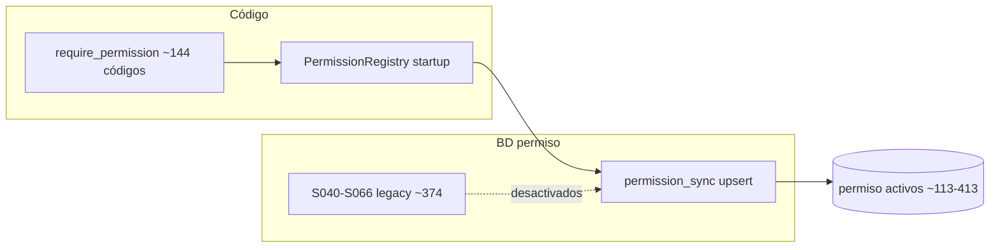
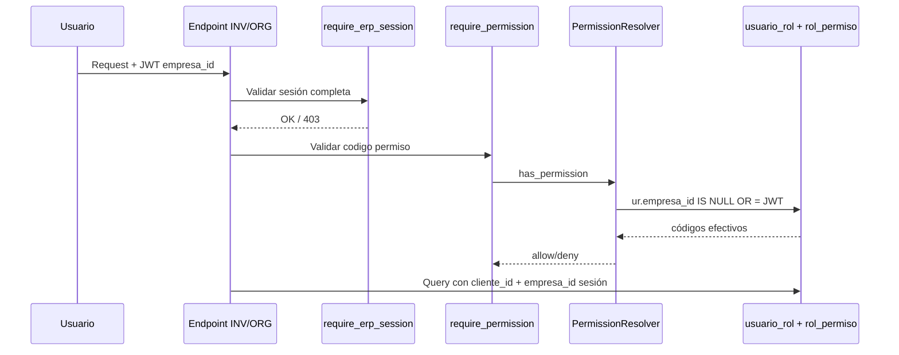

# Auditoría de endurecimiento — RBAC V1 (pre-STABLE)

**Tipo:** Auditoría estática de seguridad y consistencia (sin cambios de código, sin repair, sin commit)  
**Fecha:** 2026-05-31  
**Contexto:** Cierre funcional RBAC V1 (M1, M4, T1, T2, T3) aprobado. Última revisión antes de declarar **RBAC_V1_STABLE**.  
**Referencias:**

- [`RBAC_V1_FINAL.md`](./RBAC_V1_FINAL.md)
- [`BOOTSTRAP_SYSTEM_AUDIT.md`](./BOOTSTRAP_SYSTEM_AUDIT.md)
- [`CHANGELOG_RBAC_V1.md`](./CHANGELOG_RBAC_V1.md)
- [`RUNTIME_RBAC_AUDIT.md`](../../bootstrap_v2/00_manifest/RUNTIME_RBAC_AUDIT.md)
- [`RUNTIME_DEPENDENCY_MATRIX.md`](../../bootstrap_v2/00_manifest/RUNTIME_DEPENDENCY_MATRIX.md)

---

## 1. Resumen ejecutivo

| Dimensión | Veredicto | Notas |
|-----------|:---------:|-------|
| **Seguridad API (ORG/INV trial)** | **ACEPTABLE** | `require_permission` + `require_erp_session` (INV) + deps ORG |
| **Seguridad API (global)** | **RESIDUAL** | Endpoints auth/catálogo/modulos sin permiso explícito; debug en tenant |
| **Consistencia RBAC** | **ACEPTABLE con deuda** | Dual-path RP/RMP; sync desactiva permisos solo-SQL |
| **Multiempresa (ORG/INV)** | **ACEPTABLE** | Filtro `usuario_rol` + sesión ERP en módulos validados |
| **Multiempresa (otros módulos)** | **RIESGO** | WMS/SLS aceptan `empresa_id` por query; listados cross-company |

**Conclusión:** RBAC V1 cumple el alcance validado (roles oficiales, bundles, onboarding, ORG+INV trial). La auditoría identifica **deuda de hardening** principalmente en módulos fuera del bundle trial, endpoints administrativos legacy y divergencias DDL ↔ código. **No bloquea** la congelación `RBAC_V1_STABLE` si se documentan riesgos residuales y se planifica fase posterior de hardening.

**Conteo estático (análisis repo, mayo 2026):**

| Métrica | Valor orientativo |
|---------|:-----------------:|
| Endpoints con `require_permission` explícito | ~711 |
| Endpoints con `@require_super_admin` | ~33 |
| Endpoints autenticados sin permiso alternativo detectable | ~12 |
| Códigos únicos en `require_permission(...)` | ~144 |
| Códigos en seeds SQL `S040–S066` | ~374 |
| Intersección API ∩ SQL (matriz runtime) | ~93 |
| Permisos solo-SQL desactivados por sync | ~284 |

---

## 2. Metodología

1. Lectura estática de `permission_startup.py`, `permission_sync_service.py`, `rbac.py`, `deps_auth.py`, `org_deps.py`, `company_scope.py`, `permisos_usuario_service.py`, `menu_resolver.py`, `menu_permission_resolver.py`.
2. Script `scripts/audit_rbac_coverage.py` + análisis mejorado de decoradores `@router.*` y `dependencies=[...]`.
3. Revisión routers agregadores (`inv/presentation/endpoints.py`, `org/presentation/endpoints.py`, `auth/presentation/endpoints.py`).
4. Muestreo queries INV/ORG (empresa_id) vs WMS/SLS (patrones query param).
5. Contraste DDL `V020__tablas_bd_central.sql` vs `tables.py` (SQLAlchemy).
6. **Sin** ejecución runtime adicional en esta entrega (evidencias previas T1–T3 + M1/M4 JSON).

---

## 3. Seguridad

### 3.1 Modelo de protección en capas

```mermaid
flowchart TB
    subgraph capa1[Capa 1 — Autenticación]
        JWT[JWT válido]
        USER[get_current_active_user]
    end

    subgraph capa2[Capa 2 — Sesión ERP]
        ERP[require_erp_session]
        ORGCO[require_org_company_erp_session]
        ORGT[require_org_tenant_erp_session]
    end

    subgraph capa3[Capa 3 — RBAC API]
        RP[require_permission]
        SA[@require_super_admin]
        RC[RoleChecker Administrador]
    end

    subgraph capa4[Capa 4 — Datos]
        FILTRO[cliente_id + empresa_id en queries]
        ASSERT[assert_row_empresa]
    end

    JWT --> USER
    USER --> ERP
    USER --> RP
    ERP --> FILTRO
    RP --> FILTRO
    FILTRO --> ASSERT
```

| Mecanismo | Ubicación | Alcance |
|-----------|-----------|---------|
| `require_permission(codigo)` | `app/core/authorization/rbac.py` | Autorización API por `rol_permiso` |
| `require_erp_session` | `app/api/deps_auth.py` | Sesión completa + `empresa_id` obligatorio |
| `@require_super_admin()` | `app/core/authorization/lbac.py` | Plataforma |
| `RoleChecker(["Administrador"])` | Varios endpoints admin | Por **nombre** de rol, no `codigo_rol` |
| `apply_rbac_enforcement` | `permission_startup.py` @ startup | Inyecta permiso inferido solo paths `/org`, `/log`, `/admin` |

### 3.2 Endpoints sin `require_permission` (hallazgos)

El script `audit_rbac_coverage.py` marca endpoints con `get_current_active_user` sin `require_permission` en parámetros. Tras revisar decoradores de router, la lista **real de gaps** se reduce a:

| ID | Endpoint | Protección actual | Riesgo | Recomendación (fase posterior) |
|----|----------|-------------------|:------:|--------------------------------|
| **S-01** | `GET /auth/me/` | JWT + `reject_selection_token_for_me` | **Bajo** | Diseño intencional — no exige RP |
| **S-02** | `GET /auth/menu`, `GET /auth/permissions/me` | `require_erp_session` | **Bajo** | Sesión ERP; no expone mutación |
| **S-03** | `GET /catalogos/*` (5 rutas) | Solo autenticación | **Medio** | Cualquier usuario autenticado del tenant lee catálogos geo/moneda |
| **S-04** | `GET /modulos/{id}/dependencias/` | Solo autenticación | **Bajo** | Metadatos de catálogo global |
| **S-05** | `GET /modulos/disponibles/{cliente_id}/` | Solo autenticación | **Alto** | **IDOR cross-tenant:** path acepta cualquier `cliente_id` sin validar sesión |
| **S-06** | `GET /clientes/debug/*` | Solo autenticación | **Alto** | Exponer info interna; deshabilitar en prod |
| **S-07** | Superadmin auditoría | `@require_super_admin()` | **Bajo** | Falso positivo del script — protegido por LBAC |

**Nota:** Muchos endpoints listados por el script (users, rbac, tenant CRUD, modulos CRUD) tienen `dependencies=[Depends(require_permission(...))]` a nivel de decorador `@router.*` — el script no los detecta en parámetros de función.

**Auth prefix excluido del enforcement:** `SKIP_PREFIXES = ("/api/v1/auth", ...)` — rutas auth no reciben permiso inferido en startup (correcto para login/refresh).

### 3.3 Permisos huérfanos y catálogo

| Categoría | Descripción | Cantidad | Impacto |
|-----------|-------------|:--------:|---------|
| **Huérfanos desactivados** | Códigos solo en SQL `S040–S066`, no en registry API | ~284 | Sync los marca `es_activo=0` — no otorgan acceso |
| **Huérfanos activos protegidos** | `core.app.acceder`, `admin.platform.access` | 2 | En `PROTECTED_PERMISSION_CODIGOS` — no se desactivan |
| **Huérfanos semánticos** | `admin.tenant.access` (S020), permisos menú legacy | N | No usados por `require_permission`; sin efecto API |
| **Sin endpoint** | `core.app.acceder` no aparece en `require_permission` | 1 | Grant vía `rol_permiso`; no gate de ruta (by design) |

**Comportamiento sync (`permission_sync_service.sync`):**

- INSERT/UPDATE permisos declarados en registry (rutas + `core_permissions`).
- **Desactiva** permisos en BD ausentes del registry (excepto protegidos).
- Implicación: ejecutar solo seeds SQL sin startup deja cientos de permisos que luego se desactivan — **fuente de verdad = startup**, no `S040–S066`.

### 3.4 Menús sin permiso API asociado

| Aspecto | Estado |
|---------|--------|
| `modulo_menu.permiso_codigo_requerido` | Columna referenciada por `MenuPermissionBinder` — **no invocado** en startup (G-023) |
| `menu_permission_resolver` | Resuelve `required_permission` **en memoria** al servir `/auth/menu` |
| `rol_menu_permiso` | Gate real de visibilidad UI (`puede_ver=1`) — independiente de permiso API |
| Menú visible sin RP | Posible si RMP existe pero RP no (o viceversa) — **dual-path** |

**Riesgo:** Usuario puede ver menú (RMP) pero recibir 403 en API (RP faltante), o al revés si FE usa permisos de `/permissions/me` vs flags de menú. RBAC V1 mitiga con bundles T2/T3 que provisionan **ambos** para ORG/INV trial.

### 3.5 Permisos asociados a módulos inexistentes

| Fuente | Validación |
|--------|------------|
| `permission_sync` | Resuelve `modulo_id` por prefijo `modulo_codigo` contra tabla `modulo` |
| Seeds SQL `S040–S066` | MERGE con `modulo_id`; falla si módulo no existe en S010 |
| Registry inferido | Solo prefijos ORG/LOG/ADMIN en enforcement automático |

**Riesgo residual:** Permisos legacy en tenants antiguos con `modulo_id` apuntando a módulos desactivados — filtrados por `cliente_modulo` en resolver si `filter_by_active_modules=True`.

### 3.6 Rutas protegidas inconsistentes

| Inconsistencia | Detalle | Severidad |
|--------------|---------|:---------:|
| **RoleChecker por nombre** | `RoleChecker(["Administrador"])` vs `codigo_rol=ADMIN_TENANT` | Media — funciona hoy porque `nombre=Administrador` |
| **Enforcement parcial** | `apply_rbac_enforcement` solo infiere `/org`, `/log`, `/admin` | Media — módulos `inv`, `wms`, `sls` dependen de declaración manual |
| **Dual admin check** | Algunos endpoints exigen `require_admin` + `require_permission` | Baja — defensa en profundidad |
| **Superadmin vs permission** | Plataforma usa LBAC, no `admin.platform.*` en rutas | Baja — by design |

---

## 4. Consistencia RBAC

### 4.1 Permisos en código vs catálogo BD



| Escenario | Comportamiento | ¿Problema? |
|-----------|----------------|:----------:|
| Código declara permiso, no en BD pre-sync | Sync lo crea al startup | ✅ OK |
| BD tiene permiso solo-SQL post-sync | `es_activo=0` | ✅ OK (no grant efectivo) |
| Código usa permiso, tenant sin `rol_permiso` | 403 en runtime | ✅ OK (autorización correcta) |
| Tenant con grant SQL legacy activo | Permiso desactivado pero fila RP puede existir | ⚠️ Revisar tenants legacy |

**Permisos API declarados, típicamente no en seeds SQL:**

```
admin.usuario.*, admin.rol.*, tenant.cliente.*, tenant.branding.leer,
modulos.menu.*, org.*, inv.*
```

Estos los crea **sync** desde rutas; no dependen de `S040–S066`.

### 4.2 Permisos en catálogo no usados por rutas

| Grupo | Ejemplo | Estado post-sync |
|-------|---------|------------------|
| Módulos sin API implementada | `fin.*`, `hcm.*`, `mfg.*` | Desactivados (~284) |
| Acciones no implementadas | `*.eliminar` en módulos parciales | Desactivados |
| Legacy S020 | `admin.tenant.access` | Inactivo si no en registry |

**Impacto RBAC V1:** Ninguno en tenants nuevos — OWNER_FULL asigna permisos **activos** del catálogo post-sync.

### 4.3 `modulo_menu` con permiso inexistente

| Mecanismo | Persistencia |
|-----------|--------------|
| `MenuPermissionBinder.bind()` | Actualizaría `permiso_codigo_requerido` — **no ejecutado** |
| `menu_permission_resolver` | Busca `permiso` con `accion=leer` por `modulo_id` + recurso inferido del código menú |
| Sin match | Menú sin `required_permission` en respuesta — no bloquea visibilidad RMP |

**Query de resolución (runtime):**

```sql
SELECT codigo, modulo_id, recurso
FROM permiso
WHERE es_activo = 1 AND accion = 'leer'
  AND modulo_id IN (:modulo_ids...)
```

Menús cuyo recurso inferido no coincide (ej. `ORG_MI_EMPRESA` → recurso `empresa`) pueden no enlazar permiso en memoria — **inconsistencia FE** potencial, no bypass de seguridad API.

### 4.4 `rol_menu_permiso` → menús inexistentes

| Capa | Protección |
|------|------------|
| DDL `V020` | `FK_permiso_menu` → `modulo_menu(menu_id)` |
| SQLAlchemy `tables.py` | `ForeignKey('modulo_menu.menu_id')` |
| Bundles T2/T3 | UUIDs fijos de `S010` — válidos si catálogo aplicado |
| Insert runtime | Falla FK si menú ausente |

**Divergencia schema (hardening note):**

| Artefacto | `rol_menu_permiso.empresa_id` |
|-----------|:-----------------------------:|
| `V020__tablas_bd_central.sql` | Columna + FK + UQ `(cliente_id, empresa_id, rol_id, menu_id)` |
| `tables.py` (SQLAlchemy) | **Ausente** |
| Servicios T2/T3 | Insert sin `empresa_id` — alineado a SQLAlchemy, no a DDL V020 |

Riesgo: en BD creada estrictamente desde V020, inserts T2/T3 pueden divergir si `empresa_id` es NOT NULL en despliegues custom.

### 4.5 Dual-path API vs UI (consistencia bundles)

| Bundle | `rol_permiso` | `rol_menu_permiso` | Alineado T1–T3 |
|--------|:-------------:|:------------------:|:--------------:|
| BASE_OPERATIVE | ✅ | ❌ (solo RP) | By design |
| MANAGER_STANDARD | ✅ 47 | ✅ 14 | ✅ Validado QA |
| USER_STANDARD | ✅ 16 | ✅ 14 | ✅ Validado QA |
| OWNER_FULL | ✅ | ✅ | ✅ OwnerSync |

**Regla congelada:** menú vacío con RP presente = falta RMP (causa raíz MANAGER pre-T2, resuelta).

---

## 5. Multiempresa

### 5.1 Filtro `empresa_id` en RBAC

**SQL efectivo (`permisos_usuario_service.py`):**

```sql
-- Fragmento: sql_empresa_filter_usuario_rol("ur")
AND (ur.empresa_id IS NULL OR ur.empresa_id = :empresa_id)
```

| Rol | `usuario_rol.empresa_id` | Permisos efectivos en sesión EMP002 |
|-----|--------------------------|-------------------------------------|
| ADMIN_TENANT (M4) | `NULL` | Todos los grants del rol (cualquier sesión) |
| MANAGER_TENANT | UUID empresa | Solo si sesión = esa empresa |
| USER_TENANT | UUID empresa | Solo si sesión = esa empresa |

**Resolución `empresa_id` para RBAC:**

```
resolve_empresa_id_for_rbac(payload) → JWT empresa_id → ContextVar
```

Usado en `GET /auth/permissions/me`, `MenuResolverService`, `PermissionResolverService`.

**Validado M1/M4:** tests unitarios + evidencias JSON.

### 5.2 Endpoints company-scoped — cobertura por módulo

| Módulo | Gate sesión ERP | Filtro datos `empresa_id` | Estado |
|--------|:---------------:|:-------------------------:|:------:|
| **INV** | ✅ Router `require_erp_session` | ✅ Queries exigen `empresa_id` | **OK** |
| **ORG** `/empresa` | ✅ `require_org_tenant_erp_session` | Tenant-wide (list all org) | **OK** |
| **ORG** sucursales, deptos, … | ✅ `require_org_company_erp_session` | ✅ Queries + `assert_row_empresa` | **OK** |
| **ORG** parámetros | ✅ Hybrid | ✅ Merge global + override | **OK** |
| **Auth** menu/permissions | ✅ `require_erp_session` | RBAC filter | **OK** |
| **WMS** | ❌ No router ERP | ⚠️ `empresa_id` **Query param** del cliente | **RIESGO** |
| **SLS** | ❌ No router ERP | ⚠️ `empresa_id` **opcional** — listado all companies | **RIESGO** |
| **Catálogos** | ❌ | Solo `cliente_id` de usuario | **OK tenant / sin empresa** |

### 5.3 Posibles fugas cross-company

| ID | Escenario | Mecanismo | Severidad | Alcance RBAC V1 |
|----|-----------|-----------|:---------:|:---------------:|
| **M-01** | Manager EMP001 con sesión JWT EMP002 | RBAC filtra `usuario_rol` → sin grants admin | **Bajo** | Mitigado — manager no debería tener rol en EMP002 |
| **M-02** | Manager EMP001 fuerza query `empresa_id=EMP002` en WMS | Sin `reject_client_empresa_scope_override` | **Alto** | **Fuera bundle trial** — módulo WMS |
| **M-03** | SLS list sin `empresa_id` query | Retorna pedidos de **todas** las empresas del tenant | **Alto** | **Fuera bundle trial** |
| **M-04** | `GET /modulos/disponibles/{otro_cliente_id}` | Sin validación tenant sesión | **Crítico** | Plataforma/admin — revisar callers |
| **M-05** | Admin tenant-wide cambia sesión a EMP002 | Acceso intencional (M4) | **N/A** | By design |
| **M-06** | Legacy `empresa_id` en query ORG | `reject_legacy_empresa_query` → 403 | **Bajo** | Mitigado ORG Etapa B |
| **M-07** | Legacy `cliente_id` en query ORG | `reject_legacy_cliente_query` → 403 | **Bajo** | Mitigado ORG Etapa C1 |

**INV — patrón referencia (correcto):**

```python
# inv/presentation/endpoints.py
router = APIRouter(dependencies=[Depends(require_erp_session)])
```

```python
# producto_queries.py — triple filtro
InvProductoTable.c.cliente_id == client_id,
InvProductoTable.c.empresa_id == empresa_id,
```

**ORG — patrón referencia (correcto):**

```python
# org/presentation/endpoints.py
router.include_router(sucursales_router, dependencies=[Depends(require_org_company_erp_session)])
```

### 5.4 Diagrama flujo multiempresa RBAC V1



---

## 6. Matriz de riesgos consolidada

| ID | Área | Riesgo | Sev. | Bloquea STABLE | Acción sugerida (post-V1) |
|----|------|--------|:----:|:--------------:|---------------------------|
| S-05 | Seguridad | IDOR `modulos/disponibles/{cliente_id}` | **P0** | No* | Validar `cliente_id` = sesión |
| S-06 | Seguridad | Debug endpoints tenant en prod | **P1** | No* | Feature flag / eliminar |
| S-03 | Seguridad | Catálogos sin `require_permission` | **P2** | No | Definir permiso catálogo |
| M-02 | Multiempresa | WMS acepta `empresa_id` query | **P1** | No | Alinear a INV (`require_erp_session` + reject override) |
| M-03 | Multiempresa | SLS list cross-company | **P1** | No | Obligar filtro sesión empresa |
| C-01 | Consistencia | Dual-path RP / RMP | **P2** | No | Documentado; bundles alinean trial |
| C-02 | Consistencia | ~284 permisos SQL desactivados | **P3** | No | Deprecar seeds S040–S066 |
| C-03 | Consistencia | `MenuPermissionBinder` inactivo | **P2** | No | Activar o eliminar columna |
| C-04 | Schema | DDL V020 vs `tables.py` RMP | **P2** | No | Migración alineación |
| C-05 | Consistencia | `RoleChecker` por nombre rol | **P2** | No | Migrar a `codigo_rol` |
| M-04 | Multiempresa | INV/ORG OK; otros módulos pendientes | **P2** | No | Hardening por módulo al activar |

\* Bloquea **hardening producción global**, no el alcance **RBAC V1 trial ORG+INV** ya validado.

---

## 7. Veredicto por alcance RBAC V1

### 7.1 Dentro de alcance validado (ORG + INV + roles oficiales)

| Control | Estado |
|---------|:------:|
| Bundles T1/T2/T3 provisionan RP + RMP | ✅ |
| ADMIN tenant-wide M4 | ✅ |
| Filtro RBAC por sesión empresa | ✅ |
| INV router `require_erp_session` | ✅ |
| ORG deps tenant/company/hybrid | ✅ |
| Onboarding sin R010/R020 | ✅ |
| `/auth/menu` + `/auth/permissions/me` con sesión ERP | ✅ |

**Veredicto:** **APTO para RBAC_V1_STABLE** en el perfil trial ORG+INV y roles MANAGER/USER/ADMIN documentados.

### 7.2 Fuera de alcance / deuda posterior

- Hardening WMS, SLS, FIN, HCM y resto de módulos del catálogo S010.
- Endpoints plataforma/modulos administrativos (IDOR disponibles).
- Unificación DDL ↔ SQLAlchemy (`rol_menu_permiso`, G-010–G-012).
- Activación o retiro de `MenuPermissionBinder`.
- Endpoints debug tenant.

---

## 8. Checklist pre-STABLE (operativo)

| # | Verificación | Responsable |
|:-:|--------------|-------------|
| 1 | `RBAC_PERMISSION_SYNC_ENABLED=true` en prod | DevOps |
| 2 | App arrancada ≥1 antes del primer onboarding | DevOps |
| 3 | S010+S020 aplicados | DBA |
| 4 | No exponer `/clientes/debug/*` públicamente | DevOps / API gateway |
| 5 | Tenants legacy: ejecutar repairs según `CHANGELOG_RBAC_V1.md` §2.3 | Operaciones |
| 6 | Smoke T1/T2/T3 evidencias en staging | QA |
| 7 | Registrar deuda P0/P1 de esta auditoría en backlog post-STABLE | Producto |

---

## 9. Consultas SQL de verificación (post-despliegue)

```sql
-- Permisos activos vs grants huérfanos en tenant
SELECT COUNT(*) AS permisos_activos FROM permiso WHERE es_activo = 1;

-- Rol con RP pero sin RMP (manager pre-repair)
SELECT r.codigo_rol, COUNT(DISTINCT rp.permiso_id) AS rp, COUNT(rmp.permiso_id) AS rmp
FROM rol r
LEFT JOIN rol_permiso rp ON rp.rol_id = r.rol_id AND rp.cliente_id = r.cliente_id
LEFT JOIN rol_menu_permiso rmp ON rmp.rol_id = r.rol_id AND rmp.cliente_id = r.cliente_id AND rmp.puede_ver = 1
WHERE r.cliente_id = :cid AND r.codigo_rol IN ('MANAGER_TENANT','USER_TENANT')
GROUP BY r.codigo_rol;

-- RMP apuntando a menú inexistente (debe ser 0 si FK activa)
SELECT COUNT(*) AS huerfanos
FROM rol_menu_permiso rmp
LEFT JOIN modulo_menu mm ON mm.menu_id = rmp.menu_id
WHERE rmp.cliente_id = :cid AND mm.menu_id IS NULL;

-- Admin tenant-wide M4
SELECT ur.empresa_id FROM usuario_rol ur
JOIN rol r ON r.rol_id = ur.rol_id
WHERE ur.cliente_id = :cid AND r.codigo_rol = 'ADMIN_TENANT' AND ur.es_activo = 1;
-- Esperado: NULL

-- Permisos RP con modulo_id inválido
SELECT p.codigo FROM permiso p
LEFT JOIN modulo m ON m.modulo_id = p.modulo_id
WHERE p.es_activo = 1 AND p.modulo_id IS NOT NULL AND m.modulo_id IS NULL;
```

---

## 10. Conclusión

RBAC V1 es **funcionalmente cerrado y apto para congelación STABLE** en su alcance declarado. Esta auditoría de hardening **no invalida** las evidencias M1/M4/T1/T2/T3; documenta riesgos residuales para una **fase posterior de hardening global** (módulos fuera del trial, endpoints administrativos, alineación schema).

**Prioridad post-STABLE recomendada:**

1. **P0** — Corregir IDOR `modulos/disponibles/{cliente_id}`.
2. **P1** — Deshabilitar debug tenant; endurecer WMS/SLS multiempresa al activar comercialmente.
3. **P2** — Alinear DDL/SQLAlchemy; evaluar `MenuPermissionBinder`; migrar `RoleChecker` a `codigo_rol`.

---

**Fin de auditoría RBAC Security Hardening — pre RBAC_V1_STABLE**
