# RBAC V1 — Documentación oficial consolidada

**Versión:** 1.0 (Release Candidate)  
**Fecha:** 2026-05-31  
**Estado:** Validado en QA runtime  
**Alcance:** M1 Multiempresa · M4 ADMIN_TENANT tenant-wide · T1 BASE_OPERATIVE · T2 MANAGER_STANDARD · T3 USER_STANDARD

**Evidencias:**

| Fase | Evidencia |
|------|-----------|
| M1 | `app/bootstrap_v2/00_manifest/evidence/MULTIEMPRESA_M1_VALIDATION.json` |
| M4 | `app/bootstrap_v2/00_manifest/evidence/M4_ADMIN_TENANT_TENANT_WIDE_VALIDATION.json` |
| T1 | `app/bootstrap_v2/00_manifest/evidence/T1_BASE_OPERATIVE_INTEGRATION_VALIDATION.json` |
| T2 | `app/bootstrap_v2/00_manifest/evidence/T2_MANAGER_STANDARD_INTEGRATION_VALIDATION.json` |
| T3 | `app/bootstrap_v2/00_manifest/evidence/T3_USER_STANDARD_INTEGRATION_VALIDATION.json` |

**Documentos de diseño relacionados:**

- [MULTIEMPRESA_OFFICIAL_MODEL.md](./MULTIEMPRESA_OFFICIAL_MODEL.md)
- [ADMIN_TENANT_SCOPE_MODEL.md](./ADMIN_TENANT_SCOPE_MODEL.md)
- [ROLE_BUNDLE_BASELINE_AUDIT.md](./ROLE_BUNDLE_BASELINE_AUDIT.md)
- [MANAGER_STANDARD_BUNDLE_DESIGN.md](./MANAGER_STANDARD_BUNDLE_DESIGN.md)
- [USER_STANDARD_BUNDLE_DESIGN.md](./USER_STANDARD_BUNDLE_DESIGN.md)

---

## 1. Arquitectura general RBAC

CAXIS SaaS implementa RBAC en **dos capas independientes** que deben provisionarse por separado:

| Capa | Tabla | Propósito | Consumidor |
|------|-------|-----------|------------|
| **API RBAC** | `rol_permiso` ⋈ `permiso` | Autorización de endpoints (`require_permission`) | `PermissionResolverService` |
| **UI RBAC** | `rol_menu_permiso` ⋈ `modulo_menu` | Visibilidad y acciones del sidebar | `MenuResolverService` → `GET /auth/menu` |

### 1.1 Modelo de datos

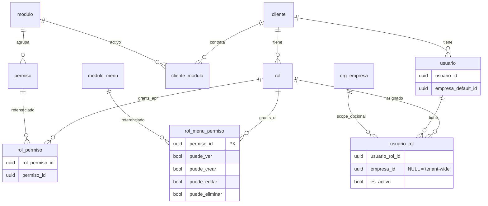

### 1.2 Resolución runtime

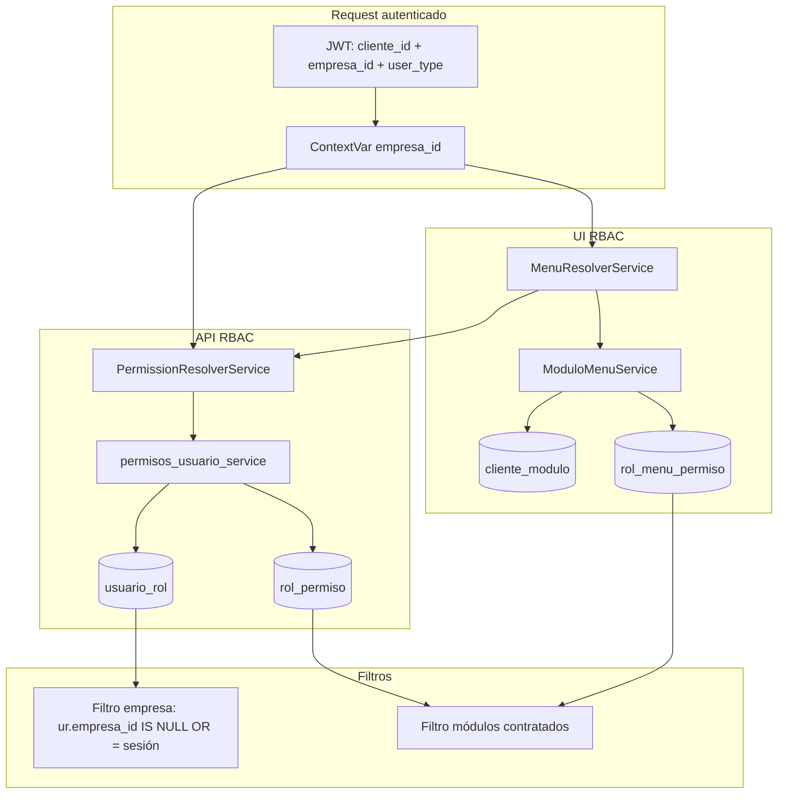

**Flujo documentado:**

1. **Tenant** → `cliente_id` identifica el tenant.
2. **Roles** → `usuario_rol` vincula usuario ↔ rol; filtrado por `empresa_id` de sesión (M1/M4).
3. **Permisos API** → `rol_permiso` proporciona códigos (`org.sucursal.leer`, etc.).
4. **Módulos contratados** → `cliente_modulo` filtra permisos y menús por plan comercial.
5. **Menú UI** → `rol_menu_permiso` determina qué ítems aparecen en `/auth/menu` (`puede_ver = 1`).

### 1.3 Separación auth vs RBAC

| Operación | Depende de `rol_permiso` |
|-----------|:------------------------:|
| `POST /auth/login` | ❌ |
| `GET /auth/me` | ❌ (solo JWT) |
| `POST /auth/empresa/cambiar` | ❌ |
| `GET /auth/menu` | ✅ (permisos + RMP) |
| APIs de negocio (`require_permission`) | ✅ |
| `GET /clientes/tenant/branding` | ✅ (`tenant.branding.leer`) |

### 1.4 Servicios centrales

| Servicio | Archivo | Responsabilidad |
|----------|---------|-----------------|
| `PermissionResolverService` | `app/core/authorization/permission_resolver.py` | Permisos efectivos por `(usuario_id, cliente_id, empresa_id)` |
| `MenuResolverService` | `app/core/authorization/menu_resolver.py` | Menú filtrado por permisos + RMP |
| `ModuloMenuService` | `app/modules/modulos/application/services/modulo_menu_service.py` | Estructura de menú + grants UI |
| `OwnerSyncService` | `app/modules/tenant/application/services/owner_sync_service.py` | Sync OWNER_FULL para ADMIN_TENANT |
| `OnboardingRbacService` | `app/modules/tenant/application/services/onboarding_rbac_service.py` | Orquestación RBAC en onboarding |

### 1.5 Reglas congeladas (R-BUNDLE)

| ID | Regla |
|----|-------|
| R-BUNDLE-01 | Auth/sesión no depende de `rol_permiso`. |
| R-BUNDLE-02 | `BASE_OPERATIVE` es obligatorio para roles operativos, independiente del plan. |
| R-BUNDLE-03 | `tenant.branding.leer` es infraestructura, no privilegio admin. |
| R-BUNDLE-04 | Permisos funcionales se gatean por `cliente_modulo`. |
| R-BUNDLE-05 | `USER_STANDARD` y `MANAGER_STANDARD` heredan `BASE_OPERATIVE`. |
| R-BUNDLE-06 | `OWNER_FULL` ⊃ `BASE_OPERATIVE` ⊃ ∅. |
| R-BUNDLE-07 | RMP de módulos no forma parte de BASE; menú vacío sin bundle funcional. |
| R-BUNDLE-08 | FE debe preferir `GET /auth/menu` sobre `/modulos-menus/me/`. |

---

## 2. Roles oficiales

### 2.1 Resumen

| Rol | `codigo_rol` | Scope `usuario_rol` | Bundle | `nivel_acceso` | JWT `user_type` |
|-----|--------------|---------------------|--------|:--------------:|-----------------|
| **PLATFORM_ADMIN** | `ADMIN_PLATFORM` | Cliente plataforma | Platform RBAC | — | `platform_admin` |
| **ADMIN_TENANT** | `ADMIN_TENANT` | **Tenant-wide** (`empresa_id IS NULL`) | OWNER_FULL | 5 | `tenant_admin` |
| **MANAGER_TENANT** | `MANAGER_TENANT` | **Company-scoped** | MANAGER_STANDARD | 3 | `user` |
| **USER_TENANT** | `USER_TENANT` | **Company-scoped** | USER_STANDARD | 1 | `user` |

> **Nota:** En catálogo y BD el rol de plataforma se registra como `ADMIN_PLATFORM`. En documentación funcional se denomina **PLATFORM_ADMIN**.

### 2.2 PLATFORM_ADMIN (`ADMIN_PLATFORM`)

| Atributo | Valor |
|----------|-------|
| **Cliente** | Plataforma (`SUPERADMIN_CLIENTE_ID`) |
| **Propósito** | Operación SaaS global: tenants, catálogos, impersonación |
| **Módulos** | `SYS_ADMIN` (incluye PLATFORM y CATALOGOS) |
| **Permisos API** | `core.app.acceder`, `admin.platform.access`, `admin.tenant.access`, `admin.*` |
| **Menú** | SYS_ADMIN completo (PLATFORM + CATALOGOS + TENANT) |
| **Provisionamiento** | `PlatformRbacBootstrapService` / `repair_platform_rbac.py` |
| **Multiempresa** | No aplica scope ERP tenant |

### 2.3 ADMIN_TENANT

| Atributo | Valor |
|----------|-------|
| **Propósito** | Administrador del tenant (owner) |
| **Scope asignación** | `usuario_rol.empresa_id = NULL` (M4 — tenant-wide) |
| **Sesión ERP** | Requiere `JWT empresa_id` activo para datos operativos |
| **Elegibles login** | Todas las `org_empresa` activas del tenant |
| **Capacidades** | CRUD usuarios/roles, administración empresas, todos los módulos contratados, SYS_ADMIN.TENANT.* |
| **Exclusión** | `tenant.cliente.crear` (solo plataforma) |
| **Provisionamiento** | `OwnerSyncService` + `bootstrap_global_grants_admin_tenant()` |

### 2.4 MANAGER_TENANT

| Atributo | Valor |
|----------|-------|
| **Propósito** | Supervisor operativo ORG + INV |
| **Scope asignación** | `usuario_rol.empresa_id = <empresa>` (company-scoped) |
| **Permisos** | Leer, crear, actualizar en ORG/INV; **sin eliminar** |
| **Empresas** | Solo `org.empresa.leer` (no administra empresas) |
| **Menú** | 14 ítems ORG + INV; sin SYS_ADMIN |
| **Provisionamiento** | `ManagerStandardService` (T2) |

### 2.5 USER_TENANT

| Atributo | Valor |
|----------|-------|
| **Propósito** | Usuario operativo de consulta |
| **Scope asignación** | `usuario_rol.empresa_id = <empresa>` (company-scoped) |
| **Permisos** | Solo `*.leer` + BASE_OPERATIVE |
| **Menú** | 14 ítems ORG + INV (solo ver + exportar); sin SYS_ADMIN |
| **Provisionamiento** | `UserStandardService` (T3) |

---

## 3. Bundles

Los bundles son conjuntos predefinidos de `rol_permiso` y `rol_menu_permiso` aplicados idempotentemente.

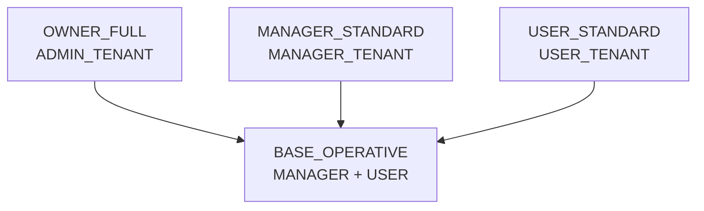

### 3.1 BASE_OPERATIVE (T1)

| Atributo | Valor |
|----------|-------|
| **Roles destino** | `MANAGER_TENANT`, `USER_TENANT` |
| **Tablas** | Solo `rol_permiso` (no RMP) |
| **Permisos** | 3 códigos fijos |
| **Servicio** | `BaseOperativeService` |
| **Repair** | `scripts/repair_base_operative.py` |

**Permisos (`rol_permiso`):**

```
core.app.acceder
tenant.branding.leer
org.empresa.leer
```

**Propósito:** Infraestructura transversal del shell ERP post-login (branding, contexto empresa). Independiente del plan comercial.

### 3.2 MANAGER_STANDARD (T2)

| Atributo | Valor |
|----------|-------|
| **Rol destino** | `MANAGER_TENANT` |
| **Hereda** | BASE_OPERATIVE |
| **`rol_permiso`** | **47** códigos |
| **`rol_menu_permiso`** | **14** menús (`puede_ver=1`) |
| **Servicio** | `ManagerStandardService` |
| **Constantes** | `manager_standard_constants.py` |
| **Repair** | `scripts/repair_manager_standard.py` |

**Política funcional aprobada:**

- ORG + INV operativos (leer, crear, actualizar).
- **Sin** `*.eliminar` en ORG/INV.
- **Sin** `org.empresa.crear/actualizar/eliminar` (solo `org.empresa.leer`).
- **Sin** SYS_ADMIN, PLATFORM, CATALOGOS, `admin.*`, `tenant.*` (excepto branding vía BASE).

**Menús visibles (14):**

| Módulo | Menús |
|--------|-------|
| ORG | Mi Empresa, Sucursales, Departamentos, Cargos, Centros de Costo, Parámetros |
| INV | Categorías, Productos, Unidades, Almacenes, Stock, Tipos Mov., Movimientos, Inv. Físico |

**Flags UI (`rol_menu_permiso`):** `ver=1`, `crear=1`, `editar=1`, `eliminar=0`, `exportar=1`; aprobación en movimientos/inventario físico.

### 3.3 USER_STANDARD (T3)

| Atributo | Valor |
|----------|-------|
| **Rol destino** | `USER_TENANT` |
| **Hereda** | BASE_OPERATIVE |
| **`rol_permiso`** | **16** códigos (solo `*.leer`) |
| **`rol_menu_permiso`** | **14** menús (`puede_ver=1`) |
| **Servicio** | `UserStandardService` |
| **Constantes** | `user_standard_constants.py` |
| **Repair** | `scripts/repair_user_standard.py` |

**Política funcional aprobada:**

- Predominantemente lectura.
- **Sin** crear, editar, eliminar, aprobar.
- Mismos 14 menús que MANAGER (solo ver + exportar).
- **Sin** SYS_ADMIN, administración tenant, administración empresas.

**Permisos API (16):**

```
core.app.acceder, tenant.branding.leer, org.empresa.leer
org.sucursal.leer, org.departamento.leer, org.cargo.leer,
org.centro_costo.leer, org.parametro.leer
inv.categoria.leer, inv.producto.leer, inv.unidad_medida.leer,
inv.almacen.leer, inv.stock.leer, inv.tipo_movimiento.leer,
inv.movimiento.leer, inv.inventario_fisico.leer
```

### 3.4 OWNER_FULL

| Atributo | Valor |
|----------|-------|
| **Rol destino** | `ADMIN_TENANT` |
| **Hereda** | BASE_OPERATIVE (como superconjunto) |
| **Servicios** | `OwnerSyncService` + `bootstrap_global_grants_admin_tenant()` |
| **Sync automático** | Onboarding, activación/desactivación de módulo comercial |

**`rol_permiso` — globales:**

```
core.app.acceder
admin.*          (todos los permisos admin declarados)
modulos.*
tenant.*         EXCEPT tenant.cliente.crear
```

**`rol_permiso` — por módulo contratado:**

Todos los `permiso` activos cuyo `modulo_id` corresponde a un módulo en `cliente_modulo`.

**`rol_menu_permiso`:**

- Todos los `modulo_menu` visibles del módulo contratado.
- Flags full: `ver/crear/editar/eliminar/exportar/imprimir/aprobar = 1`.
- SYS_ADMIN: solo `SYS_ADMIN.TENANT.*` (excluye PLATFORM y CATALOGOS).

**Conteo orientativo trial (ORG + SYS_ADMIN + INV):** ~70–75 RP + ~18 RMP.

---

## 4. Multiempresa

CAXIS separa tres conceptos de empresa:

| Concepto | Almacenamiento | Uso |
|----------|----------------|-----|
| **Empresa activa (sesión)** | JWT `empresa_id` + ContextVar | RBAC, menú, datos ERP |
| **Empresa preferida (login)** | `usuario.empresa_default_id` | Resolución automática en login |
| **Empresa asignada (rol)** | `usuario_rol.empresa_id` | Elegibilidad multiempresa |

### 4.1 `empresa_default_id` (M1)

| Evento | ¿Persiste? | Regla |
|--------|:----------:|-------|
| Onboarding admin | ✅ | `= EMP001` |
| `POST /auth/empresa/seleccionar/` | ✅ | R-LOGIN-07 |
| `POST /auth/empresa/cambiar/` | ✅ | R-CAMBIO-03 |
| Assign rol mono-empresa | ✅ | R-USER-03 (si NULL y 1 elegible) |
| Login | ❌ (solo lectura) | Limpia default inválida (R-DATA-02) |

### 4.2 `usuario_rol.empresa_id`

**Filtro SQL en resolución de permisos:**

```sql
AND (ur.empresa_id IS NULL OR ur.empresa_id = :empresa_id)
```

Implementado en `app/core/tenant/empresa_context.py` → `sql_empresa_filter_usuario_rol()`.

| Rol | Scope `usuario_rol.empresa_id` | Elegibles login |
|-----|-------------------------------|-----------------|
| **ADMIN_TENANT** | `NULL` (tenant-wide, M4) | Todas las `org_empresa` activas |
| **MANAGER_TENANT** | UUID empresa específica | Solo esa empresa |
| **USER_TENANT** | UUID empresa específica | Solo esa empresa |

### 4.3 JWT `empresa_id`

- Representa la **empresa activa de sesión**, no el scope del rol.
- Obligatorio para operaciones ERP company-scoped (INV, sucursales, etc.).
- ADMIN tenant-wide elige empresa al login o con `POST /auth/empresa/cambiar/`.
- Refresh token hereda `empresa_id` del JWT anterior.

### 4.4 Casos de login (A–D)

| Caso | Condición | Comportamiento |
|------|-----------|----------------|
| **A** | 1 empresa elegible | Sesión directa |
| **B** | N>1 + default ∈ elegibles | Sesión directa con default |
| **C** | N>1 + default NULL | `selection_token` → seleccionar → persist default |
| **D1** | Operativo, 0 elegibles | 403 `USER_WITHOUT_COMPANY` |
| **D2** | Admin onboarding, 0 org | Login sin `empresa_id` permitido |
| **D3** | Admin global + org | Reglas A/B/C sobre todas las org |

### 4.5 Diagrama multiempresa

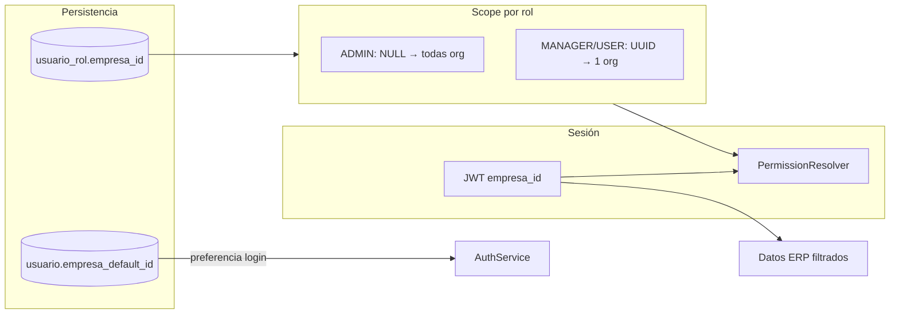

---

## 5. Flujo onboarding

El onboarding de un tenant nuevo provisiona roles, módulos y todos los bundles RBAC en una sola transacción.

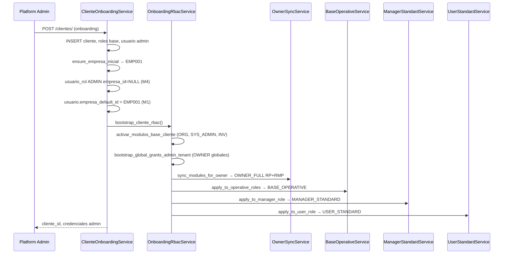

### 5.1 Orden de provisionamiento

| Paso | Servicio | Bundle / acción |
|:----:|----------|-----------------|
| 1 | `activar_modulos_base_cliente` | `cliente_modulo` según plan |
| 2 | `bootstrap_global_grants_admin_tenant` | OWNER_FULL — permisos globales |
| 3 | `OwnerSyncService.sync_modules_for_owner` | OWNER_FULL — RP + RMP por módulo |
| 4 | `BaseOperativeService.apply_to_operative_roles` | BASE_OPERATIVE → MANAGER + USER |
| 5 | `ManagerStandardService.apply_to_manager_role` | MANAGER_STANDARD |
| 6 | `UserStandardService.apply_to_user_role` | USER_STANDARD |

### 5.2 Roles creados

Definidos en `cliente_onboarding_service.ROLES_BASE`:

| `codigo_rol` | `nombre` | `nivel_acceso` | `es_admin_cliente` |
|--------------|----------|:--------------:|:------------------:|
| `ADMIN_TENANT` | Administrador | 5 | 1 |
| `MANAGER_TENANT` | Supervisor | 3 | 0 |
| `USER_TENANT` | Usuario | 1 | 0 |

---

## 6. Flujo assign role

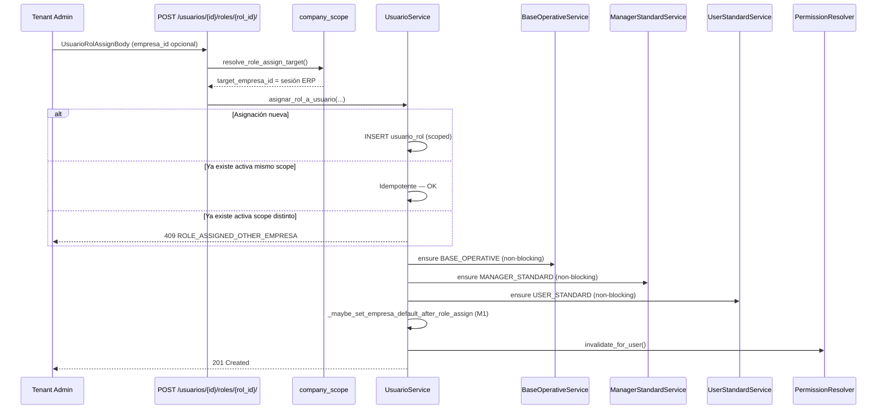

### 6.1 Reglas de asignación

| Regla | Descripción |
|-------|-------------|
| Scope operativo | MANAGER/USER se asignan scoped a `empresa_id` de sesión del admin |
| Scope admin | ADMIN_TENANT solo platform puede promover a global (`allow_global_promotion`) |
| UQ lógica | Un `(usuario_id, rol_id)` — no mismo rol en dos empresas |
| Hooks bundle | Non-blocking: fallo en bundle no bloquea la asignación |
| Default M1 | Si `empresa_default_id` NULL y 1 elegible → auto-set |

---

## 7. Flujo reactivación

Cuando una asignación `usuario_rol` existe pero `es_activo = 0`, `asignar_rol_a_usuario` la reactiva en lugar de insertar.

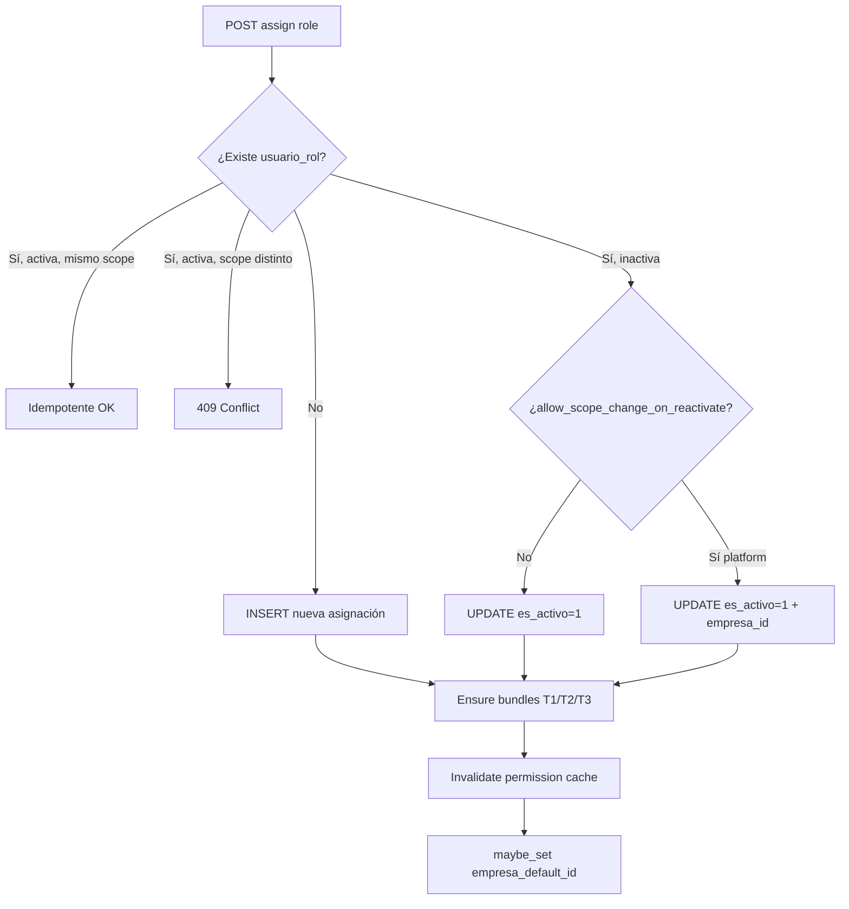

**Hooks post-reactivación:** mismos que assign role — BASE_OPERATIVE, MANAGER_STANDARD, USER_STANDARD (idempotentes).

---

## 8. Repairs disponibles

Todos los scripts son **idempotentes** y soportan `--dry-run` / `--apply`.

### 8.1 Repairs RBAC V1 (prioritarios)

| Script | Fase | Target | Acción |
|--------|:----:|--------|--------|
| `scripts/repair_base_operative.py` | T1 | MANAGER + USER | Inserta 3 permisos BASE en `rol_permiso` |
| `scripts/repair_manager_standard.py` | T2 | MANAGER_TENANT | Inserta 47 RP + 14 RMP |
| `scripts/repair_user_standard.py` | T3 | USER_TENANT | Inserta 16 RP + 14 RMP |
| `scripts/repair_admin_tenant_tenant_wide.py` | M4 | ADMIN_TENANT | `UPDATE usuario_rol SET empresa_id = NULL` |

**Uso típico:**

```bash
# Auditoría sin cambios
python scripts/repair_manager_standard.py --dry-run --all

# Aplicar en un tenant
python scripts/repair_user_standard.py --subdominio mi-tenant --apply

# Aplicar M4 tenant-wide
python scripts/repair_admin_tenant_tenant_wide.py --all --apply
```

### 8.2 Repairs complementarios

| Script | Propósito |
|--------|-----------|
| `scripts/repair_platform_rbac.py` | RBAC cliente plataforma (`ADMIN_PLATFORM`) |
| `scripts/repair_legacy_tenant_rbac.py` | Bootstrap completo legacy (equivalente R010+R020) |
| `scripts/repair_tenant_menu_grants.py` | RMP admin tenant (OwnerSync / menú sidebar) |
| `scripts/repair_minimal_erp_tenant.py` | ERP mínimo: org_empresa + vínculo admin + default |

### 8.3 Orden recomendado de repair en tenants legacy

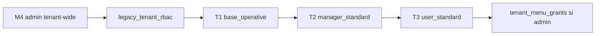

1. **M4** — Corregir scope ADMIN scoped → NULL.
2. **legacy_tenant_rbac** — Módulos + OWNER_FULL si faltan.
3. **T1** — BASE_OPERATIVE para operativos.
4. **T2/T3** — Bundles operativos completos.
5. **tenant_menu_grants** — Solo si admin sin menú SYS_ADMIN.

---

## 9. Diagramas Mermaid

### 9.1 Jerarquía de bundles

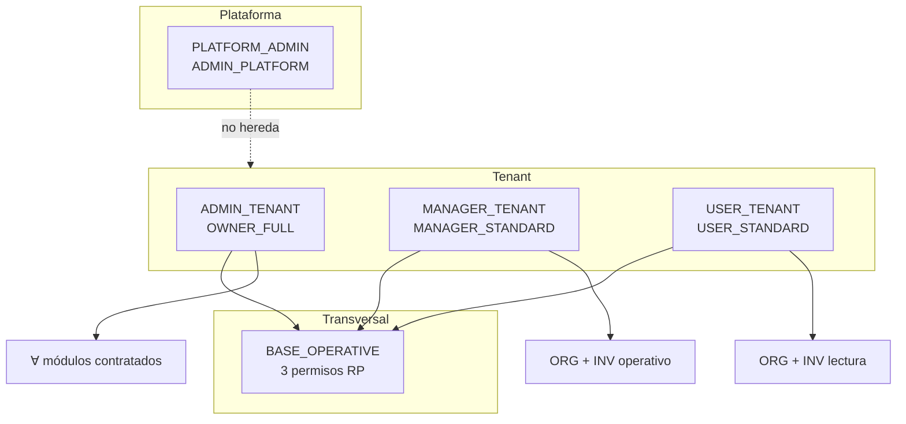

### 9.2 Resolución `/auth/menu`

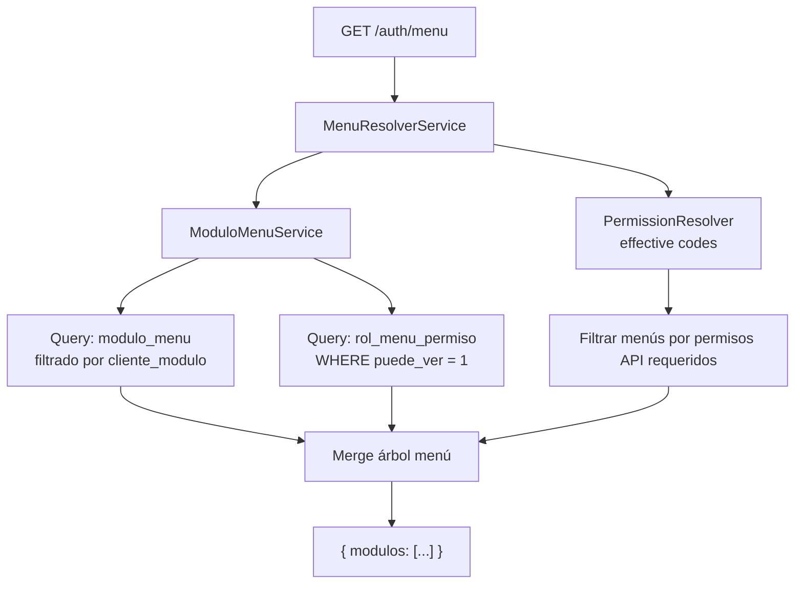

### 9.3 Ciclo de vida RBAC

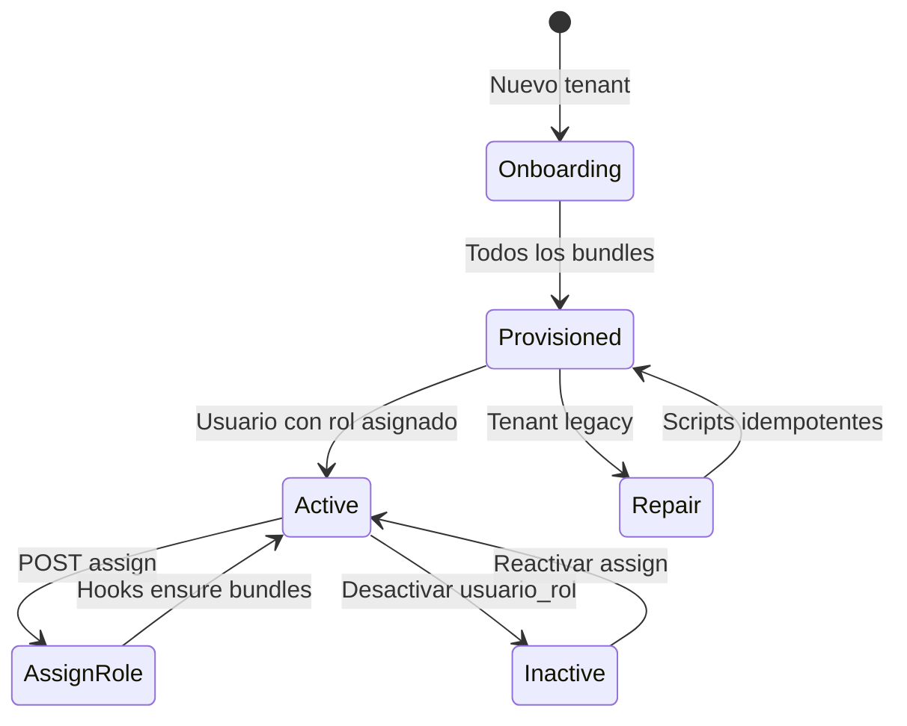

---

## 10. Matriz final de capacidades por rol

### 10.1 Matriz funcional

| Capacidad | PLATFORM_ADMIN | ADMIN_TENANT | MANAGER_TENANT | USER_TENANT |
|-----------|:--------------:|:------------:|:--------------:|:-----------:|
| Acceso plataforma SaaS | ✅ | ❌ | ❌ | ❌ |
| Impersonación tenant | ✅ | ❌ | ❌ | ❌ |
| Admin tenants / catálogos | ✅ | ❌ | ❌ | ❌ |
| Acceso ERP tenant | ❌ | ✅ | ✅ | ✅ |
| Scope multiempresa | N/A | Tenant-wide | 1 empresa | 1 empresa |
| Login sin seleccionar empresa | ✅ | Caso A/B/C | Caso A/B/C | Caso A/B/C |
| `core.app.acceder` | ✅ | ✅ | ✅ | ✅ |
| `tenant.branding.leer` | ✅ | ✅ | ✅ | ✅ |
| Admin usuarios/roles | ✅ plataforma | ✅ | ❌ | ❌ |
| Admin empresas tenant | ✅ plataforma | ✅ CRUD | ❌ solo leer | ❌ solo leer |
| Menú SYS_ADMIN.TENANT | ✅ full | ✅ full | ❌ | ❌ |
| Menú ORG (6 ítems) | ✅ full | ✅ full | ✅ sin eliminar | ✅ solo ver |
| Menú INV (8 ítems) | ✅ full | ✅ full | ✅ sin eliminar | ✅ solo ver |
| Crear registros ORG/INV | ✅ | ✅ | ✅ | ❌ |
| Editar registros ORG/INV | ✅ | ✅ | ✅ | ❌ |
| Eliminar registros ORG/INV | ✅ | ✅ | ❌ | ❌ |
| Aprobar movimientos / inv. físico | ✅ | ✅ | ✅ | ❌ |
| Exportar datos menú | ✅ | ✅ | ✅ | ✅ |
| Configuración tenant (`tenant.*`) | ✅ | ✅ | ❌ | ❌ |
| Módulos futuros (SLS, FIN, …) | ✅ auto OwnerSync | ✅ auto OwnerSync | ❌ manual bundle | ❌ manual bundle |

### 10.2 Matriz técnica (conteos validados trial ORG+INV)

| Dimensión | PLATFORM_ADMIN | ADMIN_TENANT | MANAGER_TENANT | USER_TENANT |
|-----------|:--------------:|:------------:|:--------------:|:-----------:|
| Bundle | Platform RBAC | OWNER_FULL | MANAGER_STANDARD | USER_STANDARD |
| Hereda BASE_OPERATIVE | — | ✅ (superconjunto) | ✅ | ✅ |
| `rol_permiso` (trial) | Variable | ~70–75 | **47** ✅ | **16** ✅ |
| `rol_menu_permiso` ver (trial) | Variable | ~18 | **14** ✅ | **14** ✅ |
| `usuario_rol.empresa_id` | N/A | **NULL** | UUID | UUID |
| Onboarding auto | ✅ | ✅ | ✅ | ✅ |
| Assign/reactivate hooks | — | — | ✅ | ✅ |
| Repair dedicado | `repair_platform_rbac` | `repair_legacy` + M4 | `repair_manager_standard` | `repair_user_standard` |

### 10.3 Matriz de exclusión (políticas congeladas)

| Exclusión | MANAGER | USER | ADMIN |
|-----------|:-------:|:----:|:-----:|
| `admin.*` | ❌ | ❌ | ✅ |
| `modulos.*` | ❌ | ❌ | ✅ |
| `tenant.cliente.*` | ❌ | ❌ | ❌ |
| `tenant.*` (resto) | ❌ | ❌ | ✅ |
| SYS_ADMIN.PLATFORM | ❌ | ❌ | ❌ (tenant) |
| SYS_ADMIN.CATALOGOS | ❌ | ❌ | ❌ (tenant) |
| SYS_ADMIN.TENANT | ❌ | ❌ | ✅ |
| `org.empresa.crear/actualizar/eliminar` | ❌ | ❌ | ✅ |
| `*.eliminar` ORG/INV | ❌ | ❌ | ✅ |
| `*.crear/actualizar` ORG/INV | ✅ | ❌ | ✅ |

---

## Apéndice A — Referencias de código

| Componente | Ruta |
|------------|------|
| Constantes BASE | `app/modules/tenant/application/services/base_operative_constants.py` |
| Constantes MANAGER | `app/modules/tenant/application/services/manager_standard_constants.py` |
| Constantes USER | `app/modules/tenant/application/services/user_standard_constants.py` |
| Servicio onboarding RBAC | `app/modules/tenant/application/services/onboarding_rbac_service.py` |
| OwnerSync | `app/modules/tenant/application/services/owner_sync_service.py` |
| Assign role + hooks | `app/modules/users/application/services/user_service.py` |
| Filtro empresa RBAC | `app/core/tenant/empresa_context.py` |
| Preferencia empresa | `app/core/tenant/empresa_preference.py` |
| Permission resolver | `app/core/authorization/permission_resolver.py` |
| Menu resolver | `app/core/authorization/menu_resolver.py` |

## Apéndice B — Tests de regresión

```bash
# Multiempresa M1
pytest tests/unit/test_multiempresa_m1.py tests/unit/test_empresa_sesion_auth.py -v

# M4 admin tenant-wide
pytest tests/unit/test_m4_admin_tenant_wide.py -v

# Bundles T1/T2/T3
pytest tests/unit/test_base_operative_t1.py tests/unit/test_manager_standard_t2.py tests/unit/test_user_standard_t3.py -v

# Integración runtime (requiere Docker backend)
python scripts/run_t2_manager_standard_integration.py
python scripts/run_t3_user_standard_integration.py
```

---

**Fin del documento RBAC V1.**  
Este documento consolida el estado validado al cierre de RC1. Cambios posteriores requieren nueva fase de diseño y evidencia QA.
