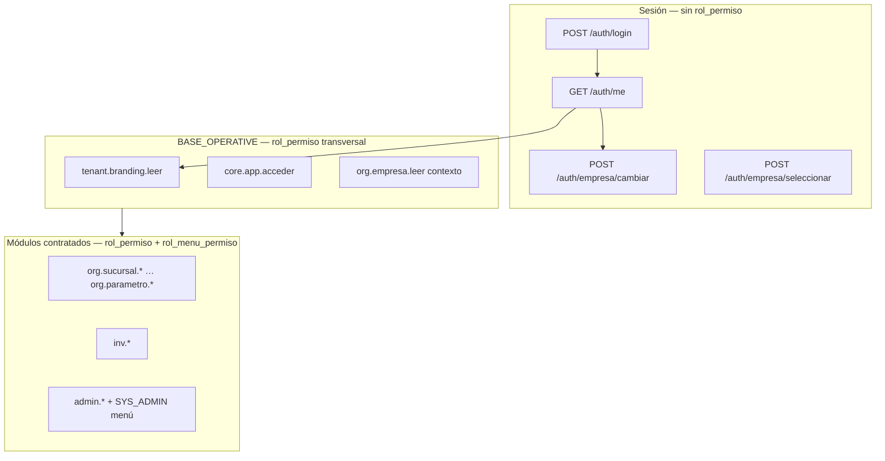
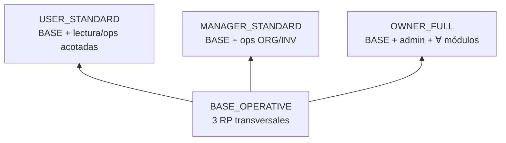

# Auditoría — Baseline de bundles RBAC (BASE_OPERATIVE)

**Tipo:** Propuesta arquitectónica (sin cambios de código)  
**Fecha:** 2026-05-31  
**Referencias:** [ROLE_GRANT_MODEL_AUDIT.md](./ROLE_GRANT_MODEL_AUDIT.md), [TENANT_ROLE_PERMISSION_MODEL_AUDIT.md](./TENANT_ROLE_PERMISSION_MODEL_AUDIT.md), [IMPLEMENTATION_PLAN_PHASE2.md](../bootstrap_v2/00_manifest/IMPLEMENTATION_PLAN_PHASE2.md), [M4_FRONTEND_BACKEND_CONTRACT_AUDIT.md](./M4_FRONTEND_BACKEND_CONTRACT_AUDIT.md)  
**Síntoma QA:** tenant_admin OK; MANAGER login + empresa activa + acceso ERP OK; errores **`tenant.branding.leer`** y similares en bootstrap post-login.

---

## 1. Resumen ejecutivo

| Pregunta | Respuesta |
|----------|-----------|
| ¿Por qué falla branding con MANAGER? | `GET /clientes/tenant/branding` exige **`tenant.branding.leer`**; MANAGER no recibe grants `tenant.*` (solo ADMIN vía `bootstrap_global_grants`). |
| ¿Login/menú/perfil requieren permiso RP? | **No** en endpoints auth (`/me`, `/menu`, `/empresa/cambiar`) — solo JWT + `require_erp_session`. |
| ¿Qué es infraestructura base? | Permisos **transversales al shell ERP** (branding, contexto empresa lectura) **independientes** del plan de módulos. |
| ¿Qué es funcional? | Permisos `org.*` (salvo lectura empresa contexto), `inv.*`, `admin.*`, etc. ligados a módulos contratados. |
| Bundle base propuesto | **`BASE_OPERATIVE`** — heredado por MANAGER_STANDARD y USER_STANDARD. |

**Veredicto:** el MANAGER “entra al ERP” porque **auth/sesión no dependen de `rol_permiso`**, pero el **shell FE** llama APIs con `require_permission` que ADMIN sí tiene y MANAGER no. Falta provisionar **BASE_OPERATIVE** en onboarding/repair.

---

## 2. Taxonomía — Infraestructura vs funcional

### 2.1 Diagrama de capas



### 2.2 Clasificación oficial

| Clase | Criterio | Ejemplos | Gate comercial |
|-------|----------|----------|----------------|
| **A — Auth/sesión** | JWT + deps auth; **no** `require_permission` | login, refresh, `/me`, cambiar empresa | N/A |
| **B — Infra ERP (BASE_OPERATIVE)** | Shell app post-login; **transversal** a roles operativos | `tenant.branding.leer`, `core.app.acceder`, `org.empresa.leer`* | **No** (siempre) |
| **C — Infra admin plataforma/tenant** | Configuración tenant; solo owner/admin | `tenant.cliente.*`, `tenant.conexion.*`, `admin.*`, `modulos.menu.administrar` | Parcial |
| **D — Funcional módulo** | Negocio ERP por módulo contratado | `org.sucursal.*`, `inv.producto.*`, … | **Sí** (`cliente_modulo`) |
| **E — UI menú (RMP)** | Visibilidad sidebar | `rol_menu_permiso` por `modulo_menu` | **Sí** (módulo + RMP) |

\* `org.empresa.leer` en BASE: lectura de catálogo empresa para **contexto/s selector**, no administración org completa.

### 2.3 Prefijos por clase

| Prefijo | Clase típica | ¿En BASE_OPERATIVE? |
|---------|--------------|:-------------------:|
| `(auth endpoints)` | A | N/A |
| `core.app.*` | B | ✅ `core.app.acceder` |
| `tenant.branding.*` | B | ✅ leer |
| `tenant.cliente.*` | C | ❌ (ADMIN / platform) |
| `tenant.conexion.*` | C | ❌ |
| `org.empresa.leer` | B* / D | ✅ en BASE (contexto) |
| `org.{otro}.*` | D | ❌ → MANAGER/USER_STANDARD |
| `inv.*` | D | ❌ → bundles módulo |
| `admin.*` | C | ❌ → OWNER_FULL |
| `modulos.menu.*` | C / legacy | ⚠️ solo si FE usa `/modulos-menus/me/` |
| `tenant.*` (resto) | C | ❌ salvo branding |

---

## 3. Permisos mínimos por flujo de bootstrap

### 3.1 Matriz flujo → endpoint → permiso

| Flujo | Endpoint backend | `require_permission` | ¿BASE_OPERATIVE? | Sin permiso — error |
|-------|------------------|:--------------------:|:----------------:|---------------------|
| **Login** | `POST /auth/login/` | ❌ | — | 401 credenciales |
| **Branding pre-login** | `GET /clientes/branding?subdominio=` | ❌ (público) | — | 404 subdominio |
| **Branding post-login** | `GET /clientes/tenant/branding` | ✅ **`tenant.branding.leer`** | ✅ | **403** `PERMISSION_DENIED` |
| **Perfil** | `GET /auth/me/` | ❌ | — | 409 selection token |
| **Empresa activa (JWT)** | Incluida en `/me` `empresa_activa` | ❌ | — | null si pending |
| **Lista empresas (admin sin JWT)** | `/me` → `empresas_disponibles` | ❌ | — | null en sesión normal |
| **Lista empresas (API ORG)** | `GET /org/empresa` | ✅ **`org.empresa.leer`** + sesión tenant | ✅ lectura | **403** |
| **Cambiar empresa** | `POST /auth/empresa/cambiar/` | ❌ | — | 403 impersonación / 409 pending |
| **Permisos efectivos** | `GET /auth/permissions/me` | ❌ (solo `require_erp_session`) | — | 409 pending; lista vacía |
| **Menú sidebar** | `GET /auth/menu` | ❌ (solo `require_erp_session`) | — | 409; **menú vacío** sin RMP |
| **Menú legacy** | `GET /modulos-menus/me/` | ✅ **`modulos.menu.leer`** | ⚠️ legacy | **403** |
| **Acceder ERP (INV/ORG ops)** | Módulos `require_erp_session` + RP recurso | ✅ por ruta | D | **403** por acción |

### 3.2 Hallazgo QA — `tenant.branding.leer`

```580:580:app/modules/tenant/presentation/endpoints_clientes.py
    dependencies=[Depends(require_permission("tenant.branding.leer"))],
```

| Rol | ¿Tiene `tenant.branding.leer` hoy? | Motivo |
|-----|:-----------------------------------:|--------|
| **ADMIN_TENANT** | ✅ | `bootstrap_global_grants_admin_tenant()` → `tenant.%` (exc. `tenant.cliente.crear`) |
| **MANAGER_TENANT** | ❌ | Sin bootstrap de grants |
| **USER_TENANT** | ❌ | Idem |

**Contradicción documental:** el OpenAPI del endpoint dice *“Usuario autenticado (cualquier nivel)”* pero el código exige RP — **debe tratarse como permiso BASE**, no como privilegio admin.

### 3.3 Flujos que NO requieren `rol_permiso` (solo sesión)

Confirmado en `deps_auth.py` y `endpoints.py`:

| Recurso | Dependencia |
|---------|-------------|
| `GET /auth/me/` | `get_current_active_user` |
| `POST /auth/empresa/cambiar/` | `get_current_user_data` + validación elegibles |
| `GET /auth/menu` | `require_erp_session` |
| `GET /auth/permissions/me` | `require_erp_session` |

**Implicación:** MANAGER puede obtener **200** en `/me`, `/menu`, `/permissions/me` con sesión válida; el fallo aparece en **llamadas paralelas del shell** (`/tenant/branding`) o en **módulos** (403).

---

## 4. Permisos por rol — independientes del plan

### 4.1 Regla oficial

> Todo usuario **operativo** (`MANAGER_TENANT`, `USER_TENANT`) debe recibir **`BASE_OPERATIVE`** al crearse/asignarse rol, **antes** de módulos contratados.

| Rol | BASE_OPERATIVE | Bundle módulo | Bundle total |
|-----|:--------------:|---------------|--------------|
| **USER_TENANT** | ✅ obligatorio | USER_STANDARD − BASE | USER_STANDARD |
| **MANAGER_TENANT** | ✅ obligatorio | MANAGER_STANDARD − BASE | MANAGER_STANDARD |
| **ADMIN_TENANT** | ✅ (vía `tenant.*` + core) | OWNER_FULL − BASE | OWNER_FULL |

### 4.2 Contenido mínimo por rol (solo capa transversal)

| Código | ADMIN hoy | MANAGER hoy | USER hoy | Propuesta |
|--------|:---------:|:-----------:|:--------:|:---------:|
| `core.app.acceder` | ✅ | ❌ | ❌ | **Todos operativos** |
| `tenant.branding.leer` | ✅ | ❌ | ❌ | **Todos operativos** |
| `org.empresa.leer` | ✅ | ❌ | ❌ | **Todos operativos** (selector/contexto) |
| `modulos.menu.leer` | ✅ | ❌ | ❌ | ⚠️ Solo si FE legacy; preferir `/auth/menu` |

**ADMIN** recibe además (OWNER, no BASE): `admin.*`, `modulos.*`, `tenant.cliente.*`, todos los módulos contratados.

---

## 5. Bundle `BASE_OPERATIVE` (definición oficial propuesta)

### 5.1 Propósito

Conjunto **mínimo e invariante** de `rol_permiso` para que cualquier usuario con sesión ERP completa pueda **cargar el shell** sin errores 403 en bootstrap transversal.

**No incluye:** menús de negocio (RMP), permisos CRUD de módulos, administración tenant.

### 5.2 Contenido RP (lista cerrada)

| # | Código | Recurso | Justificación |
|---|--------|---------|---------------|
| 1 | `core.app.acceder` | app | Grant histórico; FE puede validar “acceso ERP”; alineación R010 |
| 2 | `tenant.branding.leer` | branding | `GET /clientes/tenant/branding` — **síntoma QA** |
| 3 | `org.empresa.leer` | empresa | Contexto multiempresa vía `GET /org/empresa` si FE no usa solo `/me` |

**Total:** **3 códigos** (extensible solo por ADR; no usar prefijos amplios `tenant.%` en operativos).

### 5.3 Contenido RMP

| Elemento | Regla |
|----------|-------|
| Menús | **Ninguno** en BASE — sidebar vacío hasta bundle módulo |
| Excepción | No aplica |

### 5.4 Eventos de provisión (propuesto)

| Evento | Acción |
|--------|--------|
| Onboarding tenant | Insertar BASE_OPERATIVE en MANAGER_TENANT y USER_TENANT |
| Assign rol operativo a usuario | Rol ya debe tener BASE |
| Repair script legacy | Backfill BASE en roles sistema vacíos |
| Activación módulo | **No** modifica BASE |

### 5.5 Herencia

```text
BASE_OPERATIVE
    ├── USER_STANDARD   (= BASE + permisos funcionales USER)
    └── MANAGER_STANDARD (= BASE + permisos funcionales MANAGER)

OWNER_FULL ⊃ BASE_OPERATIVE ⊃ ∅
OWNER_FULL = BASE + admin.* + modulos.* + tenant.* + ∀ módulos contratados
```

---

## 6. Errores si faltan permisos BASE

### 6.1 Catálogo de síntomas

| Permiso faltante | Endpoint / capa | HTTP | `internal_code` | Síntoma FE |
|------------------|-----------------|------|-----------------|------------|
| `tenant.branding.leer` | `GET /clientes/tenant/branding` | **403** | `PERMISSION_DENIED` | Logo/colores default; toast error permisos; **QA actual** |
| `org.empresa.leer` | `GET /org/empresa` | **403** | `PERMISSION_DENIED` | Selector empresa header vacío si FE usa ORG API |
| `core.app.acceder` | Solo si FE guard explícito | — | — | Redirect/bloqueo shell (raro; no en API core) |
| `modulos.menu.leer` | `GET /modulos-menus/me/` | **403** | `PERMISSION_DENIED` | Solo rutas legacy; `/auth/menu` sigue 200 |
| *(ningún BASE)* | `GET /auth/me` | 200 | — | Perfil OK |
| *(ningún BASE)* | `GET /auth/menu` | 200 | — | **Menú vacío** (falta RMP módulo, no BASE) |
| *(ningún BASE)* | `GET /auth/permissions/me` | 200 | — | `permissions: []` o solo BASE cuando exista |
| Falta `inv.*` / `org.sucursal.*` | Rutas módulo | **403** | `PERMISSION_DENIED` | Pantalla carga; acciones/API fallan — **funcional**, no BASE |

### 6.2 Mensaje API estándar

```text
403 Forbidden
detail: "No tiene permisos suficientes para realizar esta acción. Se requiere: tenant.branding.leer"
internal_code: PERMISSION_DENIED
```

### 6.3 Escenario QA reconstruido

```text
1. MANAGER login → 200 Token, empresa_activa OK
2. FE bootstrap:
   a. GET /auth/me → 200 ✅
   b. GET /clientes/tenant/branding → 403 ❌ (falta tenant.branding.leer)
   c. GET /auth/permissions/me → 200, permissions: [] 
   d. GET /auth/menu → 200, modulos: [] (sin RMP módulo)
3. FE entra layout ERP pero branding/permisos/menú degradados
```

---

## 7. Propuesta final — Jerarquía de bundles

### 7.1 Vista consolidada



### 7.2 `BASE_OPERATIVE`

| Atributo | Valor |
|----------|-------|
| **Roles** | MANAGER_TENANT, USER_TENANT (obligatorio); ADMIN lo incluye vía OWNER |
| **RP** | `core.app.acceder`, `tenant.branding.leer`, `org.empresa.leer` |
| **RMP** | — |
| **Módulos contratados** | Independiente |
| **Sync** | Onboarding + repair; idempotente INSERT NOT EXISTS |

### 7.3 `USER_STANDARD`

| Atributo | Valor |
|----------|-------|
| **Hereda** | BASE_OPERATIVE |
| **RP adicional (trial ORG+INV)** | |
| | ORG: 6× `*.leer` |
| | INV: 9× `*.leer` + `inv.movimiento.crear`, `inv.movimiento.leer` |
| **Excluye** | `admin.*`, `tenant.cliente.*`, `tenant.conexion.*`, `modulos.menu.administrar`, acciones `aprobar/autorizar` salvo excepción |
| **RMP adicional** | Menús ORG+INV con `puede_ver=1`; crear solo donde RP permita |
| **Conteo orientativo trial** | BASE 3 + ~15 funcional ≈ **18 RP** |

### 7.4 `MANAGER_STANDARD`

| Atributo | Valor |
|----------|-------|
| **Hereda** | BASE_OPERATIVE |
| **RP adicional (trial ORG+INV)** | |
| | ORG: 6× leer + CRUD sucursal/departamento/cargo/centro_costo; **sin** `org.empresa.crear/eliminar` |
| | INV: ~30–35 códigos (operación + lifecycle) |
| **Excluye** | `admin.*`, `tenant.cliente.*`, SYS_ADMIN menú |
| **RMP adicional** | 6 ORG + 9 INV; flags según RP |
| **Conteo orientativo trial** | BASE 3 + ~45 funcional ≈ **48 RP** |

### 7.5 `OWNER_FULL`

| Atributo | Valor |
|----------|-------|
| **Rol** | ADMIN_TENANT |
| **Hereda** | BASE_OPERATIVE (contenido superconjunto) |
| **RP** | |
| | Globales: `core.app.acceder`, `admin.*`, `modulos.*`, `tenant.*` \ {`tenant.cliente.crear`} |
| | Por módulo contratado: **todos** los `permiso` activos del módulo |
| **RMP** | Todos los `modulo_menu` visibles; SYS_ADMIN.TENANT.*; flags full |
| **Sync hoy** | `OwnerSyncService` + `bootstrap_global_grants_admin_tenant()` |
| **Conteo trial** | ~70–75 RP + 18 RMP |

### 7.6 Tabla comparativa final

| Dimensión | BASE_OPERATIVE | USER_STANDARD | MANAGER_STANDARD | OWNER_FULL |
|-----------|:--------------:|:-------------:|:----------------:|:----------:|
| Rol destino | MGR, USER | USER_TENANT | MANAGER_TENANT | ADMIN_TENANT |
| Depende `cliente_modulo` | ❌ | ✅ filtra funcional | ✅ filtra funcional | ✅ |
| Branding post-login | ✅ | ✅ | ✅ | ✅ |
| Menú negocio | ❌ | ✅ subset | ✅ subset | ✅ full |
| Admin usuarios/roles | ❌ | ❌ | ❌ | ✅ |
| Crear empresas tenant | ❌ | ❌ | ❌ | ✅ |
| Onboarding auto hoy | ❌ | ❌ | ❌ | ✅ |

---

## 8. Reglas congeladas (R-BUNDLE)

| ID | Regla |
|----|-------|
| **R-BUNDLE-01** | Auth/sesión (`/login`, `/me`, `/empresa/cambiar`) **no** dependen de `rol_permiso`. |
| **R-BUNDLE-02** | `BASE_OPERATIVE` es **obligatorio** para todo rol operativo, **independiente** del plan. |
| **R-BUNDLE-03** | `tenant.branding.leer` es **infraestructura**, no privilegio admin. |
| **R-BUNDLE-04** | Permisos funcionales (`org.sucursal.*`, `inv.*`, …) se gatean por **`cliente_modulo`**. |
| **R-BUNDLE-05** | `USER_STANDARD` y `MANAGER_STANDARD` **heredan** BASE_OPERATIVE. |
| **R-BUNDLE-06** | `OWNER_FULL` ⊃ BASE_OPERATIVE ⊃ ∅. |
| **R-BUNDLE-07** | RMP de módulos **no** forma parte de BASE; menú vacío sin bundle funcional. |
| **R-BUNDLE-08** | FE debe preferir `GET /auth/menu` sobre `/modulos-menus/me/` (evita `modulos.menu.leer` en BASE). |
| **R-BUNDLE-09** | Faltante BASE → 403 en bootstrap shell; faltante funcional → 403 en acciones de negocio. |
| **R-BUNDLE-10** | Repair/backfill BASE es **idempotente** y prioridad **P0** antes de módulos. |

---

## 9. Plan de remediación (referencia — sin implementar)

| Prioridad | Entrega | Resuelve |
|-----------|---------|----------|
| **P0** | Grant `BASE_OPERATIVE` a MANAGER/USER en onboarding | `tenant.branding.leer` QA |
| **P0** | Script repair `apply_base_operative_bundles.py` | Tenants existentes |
| **P1** | `MANAGER_STANDARD` / `USER_STANDARD` (RoleGrantSync) | Menú + módulos |
| **P1** | FE: no exigir pseudo-permisos; usar `permissions/me` | Guards alineados |
| **P2** | Endpoint branding sin RP **o** documentar BASE obligatorio | Deuda diseño API |

**Alternativa API (no recomendada como única):** relajar `GET /tenant/branding` a solo autenticación — duplicaría semántica del endpoint público `/branding?subdominio=`. **Preferible:** provisionar BASE_OPERATIVE.

---

## 10. Conclusión

1. **Infraestructura base** ≠ módulos contratados: son pocos códigos RP transversales al shell (`tenant.branding.leer` es el caso QA).
2. **MANAGER “accede al ERP”** porque la sesión JWT es válida; los **403** aparecen en APIs de bootstrap con `require_permission`.
3. **`BASE_OPERATIVE`** (3 permisos) debe provisionarse a **MANAGER** y **USER** siempre; **MANAGER_STANDARD** y **USER_STANDARD** lo extienden con permisos funcionales filtrados por plan.
4. **`OWNER_FULL`** ya incluye BASE vía grants globales ADMIN; el gap es exclusivamente en roles operativos.

---

## 11. Referencias de código

| Tema | Ubicación |
|------|-----------|
| Branding autenticado | `endpoints_clientes.py` → `obtener_branding_tenant` |
| Branding público | `endpoints_clientes.py` → `obtener_branding_por_subdominio` |
| Grants globales ADMIN | `onboarding_rbac_service.py` → `bootstrap_global_grants_admin_tenant` |
| Auth deps sesión | `deps_auth.py` |
| Error PERMISSION_DENIED | `rbac.py` → `require_permission` |
| Lista mínima Phase2 | `IMPLEMENTATION_PLAN_PHASE2.md` §3.4 |
| Bundles previos | `ROLE_GRANT_MODEL_AUDIT.md` §7 |

**Estado:** propuesta congelada — **sin cambios de código, sin PR**.
