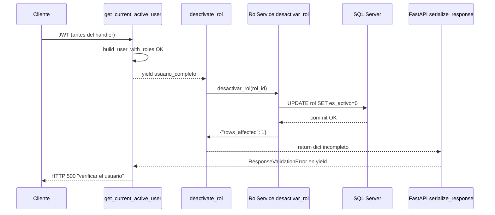

# Diagnóstico runtime — 500 en `DELETE /api/v1/roles/{rol_id}/`

**Tipo:** Evidencia runtime (logs Docker + reproducción HTTP) — sin cambios de código  
**Fecha:** 2026-06-01  
**Contexto QA:** Sprint C — desactivar perfil/rol desde administración de roles  
**Ejemplo reportado:** `62aad8f4-d2d1-4e85-816f-0976683b65e8`  
**Reproducción adicional:** `e933ad89-517c-4a3b-8519-c0920b13bbce` (rol QA creado y eliminado en esta auditoría)  
**Fuente logs:** `terminals/1.txt` — contenedor `fastapi_backend`

---

## 1. Resumen ejecutivo

| Campo | Valor |
|-------|-------|
| **Síntoma HTTP** | **500** — `"Error interno al verificar el usuario"` |
| **Excepción real** | `fastapi.exceptions.ResponseValidationError` |
| **Causa inmediata** | Respuesta del handler = `{'rows_affected': 1}` no cumple `response_model=RolRead` |
| **Causa raíz funcional** | `DEACTIVATE_ROL` sin `OUTPUT`; `execute_update` no devuelve fila del rol; el servicio retorna solo `rows_affected` |
| **¿Persistió la desactivación?** | **Sí** — `UPDATE rol SET es_activo = 0` ejecutado y commit antes del error |
| **¿Async/await faltante?** | **No** — `await execute_update` está correcto en L818 |
| **Mensaje engañoso** | Proviene de **`get_current_active_user`** (`deps.py` L338–340), no del módulo roles |
| **Clasificación** | **Bug backend** (contrato de respuesta + manejo de excepciones en dependencia yield) |
| **Frontend** | **No** — el payload DELETE es correcto; el error es post-operación en serialización |

**Patrón:** Similar al DELETE usuario (operación persistida + 500 posterior), pero **mecanismo distinto**: aquí no hay coroutine sin `await`, sino **respuesta incompleta** + **captura genérica** en dependencia con `yield`.

---

## 2. Reproducción runtime

### 2.1 Pasos

1. `POST /api/v1/roles/` — crear rol `Qa_Del_A4Be24` → **201**
2. `DELETE /api/v1/roles/{rol_id}/` → **500**
3. `GET /api/v1/roles/all-active/` → el rol **no** aparece (desactivado en BD)

### 2.2 Resultado HTTP

```http
DELETE /api/v1/roles/e933ad89-517c-4a3b-8519-c0920b13bbce/
→ 500 Internal Server Error

{
  "detail": "Error interno al verificar el usuario"
}
```

### 2.3 Observación QA (confirmada)

| Hecho | Evidencia |
|-------|-----------|
| Perfil desaparece al refrescar | `all-active` sin el `rol_id` |
| DELETE aparentemente ejecutado | Log `Rol ID ... desactivado exitosamente` **antes** del 500 |
| Mensaje no describe roles | Texto fijo de `deps.py`, no de `rbac` endpoints |

---

## 3. Endpoint y flujo completo

### 3.1 Endpoint

| Elemento | Valor |
|----------|-------|
| **Ruta** | `DELETE /api/v1/roles/{rol_id}/` |
| **Handler** | `deactivate_rol()` — `app/modules/rbac/presentation/endpoints.py` **L466–505** |
| **Permisos** | `require_admin` + `admin.rol.eliminar` |
| **response_model** | `RolRead` |
| **Dependencias** | `get_current_active_user` (vía `current_user` y `require_permission`) |

### 3.2 Secuencia (orden real en logs)



| Paso | Componente | Resultado |
|------|------------|-----------|
| 1 | `get_current_active_user` hasta `yield` | OK |
| 2 | Validaciones endpoint (cliente, no rol sistema) | OK |
| 3 | `RolService.desactivar_rol` → `execute_update(DEACTIVATE_ROL)` | **Commit OK** |
| 4 | Log servicio / endpoint “desactivado exitosamente” | OK |
| 5 | `return deactivated_rol` → validar `RolRead` | **ResponseValidationError** |
| 6 | Excepción absorbida en `deps.py` `except Exception` | **500** mensaje incorrecto |

---

## 4. Stack trace real (literal)

```text
2026-06-01 07:57:39,824 - rol_service - INFO - Rol ID e933ad89-... desactivado exitosamente
2026-06-01 07:57:39,824 - endpoints - INFO - Rol ID e933ad89-... desactivado exitosamente en cliente e4c8e906-...
2026-06-01 07:57:39,825 - app.api.deps - ERROR - Error inesperado obteniendo usuario activo 'admin': 3 validation errors:
  {'type': 'missing', 'loc': ('response', 'nombre'), 'msg': 'Field required', 'input': {'rows_affected': 1}}
  {'type': 'missing', 'loc': ('response', 'rol_id'), 'msg': 'Field required', 'input': {'rows_affected': 1}}
  {'type': 'missing', 'loc': ('response', 'fecha_creacion'), 'msg': 'Field required', 'input': {'rows_affected': 1}}
Traceback (most recent call last):
  File "/app/app/api/deps.py", line 314, in get_current_active_user
    yield usuario_completo
  File "/usr/local/lib/python3.12/site-packages/fastapi/routing.py", line 327, in app
    content = await serialize_response(
  File "/usr/local/lib/python3.12/site-packages/fastapi/routing.py", line 176, in serialize_response
    raise ResponseValidationError(
fastapi.exceptions.ResponseValidationError: 3 validation errors:
  ...
2026-06-01 07:57:39,827 - app.main - INFO - [SYSTEM] ... DELETE /api/v1/roles/e933ad89-.../ 500 93.0ms
```

**Línea donde se manifiesta el 500 al cliente:** `app/api/deps.py` **L338–340** (re-raise como HTTPException genérico).

**Línea donde se origina el fallo de negocio/respuesta:** retorno de `RolService.desactivar_rol` — `rol_service.py` **L818–843** (payload incompleto).

---

## 5. Causa raíz

### 5.1 SQL de desactivación sin fila de retorno

```84:90:app/infrastructure/database/queries/rbac/rbac_queries.py
DEACTIVATE_ROL = """
UPDATE rol
SET es_activo = 0,
    fecha_actualizacion = GETDATE()
WHERE rol_id = :rol_id
  AND cliente_id = :cliente_id;
"""
```

Sin cláusula `OUTPUT INSERTED.*`, `execute_update` devuelve solo:

```python
{"rows_affected": 1}
```

(véase `queries_async.py` L748 — rama TextClause sin `returns_rows`).

### 5.2 Servicio trata `rows_affected` como rol desactivado

```818:843:app/modules/rbac/application/services/rol_service.py
            result = await execute_update(
                text(DEACTIVATE_ROL).bindparams(
                    rol_id=rol_id,
                    cliente_id=current_client_id
                ),
                client_id=current_client_id
            )
            ...
            result_normalizado = RolService._normalizar_rol_dict(result)
            logger.info(f"Rol ID {rol_id} desactivado exitosamente")
            return result_normalizado
```

`_normalizar_rol_dict` no rellena `rol_id`, `nombre`, `fecha_creacion`, etc., cuando el dict solo tiene `rows_affected`.

### 5.3 Endpoint devuelve dict inválido para `RolRead`

```497:499:app/modules/rbac/presentation/endpoints.py
        deactivated_rol = await RolService.desactivar_rol(rol_id=rol_id)
        logger.info(f"Rol ID {rol_id} desactivado exitosamente en cliente {current_user.cliente_id}")
        return deactivated_rol
```

FastAPI valida contra `RolRead` → **ResponseValidationError**.

### 5.4 Mensaje “verificar el usuario” (dependencia compartida)

```314:341:app/api/deps.py
        yield usuario_completo
    ...
    except Exception as e:
        ...
        raise HTTPException(
            status_code=status.HTTP_500_INTERNAL_SERVER_ERROR,
            detail="Error interno al verificar el usuario",
        )
```

Con dependencias **`yield`**, las excepciones del route (incl. validación de respuesta) se propagan al generator y caen en este `except Exception`. El log atribuye el fallo a `'admin'` aunque el bug está en la **respuesta del DELETE rol**.

**Conclusión:** El mensaje **no** proviene del flujo de roles; es un **efecto colateral** de `get_current_active_user` usado en casi todos los endpoints autenticados.

---

## 6. Estado en BD (¿inconsistencia parcial?)

| Tabla / campo | Estado post-500 (reproducción) |
|---------------|-------------------------------|
| `rol.es_activo` | **0** (desactivado) |
| `rol` sigue existiendo | Sí (borrado lógico, no DELETE físico) |
| `usuario_rol` / permisos | Sin cambio en esta operación |
| Listado `GET /roles/all-active/` | Rol **excluido** (coherente con desactivación) |

**No hay inconsistencia** rol-activo-en-listado vs BD: la inconsistencia es solo **HTTP 500 vs operación exitosa** (misma clase de UX que DELETE usuario pre-fix).

---

## 7. Comparación con DELETE usuario (patrón Sprint C)

| Aspecto | DELETE usuario (corregido) | DELETE rol (este caso) |
|---------|---------------------------|-------------------------|
| SQL principal | Se ejecutaba parcialmente / no | **Sí ejecuta** `UPDATE` |
| Bug técnico | `execute_update` **sin `await`** | Respuesta **`rows_affected` only** |
| Excepción real | `TypeError: coroutine not subscriptable` | `ResponseValidationError` |
| Mensaje cliente | Error del servicio usuario | **“verificar el usuario”** (deps) |
| Persistencia | Riesgo mixto pre-fix | **Siempre persistida** en reproducción |

---

## 8. ¿El sistema asume rol activo en el usuario?

No en la desactivación del rol objetivo. El admin que ejecuta DELETE **sí** pasa `get_current_active_user` antes del handler. El fallo ocurre **después**, al serializar la respuesta del DELETE, no por falta de roles del caller.

---

## 9. Clasificación

| Categoría | ¿Aplica? | Notas |
|-----------|----------|-------|
| **Bug backend** | **Sí (principal)** | Respuesta `RolRead` incompleta + deps engañoso |
| **Frontend** | **No** | Muestra el `detail` del 500; no causa el error |
| **Datos** | **No** | Estado BD coherente |
| **Configuración** | **No** | |
| **RBAC / permisos** | **No** | `admin.rol.eliminar` autorizado; handler alcanzado |

---

## 10. Propuesta de corrección (solo diseño)

### 10.1 Mínima (recomendada) — alinear con patrón de otros UPDATE con OUTPUT

Tras `execute_update` exitoso en `desactivar_rol`, **re-leer** el rol y devolverlo completo:

```python
# Tras UPDATE exitoso (rows_affected >= 1 o result truthy):
return await RolService.obtener_rol_por_id(rol_id, incluir_inactivos=True)
```

Alternativa equivalente: extender `DEACTIVATE_ROL` con `OUTPUT INSERTED.*` y mapear esa fila (como en `eliminar_usuario` con `OUTPUT INSERTED`).

Efecto esperado: **HTTP 200** + cuerpo `RolRead` con `es_activo: false`.

### 10.2 Hardening opcional — `deps.py`

En `get_current_active_user`, **no** convertir `ResponseValidationError` / errores de serialización del route en “Error interno al verificar el usuario”:

- Re-lanzar `ResponseValidationError`, o
- Usar `except Exception` más acotado solo al bloque **antes** de `yield`.

Reduce confusión en futuros bugs de `response_model`.

### 10.3 Pruebas sugeridas (post-fix)

| Caso | Esperado |
|------|----------|
| DELETE rol custom activo | **200**, `es_activo: false`, campos `rol_id`/`nombre` presentes |
| GET `all-active` posterior | Rol ausente |
| DELETE rol ya inactivo | **200** idempotente o **404/400** según regla actual |
| Rol sistema (`cliente_id` NULL) | **403** (sin regresión) |

---

## 11. Veredicto

| Pregunta | Respuesta |
|----------|-----------|
| ¿Qué excepción genera el 500? | `ResponseValidationError` (campos requeridos de `RolRead` faltantes) |
| ¿Línea exacta? | Origen: `rol_service.py` L840–843; manifestación HTTP: `deps.py` L338–340 |
| ¿Desactivación persistida antes del error? | **Sí** |
| ¿Inconsistencia BD? | **No** en reproducción; solo contrato HTTP roto |
| ¿Async/await como DELETE usuario? | **No** |
| ¿Mensaje del flujo roles? | **No** — validación compartida vía `get_current_active_user` + `yield` |

---

## 12. Referencias de código

| Archivo | Rol en el incidente |
|---------|---------------------|
| `app/modules/rbac/presentation/endpoints.py` L466–505 | Endpoint DELETE |
| `app/modules/rbac/application/services/rol_service.py` L777–860 | `desactivar_rol` |
| `app/infrastructure/database/queries/rbac/rbac_queries.py` L84–90 | `DEACTIVATE_ROL` |
| `app/infrastructure/database/queries_async.py` L735–748 | Retorno `rows_affected` |
| `app/api/deps.py` L314–341 | Mensaje engañoso 500 |
| `app/modules/rbac/presentation/schemas.py` | `RolRead` validación respuesta |

**Relacionado:** [USER_DEACTIVATE_500_RUNTIME_ROOT_CAUSE.md](./USER_DEACTIVATE_500_RUNTIME_ROOT_CAUSE.md) (patrón operación OK + 500; causa distinta).
