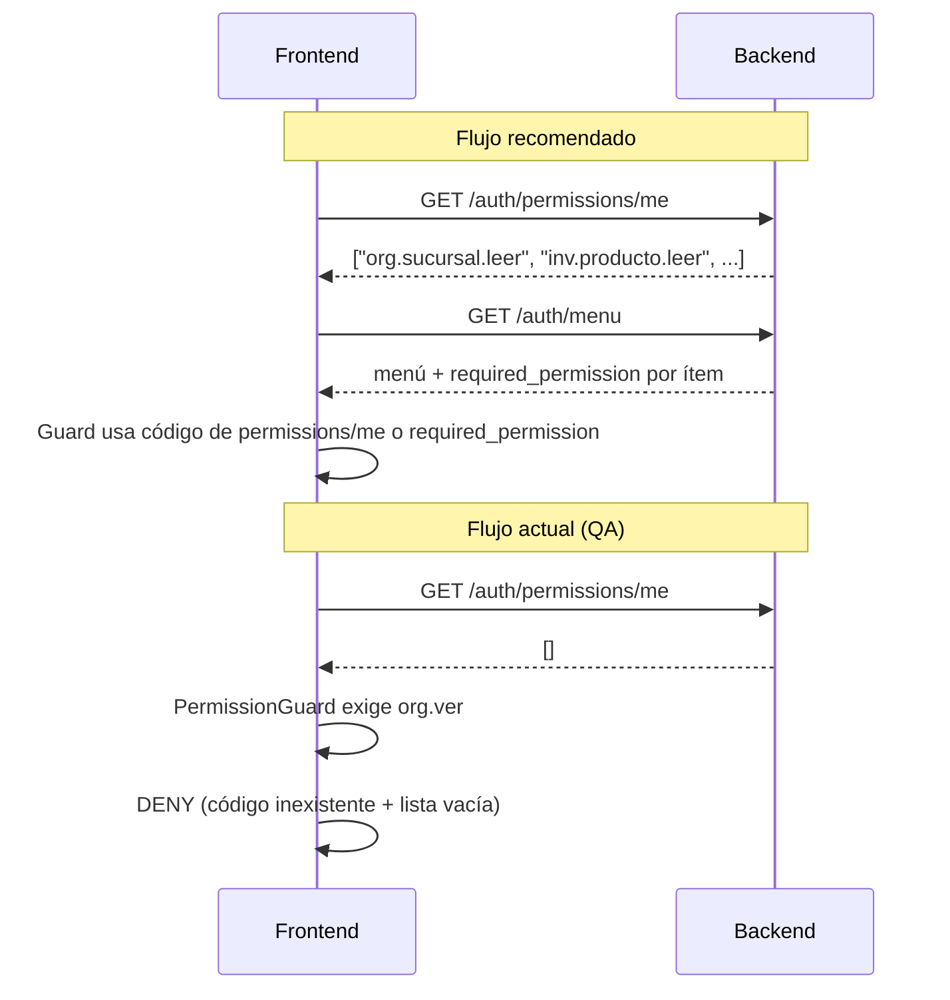

# Auditoría — Modelo de grants por rol (MANAGER / USER)

**Tipo:** Auditoría arquitectónica (sin cambios de código)  
**Fecha:** 2026-05-31  
**Referencias:** [TENANT_ROLE_PERMISSION_MODEL_AUDIT.md](./TENANT_ROLE_PERMISSION_MODEL_AUDIT.md), [USER_COMPANY_ROLE_OFFICIAL_MODEL.md](./USER_COMPANY_ROLE_OFFICIAL_MODEL.md), [RUNTIME_RBAC_AUDIT.md](../bootstrap_v2/00_manifest/RUNTIME_RBAC_AUDIT.md), [M1_M2_STAGING_INTEGRATION_VALIDATION.json](../bootstrap_v2/00_manifest/evidence/M1_M2_STAGING_INTEGRATION_VALIDATION.json)  
**Síntoma QA:** MANAGER login correcto, empresa activa y JWT válidos, pero **PermissionGuard FE deniega `org.ver`**.

---

## 1. Resumen ejecutivo

| Pregunta | Respuesta |
|----------|-----------|
| ¿MANAGER/USER tienen permisos en onboarding? | **No** — solo fila en `rol`; `rol_permiso` y `rol_menu_permiso` **vacíos**. |
| ¿ADMIN tiene grants automáticos? | **Sí** — `OwnerSyncService` + `bootstrap_global_grants_admin_tenant()`. |
| ¿Existe `org.ver` en backend? | **No** — catálogo oficial usa `org.{recurso}.{accion}` (p. ej. `org.empresa.leer`). |
| ¿Por qué falla PermissionGuard? | **Doble brecha:** (1) MANAGER sin grants → `GET /auth/permissions/me` vacío; (2) FE usa código **`org.ver`** inexistente en backend. |
| ¿Qué falta para navegar ORG+INV? | Aplicar bundle **`MANAGER_STANDARD`** (RP + RMP derivado) — hoy no existe en runtime. |

**Veredicto:** el comportamiento QA es **esperado** con el modelo actual; no es bug de login/sesión sino **provisión RBAC incompleta** + **desalineación nomenclatura FE/BE**.

---

## 2. Diagnóstico del síntoma QA (`org.ver`)

### 2.1 Cadena causal

```mermaid
flowchart TD
    subgraph onboarding[Onboarding tenant]
        R1[3 roles en tabla rol]
        R2[OwnerSync solo ADMIN_TENANT]
        R3[MANAGER sin rol_permiso]
    end

    subgraph runtime[Runtime MANAGER]
        L[Login OK + JWT empresa_id]
        PM[GET /auth/permissions/me]
        M[GET /auth/menu]
        PG[PermissionGuard FE org.ver]
    end

    R3 --> PM
    PM -->|permissions: [] o sin org.*| PG
    PG -->|DENY| X[Ruta /org bloqueada]
    R3 --> M
    M -->|modulo_codigos: []| Y[Sidebar vacío]
```

### 2.2 Evidencia staging (M1+M2)

Fuente: `M1_M2_STAGING_INTEGRATION_VALIDATION.json`

| Métrica | ADMIN_TENANT | MANAGER_TENANT |
|---------|--------------|----------------|
| `rol_permiso` prefijo `inv.%` | 35 | **0** |
| `rol_menu_permiso` INV | 9 ítems | **0** |
| `GET /auth/menu` módulos | ORG, INV, SYS_ADMIN | **`[]`** |
| Login / sesión | ✅ | ✅ |

El script de integración **espera** que MANAGER no tenga INV (`manager_no_inv_rp: true`) — confirma diseño actual, no accidente.

### 2.3 Sobre `org.ver`

| Capa | Código usado | ¿Existe en catálogo? |
|------|--------------|:--------------------:|
| **Backend API** | `org.empresa.leer`, `org.sucursal.leer`, … | ✅ S040 |
| **Backend menú** | `required_permission` inferido → `org.*.leer` | ✅ `menu_permission_resolver` |
| **Frontend PermissionGuard** (reporte QA) | `org.ver` | ❌ **0 ocurrencias en repo backend** |

**Conclusión:** `org.ver` es un **pseudo-permiso de módulo** del frontend. No puede resolverse desde `GET /auth/permissions/me` porque el backend nunca lo emite ni lo persiste en `permiso`.

**Equivalencia recomendada para guards de módulo ORG:**

```text
org.ver  →  ANY(org.empresa.leer, org.sucursal.leer, org.departamento.leer,
              org.cargo.leer, org.centro_costo.leer, org.parametro.leer)
```

O, por pantalla, usar el `required_permission` que devuelve `GET /auth/menu` (p. ej. `org.sucursal.leer` para `ORG_SUCURSALES`).

---

## 3. Permisos actuales por rol sistema

### 3.1 Estado runtime post-onboarding (trial: ORG + SYS_ADMIN + INV)

| Rol | `rol_permiso` | `rol_menu_permiso` | Origen | Operativo |
|-----|:-------------:|:------------------:|--------|:---------:|
| **ADMIN_TENANT** | ✅ Poblado | ✅ 18 ítems trial | OwnerSync + grants globales | ✅ |
| **MANAGER_TENANT** | ❌ Vacío | ❌ Vacío | Ninguno | ❌ |
| **USER_TENANT** | ❌ Vacío | ❌ Vacío | Ninguno | ❌ |

Los tres roles se crean en `cliente_onboarding_service.ROLES_BASE`; **solo ADMIN** recibe sync en `OnboardingRbacService.bootstrap_cliente_rbac()`.

### 3.2 Definición catálogo (metadatos rol)

| Atributo | ADMIN_TENANT | MANAGER_TENANT | USER_TENANT |
|----------|--------------|----------------|-------------|
| `codigo_rol` | `ADMIN_TENANT` | `MANAGER_TENANT` | `USER_TENANT` |
| `nombre` UI | Administrador | Supervisor | Usuario |
| `nivel_acceso` | 5 | 3 | 1 |
| `es_admin_cliente` | 1 | 0 | 0 |
| `user_type` JWT | `tenant_admin` | `user` | `user` |

---

## 4. `rol_permiso` efectivo por rol

### 4.1 Resolución runtime

```text
usuario_rol (scope empresa) → rol_permiso → permiso.codigo
                           ∩ cliente_modulo activo (filtro opcional)
```

Fuente: `PermissionResolverService.get_effective_permissions()` → expuesto en `GET /api/v1/auth/permissions/me`.

### 4.2 ADMIN_TENANT — composición (trial)

#### A) Grants globales (`permiso.modulo_id IS NULL`)

`bootstrap_global_grants_admin_tenant()` inserta:

| Prefijo / código | Incluido | Excluido |
|------------------|:--------:|----------|
| `core.app.acceder` | ✅ | — |
| `admin.%` | ✅ | — |
| `modulos.%` | ✅ | — |
| `tenant.%` | ✅ | `tenant.cliente.crear` |
| `org.%`, `inv.%`, … | ❌ aquí | vía OwnerSync por módulo |

Los códigos `admin.*`, `tenant.*`, `modulos.*` se crean en startup vía `permission_sync_service` (declarados en rutas HTTP), no en seeds S040–S066.

#### B) Grants por módulo contratado (OwnerSync)

OwnerSync inserta **todos** los `permiso` activos del módulo:

| Módulo | Permisos API (conteo trial) | Ejemplos |
|--------|----------------------------:|----------|
| **ORG** | 24 | `org.empresa.leer`, `org.sucursal.crear`, … |
| **INV** | 35 | `inv.producto.leer`, `inv.movimiento.procesar`, … |
| **SYS_ADMIN** | vía `admin.*` en globales | `admin.usuario.leer`, `admin.rol.asignar`, … |

**Total orientativo ADMIN trial:** ~10–15 globales + 24 ORG + 35 INV ≈ **70–75** códigos (RC1 con 2 módulos reportaba 45).

#### C) Permisos ORG completos (ADMIN recibe todos)

| Recurso | Códigos |
|---------|---------|
| empresa | `org.empresa.leer`, `.crear`, `.actualizar`, `.eliminar` |
| sucursal | `org.sucursal.leer`, `.crear`, `.actualizar`, `.eliminar` |
| centro_costo | `org.centro_costo.leer`, `.crear`, `.actualizar`, `.eliminar` |
| departamento | `org.departamento.leer`, `.crear`, `.actualizar`, `.eliminar` |
| cargo | `org.cargo.leer`, `.crear`, `.actualizar`, `.eliminar` |
| parametro | `org.parametro.leer`, `.crear`, `.actualizar`, `.eliminar` |

#### D) Permisos INV (ADMIN recibe todos — trial)

9 recursos base × CRUD + 6 acciones lifecycle (`procesar`, `autorizar`, `anular`, `finalizar`, `aprobar`) → **35 códigos** verificados en staging.

### 4.3 MANAGER_TENANT — efectivo hoy

| Fuente | Contenido |
|--------|-----------|
| Onboarding | **0 filas** |
| D010 QA seed | **0** (permisos comentados / no aplicados a MANAGER) |
| Asignación manual | Solo si TA hace `PUT /roles/{id}/permisos-negocio/` |

**`GET /auth/permissions/me`:** lista vacía `{"permissions": []}` (salvo intervención manual).

### 4.4 USER_TENANT — efectivo hoy

Idéntico a MANAGER: **cascarón vacío** hasta configuración manual.

---

## 5. `rol_menu_permiso` efectivo por rol

### 5.1 Resolución runtime

`ModuloMenuService.obtener_menu_usuario()` filtra:

```text
cliente_modulo activo
  AND rol_menu_permiso.puede_ver = 1
  AND usuario_rol (scope empresa)
```

OwnerSync para ADMIN inserta flags UI **full** por menú visible: `puede_ver/crear/editar/eliminar/exportar/imprimir=1`, `puede_aprobar=0`.

SYS_ADMIN: solo menús `SYS_ADMIN.TENANT.*` (excluye PLATFORM/CATALOGOS).

### 5.2 ADMIN_TENANT — menús trial (18)

| Módulo | `modulo_menu.codigo` | Permiso lectura inferido |
|--------|----------------------|--------------------------|
| ORG | `ORG_MI_EMPRESA` | `org.empresa.leer` |
| ORG | `ORG_SUCURSALES` | `org.sucursal.leer` |
| ORG | `ORG_DEPARTAMENTOS` | `org.departamento.leer` |
| ORG | `ORG_CARGOS` | `org.cargo.leer` |
| ORG | `ORG_CENTROS_COSTO` | `org.centro_costo.leer` |
| ORG | `ORG_PARAMETROS` | `org.parametro.leer` |
| INV | `INV_CATEGORIAS` … `INV_INV_KARDEX` | `inv.{recurso}.leer` |
| SYS_ADMIN | `SYS_ADMIN.TENANT.USERS` | (menú; API usa `admin.usuario.*`) |
| SYS_ADMIN | `SYS_ADMIN.TENANT.ROLES` | (menú; API usa `admin.rol.*`) |
| SYS_ADMIN | `SYS_ADMIN.TENANT.SESSIONS` | (menú; API admin sesiones) |

### 5.3 MANAGER_TENANT / USER_TENANT — efectivo hoy

| Métrica | Valor |
|---------|-------|
| Filas RMP | **0** |
| `GET /auth/menu` | HTTP 200, **`modulos: []`** |
| Sidebar FE | Vacío o solo rutas públicas |

**Nota:** aunque el FE muestre rutas hardcodeadas, PermissionGuard con `org.ver` fallará sin RP.

---

## 6. Permisos mínimos — MANAGER navega ORG + INV (sin admin)

### 6.1 Principio

MANAGER operativo necesita:

1. **`core.app.acceder`** — acceso base ERP (si el FE lo valida).
2. **Permisos ORG** — lectura de catálogo organizacional de **su empresa**; escritura operativa en sucursales/departamentos/cargos/centros; **sin** crear/eliminar empresas tenant-wide.
3. **Permisos INV** — operación completa del módulo contratado; **sin** `admin.*`, `tenant.*`, `modulos.*`, menús `SYS_ADMIN.*`.
4. **`rol_menu_permiso` alineado** — mismo subset en RMP o menú vacío aunque RP exista.

### 6.2 Mínimo RP — módulo ORG (navegación + operación empresa-scoped)

| Código | Obligatorio navegar | Acción UI |
|--------|:-------------------:|-----------|
| `org.empresa.leer` | ✅ | Ver “Mi empresa” / contexto |
| `org.sucursal.leer` | ✅ | Listar sucursales |
| `org.sucursal.crear` | Recomendado | Alta sucursales |
| `org.sucursal.actualizar` | Recomendado | Editar sucursales |
| `org.departamento.leer` | ✅ | |
| `org.departamento.crear` | Recomendado | |
| `org.departamento.actualizar` | Recomendado | |
| `org.cargo.leer` | ✅ | |
| `org.cargo.crear` | Recomendado | |
| `org.cargo.actualizar` | Recomendado | |
| `org.centro_costo.leer` | ✅ | |
| `org.centro_costo.crear` | Recomendado | |
| `org.centro_costo.actualizar` | Recomendado | |
| `org.parametro.leer` | ✅ | Consultar parámetros |
| `org.parametro.actualizar` | Opcional | Según política |
| `org.empresa.crear` | ❌ | Reservado ADMIN (multiempresa tenant) |
| `org.empresa.eliminar` | ❌ | Reservado ADMIN |
| `org.*.eliminar` | Opcional | MANAGER puede o no dar de baja |

**Set mínimo estricto solo navegación (6 códigos):** todos los `org.{recurso}.leer`.

### 6.3 Mínimo RP — módulo INV (navegación + operación)

| Grupo | Mínimo navegar | Operación MANAGER típica |
|-------|----------------|--------------------------|
| Catálogo | `inv.categoria.leer`, `inv.producto.leer`, `inv.unidad_medida.leer`, `inv.almacen.leer`, `inv.tipo_movimiento.leer` | + crear/actualizar catálogo |
| Stock | `inv.stock.leer` | + `inv.stock.actualizar` |
| Movimientos | `inv.movimiento.leer` | + `crear`, `procesar`, `autorizar`, `anular` |
| Inventario físico | `inv.inventario_fisico.leer` | + `crear`, `finalizar`, `aprobar`, `anular` |
| Kardex | `inv.kardex.leer` o equivalente menú | lectura |

**Excluir explícitamente:** prefijos `admin.*`, `tenant.*`, `modulos.*`.

### 6.4 Mínimo RMP — menús visibles MANAGER (trial)

| Incluir | Excluir |
|---------|---------|
| 6 menús ORG | `SYS_ADMIN.TENANT.*` |
| 9 menús INV | `SYS_ADMIN.PLATFORM.*`, `SYS_ADMIN.CATALOGOS.*` |

Flags sugeridos MANAGER: `puede_ver=1`; crear/editar según RP; `puede_aprobar=1` solo si RP incluye `aprobar`/`autorizar`.

### 6.5 Guard FE recomendado (sustituir `org.ver`)

| Guard actual (FE) | Reemplazo alineado BE |
|-------------------|----------------------|
| `org.ver` | `hasAny(['org.empresa.leer', …])` o permiso del ítem menú |
| `inv.ver` (si existe) | `hasAny(['inv.producto.leer', …])` |
| Ruta `/org/*` | `required_permission` de `GET /auth/menu` |

---

## 7. Bundles oficiales propuestos

### 7.1 Resumen

| Bundle | Rol destino | RP | RMP | Sync |
|--------|-------------|:--:|:---:|:----:|
| **OWNER_FULL** | `ADMIN_TENANT` | Globales + todos módulos contratados | Full UI OwnerSync | ✅ Hoy (OwnerSync) |
| **MANAGER_STANDARD** | `MANAGER_TENANT` | Operacional ORG+INV sin admin | Derivado RP | ❌ Propuesto |
| **USER_STANDARD** | `USER_TENANT` | Lectura + operación acotada | Derivado RP | ❌ Propuesto |

### 7.2 OWNER_FULL (oficial — implementado)

**Equivalente:** comportamiento actual `OwnerSyncService` + `bootstrap_global_grants_admin_tenant()`.

```text
RP:
  core.app.acceder
  admin.*  (todos los declarados en API)
  modulos.*
  tenant.*  EXCEPT tenant.cliente.crear
  ∀ permiso activo ∈ módulos en cliente_modulo

RMP:
  ∀ modulo_menu visible del módulo
  flags: ver/crear/editar/eliminar/exportar/imprimir = 1
  SYS_ADMIN: solo SYS_ADMIN.TENANT.*
```

**Eventos sync:** onboarding tenant, activación módulo comercial.

### 7.3 MANAGER_STANDARD (propuesto — congelar diseño)

**Regla de filtro RP:**

```text
IN (
  core.app.acceder,
  org.*,
  inv.*,
  … prefijos de módulos operativos contratados
)
AND NOT (
  admin.*,
  tenant.*,
  modulos.*
)
AND NOT accion = 'eliminar'  -- opcional: política producto
OR accion IN ('leer','crear','actualizar','procesar','autorizar','aprobar','finalizar','anular')
```

**Trial ORG+INV — conteo orientativo:** ~6–20 ORG + ~30–35 INV ≈ **40–55 códigos** (según política eliminar/aprobar).

**RMP derivado:**

| Permiso RP | Flags RMP |
|------------|-----------|
| `*.leer` | `puede_ver=1` |
| `*.crear` | `puede_ver=1`, `puede_crear=1` |
| `*.actualizar` | `puede_ver=1`, `puede_editar=1` |
| `*.aprobar`, `*.autorizar` | `puede_aprobar=1` |
| `*.eliminar` | `puede_eliminar=1` (si se incluye en bundle) |

**Menús trial MANAGER:** 15 ítems (6 ORG + 9 INV), **sin** SYS_ADMIN.

### 7.4 USER_STANDARD (propuesto)

**Regla de filtro RP:**

```text
core.app.acceder
+ ∀ *.leer en módulos contratados (ORG, INV, …)
+ operación acotada:
    inv.movimiento.crear
    inv.movimiento.leer
    inv.stock.leer
  (sin aprobar/autorizar salvo excepción)
EXCLUDE admin.*, tenant.*, modulos.*, org.empresa.crear/eliminar
```

**Trial orientativo:** ~6 ORG leer + ~9 INV leer + 1–2 operativos ≈ **15–20 códigos**.

**RMP:** menús con `puede_ver=1`; `puede_crear=1` solo donde RP lo permita; sin SYS_ADMIN.

### 7.5 Matriz comparativa bundles (trial ORG+INV)

| Dimensión | OWNER_FULL | MANAGER_STANDARD | USER_STANDARD |
|-----------|:----------:|:----------------:|:-------------:|
| `core.app.acceder` | ✅ | ✅ | ✅ |
| `admin.*` | ✅ | ❌ | ❌ |
| `tenant.*` | ✅ (exc. crear cliente) | ❌ | ❌ |
| `modulos.*` | ✅ | ❌ | ❌ |
| `org.*` CRUD completo | ✅ | ✅ exc. empresa crear/eliminar | Solo `*.leer` |
| `inv.*` operación + lifecycle | ✅ | ✅ | Lectura + mov. básico |
| Menús SYS_ADMIN | ✅ 3 | ❌ | ❌ |
| Menús ORG | ✅ 6 | ✅ 6 | ✅ 6 (solo ver) |
| Menús INV | ✅ 9 | ✅ 9 | ✅ 9 (mayoría solo ver) |
| Onboarding auto | ✅ | ❌ hoy | ❌ hoy |

---

## 8. Brechas PermissionGuard (FE) ↔ `rol_permiso` (BE)

### 8.1 Matriz de brechas

| # | Brecha | Capa | Impacto | Severidad |
|---|--------|------|---------|-----------|
| **G1** | MANAGER/USER sin `rol_permiso` en onboarding | BE provisión | `permissions/me` vacío | 🔴 Crítica |
| **G2** | FE usa `org.ver`; BE usa `org.{recurso}.leer` | Nomenclatura | Guard falla aunque hubiera ORG parcial | 🔴 Crítica |
| **G3** | FE PermissionGuard vs BE `require_permission` distintos códigos | Contrato | 403 o rutas bloqueadas incorrectamente | 🔴 |
| **G4** | Menú (`rol_menu_permiso`) vs API (`rol_permiso`) desincronizados | BE diseño | Pantalla visible / API 403 o viceversa | 🟠 |
| **G5** | `require_admin` en endpoints usuarios/roles además de `admin.*` | BE API | MANAGER nunca administra usuarios aunque tenga permiso | 🟡 By design |
| **G6** | `es_admin_cliente` JWT false para MANAGER | JWT / FE guards | Guards basados en flag admin bloquean | 🟡 |
| **G7** | `required_permission` solo en memoria (`/auth/menu`); FE puede ignorarlo | Contrato | FE no usa fuente canónica del menú | 🟠 |
| **G8** | Pseudo-permisos módulo (`*.ver`) no documentados en OpenAPI | Contrato | Sin single source of truth cross-repo | 🟠 |

### 8.2 Flujo correcto vs actual (FE)



### 8.3 Tabla de alineación códigos (ORG)

| Uso FE (reportado / hipotético) | Código backend oficial | Endpoint ejemplo |
|---------------------------------|------------------------|------------------|
| `org.ver` | ❌ no existe | — |
| Ver empresas | `org.empresa.leer` | `GET /org/empresa` |
| Ver sucursales | `org.sucursal.leer` | `GET /org/sucursales` |
| Ver departamentos | `org.departamento.leer` | `GET /org/departamentos` |
| Ver cargos | `org.cargo.leer` | `GET /org/cargos` |
| Ver centros costo | `org.centro_costo.leer` | `GET /org/centros-costo` |
| Ver parámetros | `org.parametro.leer` | `GET /org/parametros` |

### 8.4 Doble gate en SYS_ADMIN (referencia)

Aunque MANAGER tuviera `admin.usuario.leer`, varios endpoints exigen **`require_admin`** (nombre rol “Administrador”) **y** permiso API. MANAGER (`user_type=user`, `es_admin_cliente=false`) **no puede** gestionar usuarios/roles — correcto para bundle MANAGER_STANDARD.

---

## 9. Reglas congeladas (R-GRANT)

| ID | Regla |
|----|-------|
| **R-GRANT-01** | `rol_permiso` es fuente de verdad API; `GET /auth/permissions/me` refleja RP efectivo. |
| **R-GRANT-02** | `rol_menu_permiso` es fuente de verdad sidebar; debe derivarse de RP en roles sistema. |
| **R-GRANT-03** | Solo `ADMIN_TENANT` recibe OwnerSync automático en v1 actual. |
| **R-GRANT-04** | MANAGER/USER sin bundle = **no operativos** (login ok, ERP bloqueado). |
| **R-GRANT-05** | Códigos permiso canónicos: `{modulo}.{recurso}.{accion}` — no `{modulo}.ver`. |
| **R-GRANT-06** | Guards FE deben consumir `permissions/me` o `required_permission` del menú — no pseudo-códigos. |
| **R-GRANT-07** | `OWNER_FULL` = ADMIN; `MANAGER_STANDARD` / `USER_STANDARD` = bundles propuestos sin admin. |
| **R-GRANT-08** | `cliente_modulo` gate tenant-wide; bundles filtran por módulos activos. |
| **R-GRANT-09** | Activar módulo debe disparar sync multi-rol (propuesto T3). |
| **R-GRANT-10** | Divergencia RP/RMP es defecto de configuración, no de sesión multiempresa. |

---

## 10. Plan de remediación (referencia — sin implementar)

| Prioridad | Acción | Resuelve |
|-----------|--------|----------|
| P0 | Aplicar `MANAGER_STANDARD` en onboarding / repair script | G1 |
| P0 | FE: reemplazar `org.ver` por códigos BE o `required_permission` | G2, G3, G8 |
| P1 | `RoleGrantSyncService.derive_menu_from_api_grants()` | G4 |
| P1 | Documentar contrato permisos en OpenAPI / guía FE | G8 |
| P2 | Backfill tenants existentes (MANAGER/USER vacíos) | G1 |
| P2 | Health endpoint RP/RMP parity | G4 |

---

## 11. Conclusión

1. **MANAGER_TENANT** y **USER_TENANT** son roles **estructurales sin grants** — el login multiempresa funciona; la autorización no.
2. **ADMIN_TENANT** concentra todo el RBAC vía **OwnerSync** (~24 ORG + ~35 INV + globales admin en trial).
3. El fallo **`org.ver`** en PermissionGuard es **esperado** y tiene **dos causas**: lista vacía en `permissions/me` y código **inexistente** en catálogo backend.
4. Para navegar **ORG + INV** sin privilegios admin, MANAGER necesita el bundle **`MANAGER_STANDARD`** (~40–55 RP + 15 RMP en trial) y el FE debe alinear guards con **`org.*.leer`** / **`inv.*.leer`**, no `org.ver`.

---

## 12. Referencias de código

| Tema | Ubicación |
|------|-----------|
| OwnerSync ADMIN | `owner_sync_service.py` |
| Grants globales ADMIN | `onboarding_rbac_service.py` → `bootstrap_global_grants_admin_tenant` |
| Permisos ORG catálogo | `S040__permisos_rbac_org.sql` |
| Permisos INV catálogo | `S041__`, `S042__permisos_rbac_inv*.sql` |
| Permisos efectivos | `permission_resolver.py`, `GET /auth/permissions/me` |
| Menú + required_permission | `menu_permission_resolver.py`, `modulo_menu_service.py` |
| Edición RP rol | `permisos_negocio_service.py` |
| Edición RMP rol | `rol_service.py` |
| Evidencia QA staging | `M1_M2_STAGING_INTEGRATION_VALIDATION.json` |
| Auditoría previa roles | `TENANT_ROLE_PERMISSION_MODEL_AUDIT.md` |

**Estado:** auditoría congelada — **sin cambios de código, sin PR**.
