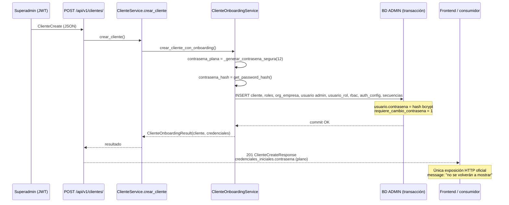

# Auditoría — Contraseña temporal del admin tenant (onboarding)

**Tipo:** Auditoría de trazabilidad (sin implementación)  
**Fecha:** 2026-06-08  
**Alcance:** Flujo `POST /api/v1/clientes/` → usuario `admin` inicial del tenant  
**Relacionado:** [`FORCE_PASSWORD_CHANGE_FRONTEND_CONTRACT.md`](FORCE_PASSWORD_CHANGE_FRONTEND_CONTRACT.md), [`FORCE_PASSWORD_CHANGE_AUDIT.md`](FORCE_PASSWORD_CHANGE_AUDIT.md)

---

## 0. Conclusión ejecutiva

| Pregunta | Respuesta |
|----------|-----------|
| ¿Dónde se genera la contraseña temporal? | `cliente_onboarding_service.py` → `_generar_contrasena_segura(12)` |
| ¿Se devuelve en texto plano solo en `POST /clientes/`? | **Sí** — único canal HTTP oficial (`credenciales_iniciales.contrasena`) |
| ¿Existe recuperación posterior vía API? | **No** |
| ¿Existe endpoint para regenerarla? | **No** |
| ¿Se registra en logs de aplicación? | **No** (solo metadatos de cliente) |
| ¿La única oportunidad HTTP de verla es la respuesta de creación? | **Sí**, salvo copias operativas en scripts QA / evidencia JSON |

**Persistencia en BD:** solo hash bcrypt en `usuario.contrasena`. La contraseña en claro **no** se almacena en base de datos.

---

## 1. Diagrama de flujo completo



---

## 2. Dónde se genera la contraseña temporal

### 2.1 Punto exacto de generación

| Atributo | Valor |
|----------|-------|
| **Archivo** | `app/modules/tenant/application/services/cliente_onboarding_service.py` |
| **Función generadora** | `_generar_contrasena_segura(length: int = 12)` (líneas 92–109) |
| **Invocación** | `ClienteOnboardingService.crear_cliente_con_onboarding()` línea 124 |
| **PRNG** | `secrets` (`secrets.choice`, `secrets.SystemRandom().shuffle`) |
| **Longitud** | 12 caracteres |
| **Alfabeto** | `a-z`, `A-Z`, `0-9`, especiales `!@#$%&*` |
| **Garantías** | Al menos 1 mayúscula, 1 minúscula, 1 dígito, 1 especial |

```python
# cliente_onboarding_service.py (resumen)
contrasena_plana = _generar_contrasena_segura(12)
contrasena_hash = get_password_hash(contrasena_plana)
```

### 2.2 Hash y persistencia

| Paso | Archivo / método | Detalle |
|------|------------------|---------|
| Hash | `app/core/security/password.py` → `get_password_hash()` | bcrypt vía `passlib` |
| INSERT usuario | `_insertar_usuario_admin()` | `usuario.contrasena = contrasena_hash` |
| Flag cambio obligatorio | `_insertar_usuario_admin()` SQL | `requiere_cambio_contrasena = 1` |
| Username fijo | Constante `ADMIN_USERNAME = "admin"` | Siempre `admin` |
| Proveedor auth | SQL INSERT | `proveedor_autenticacion = 'local'` |
| Correo admin | `cliente_data.contacto_email` | **No** se envía la contraseña por email |

### 2.3 Cadena de llamadas (creación tenant)

```
POST /api/v1/clientes/
  └─ endpoints_clientes.py :: crear_cliente()
       └─ ClienteService.crear_cliente()          [cliente_service.py:102]
            ├─ _validar_subdominio_cliente()
            ├─ _validar_codigo_cliente()
            └─ ClienteOnboardingService.crear_cliente_con_onboarding()
                 ├─ _insertar_cliente()
                 ├─ _insertar_roles_base()           → ADMIN_TENANT, MANAGER_TENANT, USER_TENANT
                 ├─ MinimalErpTenantBootstrapService.ensure_empresa_inicial()
                 ├─ _insertar_usuario_admin()        → hash + requiere_cambio=1
                 ├─ MinimalErpTenantBootstrapService.vincular_admin_empresa()
                 ├─ OnboardingRbacService.bootstrap_cliente_rbac()
                 ├─ _insertar_auth_config_si_no_existe()
                 └─ _insertar_secuencias_codigo()
```

**Conexión BD:** `DatabaseConnection.ADMIN` — transacción única con rollback si falla cualquier paso.

### 2.4 Qué NO genera esta contraseña

| Flujo | Archivo | Notas |
|-------|---------|-------|
| Bootstrap **plataforma** (superadmin SYSTEM) | `platform_identity_bootstrap_service.py` | Contraseña distinta (`_generar_contrasena_segura(16)`); no es admin tenant |
| Scripts SQL directos / seeds | `bootstrap_v2/`, `D010_*.sql` | Fuera del flujo API `POST /clientes/` |
| Alta de usuarios ERP | `POST /api/v1/usuarios/` | `UsuarioCreate.contrasena` definida por operador, no autogenerada |

---

## 3. Respuesta HTTP `POST /clientes/` — única entrega en texto plano

### 3.1 Endpoint

| Atributo | Valor |
|----------|-------|
| Método / ruta | `POST /api/v1/clientes/` |
| Router | `app/modules/tenant/presentation/endpoints_clientes.py` |
| Montaje | `app/api/v1/api.py` → `prefix="/clientes"` |
| Auth | JWT + `require_permission("tenant.cliente.crear")` + `@require_super_admin()` |
| Status | `201 Created` |
| `response_model` | `ClienteCreateResponse` |

### 3.2 Contrato OpenAPI — request

**Schema:** `ClienteCreate` (hereda `ClienteBase`)  
**Archivo:** `app/modules/tenant/presentation/schemas.py`

Campos obligatorios relevantes:

| Campo | Tipo | Notas |
|-------|------|-------|
| `codigo_cliente` | string | Único |
| `subdominio` | string | Único; resuelve tenant en login |
| `razon_social` | string | — |
| `contacto_email` | EmailStr | Se asigna a `usuario.correo` del admin |
| `modo_autenticacion` | string | Default `"local"` |

**La contraseña del admin no va en el request.** Se genera server-side.

### 3.3 Contrato OpenAPI — response

**Schema:** `ClienteCreateResponse`

| Campo | Tipo | Descripción |
|-------|------|-------------|
| `success` | boolean | `true` |
| `message` | string | `MENSAJE_CREACION_EXITOSA` |
| `data` | `ClienteRead` | Datos del tenant creado (**sin** contraseña) |
| `credenciales_iniciales` | `CredencialesInicialesRead` | **Único bloque con contraseña en claro** |

**Schema:** `CredencialesInicialesRead`

| Campo | Tipo | Descripción |
|-------|------|-------------|
| `nombre_usuario` | string | Default documentado: `"admin"` |
| `contrasena` | string | **Texto plano — "solo se muestra una vez"** |
| `requiere_cambio` | boolean | Siempre `true` en creación |

**Mensaje fijo:**

```text
"Cliente creado exitosamente. Guarde las credenciales, no se volverán a mostrar."
```

Fuente: `MENSAJE_CREACION_EXITOSA` en `cliente_onboarding_service.py:81-83`.

### 3.4 Ejemplo JSON real de respuesta

```json
{
  "success": true,
  "message": "Cliente creado exitosamente. Guarde las credenciales, no se volverán a mostrar.",
  "data": {
    "cliente_id": "fa2bb487-73c5-4137-9add-e18919fa25a0",
    "codigo_cliente": "DEMO001",
    "subdominio": "demo-tenant",
    "razon_social": "Demo Tenant S.A.C.",
    "nombre_comercial": "Demo",
    "modo_autenticacion": "local",
    "es_activo": true,
    "fecha_creacion": "2026-05-21T17:39:49.610000"
  },
  "credenciales_iniciales": {
    "nombre_usuario": "admin",
    "contrasena": "vW@s02#4nGnr",
    "requiere_cambio": true
  }
}
```

> Ejemplo alineado con evidencia persistida en `app/bootstrap_v2/00_manifest/evidence/RC1_FINAL_CONSOLIDATED.json` (respuesta capturada de pipeline QA).

### 3.5 Ubicación exacta de la contraseña en la respuesta

```text
response.credenciales_iniciales.contrasena   ← texto plano
response.credenciales_iniciales.nombre_usuario   ← "admin"
response.credenciales_iniciales.requiere_cambio   ← true
```

**No aparece en:**

- `response.data` (`ClienteRead`)
- Headers HTTP
- Cookies
- JWT (el alta de tenant no emite tokens para el admin creado)

### 3.6 Otros endpoints de clientes — sin contraseña

| Endpoint | Response | ¿Incluye contraseña? |
|----------|----------|---------------------|
| `GET /api/v1/clientes/` | `PaginatedClienteResponse` | No |
| `GET /api/v1/clientes/{id}/` | `ClienteRead` | No |
| `PUT /api/v1/clientes/{id}/` | `ClienteResponse` | No |
| `DELETE /api/v1/clientes/{id}/` | `ClienteDeleteResponse` | No |

---

## 4. Recuperación posterior — mecanismos existentes

### 4.1 API HTTP

| Mecanismo | ¿Existe? | Evidencia |
|-----------|----------|-----------|
| Re-leer contraseña temporal | **No** | `CredencialesInicialesRead` solo en `ClienteCreateResponse` |
| `GET` usuario con contraseña | **No** | `UsuarioRead` / `UsuarioReadWithRoles` sin campo `contrasena` |
| Email / SMS con credenciales | **No** | Sin servicio de envío en `cliente_onboarding_service.py` |
| `POST /auth/password/change/` | Parcial | Requiere **contraseña actual**; no ayuda si se perdió la temporal |
| `POST /auth/login/` | N/A | Valida contraseña; no la revela |
| `UsuarioUpdate` (PUT usuarios) | **No** | Schema sin campo `contrasena` |

### 4.2 Recuperación operativa (fuera de contrato API productivo)

| Herramienta | Tipo | Comportamiento |
|-------------|------|----------------|
| `scripts/staging_reset_tenant_admin.py` | CLI ops / QA | Establece contraseña **elegida por operador** (`--password`); `requiere_cambio_contrasena=0`; **no** devuelve contraseña autogenerada |
| Scripts integración (`run_t1_*.py`, `run_rc_validation_pipeline.py`) | QA | Consumen `credenciales_iniciales` de la respuesta HTTP y la usan para login/smoke |

**No hay endpoint REST del tipo:**

- `POST /clientes/{id}/regenerar-credenciales/`
- `POST /clientes/{id}/reenviar-credenciales/`
- `GET /clientes/{id}/credenciales-iniciales/`

---

## 5. Regeneración — endpoints y alternativas

### 5.1 Endpoint API para regenerar contraseña temporal

**No implementado.** Crear otro tenant genera **nuevo** cliente; no regenera el admin de uno existente.

### 5.2 Alternativas reales hoy

| Alternativa | Genera nueva temporal aleatoria | Expone en HTTP | Uso |
|-------------|--------------------------------|----------------|-----|
| Volver a llamar `POST /clientes/` | Sí (nuevo tenant) | Sí | Solo alta de **nuevo** cliente |
| `staging_reset_tenant_admin.py` | No (password del operador) | No | Staging / recuperación manual |
| Cambio por admin tras login | No | vía `password/change` | Si aún conoce la temporal |
| Impersonación superadmin | No aplica | — | Acceso soporte sin conocer password tenant |

---

## 6. Registro en logs

### 6.1 Logs de aplicación (runtime)

| Ubicación | Qué se loguea | ¿Contraseña? |
|-----------|---------------|--------------|
| `endpoints_clientes.py:72-74` | `razon_social`, `current_user.nombre_usuario` | **No** |
| `endpoints_clientes.py:78` | `cliente_id`, `razon_social` | **No** |
| `cliente_service.py:106` | `razon_social` | **No** |
| `cliente_service.py:112-115` | `cliente_id`, `subdominio` | **No** |
| `cliente_onboarding_service.py:188-192` | `cliente_id`, `subdominio` | **No** |

**Verificación:** ningún `logger.*` en módulo `tenant` incluye `contrasena_plana`, `credenciales.contrasena` ni `password`.

### 6.2 Auditoría de negocio

`ClienteService.crear_cliente()` **no** invoca `AuditService` ni tabla de auditoría para credenciales.

### 6.3 Fugas indirectas (riesgo operativo, no logs de app)

| Canal | Riesgo | Ejemplo |
|-------|--------|---------|
| Evidencia JSON en repo | **Alta** si se commitea | `bootstrap_v2/00_manifest/evidence/*.json` con `credenciales_iniciales.contrasena` |
| Salida scripts QA | Media | `run_t1_base_operative_integration.py` escribe `admin_password` en JSON de evidencia |
| Proxy / APM / access logs HTTP | Media (config dependiente) | Body de respuesta 201 podría capturarse si logging de body está habilitado |
| Pantalla superadmin FE | Operacional | Depende de si el FE guarda/muestra la respuesta |

Archivos de evidencia con contraseña en claro detectados:

- `RC1_FINAL_CONSOLIDATED.json`
- `RC1_ONBOARDING_MENU_PIPELINE_RUN.json`
- `RC1_MENU_SAAS_ALIGNMENT_PIPELINE.json`
- `rc_full_staging_bd_sistema_saas.json`
- `rc_full_staging_erp_minimal.json`
- `T1_BASE_OPERATIVE_INTEGRATION_VALIDATION.json`
- `T2_MANAGER_STANDARD_INTEGRATION_VALIDATION.json`
- `T3_USER_STANDARD_INTEGRATION_VALIDATION.json`

---

## 7. ¿Única oportunidad de ver la contraseña?

### 7.1 Canal productivo (API)

**Sí.** La única respuesta HTTP diseñada para exponer la contraseña temporal es:

```http
HTTP/1.1 201 Created
POST /api/v1/clientes/
→ credenciales_iniciales.contrasena
```

El propio backend lo declara en schema y mensaje: *"solo se muestra una vez"* / *"no se volverán a mostrar"*.

### 7.2 Canales no productivos

| Canal | ¿Puede ver/recuperar? |
|-------|----------------------|
| BD `usuario.contrasena` | Solo hash bcrypt — **irreversible** |
| Scripts QA post-creación | Sí, si capturaron la respuesta 201 |
| Evidencia JSON en disco | Sí, si se guardó la respuesta |
| CLI `staging_reset` | Operador define nueva contraseña conocida |

### 7.3 Tras primer login

Con FORCE PASSWORD CHANGE implementado:

1. Login con temporal → `requires_password_change: true`
2. Usuario debe `POST /auth/password/change/` con la temporal como `current_password`
3. Si **perdió** la temporal antes del cambio → bloqueado en ERP; recuperación solo vía ops (`staging_reset`) o intervención manual en BD

---

## 8. Estado en base de datos

### 8.1 Tabla `usuario` (BD ADMIN / central)

| Columna | Valor tras onboarding |
|---------|----------------------|
| `nombre_usuario` | `admin` |
| `contrasena` | Hash bcrypt (12 rounds passlib) |
| `requiere_cambio_contrasena` | `1` (true) |
| `correo_confirmado` | `1` (sin flujo real de confirmación) |
| `proveedor_autenticacion` | `'local'` |
| `correo` | `cliente.contacto_email` |
| `empresa_default_id` | UUID empresa inicial (`EMP001`) |

### 8.2 Alineación `requiere_cambio` (response) vs BD

| Fuente | Campo | Valor |
|--------|-------|-------|
| HTTP `credenciales_iniciales` | `requiere_cambio` | `true` |
| BD `usuario` | `requiere_cambio_contrasena` | `1` |

Ambos se setean en el mismo flujo; el login/ERP lee la columna BD (FORCE PASSWORD CHANGE).

---

## 9. OpenAPI — resumen de contratos

### 9.1 Schemas involucrados

| Schema | Archivo | Rol |
|--------|---------|-----|
| `ClienteCreate` | `schemas.py:247` | Request alta tenant |
| `ClienteCreateResponse` | `schemas.py:487` | Response 201 |
| `CredencialesInicialesRead` | `schemas.py:462` | Bloque credenciales (plano) |
| `ClienteRead` | `schemas.py` | Datos tenant sin secretos |

### 9.2 Tag OpenAPI

`Clientes (Super Admin)` — operaciones restringidas a superadmin plataforma.

### 9.3 Seguridad del contrato

- La contraseña en claro es **intencional** en `CredencialesInicialesRead` (documentado en Field description).
- No hay `writeOnly` / exclusión de serialización posterior porque el schema **no se reutiliza** en otros responses.

---

## 10. Riesgos identificados

| ID | Riesgo | Severidad | Descripción |
|----|--------|-----------|-------------|
| R1 | Pérdida irreversible de temporal | **Alta** | Si el consumidor no guarda `credenciales_iniciales`, no hay API de recuperación |
| R2 | Sin regeneración API | **Alta** | Operaciones deben usar CLI staging o reset manual |
| R3 | Evidencia QA en repo | **Media** | JSON bajo `bootstrap_v2/00_manifest/evidence/` con contraseñas históricas |
| R4 | Scripts persisten `admin_password` | **Media** | `run_t1_*.py`, `run_t2_*.py`, `run_t3_*.py` en artefactos de validación |
| R5 | Sin envío email | **Media** | `contacto_email` no recibe la contraseña; dependencia total del superadmin |
| R6 | Access logs / proxies | **Media** | Body 201 podría loguearse aguas abajo |
| R7 | `correo_confirmado=1` sin verificación | **Baja** | Admin marcado confirmado sin acción del usuario |
| R8 | Confusión con bootstrap plataforma | **Baja** | `platform_identity_bootstrap_service` es otro flujo/password |
| R9 | `staging_reset` pone `requiere_cambio=0` | **Baja** | Bypass del flujo FORCE PASSWORD CHANGE en entornos QA |

---

## 11. Matriz de trazabilidad — archivos clave

| Archivo | Función / rol |
|---------|---------------|
| `app/modules/tenant/presentation/endpoints_clientes.py` | `crear_cliente()` — expone response |
| `app/modules/tenant/application/services/cliente_service.py` | Orquesta validaciones + onboarding |
| `app/modules/tenant/application/services/cliente_onboarding_service.py` | Genera password, INSERT admin, arma `CredencialesInicialesRead` |
| `app/modules/tenant/application/services/minimal_erp_tenant_bootstrap_service.py` | Empresa inicial + vínculo admin |
| `app/modules/tenant/application/services/onboarding_rbac_service.py` | Permisos base tenant |
| `app/modules/tenant/presentation/schemas.py` | Contratos OpenAPI |
| `app/core/security/password.py` | bcrypt hash / verify |
| `app/api/v1/api.py` | Montaje router `/clientes` |
| `scripts/staging_reset_tenant_admin.py` | Reset ops (no regeneración API) |

---

## 12. Recomendaciones (solo documentales — sin código)

1. **Frontend superadmin:** modal obligatorio "copiar credenciales" antes de cerrar el wizard de alta; no persistir en `localStorage` sin cifrado.
2. **Operaciones:** no commitear evidencia JSON con `contrasena` en claro; usar secretos CI o redacción.
3. **Producto (futuro):** valorar endpoint `POST /clientes/{id}/regenerar-credenciales-admin/` con mismo contrato one-time (fuera de alcance actual).
4. **QA:** preferir `staging_reset_tenant_admin.py` con password conocida en lugar de depender de temporales históricas en disco.

---

## 13. Respuestas directas al checklist de auditoría

| # | Pregunta | Respuesta |
|---|----------|-----------|
| 1 | ¿Dónde se genera? | `_generar_contrasena_segura(12)` en `cliente_onboarding_service.py`, dentro de `crear_cliente_con_onboarding()` |
| 2 | ¿Solo en respuesta `POST /clientes/`? | **Sí** (canal HTTP productivo) |
| 3 | ¿Recuperación posterior? | **No** vía API |
| 4 | ¿Endpoint regenerar? | **No** |
| 5 | ¿En logs de app? | **No** |
| 6 | ¿Única oportunidad HTTP? | **Sí**, salvo copias en scripts/evidencia QA |

---

**Fin de auditoría.** Documento listo para consumo de producto, frontend superadmin y operaciones.
