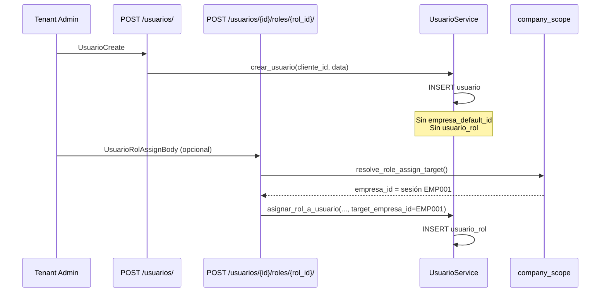
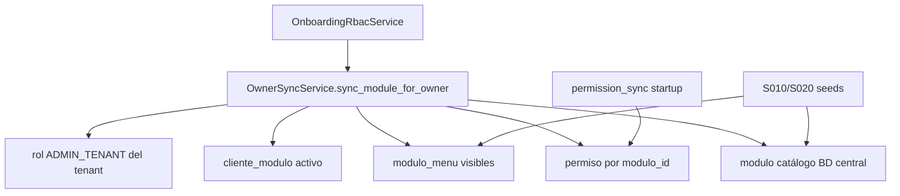

# Auditoría funcional — Modelo de roles y permisos tenant

**Fecha:** 2026-05-31  
**Alcance:** Diseño del modelo definitivo para `MANAGER_TENANT` y `USER_TENANT`.  
**Tipo:** Auditoría funcional — **sin cambios de código**.  
**Documento relacionado:** [`MULTI_EMPRESA_SESSION_AUDIT.md`](MULTI_EMPRESA_SESSION_AUDIT.md) (sesión multiempresa).

---

## Resumen ejecutivo

Hoy el tenant nace con **tres roles sistema** (`ADMIN_TENANT`, `MANAGER_TENANT`, `USER_TENANT`), pero solo **`ADMIN_TENANT` recibe grants automáticos** (`rol_permiso` + `rol_menu_permiso`) vía `OwnerSyncService` en onboarding.

`MANAGER_TENANT` y `USER_TENANT` son **cascaras vacías**: existen en `rol`, pueden asignarse en `usuario_rol`, pero sin filas en `rol_permiso` ni `rol_menu_permiso` el usuario **no ve menú operativo ni pasa `require_permission`**.

La administración visual actual expone **dos APIs independientes** (permisos API vs permisos menú) **sin sincronización** al guardar. No existe endpoint “asignar módulos a rol”; los módulos son contrato **tenant-wide** (`cliente_modulo`).

**Conclusión de diseño:** el modelo definitivo debe definir **bundles por rol sistema**, un **servicio de sincronización RP ↔ RMP** generalizado desde `OwnerSync`, y un flujo FE donde el Tenant Admin configura permisos API y el backend **deriva** visibilidad de menú de forma determinista.

---

## 1. Flujo actual — Crear usuario, asignar rol, asignar empresa

### 1.1 Diagrama operativo (Tenant Admin en sesión EMP001)



**No existe paso separado “asignar empresa”:** la empresa se fija en la asignación de rol (`usuario_rol.empresa_id`) o queda implícita por sesión del admin.

### 1.2 Paso a paso con tablas y servicios

#### A) Crear usuario — `POST /api/v1/usuarios/`

| Elemento | Detalle |
|----------|---------|
| **Endpoint** | `app/modules/users/presentation/endpoints.py` → `crear_usuario()` |
| **Servicio** | `UsuarioService.crear_usuario()` |
| **Permiso API** | `admin.usuario.crear` + `require_admin` |
| **Tablas escritas** | `usuario` |

**Columnas insertadas en `usuario`:**

```
cliente_id, nombre_usuario, correo, contrasena, nombre, apellido,
dni, telefono, proveedor_autenticacion, es_activo=1, correo_confirmado=0, es_eliminado=0
```

**NO se escribe:**

| Artefacto | Tabla | Impacto |
|-----------|-------|---------|
| Empresa preferida | `usuario.empresa_default_id` | NULL |
| Asignación rol | `usuario_rol` | Usuario no puede operar ERP |
| Permisos API | `rol_permiso` | — |
| Permisos menú | `rol_menu_permiso` | — |
| Vínculo empresa | `org_empresa` | — (solo lectura/validación) |

#### B) Asignar rol — `POST /api/v1/usuarios/{usuario_id}/roles/{rol_id}/`

| Elemento | Detalle |
|----------|---------|
| **Endpoint** | `app/modules/users/presentation/endpoints.py` → `assign_rol_to_usuario()` |
| **Resolución scope** | `resolve_role_assign_target()` (`company_scope.py`) |
| **Servicio** | `UsuarioService.asignar_rol_a_usuario()` |
| **Permiso API** | `admin.rol.asignar` + `require_admin` |
| **Tablas escritas** | `usuario_rol` (INSERT o UPDATE reactivación) |

**Reglas de scope (Tenant Admin):**

- Sin `empresa_id` en body → usa **empresa activa de sesión** (`JWT empresa_id`).
- No puede asignar rol **global** (`empresa_id NULL`); solo platform operator.
- Body con `empresa_id` distinto a sesión → 403 `EMPRESA_MISMATCH`.
- UQ efectiva: una fila por `(usuario_id, rol_id)` — no puede tener el mismo rol en dos empresas.

**Columnas insertadas en `usuario_rol`:**

```
usuario_id, rol_id, cliente_id, empresa_id (= sesión o body), es_activo=1
```

**NO se escribe:**

| Artefacto | Notas |
|-----------|-------|
| `usuario.empresa_default_id` | No se actualiza al asignar rol |
| `usuario_rol.es_empresa_default` | No se setea en assign runtime (solo onboarding) |
| `rol_permiso` / `rol_menu_permiso` | Los grants son **del rol**, no se duplican por usuario |

**Invalidación:** cache `PermissionResolver` por usuario tras assign/revoke.

#### C) “Asignar empresa” — no es un endpoint independiente

La empresa del usuario operativo se modela exclusivamente en:

1. **`usuario_rol.empresa_id`** — scope del rol (elegibilidad multiempresa).
2. **`usuario.empresa_default_id`** — preferencia de login (no se toca en create/assign actuales).
3. **JWT `empresa_id`** — empresa activa de sesión (login / seleccionar / cambiar).

Para vincular un usuario a EMP001, el Tenant Admin debe:

1. Tener sesión con `empresa_id = EMP001`.
2. Asignar rol (`MANAGER_TENANT` o `USER_TENANT`) sin body → `usuario_rol.empresa_id = EMP001`.

### 1.3 Onboarding tenant (contraste — solo ADMIN)

En `ClienteOnboardingService.crear_cliente_con_onboarding()` ocurre además:

| Paso | Tablas | Servicio |
|------|--------|----------|
| Crear 3 roles sistema | `rol` ×3 | `_insertar_roles_base()` |
| Crear admin + rol | `usuario`, `usuario_rol` | `_insertar_usuario_admin()` |
| Empresa inicial + vínculo | `org_empresa`, `usuario.empresa_default_id` | `MinimalErpTenantBootstrapService` |
| Módulos trial + RBAC owner | `cliente_modulo`, `rol_permiso`, `rol_menu_permiso` | `OnboardingRbacService` + `OwnerSyncService` |

**Solo `ADMIN_TENANT`** recibe grants en onboarding. `MANAGER_TENANT` y `USER_TENANT` quedan como filas en `rol` sin más datos.

### 1.4 Qué NO se genera hoy para MANAGER / USER

| Capa | Generado para ADMIN | Generado para MANAGER/USER |
|------|---------------------|----------------------------|
| Fila en `rol` | ✅ onboarding | ✅ onboarding |
| `cliente_modulo` | ✅ onboarding (tenant-wide) | ✅ (compartido, no por rol) |
| `rol_permiso` | ✅ OwnerSync + grants globales | ❌ |
| `rol_menu_permiso` | ✅ OwnerSync | ❌ |
| `core.app.acceder` en rol | ✅ vía grants globales admin | ❌ (R010 legacy no corre en runtime onboarding) |
| Usuario de prueba QA | ✅ en D010 seed | ✅ usuario_rol sin permisos (sección permisos comentada) |

---

## 2. Permisos — Comparativa ADMIN vs MANAGER vs USER

### 2.1 Definición de roles (catálogo)

Fuente: `cliente_onboarding_service.ROLES_BASE`

| Atributo | ADMIN_TENANT | MANAGER_TENANT | USER_TENANT |
|----------|--------------|----------------|-------------|
| `codigo_rol` | `ADMIN_TENANT` | `MANAGER_TENANT` | `USER_TENANT` |
| `nombre` | Administrador | Supervisor | Usuario |
| `nivel_acceso` | 5 | 3 | 1 |
| `es_admin_cliente` | 1 | 0 | 0 |
| `es_rol_sistema` | 1 | 1 | 1 |
| `user_type` JWT* | `tenant_admin` | `user` | `user` |

\* Calculado en `get_user_access_level_info()`: `access_level >= 4` → `tenant_admin`.

### 2.2 `rol_permiso` (permisos API)

| Rol | Estado actual | Origen de grants | Contenido típico |
|-----|---------------|------------------|------------------|
| **ADMIN_TENANT** | ✅ Poblado en onboarding | `OnboardingRbacService.bootstrap_global_grants_admin_tenant()` + `OwnerSyncService._sync_rol_permiso_module()` | Globales: `core.app.acceder`, `admin.*`, `modulos.*`, `tenant.*` (exc. `tenant.cliente.crear`). Por módulo contratado: todos los `permiso` activos del módulo (`permiso ⋈ modulo`). |
| **MANAGER_TENANT** | ❌ Vacío por defecto | Ninguno automático | Solo vía `PUT /roles/{id}/permisos-negocio/` manual o SQL QA |
| **USER_TENANT** | ❌ Vacío por defecto | Ninguno automático | Idem |

**Runtime API:** `PermissionResolver` → `obtener_codigos_permiso_usuario()` → join `usuario_rol` + `rol_permiso` + filtro `cliente_modulo`.

**Edición admin:** `set_permisos_negocio_rol()` — reemplazo total DELETE + INSERT en `rol_permiso`; invalida cache tenant.

### 2.3 `rol_menu_permiso` (permisos UI / sidebar)

| Rol | Estado actual | Origen | Contenido típico |
|-----|---------------|--------|------------------|
| **ADMIN_TENANT** | ✅ Poblado en onboarding | `OwnerSyncService._sync_rol_menu_permiso_module()` | Todos los `modulo_menu` visibles del módulo contratado; flags UI = full (ver/crear/editar/eliminar/exportar/imprimir=1, aprobar=0). SYS_ADMIN filtrado a `SYS_ADMIN.TENANT.*`. |
| **MANAGER_TENANT** | ❌ Vacío | Manual vía `PUT /roles/{id}/permisos/` o plantillas legacy | — |
| **USER_TENANT** | ❌ Vacío | Idem | — |

**Runtime menú:** `ModuloMenuService.obtener_menu_usuario()` Query 2 — join `rol_menu_permiso` + `usuario_rol`, filtro `puede_ver=1` y scope empresa.

**Edición admin:** `RolService.actualizar_permisos_rol()` — reemplazo total en `rol_menu_permiso` (solo subset de columnas UI en INSERT).

### 2.4 `cliente_modulo` (contrato comercial)

| Aspecto | Comportamiento |
|---------|----------------|
| **Scope** | **Tenant**, no por rol |
| **Quién lo escribe** | `OnboardingRbacService.activar_modulos_base_cliente()` (trial: ORG, SYS_ADMIN, INV); activación comercial vía `ClienteModuloService.activar_modulo_cliente()` |
| **Efecto ADMIN** | OwnerSync sincroniza grants admin **por cada módulo activado** |
| **Efecto MANAGER/USER** | Solo **filtra** catálogo (`GET /permisos-catalogo`) y visibilidad de módulos en menú; **no asigna** permisos al rol |
| **Activación módulo (legacy)** | `aplicar_plantillas_roles()` crea **roles nuevos** desde `modulo_rol_plantilla` — **no** actualiza MANAGER/USER_TENANT existentes |

### 2.5 Matriz resumen permisos por rol

| Capa | ADMIN_TENANT | MANAGER_TENANT | USER_TENANT |
|------|:------------:|:--------------:|:-----------:|
| `rol` (definición) | ✅ | ✅ | ✅ |
| `cliente_modulo` (tenant) | ✅ compartido | ✅ compartido | ✅ compartido |
| `rol_permiso` | ✅ auto | ❌ | ❌ |
| `rol_menu_permiso` | ✅ auto | ❌ | ❌ |
| Menú operativo post-login | ✅* | ❌** | ❌** |
| APIs con `require_permission` | ✅* | ❌** | ❌** |
| `require_admin` (RoleChecker) | ✅ por nombre "Administrador" | ❌ | ❌ |

\* Con onboarding completo y sesión con `empresa_id`.  
\** Salvo grants manuales posteriores.

---

## 3. OwnerSync — Análisis

### 3.1 Qué es y qué hace

**Servicio:** `OwnerSyncService` (`owner_sync_service.py`)  
**Modelo:** “Owner” del tenant = rol `ADMIN_TENANT` (`ADMIN_ROL_CODIGO`).

Por cada módulo contratado (`modulo_codigo`):

1. Valida catálogo `modulo` y contrato `cliente_modulo`.
2. **`_sync_rol_permiso_module`** — INSERT idempotente en `rol_permiso` todos los `permiso` del módulo.
3. **`_sync_rol_menu_permiso_module`** — INSERT idempotente en `rol_menu_permiso` todos los `modulo_menu` visibles del módulo con permisos UI completos.

**Invocación principal:** `OnboardingRbacService.bootstrap_cliente_rbac()` tras crear tenant.

**Módulos trial:** `TRIAL_MODULES = ("ORG", "SYS_ADMIN", "INV")` (`owner_sync_constants.py`).

### 3.2 Por qué solo cubre ADMIN_TENANT

| Razón | Evidencia en código |
|-------|---------------------|
| Constante explícita | `ADMIN_ROL_CODIGO = "ADMIN_TENANT"` |
| Resolución de rol | `resolve_admin_tenant_rol_id()` busca solo `codigo_rol = ADMIN_TENANT` |
| Grants globales separados | `bootstrap_global_grants_admin_tenant()` valida `codigo_rol = ADMIN_TENANT` |
| Diseño v1 Owner | Comentario en módulo: “sincroniza grants owner (ADMIN_TENANT) al activar módulos comerciales” |
| Producto bootstrap | `RUNTIME_BOOTSTRAP_FLOW.md`: “MANAGER_TENANT / USER_TENANT sin bundle — Solo ADMIN_TENANT recibe grants en v1” |

No es limitación técnica del SQL: el INSERT parametriza `admin_rol_id`; el **scope de producto** fijó un único “owner” con acceso total derivado del contrato.

### 3.3 Dependencias de OwnerSync



| Dependencia | Obligatoria | Descripción |
|-------------|-------------|-------------|
| Catálogo `permiso` | Sí | Poblado por `permission_sync_service` al startup |
| Catálogo `modulo` / `modulo_menu` | Sí | Seeds S010/S020 |
| `cliente_modulo` activo | Sí | `_assert_module_contracted` |
| Rol `ADMIN_TENANT` | Sí | Creado en onboarding antes de sync |
| `AsyncSession` onboarding | Sí | Transacción única con creación tenant |
| `MANAGER_TENANT` / `USER_TENANT` | No | No referenciados |

**Post-desactivación módulo:** `on_module_deactivated()` v1 — solo invalida cache; **no** borra grants (runtime-only).

### 3.4 ¿Puede generalizarse?

**Sí, con parametrización de perfil.** Propuesta de evolución (sin implementar):

| Componente actual | Generalización propuesta |
|-------------------|-------------------------|
| `admin_rol_id` fijo | `target_rol_id` + `GrantProfile` enum |
| Flags UI siempre full | Perfiles: `OWNER_FULL`, `MANAGER_STANDARD`, `USER_READ` |
| Todos los permiso del módulo | Subconjuntos por prefijo/acción (p. ej. USER: solo `*.leer`) |
| `bootstrap_global_grants_admin_tenant` | `bootstrap_global_grants_for_profile(rol_id, profile)` |
| Invocación solo onboarding | Hook en activación `cliente_modulo` + endpoint admin “Aplicar bundle” |

**Nombre sugerido:** `RoleGrantSyncService` (evolución de OwnerSync, mantiene idempotencia INSERT NOT EXISTS).

**Riesgos al generalizar:**

- Sobre-permisión si MANAGER recibe mismo bundle que ADMIN.
- Divergencia RP/RMP si solo se generaliza una tabla.
- Roles custom del tenant (creados vía UI) necesitan perfil `CUSTOM` sin bundle automático.

---

## 4. Administración visual — Flujo objetivo vs actual

### 4.1 Flujo deseado (producto)

```text
Tenant Admin
    ↓
Gestionar Roles (MANAGER_TENANT, USER_TENANT, custom)
    ↓
Seleccionar módulos contratados (filtro UX; fuente: cliente_modulo)
    ↓
Asignar permisos API (checkboxes por código permiso)
    ↓
[Backend] Generar automáticamente rol_permiso + rol_menu_permiso alineados
    ↓
Usuario recibe rol scoped a empresa → menú + API coherentes
```

### 4.2 Flujo actual (implementado)

```mermaid
flowchart TD
    subgraph FE[Tenant Admin UI - capacidades backend]
        A[Listar roles GET /roles/]
        B[Catálogo permisos GET /permisos-catalogo]
        C[Ver/editar API PUT /roles/{id}/permisos-negocio/]
        D[Ver/editar menú PUT /roles/{id}/permisos/]
        E[Asignar rol a usuario POST /usuarios/{uid}/roles/{rid}/]
    end

    subgraph BD[Persistencia]
        RP[rol_permiso]
        RMP[rol_menu_permiso]
        CM[cliente_modulo]
    end

    B --> CM
    C --> RP
    D --> RMP
    RP -.->|NO SYNC| RMP
    E --> UR[usuario_rol]
```

### 4.3 Endpoints involucrados

| Acción UI | Método | Ruta | Tabla afectada | Sync RMP |
|-----------|--------|------|----------------|----------|
| Listar roles | GET | `/api/v1/roles/` | — (lectura `rol`) | — |
| Catálogo permisos API | GET | `/api/v1/permisos-catalogo/` | — (lectura `permiso`, filtro `cliente_modulo`) | — |
| Ver permisos API del rol | GET | `/api/v1/roles/{id}/permisos-negocio/` | — (lectura `rol_permiso`) | — |
| Guardar permisos API | PUT | `/api/v1/roles/{id}/permisos-negocio/` | `rol_permiso` (replace) | ❌ |
| Ver permisos menú | GET | `/api/v1/roles/{id}/permisos/` | — (lectura `rol_menu_permiso`) | — |
| Guardar permisos menú | PUT | `/api/v1/roles/{id}/permisos/` | `rol_menu_permiso` (replace) | ❌ |
| Crear usuario | POST | `/api/v1/usuarios/` | `usuario` | — |
| Asignar rol + empresa | POST | `/api/v1/usuarios/{uid}/roles/{rid}/` | `usuario_rol` | — |

**Permisos de acceso admin:** `require_admin` + `admin.rol.leer` / `admin.rol.actualizar` / `admin.usuario.crear` / `admin.rol.asignar`.

### 4.4 Gap: “Asignar módulos al rol”

| Expectativa producto | Realidad código |
|--------------------|-----------------|
| Módulo habilitado por rol | **No existe.** `cliente_modulo` es por **tenant**. |
| Filtrar permisos por módulo en UI | ✅ Parcial: `listar_catalogo_permisos(cliente_id)` filtra por prefijo de módulos en `cliente_modulo` + siempre `admin.*` / `modulos.*`. |
| Activar módulo → grants MANAGER/USER | ❌ Solo OwnerSync → ADMIN; plantillas crean **roles nuevos**, no MANAGER/USER. |

### 4.5 Gap: generación automática RP + RMP

Al guardar `PUT /permisos-negocio/`:

- ✅ Escribe `rol_permiso`
- ❌ No deriva `rol_menu_permiso`
- ❌ No aplica plantilla de flags UI (MANAGER vs USER)

Al guardar `PUT /permisos/`:

- ✅ Escribe `rol_menu_permiso`
- ❌ No deriva `rol_permiso`
- ❌ Insert parcial (solo ver/editar/eliminar en SQL actual del servicio)

**Inferencia existente (solo lectura):** `menu_permission_resolver.resolve_required_permissions_for_menu_tree()` asigna `required_permission` en memoria al árbol de menú — **no persiste** ni sustituye grants.

### 4.6 Flujo visual recomendado (diseño objetivo)

```text
1. Pantalla Roles → seleccionar MANAGER_TENANT o USER_TENANT
2. Panel "Módulos" → checkboxes de módulos en cliente_modulo (solo filtro UX)
3. Panel "Permisos API" → árbol por módulo desde /permisos-catalogo
4. Botón Guardar → PUT /permisos-negocio/ + [NUEVO] RoleGrantSync.derive_menu_grants()
5. (Opcional avanzado) Panel "Ajuste fino menú" → PUT /permisos/ para excepciones
6. Pantalla Usuarios → crear → asignar rol (empresa = sesión)
```

---

## 5. Divergencias posibles

### 5.1 Menú sin permiso API

| Causa | Escenario |
|-------|-----------|
| Solo `rol_menu_permiso` | Admin configuró menú manualmente sin `permisos-negocio` |
| OwnerSync RMP sin RP equivalente | No aplica a MANAGER/USER hoy; posible en migraciones parciales ADMIN |
| `required_permission` inferido | FE muestra botón que API rechaza |

**Síntoma:** sidebar visible; acción → 403 `PERMISSION_DENIED`.

### 5.2 Permiso API sin menú

| Causa | Escenario |
|-------|-----------|
| Solo `rol_permiso` | Flujo normal actual al usar solo `permisos-negocio` |
| Módulo no contratado | Permiso filtrado en resolver pero menú ausente por JOIN `cliente_modulo` |
| Ítem menú sin grant RMP | API ok vía ruta directa/Deep link; sidebar no muestra pantalla |

**Síntoma:** `permissions/me` incluye código; `/auth/menu` no lista pantalla.

### 5.3 Usuario sin empresa

| Causa | Efecto MANAGER/USER |
|-------|---------------------|
| Usuario creado sin assign rol | Login sin `empresa_id`; ERP 403 |
| Rol asignado pero sin `empresa_id` en assign (platform global) | Tenant admin no puede; solo platform |
| Rol con permisos pero sin `usuario_rol.empresa_id` | No aplica a TA assign normal (siempre scoped) |

**Con rol y permisos pero sin empresa en sesión:** imposible en flujo TA normal post-assign (assign siempre scoped).

### 5.4 Usuario con múltiples empresas

| Aspecto | Comportamiento |
|---------|----------------|
| Mismo rol en dos empresas | **Prohibido** UQ `(usuario_id, rol_id)` — un rol, un scope |
| Roles distintos por empresa | Permitido: p. ej. MANAGER en EMP001, USER en EMP002 (dos filas `usuario_rol` distintas) |
| Permisos del rol | **Globales al rol** — no varían por empresa; solo filtra qué filas `usuario_rol` aplican en sesión |
| Menú / API en sesión | Filtrados por `empresa_id` JWT + `(ur.empresa_id IS NULL OR ur.empresa_id = sesión)` |
| Divergencia | Usuario MANAGER en EMP001 y USER en EMP002 ve capacidades distintas al cambiar empresa — **por rol**, no por grants duplicados |

### 5.5 Matriz de divergencia

| Estado RP | Estado RMP | cliente_modulo | Menú | API | Caso típico |
|:---------:|:----------:|:--------------:|:----:|:---:|-------------|
| ✅ | ✅ | ✅ | ✅ | ✅ | ADMIN post-onboarding |
| ✅ | ❌ | ✅ | ❌ | ✅ | MANAGER tras solo permisos-negocio |
| ❌ | ✅ | ✅ | ✅ | ❌ | Config manual menú |
| ❌ | ❌ | ✅ | ❌ | ❌ | MANAGER/USER recién creados |
| ✅ | ✅ | ❌ | ❌ | ❌* | Módulo desactivado (*permiso filtrado) |

---

## 6. Propuesta final — Modelo oficial (sin implementar)

### 6.1 Principios del modelo definitivo

1. **Tres roles sistema inmutables** por tenant: `ADMIN_TENANT`, `MANAGER_TENANT`, `USER_TENANT` (ya creados en onboarding).
2. **`cliente_modulo`** = gate comercial **tenant-wide** (no duplicar por rol).
3. **`rol_permiso`** = fuente de verdad para **autorización API** (`require_permission`).
4. **`rol_menu_permiso`** = fuente de verdad para **visibilidad UI**, **derivada** de RP en roles sistema (salvo ajuste fino explícito).
5. **Bundles** predefinidos por `codigo_rol` reducen carga del Tenant Admin.
6. **Empresa** se asigna en `usuario_rol`, no en grants de rol.

### 6.2 Definición oficial por rol

#### ADMIN_TENANT — Owner del tenant

| Dimensión | Regla oficial |
|-----------|---------------|
| **Propósito** | Administración completa del tenant dentro de módulos contratados |
| **Fuente de verdad RP** | OwnerSync + grants globales (actual) |
| **Fuente de verdad RMP** | OwnerSync (actual) |
| **cliente_modulo** | Todos los módulos del plan; activación dispara resync owner |
| **Sincronización** | Automática al onboarding y al activar módulo |
| **Scope usuario** | Puede tener rol global (`empresa_id NULL`) o por empresa |
| **user_type** | `tenant_admin` |
| **UX** | Acceso SYS_ADMIN tenant, gestión usuarios/roles, configuración |

#### MANAGER_TENANT — Supervisor operativo

| Dimensión | Regla oficial propuesta |
|-----------|-------------------------|
| **Propósito** | Supervisión y operación avanzada **sin** administración de tenant |
| **Fuente de verdad RP** | Bundle `MANAGER_STANDARD` + overrides via UI |
| **Fuente de verdad RMP** | **Derivado** de RP vía `RoleGrantSyncService` |
| **cliente_modulo** | Hereda filtro tenant; UI agrupa permisos por módulo contratado |
| **Sincronización** | Al guardar permisos-negocio; al activar módulo (subset manager); botón “Restaurar bundle” |
| **Scope usuario** | Siempre `usuario_rol.empresa_id` = empresa asignada (TA en sesión) |
| **user_type** | Mantener `user` JWT **o** introducir `manager` (decisión producto) |
| **Bundle RP inicial (propuesto)** | `core.app.acceder` + permisos módulo contratado excluyendo prefijos `admin.*`, `tenant.*`, `modulos.*` salvo lectura; acciones: leer, crear, editar, aprobar según módulo |
| **Bundle RMP derivado** | Menús con `puede_ver=1`; crear/editar/aprobar según acciones RP del recurso; sin pantallas SYS_ADMIN tenant |

#### USER_TENANT — Operativo estándar

| Dimensión | Regla oficial propuesta |
|-----------|-------------------------|
| **Propósito** | Operación diaria de bajo privilegio |
| **Fuente de verdad RP** | Bundle `USER_READ_OPERATE` + overrides UI |
| **Fuente de verdad RMP** | **Derivado** de RP |
| **cliente_modulo** | Mismo gate tenant |
| **Sincronización** | Idem MANAGER con perfil más restrictivo |
| **Scope usuario** | Siempre scoped a empresa |
| **user_type** | `user` |
| **Bundle RP inicial (propuesto)** | `core.app.acceder` + predominantemente `*.leer` + acciones operativas acotadas (p. ej. crear movimiento propio, sin admin org) |
| **Bundle RMP derivado** | Menús lectura + formularios operativos; sin administración ni aprobaciones salvo explícitas |

### 6.3 Servicio de sincronización propuesto

```text
RoleGrantSyncService (evolución OwnerSync)
├── sync_module_for_role(cliente_id, rol_id, modulo_codigo, profile)
│   ├── sync_rol_permiso(profile.filter_permiso)
│   └── sync_rol_menu_permiso(profile.map_permiso_to_menu_flags)
├── apply_bundle(codigo_rol: MANAGER_TENANT | USER_TENANT)
├── derive_menu_from_api_grants(rol_id)  ← invocado tras PUT permisos-negocio
└── on_module_activated(cliente_id, modulo_codigo)
        ├── OwnerSync → ADMIN_TENANT (full)
        ├── ManagerSync → MANAGER_TENANT (standard subset)
        └── UserSync → USER_TENANT (read operate subset)
```

**Regla de mapeo RP → RMP (propuesta):**

| Permiso API (`accion`) | Flags RMP |
|------------------------|-----------|
| `leer` | `puede_ver=1` |
| `crear` | `puede_ver=1`, `puede_crear=1` |
| `actualizar` | `puede_ver=1`, `puede_editar=1` |
| `eliminar` | `puede_ver=1`, `puede_eliminar=1` |
| `exportar` | `puede_exportar=1` |
| `aprobar` | `puede_aprobar=1` |

Mapeo menú: `permiso.modulo_id` + `permiso.recurso` ↔ `modulo_menu.codigo` (misma heurística que `menu_permission_resolver`).

### 6.4 Sincronización — cuándo ejecutar

| Evento | ADMIN | MANAGER | USER |
|--------|-------|---------|------|
| Onboarding tenant | ✅ Full (actual) | ✅ Bundle inicial (propuesto) | ✅ Bundle inicial (propuesto) |
| Activación módulo comercial | ✅ OwnerSync (actual) | ✅ Subset sync (propuesto) | ✅ Subset sync (propuesto) |
| PUT permisos-negocio manual | Resync owner si aplica | ✅ Derive RMP (propuesto) | ✅ Derive RMP (propuesto) |
| PUT permisos menú manual | Opcional override | Opcional override | Opcional override |
| Desactivación módulo | Cache invalidate (actual) | Marcar grants stale / soft-disable (propuesto) | Idem |

### 6.5 Experiencia de usuario

#### Tenant Admin

1. Tras onboarding, MANAGER y USER **ya tienen bundle base** operable (no cascarón vacío).
2. Pantalla Roles → editar Supervisor / Usuario → permisos agrupados por módulo contratado.
3. Un guardado → menú y API alineados (sin doble configuración obligatoria).
4. Crear usuario → asignar rol → empresa implícita (sesión); opción futura: set `empresa_default_id`.
5. Indicador de salud: “Permisos API ✓ / Menú ✓ / Sincronizado ✓”.

#### Manager / User

1. Login → empresa (Casos A–C de sesión multiempresa).
2. Menú refleja exactamente lo que pueden ejecutar.
3. Cambio de empresa → roles distintos por empresa si aplica → menú/permisos recalculados.
4. Sin pantallas “fantasma” (visible pero 403).

### 6.6 Responsabilidades backend

| Componente | Responsabilidad |
|------------|-----------------|
| `ClienteOnboardingService` | Crear 3 roles; bootstrap ADMIN + **bundles MANAGER/USER** (propuesto) |
| `OnboardingRbacService` | Orquestar módulos trial + sync multi-rol (propuesto) |
| `RoleGrantSyncService` | Sincronización idempotente RP/RMP por perfil |
| `permisos_negocio_service` | CRUD `rol_permiso`; **hook derive RMP** post-PUT (propuesto) |
| `RolService.actualizar_permisos_rol` | Override fino RMP; marcar rol como “custom menu drift” (propuesto) |
| `UsuarioService` | Create + assign scoped; opcional set `empresa_default_id` (propuesto) |
| `PermissionResolver` / `MenuResolver` | Runtime sin cambio de contrato |
| `permission_sync_service` | Catálogo `permiso` desde rutas |
| `cliente_modulo` / activación módulo | Disparar sync multi-rol al activar |

### 6.7 Responsabilidades frontend

| Área | Responsabilidad |
|------|-----------------|
| Gestión roles | Consumir GET/PUT `permisos-negocio`; mostrar módulos desde `cliente_modulo` |
| Sync UX | Tras guardar API, refrescar GET `permisos/` o confiar en sync backend |
| Usuarios | Flujo create → assign rol obligatorio antes de entregar credenciales |
| Menú app | Solo `/auth/menu`; usar `required_permission` para botones |
| Guards | Ocultar acciones sin código en `permissions/me` |
| Multiempresa | Selector empresa; recargar permisos + menú tras `empresa/cambiar` |
| Indicadores admin | Alertar divergencia RP/RMP si endpoint de health expuesto (propuesto) |

### 6.8 Decisiones abiertas (congelar en refinamiento)

| # | Decisión | Opciones |
|---|----------|----------|
| D1 | ¿Nuevo `user_type=manager` en JWT? | A) Mantener `user` B) Añadir `manager` para guards FE |
| D2 | ¿PUT permisos-negocio siempre sobrescribe RMP? | A) Siempre derive B) Solo si “modo sync” activo C) Preguntar al admin |
| D3 | ¿Bundles editables por tenant? | A) Solo sistema B) Clonar bundle a rol custom |
| D4 | ¿MANAGER puede tener rol global? | A) No (recomendado) B) Sí como ADMIN lite |
| D5 | ¿Incluir `core.app.acceder` en bundles? | A) Sí obligatorio B) Implícito sin check |

**Recomendación auditoría:** D1=A (menor impacto), D2=A, D3=A, D4=A, D5=A.

---

## 7. Plan de transición (referencia, no implementar)

| Fase | Entregable | Roles afectados |
|------|------------|-----------------|
| T0 | Documento congelado (este) | — |
| T1 | `RoleGrantSyncService` + bundles MANAGER/USER en onboarding | MANAGER, USER |
| T2 | Hook PUT permisos-negocio → derive RMP | Todos los roles editables |
| T3 | Hook activación módulo multi-rol | ADMIN + MANAGER + USER |
| T4 | Script repair tenants existentes | Backfill RP+RMP |
| T5 | FE unificado gestión roles | Tenant Admin UX |

---

## 8. Referencias de código

| Tema | Archivo |
|------|---------|
| Roles base onboarding | `app/modules/tenant/application/services/cliente_onboarding_service.py` |
| RBAC onboarding | `app/modules/tenant/application/services/onboarding_rbac_service.py` |
| OwnerSync | `app/modules/tenant/application/services/owner_sync_service.py` |
| Constantes Owner | `app/modules/tenant/application/services/owner_sync_constants.py` |
| Crear / assign usuario | `app/modules/users/application/services/user_service.py` |
| Scope assign | `app/core/tenant/company_scope.py` |
| Permisos API rol | `app/modules/rbac/application/services/permisos_negocio_service.py` |
| Permisos menú rol | `app/modules/rbac/application/services/rol_service.py` |
| Catálogo permisos | `app/modules/rbac/presentation/endpoints_permisos_catalogo.py` |
| Endpoints roles | `app/modules/rbac/presentation/endpoints.py` |
| Plantillas módulo (legacy) | `app/modules/modulos/application/helpers/rol_plantilla_applier.py` |
| Inferencia menu↔permiso | `app/core/authorization/menu_permission_resolver.py` |
| Runtime menú | `app/modules/modulos/application/services/modulo_menu_service.py` |
| Permisos efectivos | `app/core/authorization/permission_resolver.py` |
| Bootstrap flow doc | `app/bootstrap_v2/00_manifest/RUNTIME_BOOTSTRAP_FLOW.md` |

---

## 9. Conclusión

El gap central entre **ADMIN_TENANT** y **MANAGER/USER_TENANT** no es de esquema ni de endpoints: es de **provisión automática de grants**. Los roles supervisor y usuario existen estructuralmente pero operan como **roles vacíos** hasta intervención manual en dos APIs desconectadas.

El modelo definitivo propuesto mantiene la arquitectura dual **RP (API) + RMP (UI)** pero introduce **bundles por rol sistema** y **sincronización derivada** generalizando `OwnerSync`, alineando la administración visual del Tenant Admin con el comportamiento runtime de login, menú y permisos multiempresa.
