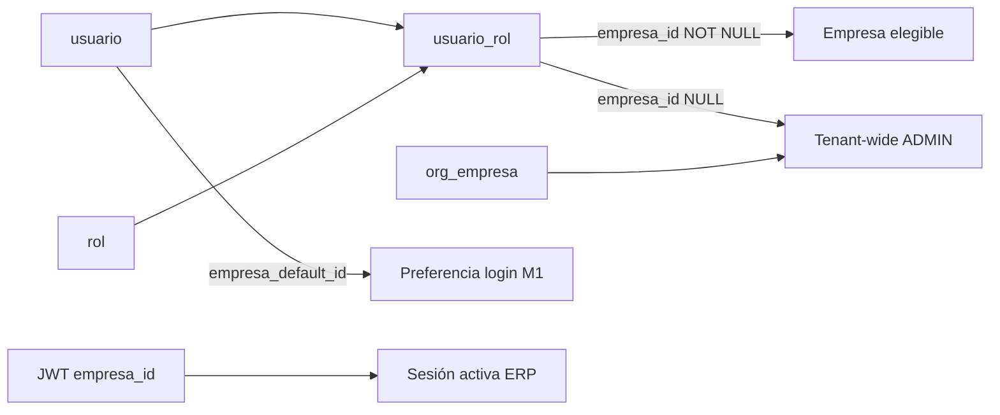
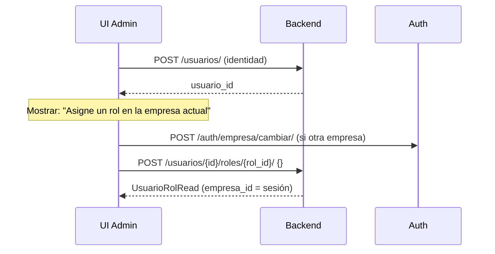

# Auditoría funcional — Modelo Usuario ↔ Empresa

**Tipo:** Auditoría read-only (sin cambios de código)  
**Fecha:** 2026-06-01  
**Objetivo:** Validar si el backend actual soporta completamente la administración multiempresa desde una futura UI de tenant admin.  
**Referencias:** [USER_COMPANY_ROLE_OFFICIAL_MODEL.md](./USER_COMPANY_ROLE_OFFICIAL_MODEL.md), [MULTIEMPRESA_ROLE_ASSIGNMENT_MODEL.md](./MULTIEMPRESA_ROLE_ASSIGNMENT_MODEL.md), [M4_FRONTEND_BACKEND_CONTRACT_AUDIT.md](./M4_FRONTEND_BACKEND_CONTRACT_AUDIT.md), [TENANT_ROLE_PERMISSION_MODEL_AUDIT.md](./TENANT_ROLE_PERMISSION_MODEL_AUDIT.md)

---

## 1. Veredicto ejecutivo

| Pregunta | Respuesta |
|----------|-----------|
| ¿El backend soporta **completamente** una UI de administración multiempresa? | **Parcialmente** |
| ¿Existe endpoint “asignar empresa al usuario”? | **No** — la elegibilidad se modela en `usuario_rol.empresa_id` vía assign/revoke de rol |
| ¿Flujo mínimo viable (crear → asignar rol scoped → login multiempresa)? | **Sí** |
| ¿Listados bidireccionales usuario↔empresa listos para UI? | **No** |
| ¿Vista tenant-wide de asignaciones para tenant admin sin cambiar sesión? | **No** (filtrado por empresa de sesión) |

**Conclusión:** El backend implementa el **modelo oficial** (empresa = scope de `usuario_rol`, no tabla intermedia usuario–empresa). Las operaciones CRUD de identidad y assign/revoke de rol existen y funcionan. Faltan endpoints y campos de respuesta orientados a la **UX de administración** (listar empresas de un usuario, listar usuarios de una empresa, cambiar scope sin revoke, preferencia `empresa_default_id` administrable, vista global de asignaciones).

---

## 2. Modelo de datos relevante



| Artefacto | Tabla / claim | Rol en multiempresa |
|-----------|---------------|---------------------|
| Identidad | `usuario` | Sin empresa; create no escribe `empresa_default_id` ni `usuario_rol` |
| Elegibilidad | `usuario_rol.empresa_id` | Define en qué empresa(s) puede operar el usuario (por rol) |
| Preferencia | `usuario.empresa_default_id` | Auto-selección post-login; **no expuesto en API** |
| Sesión | JWT `empresa_id` | Empresa activa; filtra RBAC, menú y scope de assign/revoke |
| Catálogo | `org_empresa` | Empresas del tenant; **≠** asignación de acceso |

**Regla de oro (oficial):** no hay relación directa usuario–empresa. La UI debe hablar de **“asignar rol en empresa”**, no de “asignar empresa”.

---

## 3. Análisis por operación funcional

### 3.1 Crear usuario

| Aspecto | Estado |
|---------|--------|
| API | ✅ Existe |
| Soporte multiempresa | ⚠️ Parcial — crea identidad sin elegibilidad |

**Endpoint existente**

| Método | Ruta | Permisos |
|--------|------|----------|
| `POST` | `/api/v1/usuarios/` | `require_admin` + `admin.usuario.crear` |

**Request (`UsuarioCreate`):** `nombre_usuario`, `correo`, `contrasena`, `nombre`, `apellido`, `dni`, `telefono`, `proveedor_autenticacion`. **Sin** `empresa_id`, **sin** `rol_id`.

**Response (`UsuarioRead`):** `usuario_id`, `cliente_id`, datos de perfil, flags (`es_activo`, `correo_confirmado`, …), timestamps. **Sin** roles, **sin** empresas, **sin** `empresa_default_id`.

**Qué escribe en BD:** solo fila `usuario`. `empresa_default_id = NULL`. Sin filas `usuario_rol`.

**Gap para UI:** el usuario creado **no puede operar** hasta un paso posterior de assign rol. La UI debe implementar wizard de 2 pasos o pantalla separada.

---

### 3.2 Asignar empresa(s) a usuario

| Aspecto | Estado |
|---------|--------|
| API dedicada “asignar empresa” | ❌ No existe |
| Equivalente oficial | ✅ `POST …/roles/{rol_id}/` |
| Multi-empresa homogéneo (mismo rol en N empresas) | ❌ Bloqueado (`409 ROLE_ASSIGNED_OTHER_EMPRESA`) |

**Endpoint existente**

| Método | Ruta | Permisos |
|--------|------|----------|
| `POST` | `/api/v1/usuarios/{usuario_id}/roles/{rol_id}/` | `require_admin` + `admin.rol.asignar` |

**Request body opcional (`UsuarioRolAssignBody`):**

```json
{
  "empresa_id": "<uuid|null>",
  "scope_global": false
}
```

**Resolución de scope (`resolve_role_assign_target`):**

| Actor | Comportamiento |
|-------|----------------|
| **Tenant admin** (sesión ERP con `empresa_id` en JWT) | Body omitido → usa empresa de sesión. Body con otra empresa → `403 EMPRESA_MISMATCH`. No puede `scope_global`. |
| **Platform operator** | Puede `scope_global: true` (→ `usuario_rol.empresa_id NULL`) o `empresa_id` explícito validado en tenant. |

**Response (`UsuarioRolRead`):**

```json
{
  "usuario_rol_id": "<uuid>",
  "usuario_id": "<uuid>",
  "rol_id": "<uuid>",
  "cliente_id": "<uuid>",
  "empresa_id": "<uuid|null>",
  "es_activo": true,
  "fecha_asignacion": "2026-06-01T12:00:00"
}
```

**Efectos colaterales:**

- Tras assign, si el usuario queda con **exactamente 1** empresa elegible y `empresa_default_id IS NULL` → se persiste default automáticamente (`_maybe_set_empresa_default_after_role_assign`, regla R-USER-03).
- Assign a `MANAGER_TENANT` / `USER_TENANT` dispara hooks de bundle (`ManagerStandardService`, `UserStandardService`) para poblar grants si el rol estaba vacío.

**Compatibilidad por rol sistema:**

| Rol | Scope típico | Cómo “asignar empresa” vía API |
|-----|--------------|--------------------------------|
| **ADMIN_TENANT** | `empresa_id NULL` (M4) | Solo platform puede promover a global; tenant admin en sesión EMP_X asigna scoped a EMP_X (legacy) o requiere repair/onboarding M4 |
| **MANAGER_TENANT** | `empresa_id = sesión` | Assign en empresa activa del admin |
| **USER_TENANT** | `empresa_id = sesión` | Idem |

**Para dar acceso a otra empresa:** tenant admin debe **cambiar sesión** (`POST /auth/empresa/cambiar/`) y repetir assign con **otro `rol_id`** (no el mismo rol).

**APIs faltantes (si la UI quisiera UX “checkbox de empresas”):**

- `POST /usuarios/{id}/empresas` — no existe por diseño.
- Bulk assign multi-empresa con mismo rol — no soportado (fase M3 futura).

---

### 3.3 Cambiar empresa(s) asignadas

| Aspecto | Estado |
|---------|--------|
| PATCH scope en `usuario_rol` | ❌ No existe |
| Cambio vía revoke + re-assign | ✅ Parcial |
| Platform reactivación con cambio scope | ⚠️ Solo asignación **inactiva** |

**Flujo actual para mover un MANAGER de EMP_A → EMP_B:**

1. Admin en sesión EMP_A: `DELETE /usuarios/{id}/roles/{rol_id}/` (revoke).
2. Admin cambia sesión a EMP_B: `POST /auth/empresa/cambiar/`.
3. `POST /usuarios/{id}/roles/{rol_id}/` (re-assign en EMP_B).

**Restricciones:**

- Assign activo en otro scope → `409 ROLE_ASSIGNED_OTHER_EMPRESA` o `409 ROLE_ALREADY_GLOBAL`.
- Tenant admin **no** puede revocar rol global (`409 ROLE_REVOKE_GLOBAL`); solo platform.
- No hay endpoint para “mover” sin revoke explícito.

**API faltante:** `PATCH /usuarios/{usuario_id}/roles/{rol_id}/` con `{ "empresa_id": "..." }` para realinear scope (propuesto, no implementado).

---

### 3.4 Quitar empresa(s)

| Aspecto | Estado |
|---------|--------|
| Quitar acceso a una empresa | ✅ vía revoke del rol scoped en esa empresa |
| Quitar “empresa” sin tocar rol | ❌ No aplicable al modelo |

**Endpoint existente**

| Método | Ruta | Permisos |
|--------|------|----------|
| `DELETE` | `/api/v1/usuarios/{usuario_id}/roles/{rol_id}/` | `require_admin` + `admin.rol.asignar` |

**Response:** `UsuarioRolRead` con `es_activo: false`, conserva `empresa_id` histórico.

**Scope de revoke (`resolve_role_list_scope`):**

| Actor | Qué puede revocar |
|-------|-------------------|
| Tenant admin en sesión EMP_X | Asignaciones con `empresa_id = EMP_X` o visibles en filtro sesión |
| Tenant admin | Rol global (`empresa_id NULL`) → `409 ROLE_REVOKE_GLOBAL` |
| Platform | Cualquier asignación del tenant |

**Efecto en elegibilidad:** al revocar el único rol scoped en EMP_X, el usuario deja de ver EMP_X en login. **No** limpia automáticamente `empresa_default_id` si apuntaba a esa empresa (se invalida en próximo login vía M1).

**Delete usuario:** `DELETE /usuarios/{id}/` desactiva todos los `usuario_rol` del usuario.

---

### 3.5 Obtener empresas asignadas de un usuario

| Aspecto | Estado |
|---------|--------|
| Endpoint dedicado | ❌ No existe |
| Derivación vía roles | ⚠️ Parcial, filtrada por sesión |
| Vista tenant-wide | ❌ No para tenant admin |

**Endpoints relacionados existentes**

| Método | Ruta | Qué devuelve respecto a empresas |
|--------|------|-----------------------------------|
| `GET` | `/api/v1/usuarios/{usuario_id}/` | `UsuarioReadWithRoles` — roles con `asignacion_empresa_id` en cada `RolRead` **solo del scope de sesión** |
| `GET` | `/api/v1/usuarios/{usuario_id}/roles/` | `List[RolRead]` con `asignacion_empresa_id` — **mismo filtro** |
| `GET` | `/api/v1/auth/me/` | Solo usuario autenticado; `empresas_disponibles` **condicional** (ver §3.8) |

**Ejemplo `RolRead` en detalle de usuario (tenant admin en EMP001):**

```json
{
  "rol_id": "...",
  "codigo_rol": "USER_TENANT",
  "nombre": "Usuario",
  "asignacion_empresa_id": "aaaaaaaa-....-EMP001"
}
```

Si el usuario también tiene MANAGER en EMP002, **no aparece** mientras el admin esté en sesión EMP001.

**Para ADMIN_TENANT global (M4):** `asignacion_empresa_id: null` — la UI debe inferir “todas las empresas org” cruzando con `GET /api/v1/org/empresa`.

**API faltante recomendada para UI admin:**

```
GET /api/v1/usuarios/{usuario_id}/empresas-elegibles/
→ { empresas: [{ empresa_id, razon_social, roles: [{ rol_id, codigo_rol, nombre }] }] }
```

Sin filtro de sesión; permiso `admin.usuario.leer` + tenant scope.

---

### 3.6 Obtener usuarios de una empresa

| Aspecto | Estado |
|---------|--------|
| Endpoint por empresa | ❌ No existe |
| Listado tenant-wide | ✅ Existe pero **sin filtro por empresa** |

**Endpoint existente (aproximado)**

| Método | Ruta | Permisos |
|--------|------|----------|
| `GET` | `/api/v1/usuarios/` | `admin.usuario.leer` |

**Query params:** `page`, `limit`, `search`. **Sin** `empresa_id`.

**Response (`PaginatedUsuarioResponse`):**

```json
{
  "usuarios": [
    {
      "usuario_id": "...",
      "nombre_usuario": "...",
      "roles": [
        {
          "rol_id": "...",
          "codigo_rol": "MANAGER_TENANT",
          "nombre": "Manager"
        }
      ]
    }
  ],
  "total_usuarios": 42,
  "pagina_actual": 1,
  "total_paginas": 5
}
```

**Gap crítico:** el listado paginado **no incluye `asignacion_empresa_id`** en los roles (query `SELECT_USUARIOS_PAGINATED` no proyecta `ur.empresa_id`). Además lista **todos** los usuarios del tenant con **todos** sus roles activos, sin filtrar por empresa de sesión — inconsistente con GET detalle/roles.

**API faltante:**

```
GET /api/v1/org/empresa/{empresa_id}/usuarios?page=&limit=&search=
GET /api/v1/usuarios/?empresa_id=<uuid>   (alternativa)
```

---

### 3.7 Compatibilidad ADMIN_TENANT / MANAGER_TENANT / USER_TENANT

| Rol | `usuario_rol.empresa_id` oficial | Assign por tenant admin | Multi-empresa | Grants al assign |
|-----|----------------------------------|-------------------------|---------------|------------------|
| **ADMIN_TENANT** | `NULL` (M4 tenant-wide) | Scoped a sesión si no es platform; global solo platform | Todas `org_empresa` si NULL | Ya poblado en onboarding (`tenant.*`) |
| **MANAGER_TENANT** | `NOT NULL` | Siempre empresa de sesión | Solo vía **rol distinto** en otra empresa | Hook `ManagerStandardService.ensure_for_manager_role` |
| **USER_TENANT** | `NOT NULL` | Siempre empresa de sesión | Idem | Hook `UserStandardService.ensure_for_user_role` |

**Restricción transversal:** UQ efectiva `(usuario_id, rol_id)` — **un solo scope por rol**. No se puede tener `MANAGER_TENANT` en EMP_A y EMP_B simultáneamente.

**Implicación UI:**

- Selector de rol debe usar `GET /api/v1/roles/all-active/` (`codigo_rol`, `nombre`, `rol_id`).
- Para admin tenant-wide post-M4, mostrar badge “Acceso a todas las empresas” cuando `asignacion_empresa_id === null` en ADMIN_TENANT.
- Para operativos, mostrar explícitamente: “Este rol se asignará en **{empresa activa de sesión}**”.

**Endpoints de catálogo de roles (para picker UI):**

| Método | Ruta | Response relevante |
|--------|------|-------------------|
| `GET` | `/api/v1/roles/all-active/` | `List[RolRead]` con `codigo_rol`, `nombre`, `rol_id` |
| `GET` | `/api/v1/roles/?page=&limit=` | Paginado |

---

### 3.8 Compatibilidad `empresa_default_id`, `usuario_rol`, multiempresa

#### `empresa_default_id`

| Capa | Soporte |
|------|---------|
| BD `usuario.empresa_default_id` | ✅ |
| Escritura automática | ✅ En `POST /auth/empresa/seleccionar/`, `POST /auth/empresa/cambiar/`, y post-assign si 1 elegible |
| Lectura/escritura API admin | ❌ No expuesto en ningún endpoint |
| Invalidación | ✅ Si default ∉ elegibles, se limpia en login (`get_empresa_activa_para_login`) |

**Para UI:** no mostrar ni editar `empresa_default_id`. Es preferencia interna del usuario final. Si producto requiere “empresa preferida del empleado” editable por admin → **API nueva** (fuera de scope actual).

#### `usuario_rol`

| Operación | API | `empresa_id` en response |
|-----------|-----|--------------------------|
| Crear assign | `POST …/roles/{rol_id}/` | ✅ `UsuarioRolRead.empresa_id` |
| Revocar | `DELETE …/roles/{rol_id}/` | ✅ |
| Listar | `GET …/roles/` | ✅ `RolRead.asignacion_empresa_id` (filtrado sesión) |
| Listar en paginado usuarios | `GET /usuarios/` | ❌ omitido |

#### Multiempresa (runtime sesión)

| Operación | Endpoint | Uso admin UI |
|-----------|----------|--------------|
| Login + elegibles | `POST /auth/login` | Flujo usuario final; admin usa para probar |
| Seleccionar post-login | `POST /auth/empresa/seleccionar/` | N>1 sin default |
| Cambiar empresa sesión | `POST /auth/empresa/cambiar/` | **Requerido** para assign/revoke en otra empresa |
| Perfil sesión | `GET /auth/me/` | Ver `empresa_activa`, selector header |
| Listar catálogo org | `GET /api/v1/org/empresa` | Empresas del tenant (permiso `org.empresa.leer`) |

**Response `GET /auth/me/` (`MeResponse`) — campos multiempresa:**

| Campo | Cuándo presente |
|-------|-----------------|
| `empresa_activa` | UUID string si JWT tiene empresa |
| `requiere_seleccion_empresa` | `true` si admin sin empresa en JWT y N>1 sin default |
| `empresas_disponibles` | Lista `{ empresa_id, razon_social, nombre_comercial }` solo en caso anterior |
| `roles` | Nombres (strings), sin scope empresa |

**Nota:** con sesión ERP normal (`empresa_id` en JWT), `/me` devuelve `empresas_disponibles: null` — el selector del header debe cachear elegibles del login o llamar endpoint futuro.

---

## 4. Inventario completo de APIs

### 4.1 APIs existentes (relevantes)

| # | Método | Ruta | Función multiempresa |
|---|--------|------|----------------------|
| 1 | `POST` | `/api/v1/usuarios/` | Crear identidad |
| 2 | `GET` | `/api/v1/usuarios/` | Listar usuarios tenant (sin filtro empresa) |
| 3 | `GET` | `/api/v1/usuarios/{id}/` | Detalle + roles scoped |
| 4 | `PUT` | `/api/v1/usuarios/{id}/` | Actualizar perfil (sin empresa) |
| 5 | `DELETE` | `/api/v1/usuarios/{id}/` | Baja lógica + desactiva roles |
| 6 | `POST` | `/api/v1/usuarios/{id}/roles/{rol_id}/` | **Grant elegibilidad** |
| 7 | `DELETE` | `/api/v1/usuarios/{id}/roles/{rol_id}/` | **Revocar elegibilidad** |
| 8 | `GET` | `/api/v1/usuarios/{id}/roles/` | Roles scoped |
| 9 | `GET` | `/api/v1/roles/all-active/` | Picker de roles |
| 10 | `GET` | `/api/v1/org/empresa` | Catálogo empresas tenant |
| 11 | `POST` | `/api/v1/auth/empresa/cambiar/` | Cambiar empresa sesión admin |
| 12 | `GET` | `/api/v1/auth/me/` | Estado sesión actual |

### 4.2 APIs faltantes (para UX admin multiempresa completa)

| Prioridad | API propuesta | Motivo |
|-----------|---------------|--------|
| **P0** | `GET /usuarios/{id}/empresas-elegibles/` (tenant-wide) | Detalle usuario sin depender de sesión |
| **P0** | `GET /org/empresa/{id}/usuarios` o `GET /usuarios/?empresa_id=` | Pantalla “usuarios de esta empresa” |
| **P1** | Incluir `asignacion_empresa_id` en `GET /usuarios/` paginado | Consistencia listado vs detalle |
| **P1** | `GET /usuarios/{id}/asignaciones/` → lista `UsuarioRolRead[]` sin filtro sesión | Vista matricial rol×empresa |
| **P2** | `PATCH /usuarios/{id}/roles/{rol_id}/` (cambio scope) | Evitar revoke+reassign |
| **P2** | `PUT /usuarios/{id}/empresa-preferida` (admin) | Si producto exige editar default |
| **P3** | Soporte mismo rol multi-empresa (M3) | MANAGER en A+B con un solo rol |

---

## 5. Qué necesita el frontend

### 5.1 Flujos implementables hoy (sin cambios backend)

#### Crear usuario + habilitar acceso



#### Revocar acceso a empresa

1. Asegurar sesión en la empresa objetivo (`/auth/empresa/cambiar/`).
2. `DELETE /usuarios/{id}/roles/{rol_id}/`.

#### Selector de empresa en header (admin)

- Usar `empresa_activa` de `/auth/me/` o JWT.
- Cambiar con `POST /auth/empresa/cambiar/`.
- Recargar contexto (token nuevo, menú, permisos).

### 5.2 Datos que la UI debe obtener y de dónde

| Necesidad UI | Fuente actual | Limitación |
|--------------|---------------|------------|
| Lista empresas tenant | `GET /org/empresa` | Catálogo, no asignaciones |
| Empresa activa admin | `GET /auth/me/` → `empresa_activa` | — |
| Roles disponibles | `GET /roles/all-active/` | Incluye `codigo_rol` |
| Detalle usuario + scope rol | `GET /usuarios/{id}/` | Solo roles visibles en sesión |
| Confirmar assign | `POST …/roles/{rol_id}/` response | `empresa_id` en body response |
| Usuarios por empresa | — | **No hay endpoint** — workaround: listar todos y filtrar client-side **imposible** sin `asignacion_empresa_id` en listado |

### 5.3 Workarounds temporales (subóptimos)

| Objetivo | Workaround | Riesgo |
|----------|------------|--------|
| Ver todas las empresas de un usuario | Iterar: cambiar sesión a cada empresa + `GET /usuarios/{id}/roles/` | Lento, frágil, mala UX |
| Usuarios de EMP_X | No viable fiable sin API nueva | — |
| ADMIN tenant-wide | Si `asignacion_empresa_id === null` en ADMIN → mostrar “Todas” + cruzar con org | OK para M4 |

### 5.4 Reglas UX obligatorias (alineadas al backend)

1. **No** pedir empresa en create usuario.
2. En assign rol, mostrar empresa destino = **empresa activa de sesión** (tenant admin).
3. Para assign en otra empresa → **cambiar sesión primero**.
4. No ofrecer el mismo rol (`rol_id`) en dos empresas — mostrar error `409` amigable.
5. Distinguir **ADMIN global** (`empresa_id null`) vs **operativo scoped**.
6. No depender de `empresa_default_id` — no está en API.
7. Tras assign/revoke, informar que el usuario puede necesitar re-login para ver cambios de elegibles.

### 5.5 Matriz de pantallas vs readiness backend

| Pantalla UI propuesta | Backend listo | Bloqueador |
|----------------------|:-------------:|------------|
| Alta usuario (identidad) | ✅ | — |
| Asignar rol en empresa actual | ✅ | Requiere sesión ERP |
| Matriz usuario × empresas × roles | ❌ | Falta GET tenant-wide |
| Usuarios de empresa X | ❌ | Falta filtro/listado por empresa |
| Mover usuario entre empresas | ⚠️ | Revoke + cambiar sesión + reassign |
| Editar empresa preferida empleado | ❌ | Campo no expuesto |
| Admin ve todas sus empresas assignables | ✅ | `/org/empresa` + sesión |

---

## 6. Códigos de error relevantes para la UI

| Código interno | HTTP | Cuándo |
|----------------|------|--------|
| `MISSING_SESSION_EMPRESA` | 403 | Assign/revoke/list roles sin empresa en JWT |
| `EMPRESA_MISMATCH` | 403 | Body `empresa_id` ≠ sesión |
| `ROLE_ASSIGNED_OTHER_EMPRESA` | 409 | Mismo rol en otro scope |
| `ROLE_ALREADY_GLOBAL` | 409 | Rol global; no re-scoped sin revoke |
| `ROLE_REVOKE_GLOBAL` | 409 | Tenant admin intenta revocar ADMIN global |
| `GLOBAL_ASSIGN_FORBIDDEN` | 403 | Tenant admin intenta `scope_global` |
| `ASSIGNMENT_NOT_FOUND` | 404 | Revoke cross-empresa (scope sesión) |
| `USER_WITHOUT_COMPANY` | 403 | Login sin elegibles |

---

## 7. Resumen de gaps vs operaciones solicitadas

| # | Operación | ¿Soportada? | Mecanismo actual | Gap principal |
|---|-----------|:-----------:|------------------|---------------|
| 1 | Crear usuario | ✅ | `POST /usuarios/` | Sin rol/empresa en mismo paso |
| 2 | Asignar empresa(s) | ⚠️ | Assign rol scoped | No multi-empresa mismo rol; no endpoint dedicado |
| 3 | Cambiar empresa(s) | ⚠️ | Revoke + reassign | Sin PATCH scope |
| 4 | Quitar empresa(s) | ✅ | Revoke rol en sesión | Revoke global solo platform |
| 5 | Empresas de un usuario | ⚠️ | Derivado de roles filtrados | Sin vista tenant-wide |
| 6 | Usuarios de una empresa | ❌ | — | Sin endpoint ni filtro |
| 7 | Roles ADMIN/MANAGER/USER | ✅ | Assign + hooks bundle | Semántica distinta por rol |
| 8 | `empresa_default_id` / UR / multi | ⚠️ | Runtime auth | Default no administrable; listados incompletos |

---

## 8. Recomendación para implementación FE (fases)

| Fase | Alcance | Dependencia backend |
|------|---------|---------------------|
| **FE-v1** | Create user + assign rol en sesión + revoke + cambiar sesión admin | Solo APIs existentes |
| **FE-v2** | Detalle usuario con badge por empresa (iterando sesiones o esperando P0) | Ideal: `GET …/empresas-elegibles/` |
| **FE-v3** | Pantalla usuarios por empresa | Requiere `GET …/usuarios?empresa_id=` o `/org/empresa/{id}/usuarios` |
| **FE-v4** | Matriz multi-empresa avanzada | P1 + posible M3 backend |

---

*Documento generado por auditoría estática del código en `app/modules/users`, `app/modules/auth`, `app/core/tenant/company_scope.py` y documentación oficial multiempresa. Sin modificaciones de runtime.*
