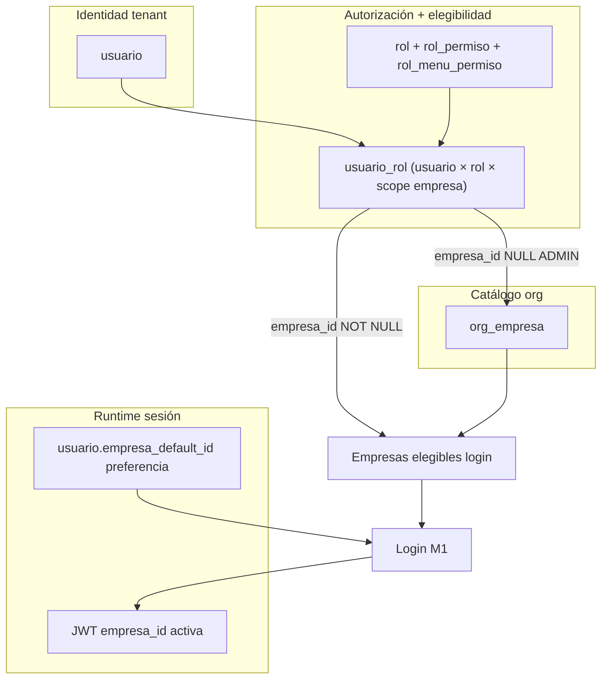
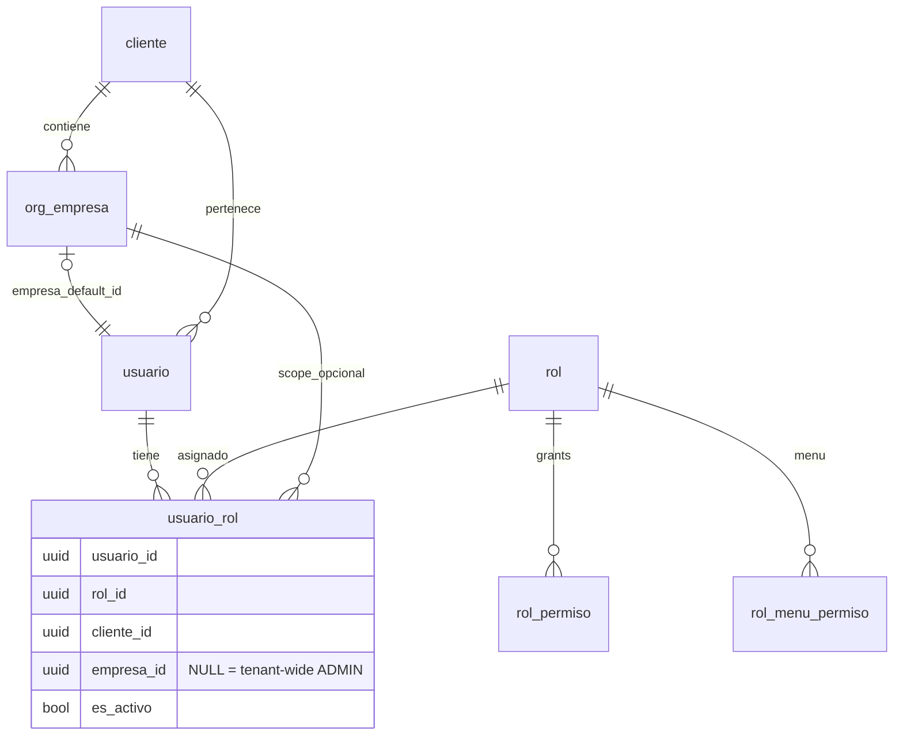
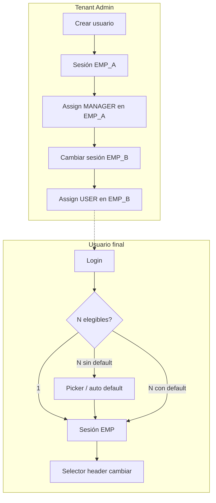

# Modelo oficial — Usuario ↔ Empresa ↔ Rol (CAXIS SaaS)

**Tipo:** Propuesta arquitectónica congelada (sin cambios de código)  
**Fecha:** 2026-05-31  
**Referencias:** [MULTIEMPRESA_OFFICIAL_MODEL.md](./MULTIEMPRESA_OFFICIAL_MODEL.md), [ADMIN_TENANT_SCOPE_MODEL.md](./ADMIN_TENANT_SCOPE_MODEL.md), [MULTIEMPRESA_ROLE_ASSIGNMENT_MODEL.md](./MULTIEMPRESA_ROLE_ASSIGNMENT_MODEL.md), [TENANT_ROLE_PERMISSION_MODEL_AUDIT.md](./TENANT_ROLE_PERMISSION_MODEL_AUDIT.md), [M4_ADMIN_TENANT_TENANT_WIDE_IMPLEMENTATION.md](./M4_ADMIN_TENANT_TENANT_WIDE_IMPLEMENTATION.md)  
**Alcance:** Definir oficialmente cómo se relacionan usuario, empresa y rol en CAXIS SaaS.

---

## 1. Resumen ejecutivo

| Pregunta | Respuesta oficial CAXIS |
|----------|-------------------------|
| ¿Un usuario puede tener **múltiples empresas**? | **Sí** — vía varias filas `usuario_rol` con `empresa_id` distintos, o **ADMIN tenant-wide** (M4) con todas las `org_empresa`. |
| ¿Mismo rol en dos empresas? (MANAGER A + MANAGER B) | **No** en el modelo vigente — UQ efectiva `(usuario_id, rol_id)` + validación `ROLE_ASSIGNED_OTHER_EMPRESA`. |
| ¿Dónde vive la “empresa del usuario”? | **No** en `usuario` (salvo preferencia). En **`usuario_rol.empresa_id`** (elegibilidad) y **JWT `empresa_id`** (sesión activa). |
| ¿Endpoint “asignar empresa”? | **No existe** — empresa = scope del assign rol. |

---

## 2. Modelo conceptual oficial

### 2.1 Tres capas (no confundir)



| Concepto | Tabla / artefacto | Función |
|----------|-------------------|---------|
| **Usuario** | `usuario` | Identidad dentro del tenant (`cliente_id`) |
| **Rol asignado** | `usuario_rol` | Vincula usuario ↔ rol ↔ **scope de empresa** |
| **Permisos del rol** | `rol_permiso`, `rol_menu_permiso` | **Tenant-wide por `rol_id`** — no duplican por empresa |
| **Empresa elegible** | `usuario_rol.empresa_id` (+ fallback org para ADMIN NULL) | Qué empresas puede elegir en login/cambiar |
| **Empresa preferida** | `usuario.empresa_default_id` | Auto-login cuando N>1 (M1) |
| **Empresa activa** | JWT `empresa_id` | Scope ERP, RBAC y menú en la sesión |
| **Catálogo** | `org_empresa` | Empresas del tenant (no = asignación) |

### 2.2 Regla de oro

> **La empresa no se asigna al usuario directamente.**  
> Se asigna **scope de empresa** al **par usuario–rol** en `usuario_rol`.

No hay `POST /usuarios/{id}/empresas/`. La elegibilidad multiempresa es **derivada** de las asignaciones de rol.

---

## 3. ¿Puede un usuario tener múltiples empresas?

### 3.1 Respuesta oficial: **Sí, con matices por rol**

| Patrón | Mecanismo | Ejemplo |
|--------|-----------|---------|
| **Operativo multi-empresa** | ≥2 filas `usuario_rol` activas con **`empresa_id` distintos** y **`rol_id` distintos** | MANAGER EMP_A + USER EMP_B |
| **Admin tenant-wide (M4)** | 1 fila `ADMIN_TENANT` con `empresa_id IS NULL` | Elegibles = todas `org_empresa` |
| **Un solo rol scoped** | 1 fila con `empresa_id = EMP001` | Solo EMP001 elegible |
| **Sin rol / sin scope** | Sin filas activas con empresa | Login rechazado (M1 R-LOGIN-04) salvo admin onboarding |

### 3.2 Cómo se calculan empresas elegibles (login)

Fuente: `AuthService.get_empresa_activa_para_login()`

```text
1. empresas_disponibles ← DISTINCT usuario_rol.empresa_id (activo, NOT NULL) ∩ org_empresa activa
2. Si ADMIN con usuario_rol.empresa_id NULL (M4):
     empresas_disponibles ← todas org_empresa activas del tenant
3. Aplicar usuario.empresa_default_id (M1) → requiere_seleccion / empresa_activa
```

**Importante:** crear fila en `org_empresa` **no** agrega elegibilidad a usuarios operativos. Solo a **ADMIN tenant-wide**.

### 3.3 Matriz multi-empresa por tipo de rol (oficial post-M4)

| Rol | `usuario_rol.empresa_id` | Multi-empresa | Fuente elegibles |
|-----|--------------------------|:-------------:|------------------|
| **ADMIN_TENANT** | **NULL** (M4) | ✅ Todas org | `org_empresa` |
| **MANAGER_TENANT** | NOT NULL, una por fila | ✅ Si **roles distintos** en empresas distintas | UR scoped |
| **USER_TENANT** | NOT NULL | ✅ Idem | UR scoped |
| Platform / superadmin | N/A | Bypass tenant | — |

---

## 4. ¿Mismo rol en múltiples empresas?

### 4.1 Ejemplo: MANAGER EMP_A + MANAGER EMP_B

**Respuesta oficial vigente: NO permitido.**

Un usuario no puede tener **dos filas** con el mismo `rol_id` (MANAGER_TENANT) en EMP_A y EMP_B.

### 4.2 Evidencia — capa aplicación

| Mecanismo | Comportamiento |
|-----------|----------------|
| `UsuarioService.asignar_rol_a_usuario()` | Busca fila existente por `(usuario_id, rol_id, cliente_id)` — **ignora empresa** |
| `_validate_assign_scope_conflict()` | Segundo scope → `409 ROLE_ASSIGNED_OTHER_EMPRESA` |
| Promoción global | Solo platform (`allow_global_promotion`) |
| Idempotencia | Mismo scope → OK; scope distinto → conflicto |

Códigos de error:

| Código | Situación |
|--------|-----------|
| `ROLE_ASSIGNED_OTHER_EMPRESA` | Rol ya asignado en otra empresa (o scope distinto) |
| `ROLE_ALREADY_GLOBAL` | Rol global; no puede scoped sin revocar |
| `EMPRESA_MISMATCH` | Tenant admin asigna con `empresa_id` ≠ sesión |

### 4.3 Evidencia — capa DDL (divergencia M3)

| Fuente | Constraint | Semántica |
|--------|------------|-----------|
| **SQLAlchemy** `tables.py` | `UQ_usuario_rol (usuario_id, rol_id)` | **Un rol por usuario** — alineado con servicio |
| **Bootstrap V020** | `UQ_usuario_rol_empresa (usuario_id, rol_id, empresa_id)` | Permitiría **mismo rol en N empresas** (filas distintas) |

**Decisión congelada (M1/M4):** la **aplicación manda** — R-DATA-05: un `(usuario_id, rol_id)` → un solo scope. Alineación DDL ↔ servicio queda en **fase M3** si producto exige MANAGER multi-empresa homogéneo.

### 4.4 Alternativas si producto requiere MANAGER en A y B

| Opción | Descripción | Estado |
|--------|-------------|--------|
| **A — Mantener (recomendado corto plazo)** | Roles distintos por empresa o cambiar scope (revocar + re-asignar) | ✅ Oficial hoy |
| **B — M3 multi-scope** | Relajar UQ app; alinear DDL; UI “mismo rol, N empresas” | Futuro |
| **C — Rol custom duplicado** | Clonar MANAGER como rol tenant custom | Anti-patrón |

### 4.5 Comportamiento en sesión si multi-empresa vía roles distintos

Usuario con MANAGER EMP_A + USER EMP_B:

| Sesión JWT | Roles que aplican RBAC | Permisos efectivos |
|------------|------------------------|-------------------|
| EMP_A | MANAGER (+ global NULL si hubiera) | Grants MANAGER |
| EMP_B | USER | Grants USER |

Al **cambiar empresa**, cambian roles visibles y permisos — **por diseño**, no por grants duplicados por empresa.

---

## 5. Restricciones actuales (inventario)

### 5.1 Índices y constraints

| Objeto | Definición | Efecto |
|--------|------------|--------|
| `UQ_usuario_rol` (ORM) | `(usuario_id, rol_id)` | 1 fila por rol por usuario |
| `UQ_usuario_rol_empresa` (V020) | `(usuario_id, rol_id, empresa_id)` | Teóricamente multi-scope mismo rol |
| `FK_usuario_rol_empresa` | → `org_empresa` | Scope válido o NULL |
| `usuario.empresa_default_id` | FK opcional → `org_empresa` | Preferencia login (M1) |
| `usuario_rol.es_empresa_default` | Columna legacy | **Deprecated** (R-DATA-06) |

### 5.2 Validaciones de servicio

| Servicio / función | Regla |
|--------------------|-------|
| `resolve_role_assign_target()` | Tenant admin: scope = **empresa de sesión**; no global |
| `resolve_role_list_scope()` | List/revoke: globales + sesión o tenant-wide platform |
| `assert_assignment_visible_in_scope()` | Revoke cross-empresa → 404 |
| `validar_empresa_para_sesion()` | Cambiar/seleccionar ∈ elegibles |
| `assert_operational_login_allowed()` | Sin elegibles → `USER_WITHOUT_COMPANY` (M1) |
| `_maybe_set_empresa_default_after_role_assign()` | 1 elegible + default NULL → set preferida (M1) |

### 5.3 Endpoints participantes

| Acción | Endpoint | Escribe |
|--------|----------|---------|
| Crear usuario | `POST /usuarios/` | `usuario` (sin UR, sin default) |
| Asignar rol | `POST /usuarios/{id}/roles/{rol_id}/` | `usuario_rol` (+ maybe default M1) |
| Revocar rol | `DELETE .../roles/{rol_id}/` | `usuario_rol.es_activo=0` |
| Crear empresa catálogo | `POST /org/empresas` | `org_empresa` only |
| Login / seleccionar / cambiar | `/auth/*` | JWT + `empresa_default_id` (M1) |

### 5.4 Reglas oficiales congeladas (R-UCR)

| ID | Regla |
|----|-------|
| **R-UCR-01** | Un `usuario` pertenece a un `cliente_id` (tenant). |
| **R-UCR-02** | Elegibilidad de empresa = función de **`usuario_rol`**, no de `usuario` solo. |
| **R-UCR-03** | **Un `(usuario_id, rol_id)` → un scope** (`empresa_id` NULL o una empresa). |
| **R-UCR-04** | `MANAGER_TENANT` / `USER_TENANT`: **siempre** `empresa_id NOT NULL`. |
| **R-UCR-05** | `ADMIN_TENANT`: **siempre** `empresa_id IS NULL` (tenant-wide, M4). |
| **R-UCR-06** | Grants de rol (`rol_permiso`, `rol_menu_permiso`) son **por rol**, no por empresa. |
| **R-UCR-07** | Multi-empresa operativo = **múltiples roles** (distintos `rol_id`) en distintos scopes, no mismo rol repetido. |
| **R-UCR-08** | `usuario.empresa_default_id` = preferencia login; no autoriza por sí sola. |
| **R-UCR-09** | JWT `empresa_id` = empresa activa ERP; obligatoria salvo excepciones documentadas. |
| **R-UCR-10** | No existe “asignar empresa” sin asignar rol. |

---

## 6. Modelo recomendado CAXIS SaaS (oficial)

### 6.1 Diagrama entidad-relación lógico



### 6.2 Tabla de decisión — asignación

| Actor | Rol | `usuario_rol.empresa_id` | Multi-empresa |
|-------|-----|--------------------------|---------------|
| Onboarding | ADMIN_TENANT | **NULL** | Todas org |
| Tenant admin crea supervisor | MANAGER_TENANT | Empresa **sesión admin** | Solo si otro rol en otra empresa |
| Tenant admin crea operativo | USER_TENANT | Empresa sesión admin | Idem |
| Platform | Cualquiera | Body o global | Según operador |

### 6.3 Evolución planificada (sin implementar aquí)

| Fase | Tema | Impacto UCR |
|------|------|-------------|
| **M1** ✅ | Preferida login | R-UCR-08 |
| **M4** ✅ | ADMIN NULL | R-UCR-05 |
| **M2** | `/me` + `puede_cambiar_empresa`, `empresa_preferida` API | UX selector |
| **M3** | Alinear UQ DDL; opcional mismo rol multi-empresa | R-UCR-03 revisión |

**Recomendación producto:** **mantener R-UCR-03** salvo requisito explícito de “supervisor en 5 sucursales con idéntico perfil MANAGER”. En ese caso, planificar M3 con UI de checkboxes por empresa en un solo assign.

---

## 7. UX recomendada

### 7.1 Crear usuario

| Paso | Backend | UX recomendada |
|------|---------|----------------|
| 1 | `POST /usuarios/` | Formulario identidad (nombre, correo, credencial). **Sin selector de empresa.** |
| 2 | — | Mensaje: “Usuario creado. Asigne un rol para habilitar acceso a empresa.” |
| 3 | Opcional inmediato | Wizard paso 2: “Asignar rol” (no bloquear create si flujo separado) |

**Regla UX:** no pedir empresa en create — evita confusión con `empresa_default_id` y UR inexistente.

### 7.2 Asignar rol (único punto de scope empresa)

| Contexto | UX |
|----------|-----|
| Tenant admin en sesión EMP_X | Mostrar: “Rol se asignará en **{empresa activa}**”. Ocultar picker de empresa (backend fuerza sesión). |
| Admin necesita usuario en EMP_Y | **Cambiar sesión** a EMP_Y (`POST /empresa/cambiar`) → assign rol → repetir si otro rol en otra empresa. |
| Platform operator | Selector empresa explícito o toggle “global tenant”. |
| Segundo rol misma “función” otra empresa | **No** ofrecer MANAGER otra vez — UI: “Rol ya asignado” o sugerir otro rol / revocar y mover scope. |

**Body API tenant admin:**

```http
POST /api/v1/usuarios/{usuario_id}/roles/{rol_id}/
Authorization: Bearer <token con empresa_id=EMP_X>
Content-Type: application/json

{}
```

(`empresa_id` en body solo platform o debe coincidir con sesión.)

### 7.3 “Asignar empresa” — patrón oficial

| ❌ Evitar | ✅ Hacer |
|----------|----------|
| Pantalla “Asignar empresa al usuario” | “Asignar rol en empresa actual” |
| Duplicar MANAGER en otra empresa | Cambiar sesión admin + assign **otro** rol o revocar/re-asignar |
| Asumir org_empresa = acceso usuario | Distinguir catálogo org vs elegibilidad UR |

### 7.4 Flujos UX multi-empresa (usuario final)



### 7.5 Copy UX sugerido

| Situación | Mensaje |
|-----------|---------|
| Post-create sin rol | “Sin rol asignado, el usuario no puede iniciar sesión en el ERP.” |
| Assign en sesión | “Acceso concedido en {razon_social} como {nombre_rol}.” |
| Conflicto 409 | “Este rol ya está asignado en otra empresa. Revóquelo o use un rol diferente.” |
| Admin M4 multi-org login | Picker con empresas org; pre-seleccionar preferida (M2). |

---

## 8. Casos de referencia

### 8.1 Supervisor solo en EMP_A

```text
usuario_rol: (user1, MANAGER_TENANT, EMP_A)
Elegibles: [EMP_A]
Login: directo
```

### 8.2 Operativo en dos empresas (modelo oficial)

```text
usuario_rol: (user1, MANAGER_TENANT, EMP_A)
usuario_rol: (user1, USER_TENANT, EMP_B)   ← rol_id distinto
Elegibles: [EMP_A, EMP_B]
Login: picker o default M1
Cambiar: alterna capacidades por rol
```

### 8.3 Intento inválido MANAGER A + MANAGER B

```text
usuario_rol: (user1, MANAGER_TENANT, EMP_A)  ← existe
POST assign MANAGER en EMP_B → 409 ROLE_ASSIGNED_OTHER_EMPRESA
```

### 8.4 Admin tenant-wide (M4)

```text
usuario_rol: (admin, ADMIN_TENANT, NULL)
Elegibles: todas org_empresa
Crear EMP002: aparece en login sin nuevo assign
Sesión ERP: sigue requiriendo empresa_id en JWT
```

---

## 9. Conclusión arquitectónica

CAXIS congela un modelo **Usuario–Rol–Scope** (no Usuario–Empresa directo):

1. **Multi-empresa:** sí, por **múltiples asignaciones rol–scope** o **ADMIN tenant-wide**.
2. **Mismo rol, múltiples empresas:** **no** en v1 oficial (R-UCR-03); divergencia DDL documentada para M3.
3. **Empresa operativa:** siempre vía **sesión JWT**; permisos del **rol** filtrados por scope UR.
4. **UX:** crear usuario sin empresa; asignar rol = asignar empresa; admin cambia sesión para assign en otra org.

---

## 10. Referencias de código

| Tema | Ubicación |
|------|-----------|
| Assign rol + conflictos | `user_service.py` → `asignar_rol_a_usuario`, `_validate_assign_scope_conflict` |
| Scope assign API | `company_scope.py` → `resolve_role_assign_target` |
| Elegibilidad login | `auth_service.py` → `get_empresa_activa_para_login` |
| UQ ORM | `tables.py` → `UsuarioRolTable` |
| DDL bootstrap | `V020__tablas_bd_central.sql` → `usuario_rol` |
| Crear usuario | `user_service.py` → `crear_usuario` |
| Reglas M1/M4 | `MULTIEMPRESA_M1_IMPLEMENTATION.md`, `M4_ADMIN_TENANT_TENANT_WIDE_IMPLEMENTATION.md` |

**Estado:** modelo oficial congelado — **sin cambios de código, sin PR**.
