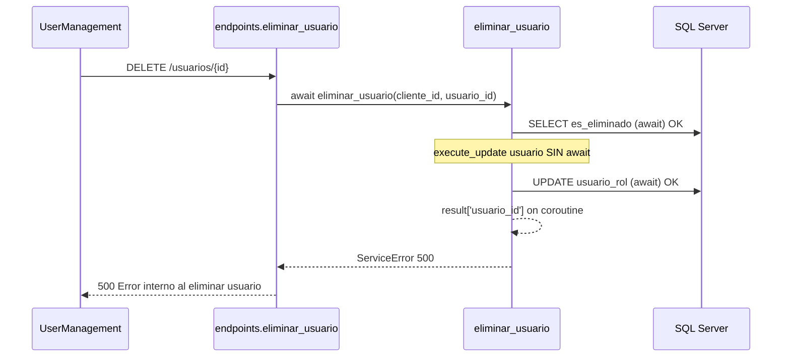

# Diagnóstico runtime — 500 en `DELETE /api/v1/usuarios/{usuario_id}/`

**Tipo:** Evidencia runtime (logs Docker) — sin cambios de código  
**Fecha:** 2026-06-01  
**Contexto QA:** Desactivar usuario desde UserManagement  
**Fuente logs:** `terminals/1.txt` — contenedor `fastapi_backend`

---

## 1. Resumen ejecutivo

| Campo | Valor |
|-------|-------|
| **Excepción exacta** | `TypeError: 'coroutine' object is not subscriptable` |
| **Archivo / línea** | `app/modules/users/application/services/user_service.py` **L1053** |
| **Línea defectuosa (origen)** | **L1021** — `execute_update(...)` **sin `await`** |
| **Causa raíz definitiva** | **Bug backend:** llamada síncrona a función `async` `execute_update`; el coroutine se trata como resultado truthy y falla al construir la respuesta |
| **Clasificación** | **Bug backend** (async/await) |
| **¿Desalineación tipo UPDATE_USER?** | **No** — presentation llama bien `eliminar_usuario(cliente_id=..., usuario_id=...)` |
| **¿Llega a SQL?** | **Parcialmente** — ver §6 |

---

## 2. Request QA (runtime)

### 2.1 Casos observados en logs

| Timestamp | Método | `usuario_id` | HTTP | Cliente |
|-----------|--------|--------------|------|---------|
| `2026-06-01 07:00:09` | `DELETE` | `de2b6e5c-ac92-42c4-95e8-6cbcdbfe87eb` | **500** | `e4c8e906-0e64-4f4e-a04d-8daee57dc7f8` |
| `2026-06-01 07:02:10` | `DELETE` | `d6ef7077-5b01-40c7-8c7d-8944a210b08f` | **500** | idem |

### 2.2 Request HTTP

```http
DELETE /api/v1/usuarios/{usuario_id}/
Authorization: Bearer <admin tenant>
Origin: http://t3usr971acefb.app.local:5173
```

- **Sin body** (correcto para DELETE).
- **Permiso:** `admin.usuario.eliminar` — **autorizado** en ambos intentos.
- **Tenant:** `t3usr971acefb` / BD `bd_sistema_saas`.

### 2.3 Respuesta al cliente

```json
{
  "detail": "Error interno al eliminar usuario"
}
```

Proviene del `ServiceError` interno del servicio (`USER_DELETION_UNEXPECTED_ERROR`), no del decorador `handle_service_errors` con mensaje `en eliminar_usuario`.

---

## 3. Endpoint, servicio y parámetros

### 3.1 Endpoint

| Elemento | Valor |
|----------|-------|
| Ruta | `DELETE /api/v1/usuarios/{usuario_id}/` |
| Handler | `eliminar_usuario()` — `app/modules/users/presentation/endpoints.py` L380–445 |
| Permisos | `require_admin` + `admin.usuario.eliminar` |
| `response_model` | `dict` |

### 3.2 Llamada desde presentation

```427:430:app/modules/users/presentation/endpoints.py
        result = await UsuarioService.eliminar_usuario(
            cliente_id=current_user.cliente_id,
            usuario_id=usuario_id
        )
```

| Parámetro enviado | Valor | ¿Coincide con firma? |
|-------------------|-------|----------------------|
| `cliente_id` | `current_user.cliente_id` | ✅ |
| `usuario_id` | path UUID | ✅ |

**No hay** kwargs erróneos (`update_data`, etc.). La capa presentation está alineada.

### 3.3 Firma del servicio

```972:972:app/modules/users/application/services/user_service.py
    async def eliminar_usuario(cliente_id: UUID, usuario_id: UUID) -> Dict:
```

Decorador: `@BaseService.handle_service_errors`.

---

## 4. Excepción y stacktrace (literal)

### 4.1 Log principal (caso `d6ef7077-…`, 07:02:10)

```text
2026-06-01 07:02:10,319 - app.modules.users.application.services.user_service - ERROR -
  Error inesperado al eliminar usuario d6ef7077-5b01-40c7-8c7d-8944a210b08f:
  'coroutine' object is not subscriptable
Traceback (most recent call last):
  File "/app/app/modules/users/application/services/user_service.py", line 1053, in eliminar_usuario
    "usuario_id": result['usuario_id'],
                  ~~~~~~^^^^^^^^^^^^^^
TypeError: 'coroutine' object is not subscriptable
```

### 4.2 Warning asociado (Python)

```text
RuntimeWarning: coroutine 'execute_update' was never awaited
```

Confirma que `result` en L1021 es el coroutine devuelto por `execute_update` sin `await`.

### 4.3 Mensajes previos en el mismo request (orden real)

```text
Intentando eliminar usuario ID: d6ef7077-...
[QUERY] execute_query ... (check es_eliminado)     ← await OK
Roles desactivados para usuario eliminado ...    ← await execute_update OK (L1038)
Usuario ID ... eliminado lógicamente exitosamente  ← log engañoso (L1050)
ERROR ... 'coroutine' object is not subscriptable  ← L1053
```

---

## 5. Causa raíz definitiva

### 5.1 Código defectuoso

```1013:1055:app/modules/users/application/services/user_service.py
            update_query = """
            UPDATE dbo.usuario
            SET es_eliminado = 1, es_activo = 0, fecha_actualizacion = GETDATE()
            OUTPUT INSERTED.usuario_id, INSERTED.nombre_usuario, INSERTED.es_eliminado
            WHERE cliente_id = ? AND usuario_id = ? AND es_eliminado = 0
            """
            
            result = execute_update(update_query, (cliente_id, usuario_id))   # ← BUG: falta await

            if not result:
                ...
            ...
                await execute_update(deactivate_roles_query, (usuario_id, cliente_id))  # ← OK
            ...
            return {
                "message": "Usuario eliminado lógicamente exitosamente",
                "usuario_id": result['usuario_id'],      # ← L1053: TypeError
                "es_eliminado": result['es_eliminado']
            }
```

`execute_update` en `queries_async.py` es **`async def`**. Sin `await`, `result` es un **coroutine**, no un `dict`.

### 5.2 Por qué el flujo “casi” completa y aún así devuelve 500

| Paso | Código | Comportamiento |
|------|--------|----------------|
| Check usuario | `await execute_query(...)` | ✅ Ejecuta SQL |
| Soft-delete `usuario` | `execute_update(...)` sin await | ❌ **No ejecuta** UPDATE; `result` = coroutine |
| `if not result:` | — | Coroutine es **truthy** → no entra en rama 409 |
| Desactivar `usuario_rol` | `await execute_update(...)` | ✅ **Sí ejecuta** SQL |
| Log “eliminado exitosamente” | L1050 | Se ejecuta **antes** del `return` |
| `return result['usuario_id']` | L1053 | **TypeError** → 500 |

---

## 6. ¿Llega a SQL?

| Operación | SQL | ¿Ejecutado en runtime QA? | Evidencia |
|-----------|-----|---------------------------|-----------|
| Verificar `es_eliminado` | `SELECT ... FROM dbo.usuario` | **Sí** | `await execute_query` L998 |
| Borrado lógico usuario | `UPDATE dbo.usuario SET es_eliminado=1, es_activo=0` | **No** (coroutine no awaited) | Warning `never awaited` |
| Desactivar roles | `UPDATE dbo.usuario_rol SET es_activo=0` | **Sí** | Log “Roles desactivados…” L361/279 |
| Respuesta HTTP 200 | — | **No** | 500 por TypeError |

**Riesgo de datos:** en QA el usuario puede quedar con `usuario_rol.es_activo=0` pero **`usuario.es_eliminado` / `es_activo` sin actualizar** si el UPDATE principal no llegó a ejecutarse. Conviene verificar fila en BD para los `usuario_id` afectados.

---

## 7. Comparación con bug `PUT` (UPDATE_USER)

| Aspecto | UPDATE 500 (`actualizar_usuario`) | DELETE 500 (`eliminar_usuario`) |
|---------|-----------------------------------|----------------------------------|
| Capa del fallo | **Presentation** — kwarg `update_data` vs `usuario_data` | **Service** — falta `await` |
| Falla antes de SQL | **Sí** (TypeError en llamada) | **Parcial** (check + roles sí; UPDATE usuario no) |
| Mensaje típico | `Error interno del servidor en actualizar_usuario` | `Error interno al eliminar usuario` |
| Patrón | Desalineación contrato endpoint ↔ servicio | Migración async incompleta (FASE 2) |
| Fix propuesto (referencia) | `usuario_data=update_data` | `result = await execute_update(...)` en L1021 |

**Conclusión:** mismo síntoma HTTP 500 en UserManagement, **causa raíz distinta**.

---

## 8. Clasificación

| Categoría | ¿Aplica? | Notas |
|-----------|:--------:|-------|
| **Bug backend** | **Sí** | `await` omitido en `eliminar_usuario` L1021 |
| Error SQL | No | No hay `DatabaseError` en logs |
| Problema de datos | Posible **efecto colateral** | Roles desactivados sin soft-delete de `usuario` |
| Configuración / tenant | No | Tenant y RBAC OK |
| Frontend | No | DELETE sin body es correcto |

---

## 9. Propuesta de corrección (solo referencia — no implementada)

```python
# user_service.py L1021
result = await execute_update(update_query, (cliente_id, usuario_id))
```

**Verificación post-fix:**

1. `DELETE` → **200** + body con `usuario_id`, `es_eliminado: true`.
2. Sin `RuntimeWarning: coroutine 'execute_update' was never awaited`.
3. En BD: `usuario.es_eliminado=1`, `usuario.es_activo=0`, `usuario_rol.es_activo=0`.

**Auditoría recomendada:** buscar otras llamadas `execute_update(` / `execute_insert(` sin `await` en `user_service.py` y módulos legacy.

---

## 10. Diagrama del fallo



---

## 11. Conclusión

| Pregunta | Respuesta |
|----------|-----------|
| ¿Endpoint? | `DELETE /api/v1/usuarios/{usuario_id}/` |
| ¿Servicio? | `UsuarioService.eliminar_usuario` |
| ¿Parámetros presentation correctos? | **Sí** |
| ¿Excepción? | `TypeError: 'coroutine' object is not subscriptable` @ L1053 |
| ¿Causa? | `await` faltante en L1021 |
| ¿Como UPDATE_USER? | **No** — otro tipo de bug |
| ¿SQL? | Parcial: roles sí, soft-delete usuario probablemente no |

---

*Diagnóstico basado en logs reales 2026-06-01 07:00–07:02 UTC (contenedor). Sin implementación ni commit.*
