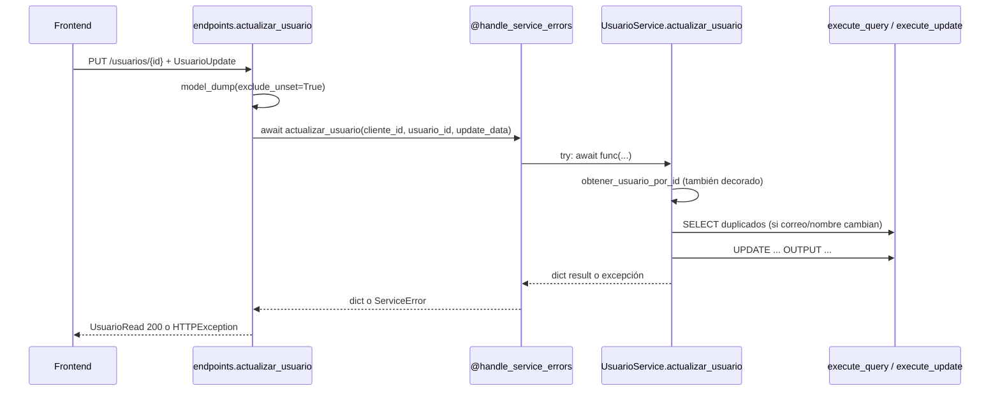

# Auditoría — 500 en `PUT /api/v1/usuarios/{usuario_id}/`

**Tipo:** Análisis read-only (sin cambios de código)  
**Fecha:** 2026-06-01  
**Evidencia QA:** `PUT /usuarios/{id}` con payload de perfil → `500` + `"detail": "Error interno del servidor en actualizar_usuario"`  
**Alcance:** Flujo exclusivo de actualización de usuario tenant.

---

## 1. Resumen ejecutivo

| Hallazgo | Conclusión |
|----------|------------|
| Endpoint involucrado | `PUT /api/v1/usuarios/{usuario_id}/` |
| Mensaje de error | Coincide **literalmente** con el generado por `@BaseService.handle_service_errors` sobre `UsuarioService.actualizar_usuario` |
| ¿El payload FE es inválido (422)? | **No** — el JSON reportado es válido para `UsuarioUpdate` |
| ¿Falla de validación de negocio (409/404)? | **No** — el 500 indica excepción no mapeada o `ServiceError` genérico |
| Causa raíz más probable | Excepción **no controlada** dentro de `UsuarioService.actualizar_usuario`, capturada por el decorador `handle_service_errors` y reenviada como `ServiceError` 500; la excepción original está en **logs del servidor** (`logger.exception`) |

**Acción inmediata para QA/desarrollo:** revisar logs en el instante del PUT buscando la línea `ERROR INESPERADO en actualizar_usuario` y la traza debajo.

---

## 2. Endpoint exacto involucrado

### 2.1 Ruta HTTP

| Elemento | Valor |
|----------|-------|
| Método | `PUT` |
| Ruta OpenAPI | `/api/v1/usuarios/{usuario_id}/` |
| Router | `app/modules/users/presentation/endpoints.py` → `router` |
| Montaje | `app/api/v1/api.py` → `prefix="/usuarios"` |
| Handler | `actualizar_usuario()` (líneas 299–377) |
| `response_model` | `UsuarioRead` |
| `status_code` éxito | `200` (por defecto en PUT) |

### 2.2 Dependencias previas al handler

| Dependencia | Función |
|-------------|---------|
| `require_admin` | `RoleChecker(["Administrador"])` |
| `require_permission("admin.usuario.actualizar")` | RBAC código de permiso |
| `get_current_active_user` | Usuario autenticado (`UsuarioReadWithRoles`) |
| Path `usuario_id` | `UUID` |

Si fallan dependencias de auth/RBAC → `401`/`403`, no el 500 observado.

---

## 3. Cadena de llamadas (capa por capa)



| Paso | Archivo | Función / método |
|------|---------|------------------|
| 1 | `endpoints.py` | `actualizar_usuario` |
| 2 | `user_service.py` | `UsuarioService.actualizar_usuario` (estático, decorado) |
| 3 | `user_service.py` | `UsuarioService.obtener_usuario_por_id` (lectura previa) |
| 4 | `queries_async.py` | `execute_query` (check duplicados) |
| 5 | `queries_async.py` | `execute_update` (UPDATE + OUTPUT) |

---

## 4. Servicio y método de actualización

### 4.1 Servicio

- **Clase:** `UsuarioService` (`app/modules/users/application/services/user_service.py`)
- **Método:** `actualizar_usuario(cliente_id: UUID, usuario_id: UUID, usuario_data: Dict) -> Dict`
- **Decoradores:** `@staticmethod` + `@BaseService.handle_service_errors`

### 4.2 Firma desde el endpoint

```python
updated_usuario = await UsuarioService.actualizar_usuario(
    cliente_id=current_user.cliente_id,
    usuario_id=usuario_id,
    update_data=update_data,  # usuario_in.model_dump(exclude_unset=True)
)
```

### 4.3 Lógica del método (orden real)

1. Log: intento de actualización.
2. **`try` interno** (líneas 860–967):
   - `obtener_usuario_por_id(cliente_id, usuario_id)` → `NotFoundError` si no existe.
   - Si cambia `nombre_usuario` o `correo` → query de duplicados → `ConflictError` 409.
   - Construye `UPDATE` dinámico solo con campos en `campos_permitidos` y no `None`.
   - Si ningún campo válido → `ValidationError` 400 `NO_UPDATE_DATA`.
   - `await execute_update(update_query, tuple(params_update))`.
   - Si `not result` → `ServiceError` 404 `USER_UPDATE_FAILED`.
   - `return result` (dict con columnas OUTPUT).
3. **`except` interno:**
   - `(ValidationError, NotFoundError, ConflictError)` → re-raise.
   - `DatabaseError` → `ServiceError` 500 *"Error de base de datos al actualizar usuario"*.
   - `Exception` → `ServiceError` 500 *"Error interno al actualizar usuario"* (`USER_UPDATE_UNEXPECTED_ERROR`).

### 4.4 Decorador externo (`handle_service_errors`)

Si una excepción **no** es `ValidationError`, `NotFoundError`, `ConflictError`, `ServiceError` ni `DatabaseError` **sale del cuerpo del método sin ser capturada por el `try` interno**, el decorador hace:

```python
raise ServiceError(
    status_code=500,
    detail=f"Error interno del servidor en {func.__name__}",
    internal_code="INTERNAL_SERVICE_ERROR",
)
```

Con `func.__name__ == "actualizar_usuario"` → mensaje exacto del QA:

> `"Error interno del servidor en actualizar_usuario"`

**Evidencia en código:**

```71:72:app/core/application/base_service.py
                    detail=f"Error interno del servidor en {func.__name__}",
                    internal_code="INTERNAL_SERVICE_ERROR"
```

**Única fuente** de esa cadena en el repositorio (búsqueda `Error interno del servidor en`).

---

## 5. Validaciones ejecutadas

### 5.1 Capa HTTP / Pydantic (antes del `try` del endpoint)

| Validación | Resultado con payload QA |
|------------|--------------------------|
| `usuario_id` path es UUID | OK (si la ruta es válida) |
| Body parsea como `UsuarioUpdate` | OK (ver §7) |
| `model_dump(exclude_unset=True)` no vacío | OK (4 campos) |

Si Pydantic falla → **422** `RequestValidationError`, no 500.

### 5.2 Capa endpoint

| Validación | HTTP si falla |
|------------|---------------|
| `update_data` vacío | **400** — *"Se debe proporcionar al menos un campo..."* |
| `CustomException` del servicio | Status de la excepción (400/404/409/500) con `ce.detail` vía `HTTPException` |
| Cualquier otra `Exception` | **500** — *"Error interno del servidor **al** actualizar el usuario."* (mensaje **distinto** al del QA) |

### 5.3 Capa `UsuarioUpdate` (Pydantic)

| Campo | Validador | Payload QA |
|-------|-----------|------------|
| `correo` | Formato básico `@` + `.` en dominio; **normaliza a minúsculas** | `supers@gmail.com` → OK |
| `nombre` | Solo letras, espacios, guiones; `.title()` | `Supervisor` → OK |
| `apellido` | Idem | `Super` → OK |
| `es_activo` | `bool` | `true` → OK |
| `nombre_usuario`, `dni`, `telefono`, `es_superadmin` | No enviados | No se validan (opcionales) |

### 5.4 Capa servicio (negocio + BD)

| Paso | Condición | HTTP esperado |
|------|-----------|---------------|
| Usuario inexistente / otro tenant | `obtener_usuario_por_id` → `None` | **404** |
| Correo o username duplicado | `ConflictError` | **409** |
| Sin campos permitidos tras filtro | `ValidationError` `NO_UPDATE_DATA` | **400** |
| Error SQL | `DatabaseError` → `ServiceError` | **500** (*"de base de datos al actualizar usuario"*) |
| Excepción Python genérica en `try` interno | `ServiceError` | **500** (*"Error interno **al** actualizar usuario"*) |
| Excepción no capturada por `try` interno | Decorador → `ServiceError` | **500** (*"Error interno del servidor **en** actualizar_usuario"*) ← **QA** |

### 5.5 Campos permitidos en SQL (`campos_permitidos`)

Solo se persisten si están en `usuario_data` y **no son `None`**:

`nombre_usuario`, `correo`, `nombre`, `apellido`, `dni`, `telefono`, `proveedor_autenticacion`, `es_activo`

Con el payload QA se generan **4** cláusulas SET + `fecha_actualizacion = GETDATE()`.

---

## 6. Excepciones no controladas y mensajes 500

### 6.1 Mapa de mensajes (para correlacionar logs)

| `detail` en respuesta | Origen | `internal_code` típico |
|----------------------|--------|-------------------------|
| `Error interno del servidor en actualizar_usuario` | `@handle_service_errors` | `INTERNAL_SERVICE_ERROR` |
| `Error interno al actualizar usuario` | `except Exception` **dentro** de `actualizar_usuario` | `USER_UPDATE_UNEXPECTED_ERROR` |
| `Error de base de datos al actualizar usuario` | `except DatabaseError` **dentro** de `actualizar_usuario` | `USER_UPDATE_DB_ERROR` |
| `Error interno del servidor al actualizar el usuario.` | `except Exception` en **endpoint** | — |
| `Error interno del servidor` (genérico) | Handler global `CustomException` si `status_code >= 500` y respuesta pasa por handler global **sin** `HTTPException` | — |

El QA reporta el **primer** mensaje → el fallo se clasificó en el **decorador del servicio**, no en el `except` genérico del endpoint.

### 6.2 Nota sobre handler global vs endpoint

- El endpoint hace `raise HTTPException(..., detail=ce.detail)` para `CustomException` → el cliente suele ver el **detalle completo** del `ServiceError` (incluido *"en actualizar_usuario"*).
- El handler global de `CustomException` **enmascara** detalles 5xx a `"Error interno del servidor"` si la excepción no pasa por `HTTPException`. El QA con texto completo sugiere ruta **endpoint → HTTPException**, coherente con el decorador.

### 6.3 Excepciones que el `try` interno **sí** convierte (no deberían producir el mensaje del QA)

| Tipo | Tratamiento |
|------|-------------|
| `KeyError` / `TypeError` en chequeo de duplicados | `except Exception` → *"al actualizar usuario"* |
| `DatabaseError` de `execute_query` / `execute_update` | *"de base de datos al actualizar usuario"* |
| `ServiceError` desde `obtener_usuario_por_id` | `except Exception` → *"al actualizar usuario"* |

### 6.4 Por qué el mensaje del QA apunta al decorador

En el código **actual**, casi toda excepción dentro del `try` interno termina en *"Error interno **al** actualizar usuario"*, no *"**en** actualizar_usuario"*.

El mensaje del QA implica una de estas situaciones:

1. **Excepción fuera del `try` interno** (solo `logger.info` antes del `try` — improbable).
2. **Excepción que no hereda de `Exception`** (`BaseException`: p. ej. cancelación) — raro en QA HTTP.
3. **Fallo en el propio bloque `except`** al construir/loguear (muy raro).
4. **Build desplegado en QA sin el `try/except` interno** (versión anterior solo con decorador).
5. **El informe QA parafrasea** el mensaje real (verificar log bruto).

Para el diagnóstico operativo, lo relevante es: **hay una excepción Python no traducida a 4xx**; la traza original está en logs del decorador: `ERROR INESPERADO en actualizar_usuario`.

---

## 7. `UsuarioUpdate` — campos obligatorios vs payload recibido

### 7.1 Campos del schema

**Todos opcionales** (actualización parcial). No hay campos obligatorios en el body.

| Campo | En payload QA | En `update_data` tras dump |
|-------|:-------------:|:--------------------------:|
| `correo` | ✅ | ✅ (`supers@gmail.com`, minúsculas) |
| `nombre` | ✅ | ✅ (`Supervisor`) |
| `apellido` | ✅ | ✅ (`Super`) |
| `es_activo` | ✅ | ✅ (`True`) |
| `nombre_usuario` | ❌ | — |
| `dni` | ❌ | — |
| `telefono` | ❌ | — |
| `es_superadmin` | ❌ | — |

### 7.2 Diferencias payload esperado vs recibido

| Aspecto | Esperado backend | Payload QA | ¿Problema? |
|---------|------------------|------------|:----------:|
| Estructura JSON | Objeto plano con claves del schema | 4 campos coherentes | No |
| `correo` | String email válido | `supers@gmail.com` | No |
| `es_activo` | Boolean | `true` | No |
| `cliente_id` en body | **No aceptado** (viene de sesión) | No enviado | Correcto |
| `empresa_id` / roles | **No** en PUT usuario | No enviados | Correcto (otro flujo) |
| Markdown en correo (artefacto doc) | Si llegara `[email](mailto:...)` | Pydantic **acepta** (validación débil) | Riesgo menor, no aplica si FE envía email limpio |

**Conclusión:** el payload reportado **no explica** un 422 ni un 400 por validación de entrada.

### 7.3 Respuesta esperada (`UsuarioRead`) vs dict devuelto por SQL

El `UPDATE` usa `OUTPUT` de:

`usuario_id`, `cliente_id`, `nombre_usuario`, `correo`, `nombre`, `apellido`, `dni`, `telefono`, `proveedor_autenticacion`, `es_activo`, `correo_confirmado`, `fecha_creacion`, `fecha_actualizacion`

Prueba local: ese dict **valida** contra `UsuarioRead` (Pydantic aplica defaults para `es_superadmin`, `es_eliminado`, etc.).

Posible fallo de serialización **después** del servicio (tipos `datetime`, `BIT` como `int`) → suele producir mensaje del **endpoint** (*"al actualizar el usuario"*), no *"en actualizar_usuario"*.

---

## 8. Hipótesis de causa raíz (ordenadas por probabilidad)

### H1 — Error de base de datos en `UPDATE` o en SELECT de duplicados (más probable operacionalmente)

**Mecanismo:** `execute_update` / `execute_query` captura excepción del driver y lanza `DatabaseError`.  
**Mensaje esperado en código actual:** *"Error de base de datos al actualizar usuario"* (si el `try` interno está activo).  
**Si QA ve *"en actualizar_usuario"*:** revisar si el `DatabaseError` se origina **fuera** del `try` interno o si la versión desplegada difiere.

Causas SQL frecuentes a verificar en log (`DB_UPDATE_ERROR` / `DB_QUERY_ERROR`):

- Timeout / conexión tenant incorrecta.
- Tipo incompatible en `es_activo` (BIT) con el driver async.
- Violación de constraint no contemplada en app (p. ej. FK `empresa_default_id` si existiera trigger).
- Sintaxis `OUTPUT` + routing SQL Server en sesión async.

### H2 — Excepción en `obtener_usuario_por_id` (previo al UPDATE)

**Mecanismo:** fallo de conexión o contexto tenant al leer el usuario.  
Normalmente envuelto en `ServiceError` por el método de lectura; el `try` de actualizar lo reconvertiría a *"al actualizar usuario"* salvo bypass del decorador de lectura.

### H3 — `current_user.cliente_id` nulo o inconsistente

**Mecanismo:** `cliente_id` inválido en parámetros SQL → error de BD o comparación errática.  
Síntoma: fallo en lectura o update, no 422.

### H4 — Bug lógico en chequeo de duplicados (menos probable con payload solo correo)

**Mecanismo:** si `correo` en BD existente es `NULL` y el nuevo correo choca con otro usuario, la query `OR correo = ?` puede devolver filas; comparación Python podría no lanzar `ConflictError` y el UPDATE podría fallar después por regla de negocio en BD (sin UQ global de correo en schema V020 — solo `UQ_usuario_cliente_nombre`).

### H5 — Respuesta / serialización post-servicio (menos alineado con mensaje QA)

**Mecanismo:** `ResponseValidationError` al serializar `UsuarioRead` → 500 con mensaje del endpoint *"al actualizar el usuario"*.  
Descartado como causa **principal** del texto exacto del QA.

---

## 9. SQL generado (payload QA)

Para el payload analizado, el UPDATE efectivo es equivalente a:

```sql
UPDATE dbo.usuario
SET correo = ?,
    nombre = ?,
    apellido = ?,
    es_activo = ?,
    fecha_actualizacion = GETDATE()
OUTPUT INSERTED.usuario_id, INSERTED.cliente_id, ...
WHERE cliente_id = ? AND usuario_id = ? AND es_eliminado = 0
```

Parámetros (orden):  
`(correo, nombre, apellido, es_activo, cliente_id, usuario_id)`  
→ `('supers@gmail.com', 'Supervisor', 'Super', True, <cliente_id>, <usuario_id>)`.

Check duplicados (solo si `correo` ≠ valor previo en BD):

```sql
SELECT usuario_id, nombre_usuario, correo
FROM dbo.usuario
WHERE cliente_id = ? AND (nombre_usuario = ? OR correo = ?)
  AND usuario_id != ? AND es_eliminado = 0
```

---

## 10. Qué revisar en logs (checklist QA)

| # | Buscar en log | Interpretación |
|---|---------------|----------------|
| 1 | `ERROR INESPERADO en actualizar_usuario` | Excepción capturada por decorador — **causa raíz en línea siguiente** |
| 2 | `Error inesperado al actualizar usuario` | Excepción capturada por `try` interno del servicio |
| 3 | `Error de BD al actualizar usuario` | `DatabaseError` — ver detalle SQL/driver arriba |
| 4 | `Error en execute_update async` | Detalle crudo del driver |
| 5 | `CustomException: INTERNAL_SERVICE_ERROR` | Confirmación handler + `internal_code` |
| 6 | Stack trace menciona `duplicados`, `execute_update`, `obtener_usuario_por_id` | Acota la línea exacta |

---

## 11. Conclusión

| Pregunta | Respuesta |
|----------|-----------|
| ¿Endpoint correcto? | `PUT /api/v1/usuarios/{usuario_id}/` → `actualizar_usuario` |
| ¿Servicio? | `UsuarioService.actualizar_usuario` |
| ¿Payload inválido? | **No** — cumple `UsuarioUpdate` |
| ¿Causa del 500? | Excepción no expuesta como 4xx; envuelta como `ServiceError` 500 |
| ¿Fingerprint del mensaje QA? | Decorador `@BaseService.handle_service_errors` en `actualizar_usuario` |
| ¿Causa raíz definitiva sin logs? | **No determinable al 100%** en análisis estático; **más probable: error de ejecución SQL o runtime en servicio** durante lectura previa o `UPDATE` |
| ¿Arreglo de código en esta auditoría? | **No** — solo análisis |

---

## 12. Referencias de código

| Artefacto | Ubicación |
|-----------|-----------|
| Endpoint PUT | `app/modules/users/presentation/endpoints.py` L299–377 |
| Servicio update | `app/modules/users/application/services/user_service.py` L834–968 |
| Schema update | `app/modules/users/presentation/schemas.py` L236–295 |
| Decorador errores | `app/core/application/base_service.py` L38–74 |
| Handler 5xx global | `app/core/exceptions.py` L161–180 |
| `execute_update` | `app/infrastructure/database/queries_async.py` L664–810 |

---

*Auditoría estática. Para cerrar causa raíz al 100%, adjuntar traza de log del request fallido (correlation id / timestamp QA).*
