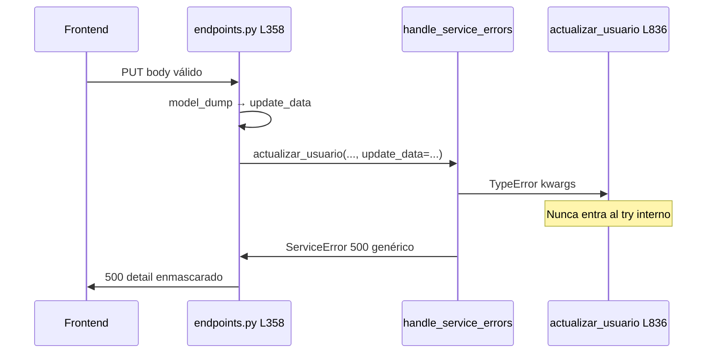

# Diagnóstico runtime — 500 en `PUT /api/v1/usuarios/{usuario_id}/`

**Tipo:** Evidencia runtime (logs Docker) — sin cambios de código  
**Fecha:** 2026-06-01  
**Relacionado:** [USER_UPDATE_500_ROOT_CAUSE_AUDIT.md](./USER_UPDATE_500_ROOT_CAUSE_AUDIT.md)  
**Fuente de logs:** `terminals/1.txt` — contenedor `fastapi_backend` (docker compose)

---

## 1. Resumen ejecutivo

| Campo | Valor |
|-------|-------|
| **Excepción exacta** | `TypeError: UsuarioService.actualizar_usuario() got an unexpected keyword argument 'update_data'` |
| **Archivo / línea (origen)** | `app/modules/users/presentation/endpoints.py` **L361** (llamada incorrecta) |
| **Firma del servicio** | `app/modules/users/application/services/user_service.py` **L836** — parámetro `usuario_data` |
| **Causa raíz definitiva** | **Bug backend:** desalineación de nombre de argumento entre capa presentation y application |
| **Clasificación** | **Bug backend** (contrato endpoint ↔ servicio) |
| **¿Llegó a SQL?** | **No** — falla antes de entrar al cuerpo de `actualizar_usuario` |
| **¿Culpa del payload FE?** | **No** — el body es válido; el 500 no depende de `correo` / `es_activo` |

---

## 2. Correlación request ↔ logs

### 2.1 Request QA (confirmado en logs)

| Campo | Valor en runtime |
|-------|------------------|
| Timestamp | `2026-06-01 06:35:02` (UTC/log contenedor) |
| Método / ruta | `PUT /api/v1/usuarios/102fca1b-000f-42d6-8183-e5bd72ff607b/` |
| `usuario_id` | `102fca1b-000f-42d6-8183-e5bd72ff607b` |
| `cliente_id` (sesión) | `e4c8e906-0e64-4f4e-a04d-8daee57dc7f8` |
| Tenant | `t3usr971acefb` / BD `bd_sistema_saas` |
| Usuario autenticado | `admin` |
| Permiso | `admin.usuario.actualizar` — **autorizado** |
| Latencia | `78.6ms` |
| HTTP | `500 Internal Server Error` |

### 2.2 Body (QA)

```json
{
  "correo": "supers@gmail.com",
  "nombre": "Supervisor",
  "apellido": "Super",
  "es_activo": true
}
```

*(En documentación QA el correo aparece con artefacto markdown; el fallo ocurre **antes** de validar o persistir datos.)*

### 2.3 Respuesta HTTP

```json
{
  "detail": "Error interno del servidor en actualizar_usuario"
}
```

Coherente con `@BaseService.handle_service_errors` envolviendo el `TypeError`.

---

## 3. Evidencia en logs (extracto literal)

### 3.1 Entrada al endpoint

```text
2026-06-01 06:35:02,402 - app.main - INFO - [SYSTEM] 172.18.0.1 -> PUT /api/v1/usuarios/102fca1b-000f-42d6-8183-e5bd72ff607b/
2026-06-01 06:35:02,477 - app.modules.users.presentation.endpoints - INFO - Solicitud PUT /usuarios/102fca1b-000f-42d6-8183-e5bd72ff607b/ recibida para actualizar en cliente e4c8e906-0e64-4f4e-a04d-8daee57dc7f8
```

### 3.2 Error capturado por el decorador (causa real)

```text
2026-06-01 06:35:02,478 - app.core.application.base_service - ERROR - ERROR INESPERADO en actualizar_usuario: UsuarioService.actualizar_usuario() got an unexpected keyword argument 'update_data'
Traceback (most recent call last):
  File "/app/app/core/application/base_service.py", line 52, in wrapper
    return await func(*args, **kwargs)
                 ^^^^^^^^^^^^^^^^^^^^^
TypeError: UsuarioService.actualizar_usuario() got an unexpected keyword argument 'update_data'
```

### 3.3 Respuesta al cliente (enmascarada)

```text
2026-06-01 06:35:02,480 - app.modules.users.presentation.endpoints - WARNING - Error de negocio al actualizar usuario 102fca1b-000f-42d6-8183-e5bd72ff607b en cliente e4c8e906-0e64-4f4e-a04d-8daee57dc7f8: Error interno del servidor en actualizar_usuario
2026-06-01 06:35:02,481 - app.main - INFO - [SYSTEM] 172.18.0.1 <- PUT /api/v1/usuarios/102fca1b-000f-42d6-8183-e5bd72ff607b/ 500 78.6ms
```

### 3.4 Mensajes **no** presentes en este request

| Patrón buscado | Resultado |
|----------------|-----------|
| `Error inesperado al actualizar usuario` | **Ausente** — no se ejecutó el `try` interno del servicio |
| `Error de BD al actualizar usuario` | **Ausente** — no hubo `execute_query` / `execute_update` en este flujo |
| `Intentando actualizar usuario ID:` (servicio) | **Ausente** — la función ni siquiera arrancó |
| Stack SQL / `DB_UPDATE_ERROR` | **Ausente** |

---

## 4. Excepción exacta y stacktrace

### 4.1 Tipo y mensaje

```
TypeError: UsuarioService.actualizar_usuario() got an unexpected keyword argument 'update_data'
```

### 4.2 Stacktrace completo (runtime)

```
Traceback (most recent call last):
  File "/app/app/core/application/base_service.py", line 52, in wrapper
    return await func(*args, **kwargs)
TypeError: UsuarioService.actualizar_usuario() got an unexpected keyword argument 'update_data'
```

### 4.3 Punto de fallo en código (repositorio local)

**Llamada incorrecta (presentation):**

```357:362:app/modules/users/presentation/endpoints.py
    try:
        updated_usuario = await UsuarioService.actualizar_usuario(
            cliente_id=current_user.cliente_id, # ✅ Pasar cliente_id para validación
            usuario_id=usuario_id,
            update_data=update_data
        )
```

**Firma real del servicio (application):**

```836:836:app/modules/users/application/services/user_service.py
    async def actualizar_usuario(cliente_id: UUID, usuario_id: UUID, usuario_data: Dict) -> Dict:
```

**Envoltorio que oculta el `TypeError`:**

```49:72:app/core/application/base_service.py
        async def wrapper(*args, **kwargs):
            try:
                return await func(*args, **kwargs)
            ...
            except Exception as e:
                logger.exception(f"ERROR INESPERADO en {func.__name__}: {str(e)}")
                raise ServiceError(
                    status_code=500, 
                    detail=f"Error interno del servidor en {func.__name__}",
                    internal_code="INTERNAL_SERVICE_ERROR"
                )
```

---

## 5. Causa raíz definitiva

El endpoint `actualizar_usuario` invoca el servicio con el keyword argument **`update_data`**, pero el método estático declara el tercer parámetro como **`usuario_data`**.

Python lanza `TypeError` al resolver la llamada (`**kwargs` no coincide con la firma). El decorador `@handle_service_errors` captura cualquier `Exception`, la registra como `ERROR INESPERADO en actualizar_usuario` y la reexpone como `ServiceError` 500 con mensaje genérico.

**Consecuencias:**

- Ningún paso de negocio ni SQL se ejecuta.
- El payload del frontend es irrelevante para este 500 concreto.
- El permiso RBAC y el tenant están correctos (logs lo confirman).

---

## 6. Clasificación

| Categoría | ¿Aplica? | Notas |
|-----------|:--------:|-------|
| **Bug backend** | **Sí** | Desalineación `update_data` vs `usuario_data` |
| Problema de datos | No | No se alcanzó la BD |
| Problema de configuración | No | Tenant, permisos y routing OK |
| Error SQL | No | Sin consultas de actualización en este trace |

---

## 7. Propuesta de corrección (sin implementar)

### 7.1 Fix mínimo (recomendado)

En `app/modules/users/presentation/endpoints.py` L358–361, alinear el nombre del argumento con el servicio:

```python
updated_usuario = await UsuarioService.actualizar_usuario(
    cliente_id=current_user.cliente_id,
    usuario_id=usuario_id,
    usuario_data=update_data,  # era: update_data=update_data
)
```

**Impacto:** una línea; desbloquea todo el flujo ya implementado (duplicados, UPDATE, OUTPUT).

### 7.2 Verificación post-fix

| Prueba | Resultado esperado |
|--------|-------------------|
| Repetir `PUT` con el mismo body | **200** + `UsuarioRead` |
| Log | `Intentando actualizar usuario ID: ...` en `user_service` |
| Sin | `ERROR INESPERADO en actualizar_usuario` |

### 7.3 Hardening opcional (no bloqueante)

| Mejora | Motivo |
|--------|--------|
| Test de integración `PUT /usuarios/{id}` | Evitar regresión de contrato presentation ↔ service |
| En `handle_service_errors`, detectar `TypeError` de firma y mapear a 500 con `internal_code=CALL_SIGNATURE_MISMATCH` o re-raise con mensaje explícito en dev | Diagnóstico más rápido en QA |
| Type checker (`mypy` / Pyright) en CI sobre llamadas a servicios | Detecta kwargs inválidos en compile time |

### 7.4 Nota sobre correo con markdown

Si en algún entorno el FE enviara literalmente `[supers@gmail.com](mailto:supers@gmail.com)`, Pydantic lo acepta hoy (validación débil). Eso es un tema **distinto** y solo aplicaría **después** de corregir el `TypeError`. No es la causa del 500 observado en logs.

---

## 8. Línea de tiempo del fallo (diagrama)



---

## 9. Conclusión

| Pregunta | Respuesta |
|----------|-----------|
| ¿Qué excepción exacta? | `TypeError` — keyword `update_data` no reconocido |
| ¿Dónde? | Llamada en `endpoints.py` L361 → propagación en `base_service.py` L52 |
| ¿Por qué 500 y no 422? | El decorador convierte cualquier `Exception` en `ServiceError` 500 |
| ¿Fix? | Renombrar kwarg a `usuario_data=` en la llamada al servicio |
| ¿SQL / datos / config? | Descartados con evidencia runtime |

---

*Diagnóstico basado en logs reales del contenedor `fastapi_backend` del 2026-06-01 06:35:02. Sin modificaciones de código ni commit.*
