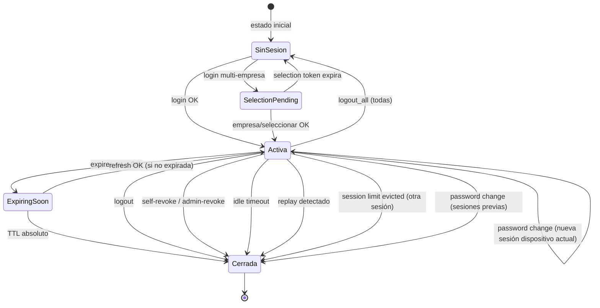

# IAM Session Management V2 — Especificación Funcional del Backend

**Documento:** `IAM_SESSION_MANAGEMENT_V2_BACKEND_SPECIFICATION.md`  
**Versión:** 1.0.0  
**Estado:** **OFICIAL — Backend IAM V2 COMPLETADO**  
**Scope:** Session Management V2 — **Password Authentication Only**  
**Fecha:** 2026-06-22  
**Audiencia:** Frontend React, aplicaciones móviles, integraciones externas, QA, auditorías  

**Alcance excluido (declaración normativa):**

| Elemento | Estado |
|----------|--------|
| Azure AD | **Out of Scope** |
| Google Login | **Out of Scope** |
| OAuth / SSO | **Out of Scope** |
| Proyecto futuro SSO | **P1-08 — Session Management V2 SSO Integration** |

**Referencias consolidadas (no duplicadas en este documento):**

- Contrato JSON aditivo: `docs/arquitectura/ERP-IAM-SESSIONS-API-CONTRACT-V2.md`
- Diseño arquitectónico histórico: `docs/arquitectura/IAM-SESSION-MANAGEMENT-V2-DESIGN-01.md`
- Plan de implementación F01–F14: `docs/arquitectura/IAM-SESSION-MANAGEMENT-V2-IMPLEMENTATION-PLAN-01.md`

> **Regla de precedencia:** Ante discrepancia entre documentación histórica y el Backend desplegado, prevalece el **comportamiento real del Backend implementado** descrito en este documento.

---

## 1. Estado oficial

| Atributo | Valor |
|----------|-------|
| **Nombre** | IAM Session Management V2 — Backend Specification |
| **Versión** | 1.0.0 |
| **Estado** | OFICIAL — Backend IAM V2 **COMPLETADO** (F01–F14, Password Authentication) |
| **Scope** | Gestión de sesiones con autenticación **login/password** bajo `/api/v1/auth/*` |
| **Fecha** | 2026-06-22 |
| **Activación** | Feature flag `IAM_SESSION_MANAGEMENT_V2_ENABLED=true` por tenant/entorno |

**Declaración de cierre:**

- F01–F14 = **COMPLETADO** (alcance Password Authentication)
- Session Management V2 Password Authentication = **COMPLETADO**
- Backend IAM V2 = **COMPLETADO**

---

## 2. Objetivos

Session Management V2 resuelve la gestión segura del ciclo de vida de sesiones de usuario en el ERP multi-tenant SaaS:

| Problema | Solución funcional |
|----------|-------------------|
| Identificación estable de sesión entre rotaciones | `session_id` canónico (`user_session`) independiente del refresh vigente |
| Robo o reutilización de refresh token | Rotación obligatoria (RTR) + detección de replay por token usado |
| Sesiones abandonadas | Idle timeout de autenticación + TTL absoluto de sesión |
| Exceso de dispositivos conectados | Session limit configurable por tenant |
| Access token válido tras logout | Blacklist Redis por `jti` vinculado a la sesión |
| Cambio de contraseña sin sesiones huérfanas | Revocación masiva + nueva sesión en el dispositivo actual |
| Operación multi-empresa | Selection token stateless + actualización de sesión al confirmar empresa |
| Soporte operativo | Listado, revocación propia, revocación admin, auditoría centralizada |
| Impersonación de soporte | Flujo separado sin sesión refresh propia en BD |

---

## 3. Conceptos oficiales

Definiciones **funcionales** — sin detalle de implementación interna.

### Session (Sesión)

Unidad lógica de autenticación de un usuario en un tenant (`cliente_id`), en un dispositivo/plataforma (`web` o `mobile`), con contexto de empresa opcional. Identificada por **`session_id`**. Persiste desde el login exitoso (o post-selección de empresa) hasta revocación o expiración.

### User Session

Registro persistente de la sesión lógica. Contiene metadatos inmutables (`login_ip`, `login_method`, `created_at`) y mutables (`last_refresh_at`, `last_seen_ip`, `empresa_id`, `expires_at`). Solo las sesiones **activas** aparecen en listados.

### Token Family

Agrupación de refresh tokens pertenecientes a una misma sesión. Permite detectar compromiso (`replay_detected`) sin afectar otras sesiones del usuario.

### Refresh Token

Credencial de larga duración almacenada en BD, entregada al cliente en cookie HttpOnly (web) o JSON (mobile). Se **rota** en cada refresh exitoso: el token anterior queda marcado como **usado**; el nuevo es el único válido para la siguiente rotación.

### Access Token

JWT de corta duración enviado en `Authorization: Bearer`. Contiene claims de identidad, tenant, empresa y, en V2, **`sid`** (= `session_id`). Se renueva en login, refresh, cambio de empresa y password change.

### Session ID (`sid`)

UUID canónico de la sesión. **Estable** durante toda la vida de la sesión. Presente en:

- Respuestas de listado (`session_id`)
- Claim JWT access `sid`
- Resolución de revocación remota (path preferido)

**No confundir** con `token_id`, que cambia en cada rotación RTR.

### Current Session

Sesión asociada al access token o refresh token del request actual. El Backend expone `current_session_id` en `GET /me/` y marca `is_current: true` en listados cuando coincide.

### Current Token

Refresh token **vigente** de la sesión actual (`token_id` en listados). Cambia tras cada rotación exitosa. Usar solo como fallback de compatibilidad para `is_current` cuando `current_session_id` no esté disponible.

### Replay Attack (Reutilización maliciosa)

Presentación de un refresh token ya **usado** en una rotación anterior. El Backend cierra **únicamente la sesión comprometida** (familia + sesión), emite auditoría `replay_detected` y responde **401** sin emitir tokens nuevos.

### Session Revocation

Cierre definitivo de una sesión: `user_session` inactiva, tokens revocados, blacklist Redis del access mapeado. Motivos funcionales: logout, logout all, admin revoke, password change, idle, límite de sesiones, replay, expiración absoluta.

### Session Limit

Política del tenant (`max_active_sessions`). Antes de crear una sesión nueva en login (o flujos equivalentes), el Backend puede evictar las sesiones activas **más antiguas** hasta cumplir el límite.

### Password Change

Flujo que invalida **todas** las sesiones del usuario, blacklistea sus access tokens mapeados y crea **una sesión nueva** en el dispositivo que ejecutó el cambio.

### Selection Token

Access JWT temporal emitido en login multi-empresa (`empresa_selection_pending: true`). **No crea sesión refresh** hasta `POST /empresa/seleccionar/`. Debe consumirse una sola vez (blacklist del `jti` al usar).

### Impersonation

Modo operativo de soporte: access JWT con `is_impersonation: true`, **sin refresh propio** persistido. El refresh del operador se conserva en Redis. Refresh y cambio de empresa están **bloqueados** (403) durante impersonación.

### Redis

Capa de aceleración para blacklist de access tokens y mapping sesión→access vigente. Operaciones **fail-soft**: un fallo de Redis no impide login/refresh/logout en BD, pero puede retrasar invalidación inmediata del access.

### Auditoría

Registro append-only en `auth_audit_log` por evento de sesión. Fail-soft: un error de auditoría **nunca** bloquea el flujo de autenticación.

---

## 4. Arquitectura funcional

### Modelo de persistencia (tres entidades)

```
┌─────────────────┐     1:1      ┌─────────────────┐     1:N      ┌─────────────────┐
│  user_session   │─────────────►│  token_family   │─────────────►│ refresh_tokens  │
│  (sesión lógica)│              │  (cadena RTR)   │              │  (credencial)   │
└─────────────────┘              └─────────────────┘              └─────────────────┘
```

### Ciclo de vida completo (Password Authentication)

```
┌──────────┐    credenciales OK     ┌──────────────┐
│  Cliente │ ─────────────────────► │    LOGIN     │
└──────────┘                        └──────┬───────┘
                                           │
                    ┌──────────────────────┼──────────────────────┐
                    │ multi-empresa        │ empresa única / admin  │
                    ▼                      ▼                        │
            ┌───────────────┐      ┌───────────────┐                │
            │ Selection     │      │ Crear sesión  │                │
            │ Token (sin    │      │ + emitir      │                │
            │ refresh)      │      │ access+refresh│                │
            └───────┬───────┘      └───────┬───────┘                │
                    │ seleccionar          │                        │
                    └──────────┬───────────┘                        │
                               ▼                                    │
                    ┌─────────────────────┐                       │
                    │   SESIÓN ACTIVA     │◄──────────────────────┘
                    │  (session_id fijo)  │
                    └─────────┬───────────┘
                              │
         ┌────────────────────┼────────────────────┐
         │                    │                    │
         ▼                    ▼                    ▼
  ┌─────────────┐    ┌─────────────┐    ┌─────────────┐
  │   REFRESH   │    │  CAMBIAR    │    │  ACTIVIDAD  │
  │   (RTR)     │    │  EMPRESA    │    │  API ERP    │
  └──────┬──────┘    └──────┬──────┘    └─────────────┘
         │                  │
         └────────┬─────────┘
                  │
    ┌─────────────┼─────────────┬─────────────┬─────────────┐
    ▼             ▼             ▼             ▼             ▼
 LOGOUT    LOGOUT ALL    PASSWORD     REVOCACIÓN    REPLAY /
 (1 ses.)  (todas)       CHANGE       REMOTA        IDLE /
                                                      TTL
    │             │             │             │             │
    └─────────────┴─────────────┴─────────────┴─────────────┘
                              │
                              ▼
                    ┌─────────────────────┐
                    │   SESIÓN CERRADA    │
                    │  (no en listados)   │
                    └─────────────────────┘
```

### Capas de validez

| Capa | Rol |
|------|-----|
| **Access JWT** | Autenticación de cada request API; validación firma + expiración + blacklist Redis |
| **Refresh token** | Renovación de sesión; validación firma JWT + estado en BD (hash) |
| **BD (3 tablas)** | Fuente de verdad de sesión, familia y credencial refresh |
| **Redis** | Blacklist access + mapping sesión→access vigente |

### Identificación de cliente

Header **`X-Client-Type`**:

| Valor | Refresh entregado | Refresh en requests |
|-------|-------------------|---------------------|
| `web` (default) | Cookie HttpOnly `refresh_token` | Cookie automática |
| `mobile` | Campo JSON `refresh_token` | Body JSON en refresh/logout |

---

## 5. Estados oficiales

### 5.1 Sesión (`user_session`)

| Estado funcional | Condición | Visible en listados |
|------------------|-----------|---------------------|
| **Activa** | `is_active = 1` y `expires_at > now` | Sí |
| **Expiring soon** | Activa y `expires_at` dentro de 24 h | Sí (`status: "expiring_soon"`) |
| **Cerrada** | `is_active = 0` o expirada | No |

Motivos de cierre (`revoked_reason` en sesión — valores persistidos):

| Motivo funcional | Valor persistido |
|------------------|------------------|
| Logout / logout all | `logout` |
| Revocación admin / session limit | `admin_force` |
| Password change | `password_reset` |
| Replay / seguridad | `security` |
| Idle / TTL absoluto | `expired` |

### 5.2 Refresh token (credencial)

| Estado | Condición | ¿Aceptado en refresh? |
|--------|-----------|----------------------|
| **Vigente** | `is_used = 0`, `is_revoked = 0`, no expirado | Sí |
| **Usado (rotado)** | `is_used = 1` | No → replay si se reutiliza |
| **Revocado** | `is_revoked = 1` | No → 401 |
| **Expirado** | `expires_at ≤ now` | No → 401 |

### 5.3 Familia de tokens

| Estado | Condición | Efecto |
|--------|-----------|--------|
| **Activa** | `is_compromised = 0` | Rotaciones permitidas |
| **Comprometida** | `is_compromised = 1` | Toda la sesión invalidada (replay) |

### 5.4 Resultado de rotación (Refresh)

| Resultado | HTTP | Comportamiento hacia el cliente |
|-----------|------|--------------------------------|
| **Rotación exitosa** | 200 | Nuevo access + nuevo refresh entregado |
| **Ya rotado (concurrencia)** | 200 | Nuevo access; refresh **no** actualizado (web: cookie intacta) |
| **Idle / inválido / replay** | 401 | Mensaje unificado de sesión expirada; sin tokens nuevos en replay |
| **Impersonación** | 403 | Refresh prohibido |

Mensaje 401 unificado en refresh:

> Sesión expirada o cerrada remotamente. Por favor, vuelva a iniciar sesión.

---

## 6. Flujos funcionales

Convenciones de tablas: **`US`** = `user_session`, **`TF`** = `token_family`, **`RT`** = `refresh_tokens`.

---

### 6.1 Login

**Endpoint:** `POST /api/v1/auth/login/`

| Aspecto | Detalle |
|---------|---------|
| **Objetivo** | Autenticar credenciales password y abrir sesión (o iniciar selección de empresa) |
| **Entradas** | `username`, `password` (form); tenant vía subdominio/middleware; `X-Client-Type` |
| **Resultado — empresa única** | `200` + access JWT + refresh + `user_data` |
| **Resultado — multi-empresa** | `200` + `LoginEmpresaSelectionResponse` (selection_token, **sin refresh**) |
| **Errores** | `401` credenciales; `429` rate limit |

**Garantías del Backend:**

- Valida tenant activo antes de autenticar
- Aplica session limit **antes** de crear sesión (evicción oldest-first)
- Crea sesión atómica: US + TF + primer RT
- Emite access con claim `sid` tras crear sesión
- Vincula access en Redis a `session_id`
- Registra `login_success` o `login_failed`

**Auditoría:** `login_success` | `login_failed`  
**Redis:** link access → sesión; blacklist jti anterior si re-emite access  
**Tablas:** INSERT US, TF, RT; UPDATE TF.current_token_id; UPDATE US si evicción

---

### 6.2 Refresh

**Endpoint:** `POST /api/v1/auth/refresh/`

| Aspecto | Detalle |
|---------|---------|
| **Objetivo** | Renovar access token y rotar refresh (RTR) |
| **Entradas** | Refresh en cookie (web) o body (mobile) |
| **Resultado** | `200` + nuevo access (+ refresh si rotación completa) |
| **Errores** | `401` sesión inválida/replay/idle; `403` impersonación |

**Garantías:**

- Valida refresh JWT + estado BD bajo lock transaccional
- Rota: INSERT nuevo RT → UPDATE familia → MARK old `is_used=1` → UPDATE US.last_refresh_at
- Idle evaluado contra `user_session.last_refresh_at`
- Concurrencia: segundo request concurrente recibe access nuevo sin refresh actualizado
- Impersonación: rechazo 403 antes de rotar

**Auditoría:** `refresh_success` | `replay_detected` | `idle_timeout`  
**Redis:** link access (blacklist jti anterior del mapping)  
**Tablas:** INSERT RT; UPDATE RT (old used); UPDATE TF; UPDATE US

---

### 6.3 Refresh Rotation (RTR)

Mecanismo interno del flujo Refresh — reglas que el consumidor debe conocer:

1. Cada refresh exitoso invalida el refresh anterior (**usado**, no reutilizable).
2. `token_id` en listados cambia; `session_id` **no** cambia.
3. Reutilizar refresh antiguo → replay → cierre de **esa sesión** + 401.
4. No lanzar múltiples refresh en paralelo de forma intencional.

---

### 6.4 Logout

**Endpoint:** `POST /api/v1/auth/logout/`

| Aspecto | Detalle |
|---------|---------|
| **Objetivo** | Cerrar la sesión del refresh presentado |
| **Entradas** | Refresh (cookie/body); access Bearer opcional |
| **Resultado** | **Siempre `200`** (idempotente) |

**Garantías:**

- Revoca sesión en BD si aún activa
- Blacklist access mapeado vía Redis
- Blacklist access Bearer si enviado
- Limpia cookies refresh (web)
- Si ya cerrada: 200 sin error

**Auditoría:** `logout`  
**Redis:** blacklist_session + blacklist jti Bearer  
**Tablas:** UPDATE US (inactive); UPDATE RT (revoked)

---

### 6.5 Logout All

**Endpoint:** `POST /api/v1/auth/logout_all/`

| Aspecto | Detalle |
|---------|---------|
| **Objetivo** | Cerrar **todas** las sesiones del usuario en el tenant |
| **Entradas** | Bearer access obligatorio |
| **Resultado** | `200` + conteo de sesiones cerradas |

**Garantías:**

- Revoca todas las sesiones activas del usuario
- Blacklist access de todas las sesiones vía Redis
- Blacklist access actual del request
- Access actual sigue válido hasta expiración natural → FE debe redirigir a login de inmediato

**Auditoría:** `logout_all`  
**Redis:** blacklist_all_user_sessions  
**Tablas:** UPDATE masivo US + RT

---

### 6.6 Password Change

**Endpoint:** `POST /api/v1/auth/password/change/`

| Aspecto | Detalle |
|---------|---------|
| **Objetivo** | Cambiar contraseña y restablecer sesiones |
| **Entradas** | Contraseña actual + nueva; Bearer + refresh del dispositivo |
| **Resultado** | `200` + tokens de **nueva sesión** |

**Garantías:**

- Valida contraseña actual
- Revoca **todas** las sesiones previas
- Crea sesión nueva en dispositivo actual
- Emite access+refresh nuevos con nuevo `session_id`

**Auditoría:** `password_change` + creación implícita (`login_success` pattern en sesión nueva)  
**Redis:** blacklist_all + link nueva sesión  
**Tablas:** UPDATE masivo US/RT; INSERT US, TF, RT

---

### 6.7 Empresa Change

**Endpoint:** `POST /api/v1/auth/empresa/cambiar/`

| Aspecto | Detalle |
|---------|---------|
| **Objetivo** | Cambiar empresa activa sin re-login |
| **Entradas** | Bearer access + `empresa_id`; refresh en cookie/body |
| **Resultado** | `200` + access/refresh/user_data actualizados |
| **Errores** | `403` durante impersonación; `401` sesión inválida |

**Garantías:**

- Rota refresh con nuevo `empresa_id` en sesión y tokens
- Actualiza contexto operativo ERP en JWT
- Bloqueado en impersonación

**Auditoría:** `empresa_changed`  
**Redis:** link access post-rotación  
**Tablas:** UPDATE US.empresa_id; rotación RT

---

### 6.8 Empresa Selection

**Flujo en dos pasos:**

**Paso A — Login:** respuesta `requiere_seleccion_empresa: true` + `selection_token` (sin refresh).

**Paso B —** `POST /api/v1/auth/empresa/seleccionar/`

| Aspecto | Detalle |
|---------|---------|
| **Objetivo** | Confirmar empresa y abrir sesión completa |
| **Entradas** | Bearer **selection_token** + `empresa_id` |
| **Resultado** | `200` + access + refresh + `user_data` con empresa |

**Garantías:**

- Rechaza access de sesión normal (409 si no es selection token)
- Blacklist del selection_token al consumir
- Crea sesión refresh + actualiza US con empresa
- `GET /me/` rechaza selection token (409)

**Auditoría:** `empresa_selected`  
**Redis:** blacklist selection jti; link access sesión  
**Tablas:** INSERT/UPDATE US, TF, RT

---

### 6.9 Session Revocation (remota)

**Self-revoke:** `POST /api/v1/auth/sessions/{id}/revoke/`  
**Admin:** `POST /api/v1/auth/sessions/{id}/revoke_admin/`

| Aspecto | Detalle |
|---------|---------|
| **Objetivo** | Cerrar sesión remota por UUID |
| **Entradas** | `{id}` = **`session_id` preferido** o `token_id` vigente (alias compatibilidad) |
| **Self — Resultado** | `200` idempotente (ya cerrada → mensaje informativo) |
| **Admin — Resultado** | `200` si activa; `404` si no existe o ya cerrada |

**Garantías:**

- Self-revoke solo sesiones propias → cross-user 404
- Admin requiere rol administrador
- Revocación cierra BD + blacklist Redis

**Auditoría:** `session_revoked` (self) | `session_admin_revoked` (admin) | `session_self_revoked` (evento endpoint legacy)  
**Redis:** blacklist_session  
**Tablas:** UPDATE US, RT, TF según motivo

---

### 6.10 Session Listing

**Usuario:** `GET /api/v1/auth/sessions/`  
**Admin:** `GET /api/v1/auth/sessions/admin/` (paginación opt-in con `page`)

| Aspecto | Detalle |
|---------|---------|
| **Objetivo** | Listar sesiones activas con dispositivo enriquecido |
| **Entradas** | Bearer access |
| **Resultado** | Lista ordenada por `last_refresh_at DESC` |

**Campos clave V2:**

| Campo | Semántica |
|-------|-----------|
| `session_id` | Identificador estable de sesión |
| `token_id` | Refresh vigente (cambia en RTR) |
| `issued_at` | Inicio de sesión (`user_session.created_at`) |
| `last_refresh_at` | Último refresh exitoso |
| `expires_at` | Expiración **absoluta** de sesión |
| `is_current` | Comparar con `current_session_id` de `/me/` |
| `login_ip` | IP original (inmutable, auditoría) |
| `ip_address` / `device.ip_address` | Última IP conocida (`last_seen_ip`) |

**Auditoría:** ninguna  
**Redis:** ninguna  
**Tablas:** SELECT US + JOIN RT/TF

---

### 6.11 Replay Attack

Disparador: presentación de refresh con `is_used = 1`.

| Aspecto | Detalle |
|---------|---------|
| **Resultado** | 401 + cierre de **solo la sesión afectada** |
| **Otras sesiones del usuario** | Permanecen activas |

**Auditoría:** `replay_detected`, `family_compromised`  
**Redis:** blacklist_session  
**Tablas:** UPDATE TF (compromised); UPDATE US (inactive); UPDATE RT (revoked)

---

### 6.12 Impersonation

**Inicio:** `POST /api/v1/auth/impersonate/{cliente_id}/`  
**Fin:** `POST /api/v1/auth/impersonate/end/`

| Aspecto | Detalle |
|---------|---------|
| **Objetivo** | Operador accede al tenant objetivo sin sesión refresh propia |
| **Entradas** | Bearer operador + permisos soporte |
| **Resultado inicio** | Access impersonation (`is_impersonation: true`) |
| **Resultado fin** | Restaura tokens operador desde Redis |

**Garantías:**

- **No** crea `user_session` para impersonación
- Refresh durante impersonación → **403**
- Cambiar empresa durante impersonación → **403**
- Parent refresh del operador validado al finalizar

**Auditoría:** eventos impersonation existentes (fuera del catálogo sesión V2)  
**Redis:** parent context operador  
**Tablas:** ninguna sesión impersonada en US

---

### 6.13 Session Expiration

Dos mecanismos independientes:

| Tipo | Trigger | Acción |
|------|---------|--------|
| **Idle auth** | Sin refresh dentro de `session_idle_timeout_minutes` | Revocación en próximo refresh → 401 |
| **TTL absoluto** | `user_session.expires_at` alcanzado | Sesión inválida → 401 |

**Auditoría:** `idle_timeout` | `session_expired`  
**Redis:** blacklist al revocar  
**Tablas:** UPDATE US, RT

> **Nota funcional:** `last_business_activity_at` se actualiza en requests ERP autenticados (throttle 5 min) para UI/alertas; **no revoca** sesión en V2.

---

### 6.14 Session Limit

| Aspecto | Detalle |
|---------|---------|
| **Momento** | Pre-creación de sesión (login, password change nueva sesión, seleccionar empresa) |
| **No aplica** | Refresh, cambio de empresa (rotación) |
| **Acción** | Evicción sesiones oldest-first hasta cumplir `max_active_sessions` |

**Auditoría:** `session_limit_evicted` por sesión evictada  
**Redis:** blacklist por sesión evictada  
**Tablas:** UPDATE US/RT evictadas

---

## 7. Contrato funcional de endpoints

Base: **`/api/v1/auth`**. Solo endpoints del alcance Password Authentication V2.

### 7.1 `POST /login/`

| | |
|---|---|
| **Responsabilidad** | Autenticación password y apertura de sesión o selection flow |
| **Garantiza** | Tokens emitidos solo tras credenciales válidas; session limit aplicado |
| **Nunca hace** | Crear refresh en flujo selection pendiente; autenticar sin tenant |
| **Frontend** | Enviar `X-Client-Type`; manejar `LoginEmpresaSelectionResponse`; almacenar access; web confía en cookie refresh |

### 7.2 `POST /refresh/`

| | |
|---|---|
| **Responsabilidad** | Renovar access y rotar refresh |
| **Garantiza** | RTR atómico; un solo refresh vigente post-rotación |
| **Nunca hace** | Refresh en impersonación; reutilizar refresh usado sin cerrar sesión |
| **Frontend** | Tras 200: reemplazar access inmediatamente; no paralelizar refresh; ante 401 → login |

### 7.3 `POST /logout/`

| | |
|---|---|
| **Responsabilidad** | Cerrar sesión del refresh presentado |
| **Garantiza** | Idempotencia 200 |
| **Nunca hace** | Requerir access obligatorio |
| **Frontend** | Limpiar access local aunque cookies ya borradas; tratar siempre como éxito |

### 7.4 `POST /logout_all/`

| | |
|---|---|
| **Responsabilidad** | Cerrar todas las sesiones del usuario |
| **Garantiza** | Revocación BD completa del usuario en tenant |
| **Nunca hace** | Invalidar access actual instantáneamente |
| **Frontend** | Redirigir a login inmediatamente; no confiar en access residual |

### 7.5 `POST /password/change/`

| | |
|---|---|
| **Responsabilidad** | Cambio de contraseña + reset de sesiones |
| **Garantiza** | Una sola sesión activa post-cambio (dispositivo actual) |
| **Nunca hace** | Preservar sesiones anteriores |
| **Frontend** | Reemplazar tokens completos; invalidar caches de sesión |

### 7.6 `POST /empresa/seleccionar/`

| | |
|---|---|
| **Responsabilidad** | Completar login multi-empresa |
| **Garantiza** | Solo acepta selection_token |
| **Nunca hace** | Aceptar access de sesión normal |
| **Frontend** | Guardar selection_token temporal; no llamar `/me/` con selection token |

### 7.7 `POST /empresa/cambiar/`

| | |
|---|---|
| **Responsabilidad** | Cambiar empresa sin re-login |
| **Garantiza** | Tokens actualizados con nueva empresa |
| **Nunca hace** | Operar en impersonación |
| **Frontend** | Enviar refresh con request; actualizar access + user_data |

### 7.8 `GET /sessions/`

| | |
|---|---|
| **Responsabilidad** | Listar sesiones activas propias |
| **Garantiza** | `is_current` correcto vía `current_session_id` |
| **Nunca hace** | Mostrar sesiones cerradas |
| **Frontend** | Usar `session_id` para revoke remoto; preferir `current_session_id` en `/me/` |

### 7.9 `GET /sessions/admin/`

| | |
|---|---|
| **Responsabilidad** | Listado admin paginado/filtrado |
| **Garantiza** | Aislamiento tenant; sort whitelist |
| **Nunca hace** | Exponer sesiones cross-tenant |
| **Frontend** | Usar paginación ERP estándar cuando `page` presente |

### 7.10 `POST /sessions/{id}/revoke/`

| | |
|---|---|
| **Responsabilidad** | Self-revoke remoto |
| **Garantiza** | Idempotencia; path acepta `session_id` o `token_id` |
| **Nunca hace** | Revocar sesiones de otro usuario (404) |
| **Frontend** | Preferir `session_id` del listado |

### 7.11 `POST /sessions/{id}/revoke_admin/`

| | |
|---|---|
| **Responsabilidad** | Revocación administrativa |
| **Garantiza** | Solo admin; 404 si ya cerrada |
| **Nunca hace** | Idempotencia (404 en reintento) |
| **Frontend** | Tratar 404 como sesión ya cerrada en UI admin |

### 7.12 `GET /me/`

| | |
|---|---|
| **Responsabilidad** | Perfil usuario + contexto sesión |
| **Garantiza** | `current_session_id` y `current_token_id` cuando V2 activo |
| **Nunca hace** | Responder con selection token pendiente (409) |
| **Frontend** | Comparar `current_session_id` con listado para `is_current` |

### 7.13 `POST /impersonate/{cliente_id}/` y `POST /impersonate/end/`

| | |
|---|---|
| **Responsabilidad** | Soporte impersonación |
| **Garantiza** | Sin sesión refresh impersonada; restauración operador |
| **Nunca hace** | Permitir refresh/cambiar empresa en impersonación |
| **Frontend** | Flujo separado; no invocar refresh ERP durante impersonación |

---

## 8. Frontend Integration Contract

### 8.1 Qué debe hacer el Frontend

1. Enviar **`Authorization: Bearer <access_token>`** en toda llamada autenticada.
2. Declarar **`X-Client-Type: web`** o **`mobile`** en login, refresh y logout.
3. **Web:** confiar en cookie HttpOnly para refresh; no extraer refresh a JS.
4. **Mobile:** persistir y enviar `refresh_token` en body de refresh/logout.
5. Tras **refresh 200:** reemplazar access en memoria/storage **inmediatamente**.
6. Tras **refresh concurrente (200 sin refresh nuevo):** usar nuevo access; **no** asumir refresh cambiado.
7. Ante **401** en refresh con mensaje de sesión expirada: **redirigir a login**; no reintentar en bucle.
8. Usar **`session_id`** como identificador de sesión en UI y revoke remoto.
9. Calcular **`is_current`** comparando `current_session_id` de `/me/` (fallback `current_token_id`).
10. En **multi-empresa:** completar flujo con `/empresa/seleccionar/` antes de operar ERP.
11. Tras **logout_all** o **password change:** redirigir a login y limpiar tokens locales.
12. Tras **logout:** limpiar access local aunque respuesta sea 200.
13. En **cambio de empresa:** enviar refresh; actualizar access + `user_data`.
14. Tolerar JSON **superset** V2 (campos adicionales ignorables).
15. Post activación V2 en entorno: forzar **re-login** en todos los dispositivos.

### 8.2 Qué nunca debe hacer el Frontend

1. **Nunca** tratar `token_id` como identificador estable de sesión en V2.
2. **Nunca** asumir que `issued_at` cambia en cada refresh (es inicio de sesión).
3. **Nunca** usar `last_refresh_at` como proxy de actividad de negocio API.
4. **Nunca** disparar múltiples refresh en paralelo intencionalmente.
5. **Nunca** invocar refresh durante impersonación activa.
6. **Nunca** invocar cambiar empresa durante impersonación.
7. **Nunca** llamar `/me/` con selection token pendiente.
8. **Nunca** confiar en access tras logout_all hasta expiración natural — redirigir ya.
9. **Nunca** enviar el feature flag `IAM_SESSION_MANAGEMENT_V2_ENABLED` (es configuración servidor).
10. **Nunca** implementar flujos SSO Azure/Google contra este contrato (Out of Scope P1-08).

### 8.3 Cómo consumir el Backend

```
Login (password)
    → guardar access
    → web: cookie refresh automática
    → mobile: guardar refresh

API autenticada
    → Bearer access
    → si 401 por expiración access → refresh una vez → reintentar
    → si refresh 401 → login

Cierre sesión
    → POST logout (refresh presente)
    → limpiar access local

Sesiones remotas
    → GET /sessions/
    → POST /sessions/{session_id}/revoke/
```

---

## 9. Máquina oficial de estados



**Estados terminales:** toda transición a **Cerrada** implica `is_active = 0` en BD y exclusión de listados.

---

## 10. Responsabilidades

| Componente | Responsabilidad | No responsabilidad |
|------------|-----------------|-------------------|
| **Backend** | Ciclo de vida sesión; RTR; replay; revocación; auditoría; emisión JWT | UI; almacenamiento seguro en cliente; routing FE |
| **Frontend** | Almacenar access; enviar headers; refresh proactivo; UX login/logout; usar `session_id` | Validar refresh en BD; rotar tokens; session limit |
| **Redis** | Blacklist access; mapping sesión→jti; fail-soft | Fuente de verdad de sesión |
| **Base de datos** | Fuente de verdad US/TF/RT; transacciones RTR/revoke | Blacklist access sin mapping |
| **JWT Access** | Identidad request; claim `sid`; exp corta | Persistencia sesión |
| **JWT Refresh** | Credencial renovación; claim tenant | Identificador sesión canónico (usar BD) |
| **Cookies (web)** | Transporte HttpOnly refresh | Access token en cookie para API |
| **Bearer Token** | Transporte access en API | Refresh en web |

---

## 11. Eventos de auditoría

Destino: **`auth_audit_log`**. Metadata en `metadata_json`. Sin tokens ni hashes en metadata.

| Evento | Cuándo | `exito` | Metadata principal |
|--------|--------|---------|-------------------|
| `login_success` | Login OK | true | `session_id`, `platform`, `login_method`, `device_id` |
| `login_failed` | Credenciales inválidas | false | `nombre_usuario_intento` |
| `refresh_success` | RTR OK | true | `session_id`, `token_id`, `family_id` |
| `logout` | Logout sesión | true | `session_id` |
| `logout_all` | Logout global | true | `sessions_revoked_count` |
| `session_revoked` | Self-revoke (servicio) | true | `session_id`, `initiator=user` |
| `session_self_revoked` | Self-revoke (endpoint) | true | `session_id` / `token_id` |
| `session_admin_revoked` | Admin revoke | true | `session_id`, `admin_usuario_id`, `target_usuario_id` |
| `replay_detected` | Replay attack | false | `session_id`, `family_id`, `token_id`, `ip` |
| `family_compromised` | Familia invalidada | false | `family_id`, `invalidation_reason` |
| `session_limit_evicted` | Evicción por límite | true | `session_id` |
| `idle_timeout` | Cierre por idle | true | `session_id`, `idle_minutes` |
| `password_change` | Cambio contraseña | true | `sessions_revoked_count` |
| `session_expired` | TTL absoluto | true | `session_id` |
| `empresa_selected` | Selección empresa post-login | true | `session_id`, `empresa_id` |
| `empresa_changed` | Cambio empresa en sesión | true | `session_id`, `old_empresa_id`, `new_empresa_id` |

---

## 12. Redis — comportamiento funcional

### 12.1 Blacklist de access token

- **Clave:** `blacklist:token:{jti}`
- **Cuándo se escribe:** logout, revocación, replay, password change, logout all, rotación (jti anterior del mapping)
- **Cuándo se consulta:** cada request autenticado con Bearer
- **TTL:** hasta expiración del access
- **Si Redis no disponible en lectura:** access **no** considerado blacklisted (fail-soft)

### 12.2 Mapping sesión → access vigente

- **Clave canónica V2:** `session:access_jti:{session_id}`
- **Valor:** `{ "jti", "exp", "token_id" }` (token_id opcional compatibilidad)
- **Cuándo se escribe:** login, refresh exitoso, password change, seleccionar empresa
- **Comportamiento en rotación:** misma clave `session_id`; nuevo jti; jti anterior blacklisted
- **Cuándo se elimina:** logout, revocación, replay, blacklist_session

### 12.3 Fail-soft global

| Operación | Si Redis falla |
|-----------|----------------|
| link_access | Sesión refresh sigue válida en BD |
| blacklist_session | Revocación BD efectiva; access puede vivir hasta exp |
| is_token_blacklisted | Access aceptado si firma válida |

---

## 13. Casos especiales

### 13.1 Replay Attack

- **Trigger:** refresh ya usado (`is_used = 1`)
- **Alcance:** solo sesión comprometida
- **Respuesta cliente:** 401 + login obligatorio en ese dispositivo
- **Otras sesiones:** permanecen activas

### 13.2 Password Change

- Cierra **todas** las sesiones
- Abre **una** nueva en dispositivo actual
- Todos los demás dispositivos: refresh inválido → 401 en próximo refresh

### 13.3 Logout All

- Cierra todas las sesiones en BD
- Access actual del request: válido hasta exp → **redirigir a login de inmediato**

### 13.4 Revocación remota

- Path `{id}`: preferir `session_id`
- Self-revoke: idempotente
- Admin revoke: 404 si ya cerrada

### 13.5 Impersonation

- Sin refresh impersonado en BD
- Refresh → 403
- Cambiar empresa → 403
- Finalizar impersonación restaura operador

### 13.6 Cambio de Empresa

- Rotación refresh con nuevo `empresa_id`
- Requiere refresh presente (cookie/body)
- Actualiza JWT access y user_data

### 13.7 Selection Token

- Emitido en login multi-empresa
- Sin refresh hasta seleccionar
- Consumo único; `/me/` bloqueado con 409 mientras pendiente

---

## 14. Checklist obligatorio para Frontend

Lista de cumplimiento para auditoría Frontend IAM V2.

### Identificación y tokens

- [ ] **FE-01** Usa `session_id` como identificador de sesión en UI y revoke.
- [ ] **FE-02** No usa `token_id` como ID de sesión en V2.
- [ ] **FE-03** Reemplaza access tras cada refresh 200 exitoso.
- [ ] **FE-04** Maneja refresh concurrente: acepta access nuevo sin asumir refresh nuevo.
- [ ] **FE-05** Ante 401 refresh → redirige a login (sin bucle infinito).

### Transporte

- [ ] **FE-06** Web: envía `X-Client-Type: web`; no lee refresh de cookie en JS.
- [ ] **FE-07** Mobile: envía `X-Client-Type: mobile`; incluye refresh en body refresh/logout.
- [ ] **FE-08** Bearer access en todas las llamadas API autenticadas.

### Sesiones

- [ ] **FE-09** `is_current` vía `current_session_id` de `/me/` (fallback `current_token_id`).
- [ ] **FE-10** Revoke remoto usa `session_id` del listado.
- [ ] **FE-11** Tras logout: limpia access local aunque HTTP 200.
- [ ] **FE-12** Tras logout_all: redirige a login inmediatamente.

### Multi-empresa

- [ ] **FE-13** Maneja `LoginEmpresaSelectionResponse` sin asumir refresh.
- [ ] **FE-14** Completa flujo con `/empresa/seleccionar/` antes de ERP.
- [ ] **FE-15** No llama `/me/` con selection token activo.

### Cambio de contexto

- [ ] **FE-16** Cambio de empresa envía refresh y actualiza access + user_data.
- [ ] **FE-17** Password change reemplaza todos los tokens locales.

### Impersonation

- [ ] **FE-18** No invoca refresh durante impersonación.
- [ ] **FE-19** No invoca cambiar empresa durante impersonación.
- [ ] **FE-20** Implementa flujo `/impersonate/end/` para restaurar operador.

### Compatibilidad V2

- [ ] **FE-21** Tolera campos JSON adicionales V2 (superset).
- [ ] **FE-22** Interpreta `expires_at` como expiración de sesión, no de refresh.
- [ ] **FE-23** Usa `login_ip` solo para auditoría/display histórico, no como última actividad.
- [ ] **FE-24** Documenta re-login obligatorio post activación V2 en entorno.

### Exclusiones

- [ ] **FE-25** No implementa flujos SSO (Out of Scope P1-08).

---

## 15. Declaración normativa

Este documento constituye la **especificación oficial del Backend IAM Session Management V2** (Password Authentication Only).

**Todo consumidor del Backend** — Frontend React, aplicaciones móviles, integraciones externas y procesos de QA — **deberá ajustarse a este contrato funcional** y al contrato JSON aditivo `ERP-IAM-SESSIONS-API-CONTRACT-V2.md`.

Ante cualquier discrepancia entre el consumidor y esta especificación, **prevalece el comportamiento definido por este documento y por el Backend implementado**.

**Alcance excluido de forma permanente en esta versión:**

- SSO / Azure AD / Google Login → **Out of Scope — Future Project P1-08**

---

**Fin del documento — IAM Session Management V2 Backend Specification v1.0.0**
