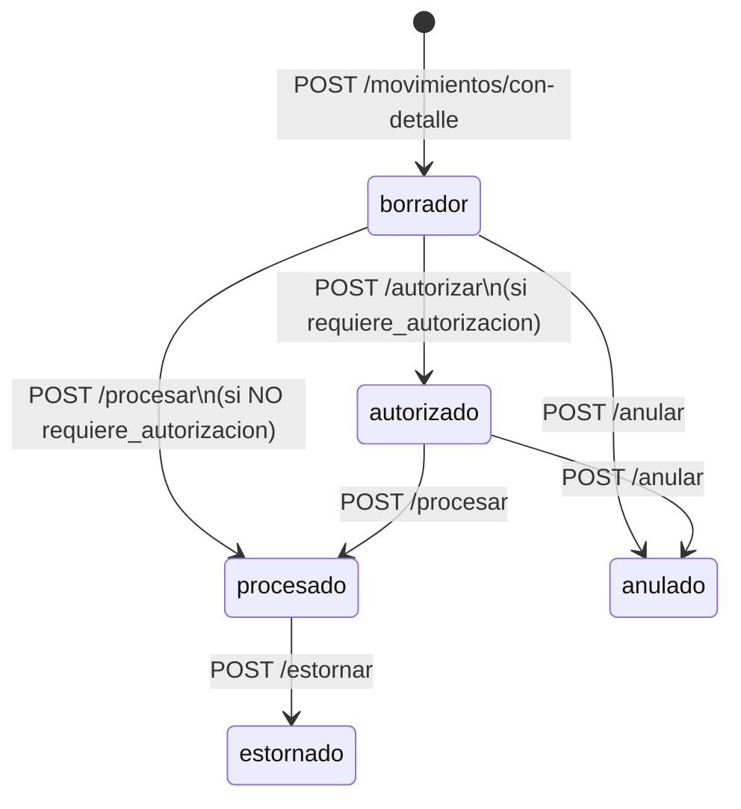
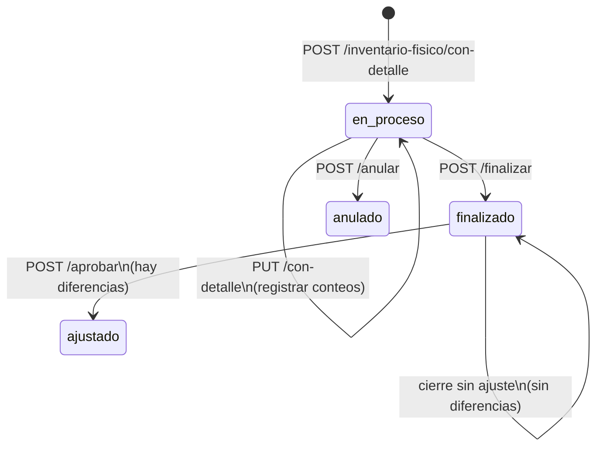

# INV — Contrato de consumo Frontend (RC1)

**Documento:** Puente oficial Backend → Frontend  
**Versión:** RC1 · 2026-06-12  
**Módulo:** Inventarios (`INV`)  
**Prefijo API:** `/api/v1/inv`  
**Fuente de verdad:** OpenAPI (`/api/v1/openapi.json` o `/docs`)

Este documento es **autocontenido**. El equipo Frontend no necesita consultar auditorías internas, planes P0 ni código de servicios del Backend para integrar INV RC1.

---

## Reglas obligatorias para Frontend

Antes de implementar cualquier pantalla INV, el Frontend debe cumplir estas reglas sin excepción:

1. **Consumir únicamente rutas canónicas** para desarrollo nuevo (ver §2). OpenAPI marca la ruta correcta; ante duda, preferir patrones `/con-detalle` y `/movimientos/{id}/…` para proceso.
2. **No utilizar rutas deprecated** (`deprecated: true` en OpenAPI). No generar clientes ni hooks contra ellas en código nuevo.
3. **No utilizar rutas legacy** para desarrollo nuevo (§3). Existen por compatibilidad; el Frontend RC1 debe ignorarlas.
4. **No realizar escritura directa sobre stock.** La tabla `inv_stock` es derivada; la mutación ocurre solo al **procesar** un movimiento. POST/PUT `/stock` están deprecated y pueden responder **409**.
5. **Respetar workflow y RBAC lifecycle.** Los estados no se editan por PUT; las transiciones solo vía endpoints de proceso (`/procesar`, `/autorizar`, `/anular`, `/estornar`, `/finalizar`, `/aprobar`). Cada botón de acción exige su permiso granular (§8).
6. **Sesión ERP obligatoria.** Todos los endpoints INV requieren JWT con sesión ERP activa y `empresa_id` seleccionada. `cliente_id` nunca se envía para autorización.
7. **`empresa_id` en escritura** debe coincidir con la empresa activa en sesión. Cross-empresa responde **404**, no 403.
8. **OpenAPI prevalece** ante cualquier discrepancia textual en este documento.

---

## §1 — Estado del módulo (RC1 Ready)

| Atributo | Valor |
|----------|-------|
| **Estado** | **RC1 Ready** — Backend INV cerrado para consumo Frontend |
| **Alcance API** | `/api/v1/inv/*` (excluye `inv-bill`) |
| **Prerequisito** | `require_erp_session` en router padre INV |
| **Identificadores** | UUID v4 en paths y bodies |
| **Gate Backend** | Suite unitaria verde (baseline + BC-31 rutas proceso) |

### Contrato canónico por tipo de entidad

| Tipo | Entidades | Write Frontend | Read Frontend |
|------|-----------|----------------|---------------|
| **Maestro** | Categoría, UM, Producto, Almacén, Tipo movimiento | POST, PUT, DELETE (soft), POST `reactivar` | GET list, GET detail |
| **Derivada** | Stock | **Prohibido** | GET list, detail, lookup, alertas |
| **Transaccional** | Movimiento | POST/PUT `/con-detalle` + POST proceso | GET `/con-detalle` |
| **Transaccional** | Inventario físico | POST/PUT `/con-detalle` + POST `finalizar`/`anular`/`aprobar` | GET `/con-detalle` |
| **Analítica** | Kardex | — | GET |

### Reglas transversales de integración

- **Autorización:** `cliente_id` solo desde sesión JWT; prohibido en body/query para autorizar.
- **Scope empresa:** `empresa_id` en body de Create/Update; validado contra sesión.
- **Cabecera-detalle:** escritura transaccional siempre con `detalles[]` embebidos en `/con-detalle`.
- **Campos de proceso:** ignorados en CREATE y rechazados en UPDATE (§5 y §6). No incluirlos en formularios editables.
- **Moneda:** preferir `moneda_id` (UUID). El campo `moneda` (string, ej. `"PEN"`) es legacy.

---

## §2 — Endpoints canónicos

Base: `/api/v1/inv`. Todas las rutas requieren sesión ERP.

### 2.1 Categorías

| Método | Ruta | Permiso | Request | Response |
|--------|------|---------|---------|----------|
| GET | `/categorias` | `inv.categoria.leer` | Query: `solo_activos` | `list[CategoriaRead]` |
| GET | `/categorias/{categoria_id}` | `inv.categoria.leer` | — | `CategoriaRead` |
| POST | `/categorias` | `inv.categoria.crear` | `CategoriaCreate` | `CategoriaRead` |
| PUT | `/categorias/{categoria_id}` | `inv.categoria.actualizar` | `CategoriaUpdate` | `CategoriaRead` |
| DELETE | `/categorias/{categoria_id}` | `inv.categoria.eliminar` | — | 204 |
| POST | `/categorias/{categoria_id}/reactivar` | `inv.categoria.actualizar` | — | `CategoriaRead` |

### 2.2 Unidades de medida

| Método | Ruta | Permiso | Request | Response |
|--------|------|---------|---------|----------|
| GET | `/unidades-medida` | `inv.unidad_medida.leer` | Query: `solo_activos` | `list[UnidadMedidaRead]` |
| GET | `/unidades-medida/{unidad_medida_id}` | `inv.unidad_medida.leer` | — | `UnidadMedidaRead` |
| POST | `/unidades-medida` | `inv.unidad_medida.crear` | `UnidadMedidaCreate` | `UnidadMedidaRead` |
| PUT | `/unidades-medida/{unidad_medida_id}` | `inv.unidad_medida.actualizar` | `UnidadMedidaUpdate` | `UnidadMedidaRead` |
| DELETE | `/unidades-medida/{unidad_medida_id}` | `inv.unidad_medida.eliminar` | — | 204 |
| POST | `/unidades-medida/{unidad_medida_id}/reactivar` | `inv.unidad_medida.actualizar` | — | `UnidadMedidaRead` |

### 2.3 Productos

| Método | Ruta | Permiso | Request | Response |
|--------|------|---------|---------|----------|
| GET | `/productos` | `inv.producto.leer` | Query: filtros | `list[ProductoRead]` |
| GET | `/productos/{producto_id}` | `inv.producto.leer` | — | `ProductoRead` |
| POST | `/productos` | `inv.producto.crear` | `ProductoCreate` | `ProductoRead` |
| PUT | `/productos/{producto_id}` | `inv.producto.actualizar` | `ProductoUpdate` | `ProductoRead` |
| DELETE | `/productos/{producto_id}` | `inv.producto.eliminar` | — | 204 |
| POST | `/productos/{producto_id}/reactivar` | `inv.producto.actualizar` | — | `ProductoRead` |

### 2.4 Almacenes

| Método | Ruta | Permiso | Request | Response |
|--------|------|---------|---------|----------|
| GET | `/almacenes` | `inv.almacen.leer` | Query: filtros | `list[AlmacenRead]` |
| GET | `/almacenes/{almacen_id}` | `inv.almacen.leer` | — | `AlmacenRead` |
| POST | `/almacenes` | `inv.almacen.crear` | `AlmacenCreate` | `AlmacenRead` |
| PUT | `/almacenes/{almacen_id}` | `inv.almacen.actualizar` | `AlmacenUpdate` | `AlmacenRead` |
| DELETE | `/almacenes/{almacen_id}` | `inv.almacen.eliminar` | — | 204 |
| POST | `/almacenes/{almacen_id}/reactivar` | `inv.almacen.actualizar` | — | `AlmacenRead` |

### 2.5 Tipos de movimiento

| Método | Ruta | Permiso | Request | Response |
|--------|------|---------|---------|----------|
| GET | `/tipos-movimiento` | `inv.tipo_movimiento.leer` | Query: `solo_activos` | `list[TipoMovimientoRead]` |
| GET | `/tipos-movimiento/{tipo_movimiento_id}` | `inv.tipo_movimiento.leer` | — | `TipoMovimientoRead` |
| POST | `/tipos-movimiento` | `inv.tipo_movimiento.crear` | `TipoMovimientoCreate` | `TipoMovimientoRead` |
| PUT | `/tipos-movimiento/{tipo_movimiento_id}` | `inv.tipo_movimiento.actualizar` | `TipoMovimientoUpdate` | `TipoMovimientoRead` |
| DELETE | `/tipos-movimiento/{tipo_movimiento_id}` | `inv.tipo_movimiento.eliminar` | — | 204 |
| POST | `/tipos-movimiento/{tipo_movimiento_id}/reactivar` | `inv.tipo_movimiento.actualizar` | — | `TipoMovimientoRead` |

### 2.6 Stock (solo lectura)

| Método | Ruta | Permiso | Request | Response |
|--------|------|---------|---------|----------|
| GET | `/stock` | `inv.stock.leer` | Query: `producto_id`, `almacen_id` | `list[StockRead]` |
| GET | `/stock/{stock_id}` | `inv.stock.leer` | — | `StockRead` |
| GET | `/stock/producto/{producto_id}/almacen/{almacen_id}` | `inv.stock.leer` | — | `StockRead` o `null` |
| GET | `/stock/alertas` | `inv.stock.leer` | Query: `almacen_id` | `list[StockRead]` |

### 2.7 Movimientos (transaccional — canónico)

| Método | Ruta | Permiso | Request | Response |
|--------|------|---------|---------|----------|
| GET | `/movimientos` | `inv.movimiento.leer` | Query: filtros | `list[MovimientoRead]` |
| GET | `/movimientos/{movimiento_id}` | `inv.movimiento.leer` | — | `MovimientoRead` |
| GET | `/movimientos/{movimiento_id}/con-detalle` | `inv.movimiento.leer` | — | `MovimientoConDetalleRead` |
| POST | `/movimientos/con-detalle` | `inv.movimiento.crear` | `MovimientoConDetalleCreate` | `MovimientoConDetalleRead` |
| PUT | `/movimientos/{movimiento_id}/con-detalle` | `inv.movimiento.actualizar` | `MovimientoConDetalleUpdate` | `MovimientoConDetalleRead` |
| POST | `/movimientos/{movimiento_id}/procesar` | `inv.movimiento.procesar` | — | `MovimientoRead` |
| POST | `/movimientos/{movimiento_id}/autorizar` | `inv.movimiento.autorizar` | — | `MovimientoRead` |
| POST | `/movimientos/{movimiento_id}/anular` | `inv.movimiento.anular` | `MotivoAnulacion` | `MovimientoRead` |
| POST | `/movimientos/{movimiento_id}/estornar` | `inv.movimiento.estornar` | `MotivoEstorno` | `MovimientoRead` |

**Notas UI:**

- Create exige `detalles` con **mínimo 1 línea**.
- Update en PUT `/con-detalle`: si se envía `detalles`, reemplaza **todas** las líneas (replace-all).
- `MotivoAnulacion` / `MotivoEstorno`: body opcional `{ "motivo": "texto" }`.

### 2.8 Inventario físico (transaccional — canónico)

| Método | Ruta | Permiso | Request | Response |
|--------|------|---------|---------|----------|
| GET | `/inventario-fisico` | `inv.inventario_fisico.leer` | Query: filtros | `list[InventarioFisicoRead]` |
| GET | `/inventario-fisico/{inventario_fisico_id}` | `inv.inventario_fisico.leer` | — | `InventarioFisicoRead` |
| GET | `/inventario-fisico/{inventario_fisico_id}/con-detalle` | `inv.inventario_fisico.leer` | — | `InventarioFisicoConDetalleRead` |
| POST | `/inventario-fisico/con-detalle` | `inv.inventario_fisico.crear` | `InventarioFisicoConDetalleCreate` | `InventarioFisicoConDetalleRead` |
| PUT | `/inventario-fisico/{inventario_fisico_id}/con-detalle` | `inv.inventario_fisico.actualizar` | `InventarioFisicoConDetalleUpdate` | `InventarioFisicoConDetalleRead` |
| POST | `/inventario-fisico/{inventario_fisico_id}/finalizar` | `inv.inventario_fisico.finalizar` | — | `InventarioFisicoRead` |
| POST | `/inventario-fisico/{inventario_fisico_id}/anular` | `inv.inventario_fisico.anular` | — | `InventarioFisicoRead` |
| POST | `/inventario-fisico/{inventario_fisico_id}/aprobar` | `inv.inventario_fisico.aprobar` | `AprobarInventarioFisicoRequest` | `InventarioFisicoRead` |

**Notas UI:**

- Create: `detalles` opcional al crear; se pueden agregar líneas en PUT posteriores.
- `AprobarInventarioFisicoRequest`: `{ "tipo_movimiento_id": UUID, "observaciones": "opcional" }`. El tipo debe ser de clase `ajuste`.

### 2.9 Kardex (analítica — solo lectura)

| Método | Ruta | Permiso | Request | Response |
|--------|------|---------|---------|----------|
| GET | `/kardex` | `inv.movimiento.leer` | Query: `producto_id`, `almacen_id`, `fecha_desde`, `fecha_hasta` | `list[KardexLineaRead]` |

### 2.10 Lectura auxiliar de detalle (opcional)

GET de líneas individuales — válidos para consulta, no para escritura:

| Método | Ruta | Permiso | Response |
|--------|------|---------|----------|
| GET | `/movimientos-detalle` | `inv.movimiento.leer` | `list[MovimientoDetalleRead]` |
| GET | `/movimientos-detalle/{movimiento_detalle_id}` | `inv.movimiento.leer` | `MovimientoDetalleRead` |
| GET | `/inventario-fisico-detalle` | `inv.inventario_fisico.leer` | `list[InventarioFisicoDetalleRead]` |
| GET | `/inventario-fisico-detalle/{inventario_fisico_detalle_id}` | `inv.inventario_fisico.leer` | `InventarioFisicoDetalleRead` |

Preferir siempre GET `/con-detalle` para pantallas de detalle transaccional.

---

## §3 — Endpoints legacy

Rutas **activas** en OpenAPI pero **no recomendadas** para código Frontend nuevo.

| Método | Ruta legacy | Motivo | Usar en su lugar |
|--------|-------------|--------|------------------|
| POST | `/movimientos` | Cabecera sin detalle | `POST /movimientos/con-detalle` |
| PUT | `/movimientos/{movimiento_id}` | Cabecera sin detalle | `PUT /movimientos/{movimiento_id}/con-detalle` |
| POST | `/inventario-fisico` | Cabecera sin detalle | `POST /inventario-fisico/con-detalle` |
| PUT | `/inventario-fisico/{inventario_fisico_id}` | Cabecera sin detalle | `PUT /inventario-fisico/{inventario_fisico_id}/con-detalle` |
| POST | `/inv/{movimiento_id}/procesar` | Montaje histórico sin prefijo recurso | `POST /movimientos/{movimiento_id}/procesar` |
| POST | `/inv/{movimiento_id}/autorizar` | Ídem | `POST /movimientos/{movimiento_id}/autorizar` |
| POST | `/inv/{movimiento_id}/anular` | Ídem | `POST /movimientos/{movimiento_id}/anular` |
| POST | `/inv/{movimiento_id}/estornar` | Ídem | `POST /movimientos/{movimiento_id}/estornar` |

> Las rutas legacy de proceso equivalen funcionalmente a las canónicas (mismo handler, distinto path). El Frontend RC1 debe implementar **solo** las canónicas bajo `/movimientos/{id}/…`.

---

## §4 — Endpoints deprecated

Marcados `deprecated: true` en OpenAPI. **No implementar en Frontend nuevo.**

| Método | Ruta | Reemplazo canónico |
|--------|------|-------------------|
| POST | `/movimientos-detalle` | `POST /movimientos/con-detalle` |
| PUT | `/movimientos-detalle/{movimiento_detalle_id}` | `PUT /movimientos/{movimiento_id}/con-detalle` |
| POST | `/inventario-fisico-detalle` | `POST /inventario-fisico/con-detalle` |
| PUT | `/inventario-fisico-detalle/{inventario_fisico_detalle_id}` | `PUT /inventario-fisico/{inventario_fisico_id}/con-detalle` |
| POST | `/stock` | Crear movimiento + `POST /movimientos/{id}/procesar` |
| PUT | `/stock/{stock_id}` | Ídem |

Los GET de detalle standalone **no** están deprecated.

---

## §5 — Workflow de movimientos

### 5.1 Estados

| Estado | Descripción | ¿Terminal? |
|--------|-------------|------------|
| `borrador` | Documento editable, sin impacto en stock | No |
| `autorizado` | Aprobado para procesar (cuando aplica) | No |
| `procesado` | Impacto aplicado en stock | **Sí** |
| `anulado` | Cancelado antes del efecto en stock | **Sí** |
| `estornado` | Documento original revertido después de procesado | **Sí** |

El estado `estornado` aplica al **movimiento original**. La reversión genera un movimiento compensatorio vinculado (visible en referencias del documento); el Frontend muestra el original como terminal `estornado` y no ofrece más acciones sobre él.

### 5.2 Diagrama de transiciones



### 5.3 Semántica anulación vs estorno

| Acción | Cuándo | Efecto en stock |
|--------|--------|-----------------|
| **Anular** | Estados `borrador` o `autorizado` | Ninguno (nunca se procesó) |
| **Estornar** | Solo estado `procesado` | Revierte el efecto mediante compensatorio |

### 5.4 Campos no editables por API

No enviar en CREATE (se ignoran) ni en UPDATE (responden error):

`estado`, `autorizado_por_usuario_id`, `fecha_autorizacion`, `usuario_procesado_id`, `fecha_procesado`, `motivo_anulacion`

### 5.5 Matriz de botones por estado

Condiciones: permiso RBAC correspondiente (§8) **y** estado válido. Si no se cumple, **ocultar** el botón.

| Botón | `borrador` | `autorizado` | `procesado` | `anulado` | `estornado` |
|-------|:----------:|:------------:|:-----------:|:---------:|:-----------:|
| **Editar** (PUT `/con-detalle`) | ✅ | ❌ | ❌ | ❌ | ❌ |
| **Autorizar** | ✅¹ | ❌² | ❌ | ❌ | ❌ |
| **Procesar** | ✅³ | ✅ | ❌² | ❌ | ❌ |
| **Anular** | ✅ | ✅ | ❌ | ❌² | ❌ |
| **Estornar** | ❌ | ❌ | ✅⁴ | ❌ | ❌ |

**Notas:**

1. **Autorizar** — solo si `requiere_autorizacion === true` (del movimiento o del tipo de movimiento seleccionado).
2. **Idempotencia** — reintentar Autorizar/Procesar/Anular sobre estado ya alcanzado devuelve el registro actual (sin error), salvo inconsistencias de datos.
3. **Procesar en borrador** — solo si `requiere_autorizacion === false`. Si requiere autorización, debe pasar primero por `autorizado`.
4. **Estornar** — condiciones adicionales (§5.6).

### 5.6 Criterios de visualización — botón Estornar

Mostrar **Estornar** solo cuando se cumplen **todas** las condiciones:

| # | Condición |
|---|-----------|
| 1 | `estado === "procesado"` |
| 2 | Permiso `inv.movimiento.estornar` |
| 3 | `documento_referencia_tipo` **no** es `inventario_fisico` ni `recepcion` |
| 4 | El movimiento no está ya en `estornado` |

Si el botón se muestra pero la operación falla por regla de negocio (ej. stock insuficiente para revertir una entrada), mostrar el `detail` / `error_code` de la respuesta (§9).

**Movimientos originados por inventario físico** (`documento_referencia_tipo: "inventario_fisico"`) no son estornables en RC1. Ocultar Estornar en esos casos.

---

## §6 — Workflow de inventario físico

### 6.1 Estados

| Estado | Descripción | ¿Terminal? |
|--------|-------------|------------|
| `en_proceso` | Conteo abierto, líneas editables | No |
| `finalizado` | Conteo cerrado; puede aprobarse o quedar sin ajuste | No |
| `ajustado` | Ajuste de stock aplicado vía movimiento | **Sí** |
| `anulado` | Cancelado sin ajuste | **Sí** |

### 6.2 Diagrama de transiciones



### 6.3 Regla de conteo

| Valor `cantidad_contada` | Significado UI |
|--------------------------|----------------|
| `null` | Línea **pendiente** de conteo |
| `0` | Conteo válido (cero unidades) |
| `> 0` | Conteo válido |

**Finalizar** exige que **todas** las líneas tengan `cantidad_contada` informada (no `null`).

### 6.4 Campos no editables por API

No enviar en CREATE (se ignoran) ni en UPDATE (error):

`estado`, `movimiento_ajuste_id`, `fecha_finalizacion`, `fecha_ajuste`, `total_productos_contados`, `total_diferencias`, `valor_diferencias`

### 6.5 Matriz de botones por estado

| Botón | `en_proceso` | `finalizado` | `ajustado` | `anulado` |
|-------|:------------:|:------------:|:----------:|:---------:|
| **Editar** (PUT `/con-detalle`) | ✅ | ❌ | ❌ | ❌ |
| **Finalizar** | ✅¹ | ❌ | ❌ | ❌ |
| **Anular** | ✅ | ✅² | ❌ | ❌² |
| **Aprobar** | ❌ | ✅³ | ❌ | ❌ |

1. **Finalizar** — solo si todas las líneas tienen `cantidad_contada !== null`.
2. **Anular** — no permitido si ya está `ajustado`. Idempotente si ya está `anulado`.
3. **Aprobar** — ver criterios §6.6.

### 6.6 Criterios de visualización — botón Aprobar

#### Mostrar Aprobar cuando:

| # | Condición |
|---|-----------|
| 1 | `estado === "finalizado"` |
| 2 | Permiso `inv.inventario_fisico.aprobar` |
| 3 | Existe **al menos una línea** con diferencia distinta de cero |

**Cálculo de diferencia en Frontend** (equivalente al Backend):

```
diferencia = cantidad_contada - cantidad_sistema
```

(o usar el campo `diferencia` de `InventarioFisicoDetalleRead` si está presente en la respuesta).

Solo considerar líneas donde `cantidad_contada !== null`.

#### Ocultar Aprobar cuando:

| Situación | Motivo |
|-----------|--------|
| `en_proceso` | Debe finalizarse el conteo primero |
| `ajustado` | Terminal — ajuste ya aplicado |
| `anulado` | Terminal — documento cancelado |
| `finalizado` **sin diferencias** | No hay ajuste de stock que aplicar; el inventario queda cerrado en `finalizado` |

#### Flujo UI recomendado — cierre sin ajuste

Si tras **Finalizar** todas las líneas coinciden con el sistema (`diferencia === 0` en todas):

- **No** mostrar botón Aprobar.
- Mostrar mensaje de cierre: conteo finalizado sin ajuste de stock.
- El estado permanece `finalizado`.

#### Flujo UI recomendado — cierre con ajuste

Si tras **Finalizar** hay al menos una línea con `diferencia !== 0`:

- Mostrar botón **Aprobar**.
- Al aprobar, el usuario selecciona `tipo_movimiento_id` de clase `ajuste`.
- Tras éxito, estado pasa a `ajustado` y `movimiento_ajuste_id` queda poblado en la respuesta.

---

## §7 — Estados terminales

### Movimientos

| Estado terminal | Edición | Transiciones permitidas |
|-----------------|---------|-------------------------|
| `procesado` | ❌ | Solo `estornar` (si aplica §5.6) |
| `anulado` | ❌ | Ninguna |
| `estornado` | ❌ | Ninguna |

### Inventario físico

| Estado terminal | Edición | Transiciones permitidas |
|-----------------|---------|-------------------------|
| `ajustado` | ❌ | Ninguna |
| `anulado` | ❌ | Ninguna |

> `finalizado` **no** es terminal: puede transicionar a `ajustado` o permanecer cerrado sin ajuste.

### Stock

Sin workflow. Solo lectura. Mutación indirecta vía movimiento procesado.

---

## §8 — Permisos RBAC lifecycle

Formato: `inv.{recurso}.{accion}`

### 8.1 CRUD base

| Recurso | Permisos |
|---------|----------|
| `categoria` | `leer`, `crear`, `actualizar`, `eliminar` |
| `unidad_medida` | `leer`, `crear`, `actualizar`, `eliminar` |
| `producto` | `leer`, `crear`, `actualizar`, `eliminar` |
| `almacen` | `leer`, `crear`, `actualizar`, `eliminar` |
| `tipo_movimiento` | `leer`, `crear`, `actualizar`, `eliminar` |
| `movimiento` | `leer`, `crear`, `actualizar` |
| `inventario_fisico` | `leer`, `crear`, `actualizar` |
| `stock` | `leer` |

`eliminar` en maestros es soft delete (`es_activo = 0`). `reactivar` usa permiso `actualizar`.

### 8.2 Permisos lifecycle (obligatorios para botones de proceso)

| Permiso | Acción UI | Endpoint |
|---------|-----------|----------|
| `inv.movimiento.autorizar` | Autorizar | `POST /movimientos/{id}/autorizar` |
| `inv.movimiento.procesar` | Procesar | `POST /movimientos/{id}/procesar` |
| `inv.movimiento.anular` | Anular | `POST /movimientos/{id}/anular` |
| `inv.movimiento.estornar` | Estornar | `POST /movimientos/{id}/estornar` |
| `inv.inventario_fisico.finalizar` | Finalizar conteo | `POST /inventario-fisico/{id}/finalizar` |
| `inv.inventario_fisico.aprobar` | Aprobar ajuste | `POST /inventario-fisico/{id}/aprobar` |
| `inv.inventario_fisico.anular` | Anular inventario | `POST /inventario-fisico/{id}/anular` |

### 8.3 Patrón UI

- Obtener permisos del usuario desde el token/sesión o endpoint de perfil.
- Ocultar o deshabilitar botones sin permiso.
- No confiar solo en ocultar: el Backend responde **403** si se invoca sin permiso.

---

## §9 — Errores funcionales relevantes para UI

### 9.1 Formato de respuesta

| Origen | Shape JSON | Uso Frontend |
|--------|------------|--------------|
| Excepciones de negocio (`ConflictError`, `NotFoundError`, etc.) | `{ "detail": "…", "error_code": "…" }` | Mapear por `error_code` cuando exista |
| `HTTPException` en endpoints de proceso | `{ "detail": "…" }` | Mostrar `detail` textual |
| Validación Pydantic | `{ "detail": [ … ] }` (422) | Errores de formulario por campo |

### 9.2 Errores transversales

| HTTP | `error_code` / contexto | Acción UI |
|------|-------------------------|-----------|
| 401 | Sesión inválida | Redirigir a login |
| 403 | `PERMISSION_DENIED` | Mensaje acceso denegado |
| 404 | `NOT_FOUND` | Registro inexistente o cross-empresa → volver al listado |
| 422 | Validación de schema | Resaltar campos inválidos |

### 9.3 Errores INV — movimientos

| HTTP | Mensaje / `error_code` | Acción UI |
|------|------------------------|-----------|
| 409 | No se puede editar un movimiento que no esté en estado `borrador` | Deshabilitar edición |
| 409 | El campo `estado` no es editable… | Quitar campo del payload |
| 409 | No se puede procesar un movimiento anulado / estornado | Ocultar Procesar |
| 409 | Movimiento requiere autorización previa | Mostrar Autorizar antes de Procesar |
| 409 | No se puede anular un movimiento procesado… | Ofrecer Estornar en su lugar |
| 409 | `MOVIMIENTO_YA_ESTORNADO` | Estado terminal — sin reintento |
| 409 | `ESTORNO_INTEGRACION_NO_MVP` | Ocultar Estornar; mensaje: no disponible para mov. de inventario físico/recepción |
| 409 | `ESTORNO_ENTRADA_PPM_QNEW_CERO` | Mensaje: ajuste manual requerido antes de estornar |
| 409 | `ESTORNO_NO_PROCESADO` | Solo estornar en `procesado` |
| 422 | No se puede procesar un movimiento sin detalle | Validar al menos 1 línea |

### 9.4 Errores INV — inventario físico

| HTTP | Mensaje / contexto | Acción UI |
|------|-------------------|-----------|
| 409 | No se puede editar un inventario físico en estado `ajustado` / `anulado` | Deshabilitar edición |
| 409 | No se puede anular un inventario físico ajustado | Ocultar Anular |
| 409 | No se puede aprobar inventario físico en estado `…` | Verificar flujo previo |
| 422 | No se puede finalizar: N línea(s) pendiente(s) de conteo | Resaltar líneas sin `cantidad_contada` |
| 422 | No se puede finalizar inventario físico sin detalle | Agregar líneas |
| 422 | Debe finalizar el conteo antes de aprobar | Forzar Finalizar primero |
| 422 | No existen diferencias de inventario para aprobar | Ocultar Aprobar (§6.6) |
| 422 | `tipo_movimiento_id` debe ser de clase `ajuste` | Filtrar selector de tipos |

### 9.5 Errores INV — stock

| HTTP | `error_code` | Acción UI |
|------|--------------|-----------|
| 409 | `STOCK_DERIVED_WRITE_FORBIDDEN` | No usar POST/PUT `/stock`; crear movimiento y procesar |

---

## §10 — Checklist oficial para Frontend

Checklist de integración INV RC1. Marcar cada ítem antes de considerar la pantalla lista.

### Infraestructura

- [ ] Cliente HTTP configurado con base `/api/v1/inv`
- [ ] Sesión ERP activa con `empresa_id` seleccionada en todas las llamadas INV
- [ ] OpenAPI importado o cliente generado desde spec actual del Backend RC1
- [ ] Manejo unificado de `{ detail, error_code }` y 422 de validación

### Contratos

- [ ] Escritura transaccional solo vía `/con-detalle` (movimientos e inventario físico)
- [ ] Proceso de movimiento solo vía `/movimientos/{id}/procesar|autorizar|anular|estornar`
- [ ] Sin consumo de endpoints `deprecated` en código nuevo
- [ ] Sin uso de rutas legacy en código nuevo
- [ ] Sin POST/PUT directo a `/stock`

### Formularios y workflow

- [ ] Formularios sin campos de workflow editables (§5.4, §6.4)
- [ ] Movimientos: matriz de botones por estado implementada (§5.5), incluyendo `estornado` (§5.1)
- [ ] Movimientos: Estornar con criterios §5.6 (oculto para `inventario_fisico` / `recepcion`)
- [ ] Inventario físico: Finalizar valida líneas pendientes (`cantidad_contada === null`)
- [ ] Inventario físico: Aprobar visible solo según §6.6
- [ ] Botones condicionados por permiso RBAC lifecycle (§8.2)

### Pantallas (Anexo A)

- [ ] Categorías
- [ ] Unidades de medida
- [ ] Productos
- [ ] Almacenes
- [ ] Tipos de movimiento
- [ ] Movimientos de inventario
- [ ] Inventario físico
- [ ] Consulta de stock
- [ ] Alertas de stock
- [ ] Kardex

### Calidad

- [ ] Smoke test por pantalla contra Backend RC1
- [ ] Manejo 409 en estados terminales (mensaje claro, sin reintento ciego)
- [ ] Listados filtrados por empresa de sesión (sin selector de empresa en UI salvo cambio de sesión)

**Criterio de cierre Frontend INV:** checklist completo + cero uso de rutas deprecated/legacy en código nuevo.

---

## Anexo A — Mapa pantalla → endpoint canónico

Rutas de menú Frontend (seed SaaS) y endpoints API canónicos asociados.

| Pantalla | Ruta UI (menú) | Operaciones API canónicas |
|----------|----------------|---------------------------|
| **Categorías** | `/inv/categorias` | `GET/POST /categorias`; `GET/PUT/DELETE /categorias/{id}`; `POST /categorias/{id}/reactivar` |
| **Unidades de medida** | `/inv/unidades-medida` | `GET/POST /unidades-medida`; `GET/PUT/DELETE /unidades-medida/{id}`; `POST …/reactivar` |
| **Productos** | `/inv/productos` | `GET/POST /productos`; `GET/PUT/DELETE /productos/{id}`; `POST …/reactivar` |
| **Almacenes** | `/inv/almacenes` | `GET/POST /almacenes`; `GET/PUT/DELETE /almacenes/{id}`; `POST …/reactivar` |
| **Tipos de movimiento** | `/inv/tipos-movimiento` | `GET/POST /tipos-movimiento`; `GET/PUT/DELETE /tipos-movimiento/{id}`; `POST …/reactivar` |
| **Movimientos de inventario** | `/inv/movimientos` | `GET /movimientos`; `GET/POST /movimientos/con-detalle`; `GET/PUT /movimientos/{id}/con-detalle`; `POST /movimientos/{id}/procesar\|autorizar\|anular\|estornar` |
| **Inventario físico** | `/inv/inventario-fisico` | `GET /inventario-fisico`; `GET/POST /inventario-fisico/con-detalle`; `GET/PUT /inventario-fisico/{id}/con-detalle`; `POST …/finalizar\|anular\|aprobar` |
| **Consulta de stock** | `/inv/stock` | `GET /stock`; `GET /stock/{id}`; `GET /stock/producto/{producto_id}/almacen/{almacen_id}` |
| **Alertas de stock** | `/inv/stock` (tab/vista alertas) o ruta dedicada | `GET /stock/alertas` (Query: `almacen_id` opcional) |
| **Kardex** | `/inv/kardex` | `GET /kardex` (Query: `producto_id`, `almacen_id`, `fecha_desde`, `fecha_hasta`) |

### Dependencias entre maestros (orden sugerido de implementación)

1. Categorías, Unidades de medida (sin dependencias INV)
2. Almacenes (puede referenciar sucursal ORG)
3. Productos (requiere categoría + UM)
4. Tipos de movimiento
5. Movimientos (requiere producto, almacén, tipo movimiento)
6. Inventario físico (requiere almacén, productos)
7. Stock, Alertas, Kardex (consulta; requiere movimientos procesados para datos significativos)

---

## Anexo B — Schemas principales (escritura y lectura)

Nombres exactos del contrato OpenAPI. Campos listados son los relevantes para formularios Frontend.

### B.1 Proceso (auxiliares)

| Schema | Campos write | Uso |
|--------|--------------|-----|
| `MotivoAnulacion` | `motivo?` (string, max 500) | Body `POST …/anular` movimiento |
| `MotivoEstorno` | `motivo?` (string, max 500) | Body `POST …/estornar` movimiento |
| `AprobarInventarioFisicoRequest` | `tipo_movimiento_id` (UUID, requerido), `observaciones?` | Body `POST …/aprobar` |

### B.2 Movimiento — escritura canónica

**`MovimientoConDetalleCreate`** — hereda cabecera + `detalles` (min 1):

| Campo cabecera | Tipo | Requerido | Notas UI |
|----------------|------|-----------|----------|
| `empresa_id` | UUID | Sí | Debe coincidir con sesión |
| `numero_movimiento` | string | Sí | max 20 |
| `tipo_movimiento_id` | UUID | Sí | Determina clase y si requiere autorización |
| `fecha_contable` | date | Sí | |
| `fecha_movimiento` | datetime | No | |
| `almacen_origen_id` | UUID | No | Según clase del tipo |
| `almacen_destino_id` | UUID | No | Según clase del tipo |
| `moneda_id` | UUID | No | Preferido sobre `moneda` |
| `requiere_autorizacion` | bool | No | Default false |
| `observaciones` | string | No | |
| `detalles` | array | Sí (min 1) | Ver línea embebida |

**`MovimientoDetalleCreateEmbebido`** (cada línea):

| Campo | Tipo | Requerido |
|-------|------|-----------|
| `producto_id` | UUID | Sí |
| `cantidad` | decimal | Sí (> 0) |
| `unidad_medida_id` | UUID | Sí |
| `cantidad_base` | decimal | Sí (> 0) |
| `costo_unitario` | decimal | No (≥ 0) |
| `lote`, `numero_serie`, `ubicacion_almacen`, `observaciones` | varios | No |

**`MovimientoConDetalleUpdate`** — campos cabecera opcionales + `detalles?` (replace-all si se envía).

### B.3 Movimiento — lectura

**`MovimientoRead`** / **`MovimientoConDetalleRead`**:

| Campo | Uso UI |
|-------|--------|
| `movimiento_id`, `numero_movimiento` | Identificación |
| `estado` | Badge y matriz de botones (§5.5) |
| `requiere_autorizacion` | Mostrar Autorizar |
| `documento_referencia_tipo` | Ocultar Estornar si `inventario_fisico` o `recepcion` |
| `fecha_procesado`, `usuario_procesado_id` | Auditoría visual |
| `motivo_anulacion` | Solo lectura si anulado |
| `detalles[]` | Grilla de líneas (`MovimientoDetalleRead`) |

**`MovimientoDetalleRead`** — incluye `costo_total` calculado.

### B.4 Inventario físico — escritura canónica

**`InventarioFisicoConDetalleCreate`**:

| Campo cabecera | Tipo | Requerido | Notas UI |
|----------------|------|-----------|----------|
| `empresa_id` | UUID | Sí | Sesión |
| `numero_inventario` | string | Sí | max 20 |
| `fecha_inventario` | date | Sí | |
| `almacen_id` | UUID | Sí | |
| `tipo_inventario` | string | Sí | `total`, `ciclico`, `selectivo` |
| `descripcion`, `observaciones` | string | No | |
| `detalles` | array | No | Líneas opcionales al crear |

**`InventarioFisicoDetalleCreateEmbebido`** (cada línea):

| Campo | Tipo | Requerido | Notas UI |
|-------|------|-----------|----------|
| `producto_id` | UUID | Sí | |
| `cantidad_sistema` | decimal | Sí (≥ 0) | Stock teórico al abrir línea |
| `cantidad_contada` | decimal | No | `null` = pendiente; `0` = válido |
| `costo_unitario` | decimal | No | Para valorizar diferencias |
| `observaciones`, `motivo_diferencia` | string | No | |

**`InventarioFisicoConDetalleUpdate`** — cabecera opcional + `detalles?` (replace-all).

### B.5 Inventario físico — lectura

**`InventarioFisicoRead`** / **`InventarioFisicoConDetalleRead`**:

| Campo | Uso UI |
|-------|--------|
| `inventario_fisico_id`, `numero_inventario` | Identificación |
| `estado` | Badge y matriz de botones (§6.5) |
| `movimiento_ajuste_id` | Enlace al movimiento generado tras Aprobar |
| `total_diferencias`, `valor_diferencias` | Resumen (solo lectura) |
| `fecha_finalizacion`, `fecha_ajuste` | Auditoría visual |
| `detalles[]` | Grilla de conteo |

**`InventarioFisicoDetalleRead`** — incluye `diferencia` y `valor_diferencia` calculados.

### B.6 Stock — solo lectura

**`StockRead`**:

| Campo | Uso UI |
|-------|--------|
| `producto_id`, `almacen_id` | Coordenadas |
| `cantidad_actual`, `cantidad_disponible`, `cantidad_reservada` | Indicadores |
| `costo_promedio`, `valor_total` | Valorización |
| `stock_minimo`, `punto_reorden` | Alertas |

### B.7 Kardex — solo lectura

**`KardexLineaRead`**:

| Campo | Uso UI |
|-------|--------|
| `fecha_movimiento` | Orden cronológico |
| `producto_id`, `tipo_movimiento_id` | Contexto |
| `almacen_origen_id`, `almacen_destino_id` | Ubicación |
| `cantidad_base`, `costo_unitario` | Movimiento y costo |
| `lote`, `numero_serie` | Trazabilidad |

### B.8 Maestros — patrón común

Todos los maestros siguen el patrón `*{Entity}Create`, `*{Entity}Update`, `*{Entity}Read` con `empresa_id` en Create. Consultar OpenAPI para el listado completo de campos por entidad (Producto incluye campos extendidos de otros módulos futuros; el Frontend INV puede implementar solo el subconjunto necesario para inventario).

---

## Anexo C — Tags OpenAPI INV y agrupación funcional

Tags expuestos en OpenAPI bajo el prefijo `/api/v1/inv`:

| Tag OpenAPI | Agrupación funcional | Endpoints principales |
|-------------|---------------------|----------------------|
| `INV - Categorías` | Maestro — clasificación productos | `/categorias` |
| `INV - Unidades de Medida` | Maestro — UM y conversión | `/unidades-medida` |
| `INV - Productos` | Maestro — catálogo SKU | `/productos` |
| `INV - Almacenes` | Maestro — ubicaciones físicas | `/almacenes` |
| `INV - Tipos de Movimiento` | Maestro — clases entrada/salida/transferencia/ajuste | `/tipos-movimiento` |
| `INV - Movimientos` | Transaccional — cabecera y `/con-detalle` | `/movimientos`, `/movimientos/con-detalle` |
| `INV - Movimientos Proceso` | Workflow movimiento | `/movimientos/{id}/procesar\|autorizar\|anular\|estornar` y alias legacy en raíz `/inv/{id}/…` |
| `INV - Movimientos Detalle` | Lectura líneas (write deprecated) | `/movimientos-detalle` |
| `INV - Inventario Físico` | Transaccional — conteo | `/inventario-fisico`, `/con-detalle`, `/finalizar`, `/anular` |
| `INV - Inventario Físico Proceso` | Workflow aprobación ajuste | `/inventario-fisico/{id}/aprobar` |
| `INV - Inventario Físico Detalle` | Lectura líneas (write deprecated) | `/inventario-fisico-detalle` |
| `INV - Stock` | Derivada — consulta saldos | `/stock` |
| `INV - Stock Alertas` | Derivada — bajo mínimo | `/stock/alertas` |
| `INV - Kardex` | Analítica — historial movimientos | `/kardex` |

### Agrupación recomendada para módulos Frontend

| Módulo UI sugerido | Tags OpenAPI |
|--------------------|--------------|
| `inv-masters` | Categorías, UM, Productos, Almacenes, Tipos movimiento |
| `inv-movements` | Movimientos, Movimientos Proceso |
| `inv-physical` | Inventario Físico, Inventario Físico Proceso |
| `inv-inquiry` | Stock, Stock Alertas, Kardex |

### Generación de cliente API

Al generar cliente desde OpenAPI:

- Filtrar o excluir operaciones con `deprecated: true`.
- Preferir paths bajo `/movimientos/{movimiento_id}/` para proceso.
- Agrupar por tag para alinear servicios Frontend con pantallas del Anexo A.

---

## Referencias externas al repositorio Backend

| Recurso | Uso |
|---------|-----|
| `/api/v1/openapi.json` | Contrato definitivo |
| `/docs` | Explorador Swagger |
| Estándares Frontend V4 | Documentos del repositorio Frontend (no del Backend) |

---

*Documento generado como entregable oficial de transición Backend INV RC1 → Frontend. No sustituye OpenAPI; lo complementa para integración acelerada.*
