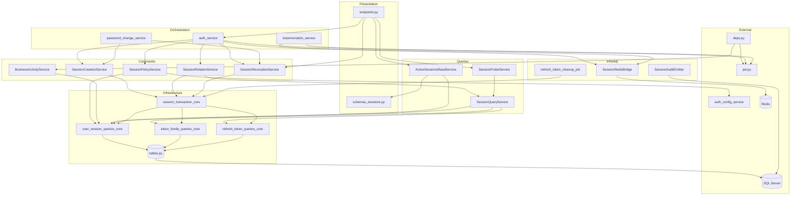
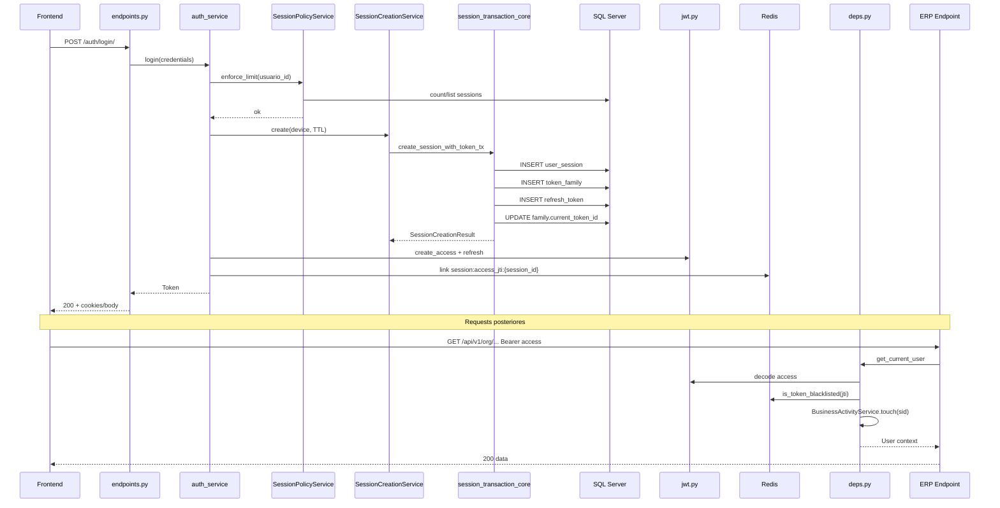
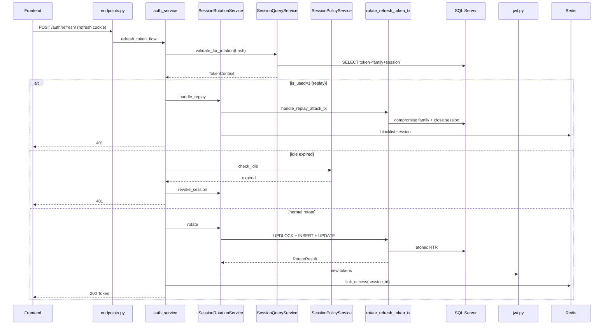
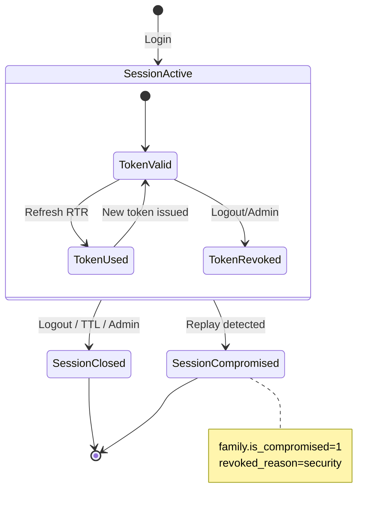

# IAM Session Management V2 — Diseño Arquitectónico Backend

**Ticket:** IAM-BE-DESIGN-01  
**Versión:** 1.0.0  
**Estado:** Especificación oficial (pre-implementación)  
**Fecha:** 2026-06-22  
**Audiencia:** Backend, Frontend, arquitectura, QA  

**Entradas normativas:**

| Documento | Rol |
|-----------|-----|
| `IAM-SESSION-MANAGEMENT-V2-IMPACT-ANALYSIS-01.md` | Análisis de impacto — base obligatoria |
| `tables_session_management_new.sql` (v3) | Modelo de datos **aprobado e inmutable** |
| `IAM_SESSION_MANAGEMENT_V2.md` | Comportamiento actual (referencia pre-refactor) |
| `ERP-IAM-SESSIONS-API-CONTRACT-V1.md` | Contrato API vigente (será sustituido por V2) |

**Restricción de esta fase:** Diseño arquitectónico exclusivamente. Sin código, sin migraciones, sin cambios en endpoints.

---

## Índice

1. [Arquitectura objetivo del módulo](#1-arquitectura-objetivo-del-módulo)
2. [Responsabilidades de cada entidad](#2-responsabilidades-de-cada-entidad)
3. [Nuevos servicios de aplicación](#3-nuevos-servicios-de-aplicación)
4. [Servicios existentes — destino](#4-servicios-existentes--destino)
5. [Diseño de repositories y queries](#5-diseño-de-repositories-y-queries)
6. [Diseño CQRS](#6-diseño-cqrs)
7. [Diseño de flujos completos](#7-diseño-de-flujos-completos)
8. [Diseño del uso de Redis](#8-diseño-del-uso-de-redis)
9. [Diseño UnitOfWork y transacciones](#9-diseño-unitofwork-y-transacciones)
10. [Eventos de auditoría](#10-eventos-de-auditoría)
11. [Responsabilidad por capa](#11-responsabilidad-por-capa)
12. [Componentes reutilizables](#12-componentes-reutilizables)
13. [Componentes que desaparecerán](#13-componentes-que-desaparecerán)
14. [Componentes nuevos](#14-componentes-nuevos)
15. [Diagrama de dependencias entre componentes](#15-diagrama-de-dependencias-entre-componentes)
16. [Diagrama completo del flujo de autenticación](#16-diagrama-completo-del-flujo-de-autenticación)
17. [Decisiones arquitectónicas pendientes y recomendación](#17-decisiones-arquitectónicas-pendientes-y-recomendación)

---

## 1. Arquitectura objetivo del módulo

### 1.1 Visión

El módulo **IAM Session Management V2** gestiona el ciclo de vida de sesiones multi-dispositivo en un ERP SaaS multi-tenant mediante **tres entidades de persistencia** con responsabilidades separadas, **Refresh Token Rotation (RTR)** con detección de replay vía `token_family`, y una capa de aplicación organizada en **CQRS ligero** (commands / queries) sobre el patrón existente del proyecto: `presentation → application/services → infrastructure/queries`.

No se introduce el patrón Repository clásico del dominio ERP. La persistencia sigue siendo **SQLAlchemy Core + funciones `*_core`**, agrupadas por agregado lógico.

### 1.2 Principios de diseño

| # | Principio | Implicación |
|---|-----------|-------------|
| P1 | **Sesión ≠ Token** | `user_session` es la unidad lógica de negocio; `refresh_tokens` es credencial rotativa |
| P2 | **Familia como frontera de seguridad** | Replay invalida la familia y cierra la sesión — no solo el token |
| P3 | **Hot path sin JOINs innecesarios** | Desnormalización controlada (`session_id`, `cliente_id` en token y familia) |
| P4 | **Transacciones atómicas en writes** | Toda mutación multi-tabla dentro de `UnitOfWork` |
| P5 | **Fail-soft en Redis** | Blacklist y mapping no bloquean flujos auth si Redis cae |
| P6 | **Tenant-first** | Toda query filtra `cliente_id`; cross-tenant → 404 |
| P7 | **Orquestación en `auth_service`** | Endpoints delgados; `auth_service` coordina login/empresa/impersonación |
| P8 | **Lectura unificada** | Un solo read service + mapper para user/admin/superadmin |

### 1.3 Diagrama de capas objetivo

```
┌─────────────────────────────────────────────────────────────────────────┐
│  PRESENTATION                                                            │
│  endpoints.py │ schemas*.py │ deps (thin — sin lógica de sesión)        │
└───────────────────────────────┬─────────────────────────────────────────┘
                                │
┌───────────────────────────────▼─────────────────────────────────────────┐
│  APPLICATION — ORQUESTACIÓN                                              │
│  auth_service.py              Login, empresa, impersonación, JWT emit   │
│  password_change_service.py   Orquestación cambio contraseña             │
│  impersonation_service.py     Sin persistencia sesión impersonada        │
└───────────────────────────────┬─────────────────────────────────────────┘
                                │
┌───────────────────────────────▼─────────────────────────────────────────┐
│  APPLICATION — SESIONES (CQRS)                                           │
│                                                                          │
│  COMMANDS (writes)                    QUERIES (reads)                    │
│  ├─ SessionCreationService            ├─ SessionQueryService             │
│  ├─ SessionRotationService            ├─ ActiveSessionsReadService       │
│  ├─ SessionRevocationService          └─ SessionProbeService             │
│  ├─ SessionPolicyService                                                 │
│  └─ BusinessActivityService                                              │
│                                                                          │
│  DOMAIN LIGHT (tipos, enums, resultados)                                 │
│  application/session/ — RotateResult, RevokedReason, SessionContext, …   │
└───────────────────────────────┬─────────────────────────────────────────┘
                                │
┌───────────────────────────────▼─────────────────────────────────────────┐
│  APPLICATION — INFRAESTRUCTURA ADYACENTE                                 │
│  SessionRedisBridge          Blacklist + access mapping por session_id   │
│  SessionAuditEmitter         Eventos auth_audit_log                        │
│  refresh_token_cleanup_job   Purga multi-tabla con retención               │
└───────────────────────────────┬─────────────────────────────────────────┘
                                │
┌───────────────────────────────▼─────────────────────────────────────────┐
│  INFRASTRUCTURE                                                          │
│  queries/auth/session/                                                   │
│    user_session_queries_core.py                                          │
│    token_family_queries_core.py                                          │
│    refresh_token_queries_core.py      (reescrito — solo credencial)      │
│    session_transaction_core.py        UoW: login, rotate, revoke         │
│  tables.py — UserSessionTable, TokenFamilyTable, RefreshTokensTable      │
└───────────────────────────────┬─────────────────────────────────────────┘
                                │
         ┌──────────────────────┼──────────────────────┐
         ▼                      ▼                      ▼
   SQL Server              Redis                 auth_audit_log
 user_session            blacklist              cliente_auth_config
 token_family            session:access_jti
 refresh_tokens
```

### 1.4 Límites del módulo

| Dentro del módulo | Fuera del módulo (integración) |
|-------------------|-------------------------------|
| Ciclo de vida sesión refresh | Emisión JWT (`app/core/security/jwt.py`) |
| RTR + replay | Validación access (`app/api/deps.py`) |
| Listados sesión activa | ERP session scope (`deps_auth.py`, `session_scope.py`) |
| Políticas idle/limit | `cliente_auth_config` (lectura vía `auth_config_service`) |
| Redis mapping sesión | Selection token JWT (stateless + blacklist jti) |

### 1.5 Identificadores canónicos (post-refactor)

| Identificador | Ámbito | Uso |
|---------------|--------|-----|
| `session_id` | Sesión lógica | **ID canónico de sesión** en API V2, revoke, Redis mapping |
| `family_id` | Seguridad RTR | Interno; expuesto solo en auditoría/SIEM |
| `token_id` | Credencial vigente | JWT refresh lookup; DTO como token actual; **no** ID de sesión |
| `token_hash` | Hot path | Lookup en refresh/logout |

---

## 2. Responsabilidades de cada entidad

> Definición alineada **exactamente** con `tables_session_management_new.sql` v3. No se rediseña el modelo.

### 2.1 UserSession (tabla `user_session`)

**Rol:** Representa la **sesión lógica** de un usuario en un dispositivo/entorno. Persiste días o semanas independientemente de cuántos refresh tokens roten.

| Responsabilidad | Detalle |
|-----------------|---------|
| Identidad de sesión | PK `session_id`; una sesión por dispositivo lógico (o reuso futuro por `device_id`) |
| Contexto multi-tenant | `usuario_id`, `cliente_id`, `empresa_id` (nullable hasta selección) |
| Metadata dispositivo | `platform`, `device_name`, `device_id`, `device_fingerprint`, `user_agent` |
| Metadata red | `login_ip` (inmutable), `last_seen_ip` (actualizado en refresh) |
| Método auth | `login_method` (`password`, `sso`, `2fa`, `api_key`) |
| Flujo empresa | `selection_token_completed` (0=directo, 1=vía selection_token) |
| Estado operativo | `is_active`, `revoked_at`, `revoked_reason` (CHECK DB) |
| Ciclo de vida | `created_at`, `expires_at` (TTL absoluto sesión; remember_me) |
| Actividad auth | `last_refresh_at` — solo `POST /auth/refresh` |
| Actividad negocio | `last_business_activity_at` — throttle 5 min en deps ERP |

**Invariantes de aplicación:**

- Una sesión activa tiene `is_active=1` AND `revoked_at IS NULL` AND `expires_at > now`.
- Cerrar sesión → `is_active=0` + `revoked_at` + `revoked_reason`; cascade lógico a familia.
- `login_ip` nunca se actualiza después de la creación.
- `empresa_id` se actualiza en selección/cambio de empresa (junto con token vigente).

**No es responsabilidad de UserSession:**

- Almacenar hash del refresh token.
- Gestionar cadena de rotación (delegado a `token_family` + `refresh_tokens`).
- Blacklist de access JWT (Redis).

### 2.2 TokenFamily (tabla `token_family`)

**Rol:** Agrupa la **cadena de rotación** de refresh tokens dentro de una sesión. Mecanismo central de **detección de replay**.

| Responsabilidad | Detalle |
|-----------------|---------|
| Vínculo sesión | `session_id` — relación **1:1** sesión activa ↔ familia activa |
| Contexto desnormalizado | `usuario_id`, `cliente_id` — lookup replay sin JOIN a sesión |
| Token vigente | `current_token_id` — O(1) sin buscar `is_used=0` |
| Compromiso | `is_compromised`, `compromised_at`, `invalidation_reason` |
| Auditoría | `created_at` |

**Invariantes de aplicación:**

- Al crear sesión se crea exactamente una familia con `current_token_id=NULL` hasta el primer token.
- En rotación exitosa: `current_token_id` se actualiza **en la misma transacción** que INSERT del nuevo token y UPDATE `is_used` del anterior.
- Si `is_compromised=1`, **todos** los tokens de la familia son inválidos; la sesión padre se cierra.
- Tras replay: **no** se emite nueva familia en la misma sesión — se fuerza re-autenticación (nueva `user_session`).

**Transiciones de `invalidation_reason`:**

`replay_detected` | `session_revoked` | `admin_force` | `password_reset` | `security_policy`

### 2.3 RefreshToken (tabla `refresh_tokens`)

**Rol:** Almacena **una emisión** de credencial refresh. Cada fila = un token criptográfico con vida de un solo uso (RTR) o revocación forzada.

| Responsabilidad | Detalle |
|-----------------|---------|
| Credencial | `token_hash` (SHA-256, UNIQUE) — nunca texto plano |
| Jerarquía | `family_id`, `session_id`, `parent_token_id` (NULL solo en primer token) |
| Contexto desnormalizado | `cliente_id`, `usuario_id`, `empresa_id` |
| Ciclo de vida token | `expires_at`, `created_at`, `last_used_at` |
| Estado RTR | `is_used`, `used_at` — consumo en rotación normal |
| Revocación forzada | `is_revoked`, `revoked_at`, `revoked_reason` (CHECK DB) |

**Estados mutuamente excluyentes (operación normal):**

| is_used | is_revoked | Significado |
|---------|------------|-------------|
| 0 | 0 | Vigente — puede usarse |
| 1 | 0 | Consumido en rotación |
| 0 | 1 | Invalidado (logout, admin, familia comprometida) |
| 1 | 1 | Violación — no debe ocurrir |

**No es responsabilidad de RefreshToken:**

- Metadata de dispositivo (vive en `user_session`).
- Conteo de usos (`uso_count` eliminado — RTR binario).
- Decidir cierre de sesión sin consultar familia/sesión.

### 2.4 Relación entre entidades

```
usuario (1) ──< user_session (N)     [multi-device]
user_session (1) ── token_family (1)  [1:1 mientras sesión activa]
token_family (1) ──< refresh_tokens (N) [cadena A→B→C]
refresh_tokens (parent) ──< refresh_tokens (child) [self-ref forense]
```

### 2.5 Dos niveles de TTL

| Nivel | Campo | Configuración | Prevalece |
|-------|-------|---------------|-----------|
| Sesión | `user_session.expires_at` | `session_timeout_minutes` / `remember_me_days` | TTL absoluto — fuerza re-login |
| Token | `refresh_tokens.expires_at` | `refresh_token_days` | Validez del refresh individual |

**Regla:** Si `user_session.expires_at` se alcanza, la sesión se cierra aunque el token vigente no haya expirado.

---

## 3. Nuevos servicios de aplicación

### 3.1 Servicios de comando (writes)

| Servicio | Responsabilidad | Queries / UoW que usa |
|----------|-----------------|----------------------|
| **SessionCreationService** | Crear `user_session` + `token_family` + primer `refresh_token` en login o post-password-change | `session_transaction_core.create_session_with_token` |
| **SessionRotationService** | RTR atómico: validar, rotar, detectar replay, actualizar `last_refresh_at` / `last_seen_ip` | `session_transaction_core.rotate_refresh_token` |
| **SessionRevocationService** | Logout, logout all, revoke by session_id, revoke admin | `session_transaction_core.revoke_session`, `revoke_all_sessions` |
| **SessionPolicyService** | Session limit (pre-login), idle auth timeout (pre-rotate) | `user_session_queries_core`, `auth_config_service` |
| **BusinessActivityService** | Throttle update `last_business_activity_at` | `user_session_queries_core.touch_business_activity` |
| **SessionRedisBridge** | Mapping access jti ↔ session; blacklist por sesión | Redis (sin BD) |
| **SessionAuditEmitter** | Registrar eventos en `auth_audit_log` | `audit_service` |

### 3.2 Servicios de consulta (reads)

| Servicio | Responsabilidad |
|----------|-----------------|
| **SessionQueryService** | Resolver sesión/token por hash, por id, validar estado para probe |
| **ActiveSessionsReadService** | Listados user/admin paginados — **reutiliza** mapper V1 adaptado |
| **SessionProbeService** | Validación read-only para `/me/` (`current_session_id`, `current_token_id`) — sin side effects |

### 3.3 Servicios de orquestación (existentes — rol refinado)

| Servicio | Rol post-V2 |
|----------|-------------|
| **auth_service** | Orquesta login → `SessionCreationService`; refresh → `SessionRotationService`; emite JWT; empresa/impersonación |
| **password_change_service** | Revoke all vía `SessionRevocationService` + nueva sesión vía `SessionCreationService` |
| **impersonation_service** | Sin cambio de persistencia; parent refresh del operador sigue en BD |
| **auth_config_service** | Lectura políticas — sin cambio estructural |
| **refresh_token_cleanup_job** | Orquesta purga multi-tabla con política de retención |

### 3.4 Diagrama de colaboración entre servicios

```
auth_service
  ├─► SessionCreationService      (login, seleccionar empresa, password change)
  ├─► SessionRotationService      (refresh, cambiar empresa)
  ├─► SessionRevocationService    (logout, logout_all)
  ├─► SessionPolicyService        (pre-condiciones limit/idle)
  ├─► SessionRedisBridge          (post-emit link jti)
  └─► SessionAuditEmitter         (eventos)

deps.py (get_current_user)
  └─► BusinessActivityService     (throttle 5 min, fail-soft)

endpoints sessions/*
  ├─► ActiveSessionsReadService   (GET list)
  ├─► SessionRevocationService    (POST revoke)
  └─► SessionProbeService         (GET /me context)
```

---

## 4. Servicios existentes — destino

| Servicio actual | Destino | Acción |
|-----------------|---------|--------|
| `refresh_token_service.py` (~900 LOC) | **DIVIDIR Y ELIMINAR** | Responsabilidades repartidas en §3; archivo marcado `deprecated` hasta migración completa |
| `rotate_refresh_token_service.py` | **ABSORBIDO** por `SessionRotationService` | Eliminar tras migración |
| `active_sessions_read_service.py` | **REFACTORIZAR** | Mantener nombre; queries sobre `user_session` JOIN familia/token |
| `admin_sessions_service.py` | **ELIMINAR** | Ya deprecated; delegación total a `ActiveSessionsReadService` |
| `auth_service.py` | **REFACTORIZAR** | Orquestación; eliminar llamadas directas a queries token-monolíticas |
| `password_change_service.py` | **REFACTORIZAR** | Usar nuevos command services |
| `refresh_token_cleanup_job.py` | **REFACTORIZAR** | Purga 3 tablas |
| `impersonation_service.py` | **SIN CAMBIO** estructural | Parent refresh sigue siendo JWT del operador |
| `auth_config_service.py` | **SIN CAMBIO** | — |

### 4.1 Mapeo método a método (`RefreshTokenService` → nuevos servicios)

| Método actual | Servicio destino |
|---------------|------------------|
| `hash_token` | `SessionQueryService` (utilidad estática compartida) |
| `store_refresh_token` | `SessionCreationService.create` |
| `validate_refresh_token` | `SessionQueryService.validate_for_rotation` + `SessionPolicyService.check_idle` |
| `rotate_*` (indirecto) | `SessionRotationService.rotate` |
| `revoke_token` | `SessionRevocationService.revoke_current` |
| `revoke_all_user_tokens` | `SessionRevocationService.revoke_all_for_user` |
| `revoke_refresh_token_by_id` | `SessionRevocationService.revoke_by_session_id` |
| `enforce_max_active_sessions` | `SessionPolicyService.enforce_limit` |
| `link_session_access_jti` | `SessionRedisBridge.link_access` |
| `blacklist_access_for_token_id` | `SessionRedisBridge.blacklist_session` |
| `blacklist_access_for_user_active_sessions` | `SessionRedisBridge.blacklist_all_user_sessions` |
| `handle_revoked_refresh_reuse` | **ELIMINAR** — reemplazado por replay en `SessionRotationService` |
| `is_revoked_refresh_reuse_candidate` | **ELIMINAR** — lógica `is_used` en rotate |
| `resolve_current_token_id_from_refresh` | `SessionProbeService.resolve_context` |
| `get_active_sessions` | `ActiveSessionsReadService` |
| `cleanup_expired_tokens` | `refresh_token_cleanup_job` + query purge |
| `record_refresh_token_activity` / `uso_count` | **ELIMINAR** — `last_refresh_at` en sesión |

---

## 5. Diseño de repositories y queries

### 5.1 Convención de nomenclatura

El proyecto IAM **no usa Repository pattern**. Se adopta la convención existente:

- **Queries:** funciones `async def *_core(...)` en `app/infrastructure/database/queries/auth/session/`
- **Transacciones:** funciones `async def *_in_tx(uow, ...)` en `session_transaction_core.py`
- **Tablas ORM:** `UserSessionTable`, `TokenFamilyTable`, `RefreshTokensTable` en `tables.py`

El término "repository" en este documento designa **agrupación lógica de queries por agregado**, no una clase Repository.

### 5.2 Estructura de archivos queries

```
app/infrastructure/database/queries/auth/session/
├── __init__.py                      # Re-exports públicos
├── user_session_queries_core.py     # CRUD sesión + activity
├── token_family_queries_core.py     # Familia + compromiso
├── refresh_token_queries_core.py    # Credencial (reescrito)
└── session_transaction_core.py      # UoW multi-tabla
```

### 5.3 `user_session_queries_core.py`

| Función | Tipo | Descripción |
|---------|------|-------------|
| `insert_user_session_core` | Write | INSERT sesión nueva |
| `update_session_empresa_core` | Write | SET `empresa_id`, `selection_token_completed` |
| `update_session_on_refresh_core` | Write | SET `last_refresh_at`, `last_seen_ip` |
| `touch_business_activity_core` | Write | SET `last_business_activity_at` (condicional throttle en service) |
| `close_session_core` | Write | SET `is_active=0`, `revoked_at`, `revoked_reason` |
| `close_all_user_sessions_core` | Write | Bulk close por `usuario_id` + `cliente_id` |
| `get_active_session_by_id_core` | Read | Por `session_id` + tenant |
| `count_active_sessions_core` | Read | Para session limit |
| `list_active_sessions_oldest_first_core` | Read | Para eviction session limit |
| `is_session_idle_expired_core` | Read | `last_refresh_at` vs policy |
| `is_session_absolute_expired_core` | Read | `expires_at` vs now |
| `find_session_by_device_core` | Read | Opcional futuro — `device_id` + `usuario_id` |

### 5.4 `token_family_queries_core.py`

| Función | Tipo | Descripción |
|---------|------|-------------|
| `insert_token_family_core` | Write | INSERT familia para sesión nueva |
| `update_current_token_id_core` | Write | SET `current_token_id` (en tx rotate) |
| `mark_family_compromised_core` | Write | SET `is_compromised=1`, `compromised_at`, `invalidation_reason` |
| `get_family_by_id_core` | Read | Con checks `is_compromised` |
| `get_family_by_session_id_core` | Read | Familia activa de sesión |
| `get_family_by_current_token_id_core` | Read | O(1) lookup |

### 5.5 `refresh_token_queries_core.py` (reescrito)

| Función | Tipo | Descripción |
|---------|------|-------------|
| `insert_refresh_token_core` | Write | INSERT token (familia ya existe) |
| `get_refresh_token_by_hash_core` | Read | Hot path — activo, no usado, no revocado |
| `get_refresh_token_by_hash_any_state_core` | Read | Probe /me — incluye usado/revocado |
| `mark_token_used_core` | Write | SET `is_used=1`, `used_at`, `last_used_at` |
| `revoke_token_core` | Write | SET `is_revoked=1` (forzado) |
| `revoke_tokens_by_session_core` | Write | Bulk revoke al cerrar sesión |
| `purge_expired_tokens_core` | Write | DELETE con política retención |

**Eliminadas respecto a V020:** `record_refresh_token_activity_core` (`uso_count`), idle en token row, insert con device columns.

### 5.6 `session_transaction_core.py` (UoW — operaciones atómicas)

| Función | Tablas afectadas | Lock |
|---------|------------------|------|
| `create_session_with_token_tx` | session + family + token | — |
| `rotate_refresh_token_tx` | token (lock) + token insert + token mark used + family update + session update | `UPDLOCK, ROWLOCK` por `token_hash` |
| `revoke_session_tx` | session close + family invalidate + tokens revoke | Por `session_id` |
| `revoke_all_user_sessions_tx` | bulk session + families + tokens | Por `usuario_id` |
| `handle_replay_attack_tx` | family compromised + session close + tokens revoke | Atómico |

### 5.7 Reglas transversales de queries

1. **Siempre** filtrar `cliente_id` en WHERE (tenant isolation).
2. **Nunca** concatenar input en SQL — parámetros bind.
3. Operaciones hot path refresh: **una sola transacción** `rotate_refresh_token_tx`.
4. `current_token_id` se actualiza **solo** dentro de `rotate_refresh_token_tx`.
5. Lecturas de listado: JOIN `user_session` → `token_family` → `refresh_tokens` ON `current_token_id`.

---

## 6. Diseño CQRS

### 6.1 Separación Command / Query

| Lado | Ubicación | Regla |
|------|-----------|-------|
| **Commands** | `application/services/session_*` + `session_transaction_core` | Mutan estado; pueden usar UoW; emiten auditoría |
| **Queries** | `application/services/*ReadService`, `SessionQueryService` | Solo SELECT; **sin side effects**; sin idle revoke |

**Anti-patrón actual a corregir:** `validate_refresh_token` que revoca por idle — en V2 el idle se evalúa explícitamente en command path (rotate) o policy service, no en query de validación.

### 6.2 Commands

| Command | Handler | Input | Output |
|---------|---------|-------|--------|
| `CreateSessionCommand` | `SessionCreationService.create` | usuario, cliente, device context, login_method, empresa_id?, TTL | `SessionCreationResult(session_id, token_id, family_id)` |
| `RotateRefreshTokenCommand` | `SessionRotationService.rotate` | token_hash, cliente_id, usuario_id, new_hash, TTL, device IP | `RotateResult` (extiende actual) |
| `RevokeSessionCommand` | `SessionRevocationService.revoke_by_session_id` | session_id, cliente_id, reason | `RevokeResult` |
| `RevokeCurrentSessionCommand` | `SessionRevocationService.revoke_current` | token_hash, cliente_id, reason | `RevokeResult` |
| `RevokeAllSessionsCommand` | `SessionRevocationService.revoke_all_for_user` | usuario_id, cliente_id, reason | `int` (count) |
| `CompromiseFamilyCommand` | `SessionRotationService.handle_replay` | family_id, cliente_id | `ReplayDetectionResult` |
| `EnforceSessionLimitCommand` | `SessionPolicyService.enforce_limit` | usuario_id, cliente_id | `int` (evicted) |
| `UpdateSessionEmpresaCommand` | `SessionCreationService.update_empresa` | session_id, empresa_id, selection_completed | void |
| `TouchBusinessActivityCommand` | `BusinessActivityService.touch` | session_id, cliente_id | void (throttled) |
| `PurgeExpiredSessionsCommand` | `refresh_token_cleanup_job` | cliente_id, retention_policy | `PurgeStats` |

### 6.3 Queries

| Query | Handler | Input | Output |
|-------|---------|-------|--------|
| `GetTokenByHashQuery` | `SessionQueryService.get_by_hash` | hash, cliente_id | `TokenContext` o None |
| `GetSessionByIdQuery` | `SessionQueryService.get_session` | session_id, cliente_id | `SessionRow` |
| `ListUserActiveSessionsQuery` | `ActiveSessionsReadService.list_user` | usuario_id, cliente_id | `list[UserSessionRead]` |
| `ListAdminActiveSessionsQuery` | `ActiveSessionsReadService.list_admin` | cliente_id, filters, pagination | paginated |
| `ResolveSessionContextQuery` | `SessionProbeService.resolve` | refresh_jwt, cliente_id | `SessionProbeResult` |
| `ValidateSessionForRotationQuery` | `SessionQueryService.validate_for_rotation` | hash, cliente_id | validación sin mutación |

### 6.4 Tipos de dominio ligero (`application/session/`)

| Tipo | Propósito |
|------|-----------|
| `RotateResult` / `RotateOutcome` | Extender con `COMPROMISED`, `FAMILY_REVOKED`, `SESSION_EXPIRED` |
| `RevokedReason` | Realign con CHECK DB v3 (§10) |
| `SessionCreationResult` | IDs creados en login |
| `SessionProbeResult` | `session_id`, `token_id`, `is_active` para `/me/` |
| `TokenContext` | Agregado read: session + family + token rows |
| `ReplayDetectionResult` | Resultado de compromiso familia |

**No se crean** entidades de dominio ricas con comportamiento (el módulo auth no sigue DDD ERP). Los tipos son **DTOs de aplicación** y enums.

---

## 7. Diseño de flujos completos

### 7.1 Login

**Endpoint:** `POST /auth/login/`  
**Orquestador:** `auth_service`

```
1. Validar credenciales usuario (existente)
2. Leer cliente_auth_config (max_sessions, TTL, refresh_days, idle)
3. SessionPolicyService.enforce_limit(usuario_id) → evict oldest sessions si excede
4. Construir device context (UA, IP, platform, device_id, fingerprint)
5. SessionCreationService.create:
   a. INSERT user_session (expires_at según remember_me)
   b. INSERT token_family (session_id, current_token_id=NULL)
   c. INSERT refresh_tokens (primer token, parent_token_id=NULL)
   d. UPDATE token_family.current_token_id
   — todo en create_session_with_token_tx
6. auth_service emite access JWT + refresh JWT
7. SessionRedisBridge.link_access(session_id, access_jti, exp)
8. SessionAuditEmitter → login_success
9. Retornar Token (+ selection_token si multi-empresa sin empresa única)
```

**Empresa única:** `empresa_id` en sesión al crear; `selection_token_completed=0`.  
**Multi-empresa:** `empresa_id=NULL`; flujo selection_token (§7.10).

### 7.2 Refresh Token Rotation (RTR)

**Endpoint:** `POST /auth/refresh/`  
**Handler:** `SessionRotationService.rotate`

```
1. Extraer refresh JWT → hash
2. SessionQueryService.validate_for_rotation(hash, cliente_id):
   - Token existe, is_used=0, is_revoked=0, expires_at > now
   - Familia is_compromised=0
   - Sesión is_active=1, expires_at > now
3. SessionPolicyService.check_idle(session.last_refresh_at) → si expirado: revoke_session_tx(IDLE) → 401
4. rotate_refresh_token_tx [UPDLOCK token by hash]:
   a. Re-validar estado bajo lock
   b. Si is_used=1 → REPLAY (§7.3) — abort tx
   c. INSERT nuevo refresh_token (parent_token_id=old.token_id)
   d. UPDATE token_family.current_token_id = new.token_id
   e. UPDATE old token: is_used=1, used_at=now, last_used_at=now
   f. UPDATE user_session: last_refresh_at=now, last_seen_ip=request_ip
5. auth_service emite nuevos JWT
6. SessionRedisBridge.link_access(session_id, new_jti, exp)
7. SessionAuditEmitter → refresh_success
8. Retornar Token
```

**Concurrencia:** Dos refresh simultáneos con el mismo token — el segundo bajo lock ve `is_used=1` → replay (§7.3).

### 7.3 Replay Attack Detection

**Disparador:** Presentación de token con `is_used=1` (o revocado por `family_compromised`) en rotate o validate command path.

```
1. handle_replay_attack_tx [atómico]:
   a. UPDATE token_family SET is_compromised=1, compromised_at=now, invalidation_reason='replay_detected'
   b. UPDATE user_session SET is_active=0, revoked_at=now, revoked_reason='security'
   c. UPDATE refresh_tokens SET is_revoked=1, revoked_reason='replay_detected' WHERE family_id=?
2. SessionRedisBridge.blacklist_session(session_id)
3. SessionAuditEmitter → replay_detected (exito=false, metadata: family_id, token_id, IP)
4. Retornar 401 AuthenticationError — mensaje genérico al cliente
5. NO emitir nuevo token; NO nueva familia en misma sesión
```

**Diferencia vs modelo actual:** Ya no se hace `revoke_all` del usuario — solo la sesión comprometida. Otras sesiones/dispositivos siguen activas.

### 7.4 Logout

**Endpoint:** `POST /auth/logout/`  
**Semántica:** Idempotente — siempre 200.

```
1. Resolver token por hash (puede estar ya revocado)
2. Si sesión activa:
   revoke_session_tx(session_id, reason='logout')
   SessionRedisBridge.blacklist_session(session_id)
   SessionAuditEmitter → logout
3. Si ya cerrada: 200 sin error (idempotente)
4. auth_service blacklist access jti actual (best-effort)
```

### 7.5 Logout All

**Endpoint:** `POST /auth/logout_all/`

```
1. RevokeAllSessionsCommand → revoke_all_user_sessions_tx
2. SessionRedisBridge.blacklist_all_user_sessions(usuario_id, cliente_id)
3. SessionAuditEmitter → logout_all
4. Retornar 200 + count
```

**Nota:** Access tokens vigentes siguen válidos hasta expirar (limitación heredada — documentada).

### 7.6 Password Change

**Orquestador:** `password_change_service`

```
1. Validar contraseña actual
2. Actualizar hash contraseña usuario
3. RevokeAllSessionsCommand(reason='password_reset') — cierra TODAS las sesiones
4. SessionRedisBridge.blacklist_all_user_sessions
5. SessionCreationService.create — nueva sesión para el dispositivo actual
6. Emitir nuevos JWT + link Redis
7. SessionAuditEmitter → password_change + session_created
```

### 7.7 Session Limit

**Momento:** Pre-`CreateSessionCommand` en login (y opcionalmente post-impersonation restore).

```
1. count_active_sessions_core(usuario_id, cliente_id)
2. Si count >= max_active_sessions (de cliente_auth_config):
   a. list_active_sessions_oldest_first_core
   b. Para cada sesión a evictar: revoke_session_tx(reason implícito 'session_limit' → session.revoked_reason='admin_force' o política dedicada)
   c. SessionRedisBridge.blacklist_session por cada una
3. Proceder con CreateSessionCommand
```

**Cambio semántico vs V1:** Cuenta **sesiones lógicas** (`user_session.is_active`), no filas token.

### 7.8 Idle Timeout

**Dos mecanismos independientes:**

| Tipo | Campo | Evaluado en | Acción |
|------|-------|-------------|--------|
| **Idle auth** | `user_session.last_refresh_at` | `SessionRotationService` pre-rotate | `revoke_session_tx`, reason sesión `'expired'` |
| **TTL absoluto** | `user_session.expires_at` | Toda validación command | Cierre sesión |
| **Idle negocio** | `user_session.last_business_activity_at` | Solo UI/alertas; **no** revoca en V2 inicial | Informativo |

**Configuración:** `cliente_auth_config.session_idle_timeout_minutes` aplica a idle auth.

**Query path:** `SessionProbeService` y listados **no** revocan por idle.

### 7.9 Business Activity Tracking

**Momento:** `get_current_user` en `app/api/deps.py` (requests ERP autenticados).

```
1. Extraer session_id del access JWT claim (nuevo claim — ver §17)
2. BusinessActivityService.touch(session_id):
   - Si last_business_activity_at IS NULL OR (now - last) > 5 min:
     touch_business_activity_core
   - Fail-soft: error BD no bloquea request
3. No actualizar en refresh ni en login
```

### 7.10 Empresa Selection

**Flujo multi-empresa:**

```
Login (empresa_id=NULL, selection_token_completed=0)
  → emite selection_token JWT (stateless, existente)
  → blacklist jti al consumir (Redis, existente)

POST /auth/empresa/seleccionar/
  1. Validar selection_token
  2. UpdateSessionEmpresaCommand(session_id, empresa_id, selection_token_completed=1)
  3. Si refresh ya existe: RotateRefreshTokenCommand con nuevo empresa_id en token
     Si no: actualizar sesión + token vigente empresa_id
  4. Emitir access JWT final con empresa_id
```

**Cambiar empresa (`POST /auth/empresa/cambiar/`):** `RotateRefreshTokenCommand` con nuevo `empresa_id` en sesión y token — equivalente semántico al actual.

### 7.11 Impersonation

**Sin fila de sesión impersonada en BD** (heredado).

```
POST /auth/impersonate/
  1. Validar permisos operador
  2. Guardar en Redis: parent_refresh_token (JWT string operador), parent session context
  3. Emitir access JWT impersonation (sin refresh propio de impersonación)
  4. NO crear user_session para impersonación

POST /auth/impersonate/end/
  1. Restaurar parent_refresh_token del operador
  2. Validar que sesión operador sigue activa vía SessionQueryService
  3. Emitir JWT operador
```

**Impacto V2:** Validación parent refresh usa modelo 3-tablas; Redis parent sigue siendo string JWT.

---

## 8. Diseño del uso de Redis

### 8.1 Claves y responsabilidades

| Clave | Formato | Valor | TTL | Responsable |
|-------|---------|-------|-----|-------------|
| Blacklist access | `blacklist:token:{jti}` | `"1"` o timestamp | Hasta `exp` del access | `deps.py` lectura; `SessionRedisBridge` escritura |
| Session access map | `session:access_jti:{session_id}` | `{"jti","exp","token_id"}` | Hasta `exp` access | `SessionRedisBridge` |
| Selection token used | `blacklist:token:{jti}` | (existente) | (existente) | `auth_service` — sin cambio |
| Impersonation parent | `impersonation:parent:{operador_id}` | JSON con parent_refresh | Configurado | `impersonation.py` — sin cambio |

### 8.2 Decisión de diseño: key por `session_id` (recomendada)

**Cambio respecto a V1:** `session:access_jti:{token_id}` → `session:access_jti:{session_id}`

| Criterio | `token_id` (V1) | `session_id` (V2 recomendado) |
|----------|-----------------|-------------------------------|
| Estabilidad entre rotaciones | Cambia cada refresh | **Estable** |
| Blacklist post-logout | Debe resolver token vigente | Directo por sesión |
| Rotación | Re-link obligatorio cada refresh | Un link por emisión access; actualizar valor |

**Comportamiento en rotación:**

1. Emitir nuevo access con nuevo `jti`.
2. `SessionRedisBridge.link_access(session_id, jti, exp, token_id=vigente)` — **sobrescribe** valor en misma key.
3. Opcional: blacklist del `jti` anterior si se almacenó en el JSON previo.

### 8.3 Fail-soft (heredado)

| Operación Redis | Si falla |
|-----------------|----------|
| `link_access` | Log warning; sesión refresh sigue válida |
| `blacklist_session` | Log warning; logout BD efectuado; access puede vivir hasta exp |
| `is_token_blacklisted` | Tratar como no blacklisted |

### 8.4 JWT claims nuevos (access token)

| Claim | Propósito |
|-------|-----------|
| `sid` | `session_id` — para BusinessActivityService |
| `jti` | (existente) — blacklist |

El refresh JWT puede incluir `sid` opcional para reducir lookup, pero **la validación siempre consulta BD por hash**.

---

## 9. Diseño UnitOfWork y transacciones

### 9.1 Cuándo usar UnitOfWork

| Operación | UoW obligatorio |
|-----------|-----------------|
| Login (create session) | **Sí** |
| Refresh RTR | **Sí** |
| Replay handling | **Sí** |
| Logout / revoke session | **Sí** |
| Logout all | **Sí** (batch en una tx o una tx por sesión — ver nota) |
| Business activity touch | **No** — single UPDATE autocommit |
| Listados / probe | **No** |
| Cleanup purge | **Sí** por batch |

### 9.2 Patrón de transacción RTR (canónico)

```
async with UnitOfWork(client_id) as uow:
    row = await uow.execute(LOCK_TOKEN_BY_HASH, ...)     # UPDLOCK, ROWLOCK
    assert row.is_used == 0 and not row.is_revoked
    new_id = await uow.execute(INSERT_NEW_TOKEN, ...)
    await uow.execute(UPDATE_FAMILY_CURRENT, new_id)
    await uow.execute(MARK_OLD_USED, old_id)
    await uow.execute(UPDATE_SESSION_REFRESH_ACTIVITY, ...)
# commit automático al salir
```

**Orden crítico:** INSERT nuevo token **antes** de marcar anterior como `is_used=1` (evita ventana sin token vigente).

### 9.3 Locks

| Recurso | Lock | Motivo |
|---------|------|--------|
| `refresh_tokens` por `token_hash` | `UPDLOCK, ROWLOCK` | Rotación concurrente |
| `token_family` por `family_id` | `UPDLOCK` solo en replay path | Evitar doble compromiso |
| `user_session` | Sin lock habitual | Actualización vía FK/session_id en tx |

### 9.4 Rollback

Cualquier excepción en `UnitOfWork` → rollback completo. Especialmente:

- Fallo UPDATE `current_token_id` después de INSERT → no debe quedar token huérfano.
- `RotateResult.success == False` → la tx no commitea.

### 9.5 Logout all — estrategia transaccional

**Recomendación:** Una transacción por usuario con múltiples `revoke_session_tx` internos, o una query bulk optimizada por tabla. Si el volumen de sesiones es alto (>50), batch por chunks de 20 sesiones con tx independientes — consistencia eventual aceptable para logout all.

---

## 10. Eventos de auditoría

### 10.1 Tabla destino

`auth_audit_log` — sin FK a sesiones. Metadata en `metadata_json`.

### 10.2 Catálogo de eventos

| Evento | Cuándo | `exito` | Metadata JSON |
|--------|--------|---------|---------------|
| `login_success` | Login OK | true | `session_id`, `platform`, `login_method`, `device_id` |
| `login_failed` | Credenciales inválidas | false | `nombre_usuario_intento` |
| `refresh_success` | RTR OK | true | `session_id`, `token_id`, `family_id` |
| `logout` | Logout | true | `session_id` |
| `logout_all` | Logout all | true | `sessions_revoked_count` |
| `session_revoked` | Self-revoke | true | `session_id`, `initiator=user` |
| `session_admin_revoked` | Admin revoke | true | `session_id`, `admin_usuario_id` |
| `replay_detected` | Replay attack | false | `session_id`, `family_id`, `token_id`, `ip` |
| `family_compromised` | Familia marcada | false | `family_id`, `invalidation_reason` |
| `session_limit_evicted` | Evicción por límite | true | `session_id` evicted |
| `idle_timeout` | Sesión cerrada por idle | true | `session_id`, `idle_minutes` |
| `password_change` | Cambio contraseña | true | `sessions_revoked_count` |
| `session_expired` | TTL absoluto | true | `session_id` |
| `empresa_selected` | Selección empresa | true | `session_id`, `empresa_id` |
| `empresa_changed` | Cambio empresa | true | `session_id`, `old_empresa_id`, `new_empresa_id` |

### 10.3 Mapeo `RevokedReason` aplicación ↔ CHECK DB

| Capa aplicación (`RevokedReason`) | `user_session.revoked_reason` | `refresh_tokens.revoked_reason` | `token_family.invalidation_reason` |
|-----------------------------------|-------------------------------|-----------------------------------|-------------------------------------|
| `USER_LOGOUT` | `logout` | `logout` | `session_revoked` |
| `LOGOUT_ALL` | `logout` | `logout` | `session_revoked` |
| `ADMIN_REVOKE` | `admin_force` | `logout` | `admin_force` |
| `PASSWORD_CHANGE` | `password_reset` | `password_reset` | `password_reset` |
| `REPLAY_DETECTED` (nuevo) | `security` | `replay_detected` | `replay_detected` |
| `IDLE_TIMEOUT` | `expired` | — | `session_revoked` |
| `SESSION_LIMIT` | `admin_force` | `family_compromised` | `session_revoked` |
| `USER_DEACTIVATED` | `admin_force` | `logout` | `admin_force` |
| `ABSOLUTE_TTL` (nuevo) | `expired` | — | `session_revoked` |

**Eliminados en V2:** `SESSION_ROTATED`, `TOKEN_REUSE` (reemplazados por `is_used` + `replay_detected`).

---

## 11. Responsabilidad por capa

### 11.1 Presentation (`app/modules/auth/presentation/`)

| Responsabilidad | Sí | No |
|-----------------|----|----|
| Validación formato request (Pydantic) | ✓ | |
| Extracción cookie/header refresh | ✓ | |
| Delegación a `auth_service` / read services | ✓ | |
| Lógica RTR, replay, idle | | ✗ |
| Queries SQL directas | | ✗ |
| Mapeo row → DTO | | ✗ (delegar a mapper) |

### 11.2 Application (`app/modules/auth/application/`)

| Responsabilidad | Sí | No |
|-----------------|----|----|
| Orquestación flujos auth | ✓ (`auth_service`) | |
| Commands / Queries sesión | ✓ (servicios §3) | |
| Enums, resultados, mappers | ✓ (`application/session/`) | |
| Políticas idle/limit | ✓ (`SessionPolicyService`) | |
| SQL / Redis directo | | ✗ |
| HTTP / status codes | | ✗ (excepto raise domain exceptions) |

### 11.3 Domain (`app/modules/auth/domain/`)

| Responsabilidad | Sí | No |
|-----------------|----|----|
| Entidad `Usuario` (existente) | ✓ | |
| Entidades ORM sesión | | ✗ — no se introducen entidades de dominio ricas |
| Invariantes RTR | ✓ en `application/session/` como tipos + validadores | |
| Persistencia | | ✗ |

**Nota:** El módulo auth mantiene **domain light** — tipos y enums en `application/session/`, no agregados DDD completos.

### 11.4 Infrastructure

| Responsabilidad | Sí | No |
|-----------------|----|----|
| SQLAlchemy tables | ✓ `tables.py` | |
| Queries `*_core` | ✓ `queries/auth/session/` | |
| UnitOfWork execution | ✓ `session_transaction_core` | |
| Redis | ✓ vía `SessionRedisBridge` en application (o `infrastructure/redis`) | |
| Reglas de negocio replay | | ✗ |

### 11.5 Core transversal

| Componente | Rol en V2 |
|------------|-----------|
| `jwt.py` | Emisión/validación; claims `sid` |
| `deps.py` | Blacklist + `BusinessActivityService` |
| `deps_auth.py` | ERP session scope — sin cambio |
| `unit_of_work.py` | Tx multi-tabla — sin cambio API |
| `auth_config_service` | Políticas tenant |

---

## 12. Componentes reutilizables

| Componente | Reutilización en V2 |
|------------|---------------------|
| `UnitOfWork` | 100% — tx RTR, create, revoke |
| `app/core/security/jwt.py` | ~95% — añadir claim `sid` |
| `app/api/deps.py` | ~90% — hook business activity |
| `app/api/deps_auth.py` | 100% |
| `auth_config_service` | 100% |
| `audit_service` / `audit_queries` | 100% — nuevos eventos |
| `SessionReadMapper` | ~70% — adaptar fuentes columna |
| `UserAgentParser` (si existe en mapper) | 100% |
| `schemas_sessions.py` / `schemas_admin_sessions.py` | ~80% — añadir `session_id`, ajustar semántica |
| `RevokedReason` | ~60% — ampliar/realign |
| `RotateResult` / `RotateOutcome` | ~70% — nuevos outcomes |
| `shared/pagination/` (admin list) | 100% |
| `impersonation.py` / `impersonation_service` | ~95% |
| `password_change_service` | ~70% — nuevos command calls |
| Redis client infra | 100% |

---

## 13. Componentes que desaparecerán

| Componente | Motivo |
|------------|--------|
| `RefreshTokenService` (monolito) | Dividido en servicios §3 |
| `rotate_refresh_token_service.py` | Absorbido por `SessionRotationService` |
| `admin_sessions_service.py` | Deprecated — eliminar |
| `refresh_token_queries_core.py` (versión V020) | Reemplazado por `queries/auth/session/*` |
| `refresh_token_rotate_queries_core.py` | Absorbido por `session_transaction_core.py` |
| `record_refresh_token_activity_core` | Sin `uso_count` |
| `handle_revoked_refresh_reuse` | Reemplazado por replay en rotate tx |
| `is_revoked_refresh_reuse_candidate` | Idem |
| `RevokedReason.SESSION_ROTATED` | RTR usa `is_used` |
| `RevokedReason.TOKEN_REUSE` | → `REPLAY_DETECTED` |
| SQL superadmin ad-hoc `FROM dbo.refresh_tokens` | Delegar a read service |
| Lógica idle en `validate_refresh_token` | Movida a command path |
| Redis key `session:access_jti:{token_id}` | → `{session_id}` |
| Identidad sesión = `token_id` en contrato | → `session_id` canónico |

**Deprecación:** Marcar `deprecated=True` en re-exports durante transición; no eliminar físicamente hasta cierre de migración (regla `.cursorrules`).

---

## 14. Componentes nuevos

### 14.1 Infrastructure

| Archivo | Descripción |
|---------|-------------|
| `queries/auth/session/user_session_queries_core.py` | Queries sesión |
| `queries/auth/session/token_family_queries_core.py` | Queries familia |
| `queries/auth/session/refresh_token_queries_core.py` | Queries credencial (reescrito) |
| `queries/auth/session/session_transaction_core.py` | Transacciones UoW |
| `queries/auth/session/__init__.py` | Exports |
| `tables.py` → `UserSessionTable` | ORM Core |
| `tables.py` → `TokenFamilyTable` | ORM Core |

### 14.2 Application services

| Archivo | Descripción |
|---------|-------------|
| `services/session_creation_service.py` | CreateSession command |
| `services/session_rotation_service.py` | RTR + replay |
| `services/session_revocation_service.py` | Revoke commands |
| `services/session_policy_service.py` | Limit + idle |
| `services/session_query_service.py` | Token/session lookups |
| `services/session_probe_service.py` | Read-only /me context |
| `services/session_redis_bridge.py` | Redis sesión |
| `services/business_activity_service.py` | Throttle activity |
| `services/session_audit_emitter.py` | Auditoría (wrapper) |

### 14.3 Application session types

| Archivo | Descripción |
|---------|-------------|
| `session/session_creation_result.py` | Resultado login |
| `session/session_probe_result.py` | Contexto /me |
| `session/token_context.py` | Agregado lectura |
| `session/replay_detection_result.py` | Resultado replay |
| `session/revoked_reason.py` | Actualizado |

### 14.4 Presentation (evolución, no archivos nuevos obligatorios)

| Cambio | Descripción |
|--------|-------------|
| `schemas_sessions.py` | +`session_id`, `login_ip`, `last_seen_ip`, `platform` |
| `schemas.py` `MeResponse` | +`current_session_id`; mantener `current_token_id` |
| Contrato API V2 | Documento nuevo `ERP-IAM-SESSIONS-API-CONTRACT-V2.md` (fase posterior) |

---

## 15. Diagrama de dependencias entre componentes



---

## 16. Diagrama completo del flujo de autenticación

### 16.1 Vista de secuencia — Login a request ERP



### 16.2 Vista de secuencia — Refresh con RTR



### 16.3 Vista de estados — Sesión y token



### 16.4 Mapa de endpoints → commands

| Endpoint | Command(s) |
|----------|------------|
| `POST /login/` | `EnforceSessionLimit` → `CreateSession` |
| `POST /refresh/` | `RotateRefreshToken` |
| `POST /logout/` | `RevokeCurrentSession` |
| `POST /logout_all/` | `RevokeAllSessions` |
| `POST /sessions/{id}/revoke/` | `RevokeSession` |
| `POST /sessions/{id}/revoke_admin/` | `RevokeSession` (admin) |
| `POST /empresa/seleccionar/` | `UpdateSessionEmpresa` + opcional `Rotate` |
| `POST /empresa/cambiar/` | `RotateRefreshToken` |
| `POST /password/change/` | `RevokeAllSessions` → `CreateSession` |
| `GET /sessions/*` | `List*ActiveSessions` |
| `GET /me/` | `ResolveSessionContext` |

---

## 17. Decisiones arquitectónicas pendientes y recomendación

### D-01 — Identificador canónico de sesión en API

| Opción | Pros | Contras |
|--------|------|---------|
| A) Mantener `token_id` como ID sesión | Zero breaking FE | Semánticamente incorrecto; cambia en cada refresh |
| B) Exponer solo `session_id` | Correcto, estable | Breaking paths revoke y FE |
| C) **Dual: `session_id` canónico + `token_id` vigente** | Estable + backward compat parcial | Dos IDs en DTO |

**Recomendación: Opción C.**

- DTOs incluyen `session_id` (nuevo, canónico) y `token_id` (refresh vigente).
- Paths revoke migran a `{session_id}` con **alias** temporal `{token_id}` resolviendo a sesión (deprecar en OpenAPI).
- `/me/` expone `current_session_id` + `current_token_id`.
- Documentar en contrato API V2.

### D-02 — Redis session mapping key

| Opción | Recomendación |
|--------|---------------|
| `{token_id}` | No — cambia cada rotación |
| **`{session_id}`** | **Sí** — estable, alinea con logout/blacklist |

### D-03 — Compatibilidad Frontend / versión API

| Opción | Recomendación |
|--------|---------------|
| Nueva ruta `/v2/auth/` | Aislamiento limpio pero duplica routers |
| **Extensión aditiva V1 → V2 contrato** | **Sí** — mismos paths, DTO superset, paths revoke aceptan ambos IDs durante transición |

### D-04 — Retención forense y cleanup

| Opción | Recomendación |
|--------|---------------|
| DELETE inmediato (actual) | Pierde cadena forense A→B→C |
| **Retención 90 días** tokens `is_used=1` o `is_revoked=1` | **Sí** — balance espacio/auditoría |
| Sesiones cerradas | Mantener `user_session` inactiva 90 días; purgar después |
| Familias comprometidas | Retener 1 año para SIEM |

Configurable en `cliente_auth_config` (campo futuro) o constante de aplicación inicial.

### D-05 — Mapeo RevokedReason

**Recomendación:** Tabla única de mapping en `application/session/revoked_reason.py` con función `to_session_reason()`, `to_token_reason()`, `to_family_reason()` — ver §10.3. Eliminar valores obsoletos (`SESSION_ROTATED`, `TOKEN_REUSE`).

### D-06 — Claim `sid` en access JWT

| Opción | Recomendación |
|--------|---------------|
| Sin claim — resolver por refresh | Más lookups |
| **`sid` en access JWT** | **Sí** — habilita business activity sin consultar refresh |

Validar que `sid` corresponde a sesión activa en operaciones sensibles (opcional fase 2).

### D-07 — Device session reuse

| Opción | Recomendación |
|--------|---------------|
| Siempre nueva sesión en login | Simple; más filas |
| Reusar por `device_id` | Menos sesiones; complejidad |
| **Fase 1: siempre nueva** | **Sí** — índice `IDX_session_device_usuario` preparado para fase 2 |

### D-08 — Logout all transaccional

**Recomendación:** Bulk SQL por tabla (sessions, families, tokens) en una UoW si sesiones < 20; chunks si más.

### D-09 — TTL dual sesión vs token

**Recomendación:** `user_session.expires_at` = TTL absoluto (remember_me / session_timeout). `refresh_tokens.expires_at` = `refresh_token_days` desde emisión del token vigente. Validar **ambos** en rotate; el más restrictivo prevalece.

### D-10 — Trabajo V1 Enterprise en rama

**Recomendación:** No mergear a main sin adaptar a este diseño. Reutilizar `SessionReadMapper` y estructura `ActiveSessionsReadService` cambiando solo queries fuente.

---

## Resumen ejecutivo

| Aspecto | Decisión de diseño |
|---------|-------------------|
| Modelo datos | `tables_session_management_new.sql` v3 — inmutable |
| Patrón persistencia | SQLAlchemy Core `*_core` + `session_transaction_core` |
| Patrón aplicación | CQRS ligero — command/query services |
| Monolito `RefreshTokenService` | Dividir en 6+ servicios especializados |
| ID sesión API | `session_id` canónico + `token_id` vigente en DTO |
| Redis mapping | `session:access_jti:{session_id}` |
| Replay | `is_used=1` → compromiso familia + cierre sesión (no revoke all usuario) |
| Rotación | UoW atómica: INSERT → UPDATE family → MARK used |
| Auditoría | 15+ eventos con `session_id`/`family_id` en metadata |
| Contrato FE | Extensión aditiva V2; paths revoke con alias transición |

---

**Fin del documento — IAM-BE-DESIGN-01**

**Próximo artefacto:** Plan de implementación (`IAM-SESSION-MANAGEMENT-V2-IMPLEMENTATION-PLAN-01`) derivado de este diseño y del análisis de impacto.
