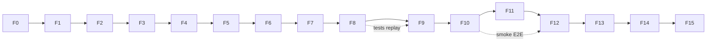

# IAM Session Management V2 — Plan de Implementación Oficial

**Ticket:** IAM-BE-IMPLEMENTATION-PLAN-02  
**Versión:** 1.0.0  
**Estado:** Plan ejecutable (pre-código)  
**Fecha:** 2026-06-22  
**Audiencia:** Backend, QA, Frontend, DevOps, arquitectura  

**Documentos normativos de entrada:**

| Documento | Rol |
|-----------|-----|
| `IAM-SESSION-MANAGEMENT-V2-IMPACT-ANALYSIS-01.md` | Impacto y riesgos |
| `IAM-SESSION-MANAGEMENT-V2-DESIGN-01.md` | Arquitectura objetivo |
| `IAM-SESSION-MANAGEMENT-V2-COMPONENT-SPECIFICATION-01.md` | Spec por componente (C01–C21) |
| `tables_session_management_new.sql` (v3) | DDL inmutable |

**Restricción de esta fase:** Planificación exclusivamente. Sin código, sin migraciones ejecutadas, sin cambios en el repositorio salvo este documento.

---

## Índice

1. [Estrategia general de implementación](#1-estrategia-general-de-implementación)
2. [Orden exacto de construcción](#2-orden-exacto-de-construcción)
3. [Dependencias entre fases](#3-dependencias-entre-fases)
4. [Archivos nuevos](#4-archivos-nuevos)
5. [Archivos existentes a modificar](#5-archivos-existentes-a-modificar)
6. [Archivos que desaparecerán](#6-archivos-que-desaparecerán)
7. [Migración incremental](#7-migración-incremental)
8. [Compatibilidad temporal V1 ↔ V2](#8-compatibilidad-temporal-v1--v2)
9. [Rollback por fase](#9-rollback-por-fase)
10. [Riesgos técnicos por fase](#10-riesgos-técnicos-por-fase)
11. [Criterios de aceptación por fase](#11-criterios-de-aceptación-por-fase)
12. [Casos de prueba obligatorios](#12-casos-de-prueba-obligatorios)
13. [Validaciones manuales y automáticas](#13-validaciones-manuales-y-automáticas)
14. [Integración Frontend](#14-integración-frontend)
15. [Limpieza código legado](#15-limpieza-código-legado)
16. [Fases detalladas](#16-fases-detalladas)

---

## 1. Estrategia general de implementación

### 1.1 Principio rector

**Construir V2 en paralelo al V1 operativo; conmutar con feature flag; desplegar DDL en ventana única; eliminar legado tras estabilización.**

El modelo de datos V1 (tabla monolítica `refresh_tokens`) y V2 (tres entidades) son **semánticamente incompatibles**. No existe migración de filas ni dual-write prolongado. La incrementalidad aplica al **código y las validaciones**, no a la coexistencia indefinida de ambos modelos en producción.

### 1.2 Pilares

| # | Pilar | Descripción |
|---|-------|-------------|
| P1 | **Additive-first** | Nuevos archivos y servicios antes de modificar orquestadores |
| P2 | **Feature flag** | `IAM_SESSION_MANAGEMENT_V2_ENABLED` (global + override por tenant en staging) |
| P3 | **Test gate** | Ninguna fase cierra sin tests obligatorios verdes |
| P4 | **Un commit por fase** | Commits atómicos, revertibles, mensaje estándar |
| P5 | **DDL único** | Un script bootstrap `V031` derivado de `tables_session_management_new.sql` |
| P6 | **Contrato API aditivo** | DTO superset; paths revoke aceptan `session_id` y alias `token_id` |
| P7 | **Sin big-bang de código** | Solo big-bang de **datos** (re-login) en ventana de deploy Fase 12 |

### 1.3 Ramas Git recomendadas

```
main
 └── feature/iam-session-v2          (integración continua)
      ├── phase/00-governance
      ├── phase/01-ddl-orm
      ├── phase/02-queries
      ...
      └── phase/13-legacy-cleanup
```

Cada fase: PR a `feature/iam-session-v2` con review obligatorio. Merge a `main` solo tras Fase 12 + QA sign-off.

### 1.4 Entornos

| Entorno | Uso |
|---------|-----|
| Local + BD dev | Fases 0–11 con flag V2 |
| Staging | Fases 8–11; FE integración |
| Pre-prod | Fase 12 dry-run DDL + smoke |
| Producción | Fase 12 ventana mantenimiento |

### 1.5 Estimación calendario

| Escenario | Duración |
|-----------|----------|
| 1 dev senior | 8–11 semanas |
| 2 devs (queries + services en paralelo tras F3) | 5–7 semanas |
| Buffer QA + deploy | +1 semana |

---

## 2. Orden exacto de construcción

```
F0  Gobernanza y feature flag
F1  DDL bootstrap + SQLAlchemy tables (ORM)
F2  Domain types (C19)
F3  Queries infra — user_session + token_family (C15, C16)
F4  Queries infra — refresh_token v3 + session_transaction (C17, C18)
F5  Bridges — audit + redis (C07, C06)
F6  Query services (C08, C10)
F7  Policy + creation commands (C04, C01)
F8  Rotation + replay (C02)          ← hot path crítico
F9  Revocation (C03)
F10 Orquestación auth — login/refresh/logout (C11)
F11 Orquestación — empresa + password + impersonation (C11, C12, C13)
F12 Read path — listados + schemas + endpoints aditivos (C09, C20, C21)
F13 Adyacentes — cleanup, users, superadmin, deps activity (C05, C14, externos)
F14 Cutover DDL + flag producción
F15 Legacy cleanup + documentación operativa
```

---

## 3. Dependencias entre fases



| Fase | Bloqueada por | Desbloquea |
|------|---------------|------------|
| F0 | — | F1–F15 |
| F1 | F0 | F3, F4 |
| F2 | F1 | F6–F9 |
| F3 | F1 | F4, F7 |
| F4 | F3 | F7, F8, F9 |
| F5 | F2 | F9, F10 |
| F6 | F4, F5 | F10, F12 |
| F7 | F4, F6 | F10 |
| F8 | F7 | F10, F11 |
| F9 | F8, F5 | F10, F11 |
| F10 | F7, F8, F9 | F11, F12, F14 |
| F11 | F10 | F13, F14 |
| F12 | F6, F10 | F13, F14 |
| F13 | F11, F12 | F14 |
| F14 | F13 | F15 |
| F15 | F14 | — |

**Paralelización posible:**

- F5 (bridges) en paralelo con F3–F4 si F2 completada.
- F12 (read) puede iniciarse tras F6, pero **no mergear** hasta F10 smoke verde.
- Tests de F8 y F9 pueden escribirse en paralelo por dos devs.

---

## 4. Archivos nuevos

### 4.1 Bootstrap / DDL

| Archivo | Fase |
|---------|:----:|
| `app/bootstrap_v2/01_schema/V031__iam_session_management_v3.sql` | F1 |

### 4.2 Infrastructure — queries session

| Archivo | Fase |
|---------|:----:|
| `app/infrastructure/database/queries/auth/session/__init__.py` | F3 |
| `app/infrastructure/database/queries/auth/session/user_session_queries_core.py` | F3 |
| `app/infrastructure/database/queries/auth/session/token_family_queries_core.py` | F3 |
| `app/infrastructure/database/queries/auth/session/refresh_token_queries_core.py` | F4 |
| `app/infrastructure/database/queries/auth/session/session_transaction_core.py` | F4 |

### 4.3 Application — services

| Archivo | Fase |
|---------|:----:|
| `app/modules/auth/application/services/session_audit_emitter.py` | F5 |
| `app/modules/auth/application/services/session_redis_bridge.py` | F5 |
| `app/modules/auth/application/services/session_query_service.py` | F6 |
| `app/modules/auth/application/services/session_probe_service.py` | F6 |
| `app/modules/auth/application/services/session_policy_service.py` | F7 |
| `app/modules/auth/application/services/session_creation_service.py` | F7 |
| `app/modules/auth/application/services/session_rotation_service.py` | F8 |
| `app/modules/auth/application/services/session_revocation_service.py` | F9 |
| `app/modules/auth/application/services/business_activity_service.py` | F13 |

### 4.4 Application — session types

| Archivo | Fase |
|---------|:----:|
| `app/modules/auth/application/session/session_creation_result.py` | F2 |
| `app/modules/auth/application/session/session_probe_result.py` | F2 |
| `app/modules/auth/application/session/token_context.py` | F2 |
| `app/modules/auth/application/session/replay_detection_result.py` | F2 |
| `app/modules/auth/application/session/revoke_result.py` | F2 |
| `app/modules/auth/application/session/revoked_reason_mappers.py` | F2 |

### 4.5 Tests nuevos

| Archivo | Fase |
|---------|:----:|
| `tests/unit/test_iam_sessions_v2_f1_tables.py` | F1 |
| `tests/unit/test_iam_sessions_v2_f3_user_session_queries.py` | F3 |
| `tests/unit/test_iam_sessions_v2_f4_transaction_core.py` | F4 |
| `tests/unit/test_iam_sessions_v2_f5_redis_bridge.py` | F5 |
| `tests/unit/test_iam_sessions_v2_f6_query_probe.py` | F6 |
| `tests/unit/test_iam_sessions_v2_f7_creation_policy.py` | F7 |
| `tests/unit/test_iam_sessions_v2_f8_rotation_replay.py` | F8 |
| `tests/unit/test_iam_sessions_v2_f9_revocation.py` | F9 |
| `tests/unit/test_iam_sessions_v2_f10_auth_orchestration.py` | F10 |
| `tests/unit/test_iam_sessions_v2_f11_empresa_password.py` | F11 |
| `tests/unit/test_iam_sessions_v2_f12_read_dto.py` | F12 |
| `tests/unit/test_test_iam_sessions_v2_f13_adjacent.py` | F13 |
| `tests/integration/test_iam_sessions_v2_e2e_smoke.py` | F10 |
| `tests/integration/test_iam_sessions_v2_cutover.py` | F14 |

### 4.6 Documentación

| Archivo | Fase |
|---------|:----:|
| `docs/arquitectura/ERP-IAM-SESSIONS-API-CONTRACT-V2.md` | F0 |
| `docs/arquitectura/IAM-SESSION-MANAGEMENT-V2-OPERATIONS.md` | F15 |

---

## 5. Archivos existentes a modificar

| Archivo | Fases | Naturaleza |
|---------|:-----:|------------|
| `app/core/config.py` | F0 | Feature flag `IAM_SESSION_MANAGEMENT_V2_ENABLED` |
| `app/infrastructure/database/tables.py` | F1 | `UserSessionTable`, `TokenFamilyTable`, `RefreshTokensTable` v3 |
| `app/infrastructure/database/queries/auth/__init__.py` | F3–F4 | Exports session queries |
| `app/modules/auth/application/session/revoked_reason.py` | F2 | Enum V2 + deprecaciones |
| `app/modules/auth/application/session/rotate_result.py` | F2 | Nuevos outcomes |
| `app/modules/auth/application/session/__init__.py` | F2 | Exports |
| `app/modules/auth/application/services/__init__.py` | F5–F9 | Exports nuevos services |
| `app/modules/auth/application/services/auth_service.py` | F10–F11 | Orquestación V2 vía flag |
| `app/modules/auth/application/services/password_change_service.py` | F11 | C03 + C01 |
| `app/modules/auth/application/services/impersonation_service.py` | F11 | C08 validación parent |
| `app/modules/auth/application/services/active_sessions_read_service.py` | F12 | Queries V2 |
| `app/modules/auth/application/session/session_read_mapper.py` | F12 | `session_id`, fuentes columna |
| `app/modules/auth/application/session/active_session_read_columns.py` | F12 | Whitelist V2 |
| `app/modules/auth/presentation/schemas_sessions.py` | F12 | `session_id`, IPs duales |
| `app/modules/auth/presentation/schemas_admin_sessions.py` | F12 | Idem admin |
| `app/modules/auth/presentation/schemas.py` | F12 | `current_session_id`, MeResponse |
| `app/modules/auth/presentation/endpoints.py` | F10–F12 | Flag + revoke alias |
| `app/modules/auth/application/services/refresh_token_cleanup_job.py` | F13 | Purga 3 tablas |
| `app/core/security/jwt.py` | F13 | Claim `sid` |
| `app/api/deps.py` | F13 | `BusinessActivityService` |
| `app/modules/users/application/services/user_service.py` | F13 | C03 revoke all |
| `app/modules/superadmin/application/services/superadmin_usuario_service.py` | F13 | Delegar C09 |
| `app/modules/superadmin/presentation/schemas.py` | F13 | Alinear DTO sesión |
| `tests/test_tenant_isolation.py` | F4 | Queries V2 |
| `tests/unit/test_iam_sessions_*.py` (existentes) | F8–F15 | Adaptar o reemplazar |

**Sin modificar en fases 0–11 (solo F12+ aditivo en presentation):**

- Rutas HTTP (paths iguales)
- `response_model` estructura base (solo campos aditivos)

---

## 6. Archivos que desaparecerán

Al finalizar **Fase 15** (no antes):

| Archivo | Acción | Condición |
|---------|--------|-----------|
| `app/modules/auth/application/services/refresh_token_service.py` | Eliminar | Flag V2 100% prod ≥ 2 semanas |
| `app/modules/auth/application/services/rotate_refresh_token_service.py` | Eliminar | Idem |
| `app/modules/auth/application/services/admin_sessions_service.py` | Eliminar | Ya deprecated |
| `app/infrastructure/database/queries/auth/refresh_token_queries_core.py` | Eliminar o mover a `_legacy/` | Tras eliminar imports |
| `app/infrastructure/database/queries/auth/refresh_token_rotate_queries_core.py` | Eliminar | Idem |
| Referencias V1 en `auth_service.py` | Eliminar ramas `if not v2` | F15 |
| `SESSION_ACCESS_JTI_PREFIX` legacy `token_id` key | Eliminar dual-read | F15 |

**Regla `.cursorrules`:** marcar `deprecated=True` en re-exports durante F10–F14; eliminación física solo en F15.

---

## 7. Migración incremental

### 7.1 Qué es incremental

| Incremental ✅ | No incremental ❌ |
|--------------|-------------------|
| Construcción de módulos V2 en paralelo | Coexistencia V1+V2 datos en prod |
| Tests aislados por capa | Migración fila-a-fila refresh_tokens |
| Feature flag apagado en prod hasta F14 | Dual-write prolongado |
| Deploy código con flag OFF | DDL sin ventana planificada |

### 7.2 Timeline de conmutación

```
[F0–F13]  Prod: flag=OFF, código V1 activo, código V2 dormido (sin DDL nuevo)
[F14 pre] Staging: DDL + flag=ON → QA E2E completo
[F14]     Prod ventana: DDL V031 → invalida sesiones → deploy código → flag=ON
[F15]     Eliminar legado V1
```

### 7.3 DDL (Fase 1 archivo / Fase 14 ejecución)

- Script `V031__iam_session_management_v3.sql` = contenido de `tables_session_management_new.sql` adaptado a convención Flyway bootstrap.
- **DROP** tabla `refresh_tokens` V020 + CREATE tres tablas (deploy note: re-login obligatorio).
- Ejecutar en: BD central + cada BD dedicada multi-tenant (inventario previo).

### 7.4 Desarrollo local sin DDL

Fases F3–F13 en local:

1. Aplicar V031 en BD dev docker.
2. Flag `IAM_SESSION_MANAGEMENT_V2_ENABLED=true` en `.env`.
3. CI job `iam-session-v2` corre tests V2 con BD efímera + V031.

Prod sin F14 sigue V020 + flag false — **código V2 no invocado**.

---

## 8. Compatibilidad temporal V1 ↔ V2

### 8.1 Feature flag

```text
IAM_SESSION_MANAGEMENT_V2_ENABLED: bool = False   # global
IAM_SESSION_V2_TENANT_ALLOWLIST: str = ""       # UUIDs staging, opcional
```

`auth_service` y `endpoints` ramifican:

```text
if is_session_v2_enabled(cliente_id):
    → C01–C10
else:
    → RefreshTokenService (legado)
```

### 8.2 API — contrato aditivo (DESIGN D-01, D-03)

| Elemento | V1 | V2 | Compatibilidad |
|----------|----|----|----------------|
| `GET /sessions/` | `token_id` | + `session_id`, `platform`, `login_ip` | Superset JSON |
| `POST /sessions/{id}/revoke/` | path = `token_id` | acepta `session_id` **o** `token_id` vigente | Alias resolver |
| `GET /me/` | `current_token_id` | + `current_session_id` | Superset |
| `client_type` | presente | alias de `platform` | Ambos en respuesta |
| `last_used_at` | alias | + `last_refresh_at` | Ambos |

### 8.3 Redis — dual-read transitorio (F10–F14)

| Operación | V1 key | V2 key | Estrategia |
|-----------|--------|--------|------------|
| link_access | `session:access_jti:{token_id}` | `session:access_jti:{session_id}` | Escribir **ambas** en F10–F13 |
| blacklist | leer V2, fallback V1 | prioridad V2 | F15 elimina V1 |

### 8.4 Tests duales (F10–F14)

CI ejecuta:

- `pytest tests/unit/test_iam_sessions_*` — suite legada con flag OFF
- `pytest tests/unit/test_iam_sessions_v2_*` — suite V2 con flag ON

Tras F15: eliminar suite legada o archivar.

---

## 9. Rollback por fase

| Fase | Rollback | Impacto |
|:----:|----------|---------|
| F0 | Revert commit doc + flag default | Nulo |
| F1 | Revert ORM + script V031 (no ejecutado en prod) | Nulo en prod |
| F2–F9 | Revert commits; flag OFF | Nulo — código no wired |
| F10–F13 | Flag OFF en config; revert deploy | V1 sigue operativo **si DDL no aplicado** |
| F14 | **Crítico** — ver abajo | Re-login ya ocurrió |
| F15 | No revertir eliminación sin restaurar archivos git | Alto |

### 9.1 Rollback F14 (cutover producción)

**Escenario A — DDL aplicado, código V2 defectuoso:**

1. Flag `IAM_SESSION_MANAGEMENT_V2_ENABLED=false` inmediato.
2. **No restaura sesiones** — usuarios deben re-login incluso en V1 (tabla V020 eliminada).
3. Rollback código a release anterior **solo si** se mantiene backup BD pre-V031 y se restaura snapshot completo (ventana ≤ 1h).
4. Comunicación incidente obligatoria.

**Escenario B — DDL falló parcialmente:**

1. No activar flag.
2. Restaurar snapshot BD pre-ventana.
3. Abortar deploy.

**Mitigación:** backup full BD + script rollback `V031_rollback.sql` (DROP v3, RESTORE V020 desde backup) preparado en F1.

---

## 10. Riesgos técnicos por fase

| Fase | Riesgo | Nivel | Mitigación |
|:----:|--------|:-----:|------------|
| F0 | FE no alineado en `session_id` | Medio | Contrato V2 firmado antes F12 |
| F1 | Drift ORM vs DDL | Medio | Test F1 tables vs information_schema |
| F3–F4 | SQL incorrecto multi-tabla | Alto | Tests unit + integration tx |
| F4 | Orden RTR incorrecto | **Alto** | Test concurrencia F8 |
| F5 | Redis dual-key inconsistente | Medio | Tests + eliminar dual F15 |
| F8 | Replay no detectado | **Alto** | Tests obligatorios concurrencia |
| F8 | Falso positivo replay | Alto | UPDLOCK + orden INSERT antes is_used |
| F10 | Regresión login prod | **Alto** | Flag OFF default; smoke staging |
| F12 | Breaking DTO FE | Medio | Solo campos aditivos |
| F13 | superadmin divergente | Medio | Delegar C09 |
| F14 | Multi-DB incompleto | **Alto** | Checklist tenants pre-ventana |
| F14 | Invalidación masiva sesiones | **Alto** | Comunicación 72h antes |
| F15 | Eliminar código en uso | Medio | Solo tras 2 semanas estable |

---

## 11. Criterios de aceptación por fase

| Fase | Criterio de aceptación (resumen) |
|:----:|----------------------------------|
| F0 | Contrato API V2 aprobado por FE; flag en config; ticket deploy creado |
| F1 | V031 en repo; ORM 3 tablas; test schema match |
| F2 | Tipos importables; enum mapping completo |
| F3 | 11 funciones user_session + 6 family; tests verdes |
| F4 | 5 tx functions; create+rotate integration test |
| F5 | Redis bridge tests; audit emitter mock |
| F6 | Query + probe sin side effects verificado |
| F7 | Create session 3 filas atómicas; session limit evict |
| F8 | RTR + replay + concurrencia tests verdes |
| F9 | Logout idempotente; revoke all; redis blacklist |
| F10 | E2E smoke login→refresh→logout flag ON staging |
| F11 | Empresa + password + impersonation parent OK |
| F12 | Listados con `session_id`; OpenAPI superset |
| F13 | Cleanup + users deactivate + superadmin delegado |
| F14 | Prod flag ON; 0 errores críticos 24h; re-login documentado |
| F15 | Sin imports legado; suite V1 archivada; docs operativas |

---

## 12. Casos de prueba obligatorios

### 12.1 Por fase (mínimo bloqueante)

| Fase | Tests obligatorios |
|:----:|-------------------|
| F1 | ORM columns match DDL; indexes exist |
| F4 | `create_session_with_token_tx` rollback on failure |
| F7 | Session limit evicts oldest; create TTL remember_me |
| F8 | Rotate success; replay `is_used=1`; double concurrent refresh |
| F8 | Idle timeout revokes before rotate |
| F9 | Logout idempotent; self-revoke 404 cross-user |
| F9 | Logout all count; admin revoke 404 closed |
| F10 | Login→refresh→logout E2E integration |
| F10 | Impersonation refresh blocked 403 |
| F11 | Password change revokes all + new session |
| F11 | Empresa seleccionar updates session |
| F12 | `is_current` by session_id; admin pagination |
| F13 | Tenant isolation all queries |
| F14 | Cutover smoke en staging clone |

### 12.2 Suite regresión pre-F14

Ejecutar completa:

```text
pytest tests/unit/test_iam_sessions_v2_* tests/integration/test_iam_sessions_v2_*
pytest tests/unit/test_iam_sessions_*  # legado flag OFF
pytest tests/test_tenant_isolation.py
```

---

## 13. Validaciones manuales y automáticas

### 13.1 Automáticas (CI)

| Gate | Cuándo |
|------|--------|
| `ruff` / linter | Cada PR |
| Unit tests fase | Cada PR fase |
| OpenAPI schema diff | F12 — solo adiciones |
| Migration dry-run V031 | F1, F14 |

### 13.2 Manuales (staging)

| # | Validación | Fase |
|---|------------|:----:|
| M1 | Login web + cookie refresh | F10 |
| M2 | Refresh tras 5 min; verificar `last_refresh_at` en BD | F10 |
| M3 | Logout; access rechazado tras blacklist (si Redis up) | F10 |
| M4 | Listar sesiones; `is_current` correcto | F12 |
| M5 | Self-revoke sesión remota | F12 |
| M6 | Admin revoke + audit en `auth_audit_log` | F12 |
| M7 | Simular replay (reusar refresh antiguo) → 401 + sesión cerrada | F8/F10 |
| M8 | Cambio empresa sin re-login | F11 |
| M9 | Multi-empresa selection flow | F11 |
| M10 | Password change cierra otras sesiones | F11 |

### 13.3 Checklist pre-producción F14

- [ ] Backup BD central + N tenants dedicados
- [ ] V031 ejecutado en staging idéntico a prod
- [ ] Comunicación usuarios enviada
- [ ] FE desplegado con soporte `session_id` (o tolerante a superset)
- [ ] Rollback script probado en clone
- [ ] On-call asignado ventana

---

## 14. Integración Frontend

### 14.1 Principio

**Mismos paths `/api/v1/auth/*`; JSON superset; sin breaking removals en F12–F14.**

### 14.2 Coordinación por hito

| Hito | Backend | Frontend |
|------|---------|----------|
| Pre-F12 | Publicar `ERP-IAM-SESSIONS-API-CONTRACT-V2.md` | Leer contrato |
| F12 deploy staging | `session_id` en listados | Opcional: mostrar por `session_id` |
| F12 | `current_session_id` en `/me/` | Actualizar `is_current` compare |
| F10–F12 | Revoke path acepta `token_id` legacy | Sin cambio obligatorio |
| Post-F14 | Documentar re-login obligatorio | Pantalla login + mensaje sesión expirada |

### 14.3 Campos FE — prioridad migración

| Prioridad | Campo FE | Acción |
|:---------:|----------|--------|
| P0 | `is_current` | Comparar `current_session_id` (fallback `current_token_id`) |
| P1 | Revoke remoto | Enviar `session_id` cuando disponible |
| P2 | Device display | `device.device_label` (sin cambio) |
| P3 | `platform` vs `client_type` | Migrar a `platform` cuando conveniente |

### 14.4 OpenAPI

- F12: verificar `openapi.json` — solo propiedades `add` en schemas sesión.
- Publicar diff a FE en cada release staging.

---

## 15. Limpieza código legado

### 15.1 Criterios para iniciar F15

- [ ] `IAM_SESSION_MANAGEMENT_V2_ENABLED=true` en prod ≥ 14 días
- [ ] 0 incidentes P0/P1 sesiones en período
- [ ] Suite V2 verde en CI
- [ ] FE confirma uso de `session_id` o no depende de semántica `token_id`=sesión

### 15.2 Acciones F15

1. Eliminar archivos §6.
2. Eliminar ramas `if not v2` en `auth_service`, `endpoints`.
3. Eliminar dual-write Redis V1 keys.
4. Archivar tests `test_iam_sessions_p1_*` → `tests/legacy/` o eliminar.
5. Actualizar `IAM_SESSION_MANAGEMENT_V2.md` operativo (nuevo doc operations).
6. Marcar `ERP-IAM-SESSIONS-API-CONTRACT-V1.md` como superseded.
7. Eliminar `RefreshTokenService` de `services/__init__.py` exports.

### 15.3 Verificación post-limpieza

```text
rg "RefreshTokenService" app/  → 0 resultados (excepto changelog)
rg "refresh_token_rotate_queries_core" app/  → 0
rg "SESSION_ROTATED" app/  → 0 (excepto docs históricos)
```

---

## 16. Fases detalladas

---

### Fase F0 — Gobernanza y preparación

| Campo | Valor |
|-------|-------|
| **Objetivo** | Alinear stakeholders; feature flag; contrato API V2; ticket deploy |
| **Componentes** | Config, documentación |
| **Crear** | `docs/arquitectura/ERP-IAM-SESSIONS-API-CONTRACT-V2.md` |
| **Modificar** | `app/core/config.py` |
| **Riesgo** | **Bajo** |
| **Dependencias** | Ninguna |
| **Validaciones** | Review arquitectura + FE del contrato V2 |
| **Aceptación** | Contrato V2 merged; flag default `False`; checklist F14 en ticket Jira/Linear |
| **Rollback** | Revert doc + config |
| **Commit** | `chore(iam-session): F0 governance — feature flag and API V2 contract` |

---

### Fase F1 — DDL bootstrap + SQLAlchemy ORM

| Campo | Valor |
|-------|-------|
| **Objetivo** | Versionar DDL V031; definir tablas ORM v3 |
| **Componentes** | C15–C17 tablas base en `tables.py` |
| **Crear** | `V031__iam_session_management_v3.sql`, `tests/unit/test_iam_sessions_v2_f1_tables.py` |
| **Modificar** | `app/infrastructure/database/tables.py` |
| **Riesgo** | **Medio** |
| **Dependencias** | F0 |
| **Validaciones** | Dry-run SQL local; test columnas vs DDL |
| **Aceptación** | ORM refleja `tables_session_management_new.sql` exactamente |
| **Rollback** | Revert commit; no ejecutar V031 en shared envs |
| **Commit** | `feat(iam-session): F1 DDL V031 and SQLAlchemy tables for session v3` |

---

### Fase F2 — Domain types (C19)

| Campo | Valor |
|-------|-------|
| **Objetivo** | Tipos compartidos RotateResult, RevokedReason mappers, DTOs resultado |
| **Componentes** | C19 |
| **Crear** | `session_creation_result.py`, `session_probe_result.py`, `token_context.py`, `replay_detection_result.py`, `revoke_result.py`, `revoked_reason_mappers.py` |
| **Modificar** | `revoked_reason.py`, `rotate_result.py`, `session/__init__.py` |
| **Riesgo** | **Bajo** |
| **Dependencias** | F1 |
| **Validaciones** | Unit tests enum mapping |
| **Aceptación** | Todos los outcomes documentados importables |
| **Rollback** | Revert commit |
| **Commit** | `feat(iam-session): F2 session domain types and revoked reason mappers` |

---

### Fase F3 — Queries user_session + token_family (C15, C16)

| Campo | Valor |
|-------|-------|
| **Objetivo** | CRUD queries tablas sesión y familia |
| **Componentes** | C15, C16 |
| **Crear** | `queries/auth/session/__init__.py`, `user_session_queries_core.py`, `token_family_queries_core.py`, `test_iam_sessions_v2_f3_*.py` |
| **Modificar** | `queries/auth/__init__.py` |
| **Riesgo** | **Medio** |
| **Dependencias** | F1 |
| **Validaciones** | Tests con BD dev V031; tenant filter |
| **Aceptación** | 17 funciones según COMPONENT-SPEC; `cliente_id` en todo WHERE |
| **Rollback** | Revert; sin wiring |
| **Commit** | `feat(iam-session): F3 user_session and token_family queries core` |

---

### Fase F4 — Queries refresh_token v3 + transactions (C17, C18)

| Campo | Valor |
|-------|-------|
| **Objetivo** | Credencial v3 + transacciones atómicas create/rotate/revoke/replay |
| **Componentes** | C17, C18 |
| **Crear** | `refresh_token_queries_core.py` (session/), `session_transaction_core.py`, `test_iam_sessions_v2_f4_*.py` |
| **Modificar** | `queries/auth/__init__.py`, `tests/test_tenant_isolation.py` |
| **Riesgo** | **Alto** |
| **Dependencias** | F3 |
| **Validaciones** | Integration: create 3 tablas; rollback tx |
| **Aceptación** | `create_session_with_token_tx` y `rotate_refresh_token_tx` pasan tests |
| **Rollback** | Revert commit |
| **Commit** | `feat(iam-session): F4 refresh token v3 queries and session transaction core` |

---

### Fase F5 — Bridges audit + Redis (C07, C06)

| Campo | Valor |
|-------|-------|
| **Objetivo** | SessionAuditEmitter + SessionRedisBridge con dual-key |
| **Componentes** | C06, C07 |
| **Crear** | `session_audit_emitter.py`, `session_redis_bridge.py`, `test_iam_sessions_v2_f5_*.py` |
| **Modificar** | `services/__init__.py` |
| **Riesgo** | **Medio** |
| **Dependencias** | F2 |
| **Validaciones** | Mock Redis; audit fail-soft |
| **Aceptación** | link_access escribe key V2; dual-write V1+V2 keys |
| **Rollback** | Revert commit |
| **Commit** | `feat(iam-session): F5 session audit emitter and redis bridge` |

---

### Fase F6 — Query services (C08, C10)

| Campo | Valor |
|-------|-------|
| **Objetivo** | Lecturas sin side effects; hash_token; probe /me |
| **Componentes** | C08, C10 |
| **Crear** | `session_query_service.py`, `session_probe_service.py`, `test_iam_sessions_v2_f6_*.py` |
| **Modificar** | `services/__init__.py` |
| **Riesgo** | **Medio** |
| **Dependencias** | F4, F5 |
| **Validaciones** | Probe no llama revoke; validate_for_rotation read-only |
| **Aceptación** | TokenContext compuesto correcto |
| **Rollback** | Revert commit |
| **Commit** | `feat(iam-session): F6 session query and probe services` |

---

### Fase F7 — Policy + Creation (C04, C01)

| Campo | Valor |
|-------|-------|
| **Objetivo** | Session limit + creación sesión completa |
| **Componentes** | C04, C01 |
| **Crear** | `session_policy_service.py`, `session_creation_service.py`, `test_iam_sessions_v2_f7_*.py` |
| **Modificar** | `services/__init__.py` |
| **Riesgo** | **Medio** |
| **Dependencias** | F4, F6 |
| **Validaciones** | Create atómico; evict oldest |
| **Aceptación** | SessionCreationResult con 3 IDs |
| **Rollback** | Revert commit |
| **Commit** | `feat(iam-session): F7 session policy and creation services` |

---

### Fase F8 — Rotation + Replay (C02)

| Campo | Valor |
|-------|-------|
| **Objetivo** | RTR atómico + detección replay |
| **Componentes** | C02 |
| **Crear** | `session_rotation_service.py`, `test_iam_sessions_v2_f8_*.py` |
| **Modificar** | `services/__init__.py` |
| **Riesgo** | **Alto** |
| **Dependencias** | F7 |
| **Validaciones** | Tests concurrencia; replay; idle |
| **Aceptación** | RotateOutcome.COMPROMISED funcional; orden INSERT→current_token_id→is_used |
| **Rollback** | Revert commit |
| **Commit** | `feat(iam-session): F8 session rotation service with RTR and replay detection` |

---

### Fase F9 — Revocation (C03)

| Campo | Valor |
|-------|-------|
| **Objetivo** | Logout, logout all, revoke by session, evicción |
| **Componentes** | C03 |
| **Crear** | `session_revocation_service.py`, `test_iam_sessions_v2_f9_*.py` |
| **Modificar** | `services/__init__.py` |
| **Riesgo** | **Medio** |
| **Dependencias** | F8, F5 |
| **Validaciones** | Idempotencia logout; Redis blacklist |
| **Aceptación** | RevokeResult; audit events vía C07 |
| **Rollback** | Revert commit |
| **Commit** | `feat(iam-session): F9 session revocation service` |

---

### Fase F10 — Orquestación auth core (C11)

| Campo | Valor |
|-------|-------|
| **Objetivo** | Wire login, refresh, logout vía flag V2 en auth_service |
| **Componentes** | C11, endpoints (lógica interna) |
| **Crear** | `test_iam_sessions_v2_f10_*.py`, `test_iam_sessions_v2_e2e_smoke.py` |
| **Modificar** | `auth_service.py`, `endpoints.py` (sin cambiar paths) |
| **Riesgo** | **Alto** |
| **Dependencias** | F7, F8, F9 |
| **Validaciones** | E2E staging flag ON; flag OFF regresión V1 |
| **Aceptación** | Smoke M1–M4 manual OK; suite dual CI verde |
| **Rollback** | Flag OFF; revert deploy |
| **Commit** | `feat(iam-session): F10 auth orchestration login refresh logout behind v2 flag` |

---

### Fase F11 — Orquestación empresa, password, impersonation

| Campo | Valor |
|-------|-------|
| **Objetivo** | Flujos secundarios auth con V2 |
| **Componentes** | C11, C12, C13 |
| **Crear** | `test_iam_sessions_v2_f11_*.py` |
| **Modificar** | `auth_service.py`, `password_change_service.py`, `impersonation_service.py`, `endpoints.py` |
| **Riesgo** | **Medio** |
| **Dependencias** | F10 |
| **Validaciones** | M8–M10 manual |
| **Aceptación** | Password revoca all; empresa actualiza session |
| **Rollback** | Flag OFF |
| **Commit** | `feat(iam-session): F11 empresa password impersonation v2 orchestration` |

---

### Fase F12 — Read path + DTOs aditivos (C09, C20, C21)

| Campo | Valor |
|-------|-------|
| **Objetivo** | Listados sesión V2; schemas superset; revoke alias session_id/token_id |
| **Componentes** | C09, C20, C21 |
| **Crear** | `test_iam_sessions_v2_f12_*.py` |
| **Modificar** | `active_sessions_read_service.py`, `session_read_mapper.py`, `active_session_read_columns.py`, `schemas_sessions.py`, `schemas_admin_sessions.py`, `schemas.py`, `endpoints.py` |
| **Riesgo** | **Medio** |
| **Dependencias** | F6, F10 |
| **Validaciones** | OpenAPI diff solo adiciones; M5–M6 |
| **Aceptación** | `session_id` en DTO; `is_current` por session; admin paginado OK |
| **Rollback** | Revert presentation changes |
| **Commit** | `feat(iam-session): F12 active sessions read path and additive API DTOs` |

---

### Fase F13 — Adyacentes y business activity (C05, C14, externos)

| Campo | Valor |
|-------|-------|
| **Objetivo** | Cleanup job, user deactivate, superadmin, deps throttle, JWT sid |
| **Componentes** | C05, C14, user_service, superadmin |
| **Crear** | `business_activity_service.py`, `test_iam_sessions_v2_f13_*.py` |
| **Modificar** | `refresh_token_cleanup_job.py`, `user_service.py`, `superadmin_usuario_service.py`, `superadmin/schemas.py`, `jwt.py`, `deps.py` |
| **Riesgo** | **Medio** |
| **Dependencias** | F11, F12 |
| **Validaciones** | Tenant isolation; cleanup stats |
| **Aceptación** | Superadmin delega C09; touch activity throttle 5 min |
| **Rollback** | Revert commit |
| **Commit** | `feat(iam-session): F13 cleanup users superadmin and business activity tracking` |

---

### Fase F14 — Cutover producción

| Campo | Valor |
|-------|-------|
| **Objetivo** | Ejecutar V031 prod; activar flag; validar 24h |
| **Componentes** | Todos |
| **Crear** | `test_iam_sessions_v2_cutover.py`, runbook en ticket |
| **Modificar** | Config prod `IAM_SESSION_MANAGEMENT_V2_ENABLED=true` |
| **Riesgo** | **Alto** |
| **Dependencias** | F13; checklist §13.3 |
| **Validaciones** | M1–M10 en prod limitado; monitor errores 401/500 auth |
| **Aceptación** | 0 P0 24h; usuarios pueden re-login; métricas refresh OK |
| **Rollback** | §9.1 escenario A/B |
| **Commit** | `chore(iam-session): F14 enable session management v2 in production` |

---

### Fase F15 — Legacy cleanup

| Campo | Valor |
|-------|-------|
| **Objetivo** | Eliminar código V1; documentación operativa |
| **Componentes** | Eliminación §6 |
| **Crear** | `IAM-SESSION-MANAGEMENT-V2-OPERATIONS.md` |
| **Modificar** | Eliminar archivos legado; limpiar imports |
| **Riesgo** | **Medio** |
| **Dependencias** | F14 estable ≥ 14 días |
| **Validaciones** | `rg` checks §15.3; CI verde sin tests legacy |
| **Aceptación** | Sin RefreshTokenService; docs operativas publicadas |
| **Rollback** | Restaurar archivos desde git tag pre-F15 |
| **Commit** | `refactor(iam-session): F15 remove legacy v1 session management code` |

---

## Anexo A — Mapa fase → componentes (C01–C21)

| Componente | Fase introducción | Fase wiring producción |
|------------|:-----------------:|:----------------------:|
| C15 user_session_queries | F3 | F14 |
| C16 token_family_queries | F3 | F14 |
| C17 refresh_token_queries | F4 | F14 |
| C18 session_transaction | F4 | F14 |
| C19 domain types | F2 | F14 |
| C07 audit emitter | F5 | F14 |
| C06 redis bridge | F5 | F14 |
| C08 query service | F6 | F14 |
| C10 probe service | F6 | F14 |
| C04 policy | F7 | F14 |
| C01 creation | F7 | F14 |
| C02 rotation | F8 | F14 |
| C03 revocation | F9 | F14 |
| C11 auth_service | F10–F11 | F14 |
| C12 password | F11 | F14 |
| C13 impersonation | F11 | F14 |
| C09 read service | F12 | F14 |
| C20 mapper | F12 | F14 |
| C21 columns | F12 | F14 |
| C05 business activity | F13 | F14 |
| C14 cleanup job | F13 | F14 |

---

## Anexo B — Resumen ejecutivo para gestión

| Métrica | Valor |
|---------|-------|
| Fases totales | 16 (F0–F15) |
| Commits atómicos | 16 |
| Archivos nuevos ~ | 35 |
| Archivos modificados ~ | 25 |
| Archivos eliminados ~ | 5 (+ ramas flag) |
| Ventana crítica | F14 única |
| Re-login usuarios | Obligatorio en F14 |
| Breaking API | Ninguno intencional (superset aditivo) |

---

**Fin del documento — IAM-BE-IMPLEMENTATION-PLAN-02**

**Cadena documental completa:**

1. IMPACT-ANALYSIS-01 → 2. DESIGN-01 → 3. COMPONENT-SPECIFICATION-01 → **4. IMPLEMENTATION-PLAN-01 (este documento)** → Implementación código
